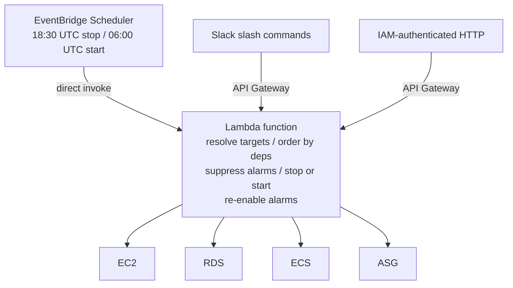

# Scheduled resource management

Lambda function that stops non-production AWS resources in the evening and starts them in the morning, triggered by
EventBridge Scheduler.<br/>
Supports EC2, RDS, ECS, and Auto Scaling Groups. Includes Slack slash commands and IAM-authenticated HTTP for on-demand
invocation.

## Files

| File                       | What                                                                                               |
| -------------------------- | -------------------------------------------------------------------------------------------------- |
| `function.py`              | Python Lambda handler. All invocation paths, safety rails, dependency ordering, alarm suppression. |
| `config.json`              | Configuration structure: aliases, default counts, resource registry, scheduler target lists.       |
| `eventbridge-scheduler.ts` | Pulumi (TypeScript) IaC for the two EventBridge Scheduler schedules and their IAM role.            |

## Architecture



The scheduler invokes the Lambda directly (no SNS or SQS intermediary needed). EventBridge Scheduler is the modern
replacement for CloudWatch EventRule.

On-demand invocation paths (HTTP via API Gateway with IAM auth, Slack slash commands, or a CLI wrapper) are useful for
operators who need to start resources outside the schedule. All paths go through the same Lambda function to share
safety rails and dependency logic.

## Resource types and API operations

Each AWS service has different stop/start semantics. The implementation must handle each type **individually**.

All operations should be **idempotent**. Stopping already stopped resources returns success.<br/>
Callers should **not** need to know the current state before issuing a command.

### EC2 instances

Stop with `StopInstances`, start with `StartInstances`.<br/>
Both accept a list of instance IDs and process them in parallel. Operations are idempotent, and each return the instance
with its current state.

State transitions take seconds to minutes. Check the instance state via `DescribeInstances`, and wait for `stopped` or
`running` when downstream operations depend on readiness.

```sh
# Stop.
aws ec2 stop-instances --instance-ids 'i-0abc123'

# Start.
aws ec2 start-instances --instance-ids 'i-0abc123'

# Wait for running.
aws ec2 wait instance-running --instance-ids 'i-0abc123'
```

### RDS instances

Stop with `StopDBInstance`, start with `StartDBInstance`. Each call accepts a **single** DB instance identifier.

After 7 consecutive days, the RDS service automatically starts a stopped instance. The start appears **only** as an RDS
event, not as a CloudTrail `StartDBInstance` call, so caller-based auditing misses it entirely:

```text
DB instance is being started due to it exceeding the maximum allowed time being stopped
```

The 7-day clock starts the moment a stop request completes. With a fixed evening stop schedule, the force-start lands
roughly 10 minutes after that evening's stop run, maximizing unattended runtime until the next stop.

Containment options, ordered from simplest to most complete:

1. Run the stop schedule **daily** (including weekends). Caps unattended runtime at ~24 hours.
1. Add the instance to the morning start list. The daily stop/start resets the 7-day clock, at the cost of daytime
   runtime charges.
1. Implement event-driven re-stop triggered by the RDS force-start event (complete fix, new machinery).

Stop-only resources (those in the nightly stop list but not the morning start list, started on demand when needed) are
the ones that hit this limit when a quiet week passes. The daily stop schedule is the minimum countermeasure.

Starting an RDS instance takes **5 to 12 minutes** depending on instance class and storage. Plan dependency ordering
budgets accordingly.

```sh
# Stop.
aws rds stop-db-instance --db-instance-identifier 'staging-postgres'

# Start.
aws rds start-db-instance --db-instance-identifier 'staging-postgres'

# Wait for available.
aws rds wait db-instance-available --db-instance-identifier 'staging-postgres'
```

### ECS services

ECS services do **not** have a stop/start concept, requiring instead to set the service's `desiredCount` to 0 to drain
all tasks and set it back to the desired count to restart them.

Stop (drain): `UpdateService` with `desiredCount: 0`.<br/>
Start (restore): `UpdateService` with `desiredCount: N` (N is the desired task count; default to 1 if unknown, or store
the original count somewhere permanent before stopping).

There is no "wait for drained" API. One needs to poll `DescribeServices` and check that `runningCount` reaches 0.<br/>
The ECS service scheduler handles task termination and respects `deregistrationDelay` on load balancer target groups,
so draining a service behind a load balancer can take up to the configured deregistration delay (default 300 seconds).

```sh
# Stop (drain to 0).
aws ecs update-service --cluster 'staging' --service 'api' --desired-count '0'

# Start (restore to 2).
aws ecs update-service --cluster 'staging' --service 'api' --desired-count '2'
```

When storing desired counts to restore later, keep the mapping **outside** the Lambda (e.g., in the scheduler's input
payload, in a configuration file bundled with the code, or in a DynamoDB table).

### Auto Scaling Groups

Setting `DesiredCapacity` to 0 alone will make the ASG immediately relaunch instances to satisfy `MinSize`. Always zero
**both** `MinSize` and `DesiredCapacity`:

```py
autoscaling.update_auto_scaling_group(
    AutoScalingGroupName=name,
    DesiredCapacity=0,
    MinSize=0,
)
```

On start, check `MinSize` and restore it alongside `DesiredCapacity`. If the ASG is restarted manually (console, CLI)
without restoring `MinSize`, it will remain at 0 and the ASG will **not** auto-relaunch failed instances even though it
appears to be "running":

```python
current_min = group['MinSize']
kwargs = {'DesiredCapacity': desired_capacity}
if current_min == 0:
    kwargs['MinSize'] = 1
autoscaling.update_auto_scaling_group(
    AutoScalingGroupName=name, **kwargs
)
```

```sh
# Stop.
aws autoscaling update-auto-scaling-group --auto-scaling-group-name 'staging-asg' \
  --desired-capacity '0' --min-size '0'
# Start.
aws autoscaling update-auto-scaling-group --auto-scaling-group-name 'staging-asg' \
  --desired-capacity '3' --min-size '1'
```

Wait for readiness by polling `DescribeAutoScalingGroups` until the desired number of instances are `InService`.

## Safety rails

Production resources must never be stopped by the scheduler.

Implement protections:

1. Lists are **opt-in** by design.<br/>
   Resources **must** be **explicitly** listed in the scheduler's stop and start target lists. Resources absent from
   both lists are **never** touched.
1. Resources tagged `Environment=Production` (or equivalent) are **always** refused, regardless of how the function is
   invoked. This is meant to catch misconfiguration in the target lists.
1. Resources with no `Environment` tag are **refused** (ambiguous = better to not touch). All managed resources should
   have the tag as a precondition.
1. A tag like `ops:excludeFromScheduledStop=true` on a resource causes the scheduler to skip it without error.<br/>
   Useful for temporarily opting a resource out (e.g., during a load test) without changing the scheduler's own
   configuration.<br/>
   Manual stop/start via other invocation paths is **not** affected by this tag.
1. Mirror the tag-based checks in the Lambda's IAM role policy using `aws:ResourceTag` conditions.<br/>
   Makes it impossible for the Lambda to stop a production resource even if the code has a bug.

   <details style='padding: 0 0 1rem 1rem'>

   ```json
   {
     "Effect": "Allow",
     "Action": [
        "ec2:StopInstances",
        "ec2:StartInstances"
     ],
     "Resource": "*",
     "Condition": {
       "StringNotEquals": {
         "aws:ResourceTag/Environment": "Production"
       }
     }
   }
   ```

   </details>

Within a dependency set, an excluded resource counts as "not stopped" for dependency gating.<br/>
Its downstream dependencies are **skipped** (preventing, e.g., a database from stopping while its excluded consumer is
still running).

## Dependency ordering

Some resources depend on others at runtime (an application needs its database). Start and stop order **must** reflect
these dependencies.

`start` will take on dependencies **first**.<br/>
Start the database, wait for it to become available (RDS: `available`, EC2: `running`), then start the compute resources
that depend on it. If readiness is not confirmed within a timeout budget (suggest 12 minutes for RDS), start the
dependents anyway.<br/>
Applications are **expected** to retry until their dependencies return. Blocking indefinitely is worse than a brief
connection-error window.<br/>
Failing the overall run loud makes the timeout visible.

`stop` acts on **dependents** first, in order of **reverse** dependency.<br/>
Drain the compute resources, confirm they are stopped (ECS: `runningCount=0`, EC2: `stopped`, ASG: all instances
terminated), then stop the database. If a dependent fails to stop within the budget (suggest 5 minutes), **skip** the
remaining levels rather than stopping a database under a still-running consumer. This is the error dependency ordering
exists to prevent.

Resources with no dependencies and single-resource operations need no waits, and can and do execute in parallel.

Dependency graphs should be validated at deploy time (if using IaC) by rejecting unknown references, cross-graph
references, cycles, and duplicate entries. The reference implementation uses Kahn's algorithm for topological sorting.

## CloudWatch alarm suppression

When a resource is stopped, its CloudWatch alarms will fire (CPU at 0%, health checks failing, etc.).<br/>
Suppress them automatically to avoid noise.

<details>
  <summary>Stop process</summary>

Before stopping a resource, discover all CloudWatch MetricAlarms whose dimensions reference it and disable their actions
with `DisableAlarmActions`.

Alarm discovery can be dynamic. Paginate `DescribeAlarms` once per invocation and build a dimension-value index matching
against `DBInstanceIdentifier`, `InstanceId`, `ServiceName` + `ClusterName`, `AutoScalingGroupName`, or equivalent
dimension keys.

</details>

<details>
  <summary>Start process</summary>

After confirming the resource is ready, re-enable alarm actions with `EnableAlarmActions`.

</details>

Alarm disable failures on stop should be **best-effort** (log a warning, proceed with the stop). Alarm re-enable failure
on start should **fail loud** (mark the resource as errored).<br/>
A running resource with muted alarms is the incident this feature exists to prevent.

Exclusion tags should work on both resources (skip alarm management entirely for that resource) and individual alarms
(never disable/re-enable that specific alarm, regardless of which resource it monitors).

Scope limitations:

- **CompositeAlarms** have no dimensions and cannot be matched to a resource. Skip them.
- Alarms on **ALB** and **target groups** use a different dimension namespace.<br/>
  They typically self-resolve via `INSUFFICIENT_DATA -> OK` when traffic stops and resumes, so explicit suppression is
  _usually_ unnecessary.
- **Cross-resource relationships** are **not** covered.<br/>
  Stopping an ECS service suppresses alarms whose dimensions reference _that_ service, but not alarms on a _different_
  resource affected as a side effect (e.g., stopping a Debezium producer does not suppress the
  `OldestReplicationSlotLag` alarm on its source RDS instance). Handle these cases at the database level (e.g.,
  `max_slot_wal_keep_size` to cap WAL retention) or by explicit alarm-level exclusion tags.

## Observability

Every invocation should emit a structured JSON log entry to CloudWatch Logs:

```json
{
  "action": "stop",
  "source": "scheduler",
  "caller": "scheduler",
  "total": 12,
  "acted": 9,
  "skipped": 3,
  "errors": 0,
  "results": [
    {"type": "ecs", "cluster": "Staging", "service": "api", "status": "ok", "message": "desiredCount 1 -> 0", "alarmsDisabled": 1},
    {"type": "rds", "id": "staging-postgres", "status": "ok", "message": "stopped"},
    {"type": "ec2", "id": "i-0abc123", "status": "ok", "message": "already stopped"}
  ]
}
```

| Field     | Description                                                                     |
| --------- | ------------------------------------------------------------------------------- |
| `source`  | How the function was invoked: `scheduler`, `http`, `slack`, `cli`               |
| `caller`  | The identity of the caller: `scheduler` for cron, IAM ARN for HTTP, user for UI |
| `total`   | Resources passed to the operation                                               |
| `acted`   | Resources the function actually changed state on                                |
| `skipped` | Resources already in the target state (idempotent no-ops)                       |
| `errors`  | Resources that failed or were refused                                           |

Per-resource `status` is `"ok"` for **both** successful operations **and** responses for targets already in the desired
state (idempotency). `status` is `"error"` for resources that are refused or failed.

CloudWatch Logs Insights query for scheduler runs:

```text
fields @timestamp, action, acted, skipped, errors
| filter source = "scheduler"
| sort @timestamp desc
```

## EventBridge Scheduler configuration

Use `aws.scheduler.Schedule` (EventBridge Scheduler), not the legacy `aws.cloudwatch.EventRule`.

Two schedules are needed:

| Schedule                           | Action                                        |
| ---------------------------------- | --------------------------------------------- |
| Evening (e.g. 18:30 UTC)           | Stop all resources in the nightly stop list   |
| Morning (e.g. 06:00 UTC, weekdays) | Start all resources in the morning start list |

Running the stop schedule **daily** (including weekends) is recommended to address the RDS 7-day force-start. The start
schedule can be weekdays only since weekend stops are no-ops for already-stopped resources.

**Cron expression quirk**: AWS EventBridge cron differs from Unix cron. Either day-of-month or day-of-week must be `?`,
not `*`. Both cannot be `*`. The trailing field is the year (usually `*`):

| Intent                | AWS EventBridge cron      |
| --------------------- | ------------------------- |
| Daily at 18:30 UTC    | `cron(30 18 * * ? *)`     |
| Weekdays at 06:00 UTC | `cron(0 6 ? * MON-FRI *)` |

EventBridge Scheduler requires a **dedicated** IAM role with `scheduler.amazonaws.com` as the trust principal. The role
needs `lambda:InvokeFunction` on the target Lambda's ARN.

Each schedule passes a JSON payload to the Lambda, which specifies which resources to stop or start. The following
categories are recommended:

| Category        | Stop list | Start list | Description                                                                |
| --------------- | --------- | ---------- | -------------------------------------------------------------------------- |
| Full workday    | yes       | yes        | Core staging services needed every working day                             |
| On-demand only  | yes       | no         | Services stopped nightly, started manually when needed (e.g., Grafana, CI) |
| Never scheduled | no        | no         | Resources managed by other means (native ASG schedules, always-on, etc.)   |

On-demand resources are the most vulnerable to the RDS 7-day force-start as they are stopped nightly and only started
when someone explicitly needs them. The daily stop schedule limits unattended runtime to ~24 hours.

Named aliases (groups of resources with dependency edges) are there to simplify configuration. Define them once and
reference them from both schedules and manual commands. See `config.json` for the structure.

See `eventbridge-scheduler.ts` for the complete Pulumi IaC example.

## IAM permissions

The Lambda's execution role needs the following permissions. Scope resource ARNs as tightly as practical, and add
`aws:ResourceTag/Environment` conditions to prevent production access (see [Safety rails](#safety-rails)).

| Action                                                             | Purpose                               | Resource scope                                      |
| ------------------------------------------------------------------ | ------------------------------------- | --------------------------------------------------- |
| `ec2:StopInstances`                                                | Stop EC2 instances                    | Per-instance or `*` with tag condition              |
| `ec2:StartInstances`                                               | Start EC2 instances                   | Same                                                |
| `ec2:DescribeInstances`                                            | Check instance state                  | `*` (Describe does not support resource-level ARNs) |
| `rds:StopDBInstance`                                               | Stop RDS instances                    | Per-instance ARN or `*` with tag condition          |
| `rds:StartDBInstance`                                              | Start RDS instances                   | Same                                                |
| `rds:DescribeDBInstances`                                          | Check instance state                  | `*`                                                 |
| `rds:ListTagsForResource`                                          | Read tags for safety checks           | `*`                                                 |
| `ecs:UpdateService`                                                | Set desiredCount to 0 or N            | Per-service ARN or `*` with tag condition           |
| `ecs:DescribeServices`                                             | Check running count + read tags       | `*`                                                 |
| `autoscaling:UpdateAutoScalingGroup`                               | Set DesiredCapacity and MinSize       | Per-ASG ARN or `*` with tag condition               |
| `autoscaling:DescribeAutoScalingGroups`                            | Check instance states + read tags     | `*`                                                 |
| `cloudwatch:DescribeAlarms`                                        | Discover alarms to suppress           | `*`                                                 |
| `cloudwatch:DisableAlarmActions`                                   | Suppress alarms on stop               | `*` or per-alarm ARN                                |
| `cloudwatch:EnableAlarmActions`                                    | Re-enable alarms on start             | Same                                                |
| `tag:GetResources`                                                 | Alarm-level exclusion tag lookup      | `*` (only valid value)                              |
| `secretsmanager:GetSecretValue`                                    | Slack signing secret (if using Slack) | Per-secret ARN                                      |
| `lambda:InvokeFunction`                                            | Slack async self-invoke               | Own function ARN                                    |
| `logs:CreateLogGroup`, `logs:CreateLogStream`, `logs:PutLogEvents` | CloudWatch Logs                       | Log group ARN                                       |

Tag-based discovery via `resourcegroupstaggingapi:GetResources` (`tag:GetResources`) can complement or replace static
target lists when resources are identified by tags rather than explicit IDs.

## Design boundaries

The Lambda sets the resources' desired state and sequences its own actions within a single invocation.<br/>
Keep it that way.

Applications are **expected** to retry until their dependencies return. The Lambda is a state setter, not a supervisor,
so it should **not** take care of application's shenanigans too.

Persistent failures surface through existing channels (structured CloudWatch logs and Lambda error alarms). EventBridge
Scheduler supports configurable retry policies, typically capped at 2 retries.

Any change that would make the Lambda watch something it is not about to act on in the same invocation belongs in the
application or in real monitoring, not in the Lambda.
