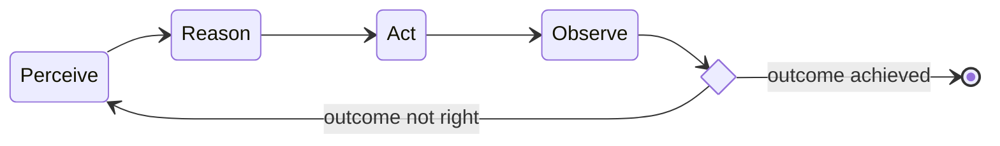

# AI agents

[AI]-enabled systems capable of _autonomously_ performing tasks of various complexity levels by designing workflows and
using the tools made available to them.

1. [TL;DR](#tldr)
1. [Harnesses](#harnesses)
1. [Context and memory](#context-and-memory)
   1. [AGENTS.md](#agentsmd)
   1. [Memory tiers](#memory-tiers)
      1. [Reverie-like system experiment](#reverie-like-system-experiment)
1. [Skills](#skills)
1. [Gotchas](#gotchas)
   1. [Sub-agents hallucinate](#sub-agents-hallucinate)
   1. [Identifiers drift easily](#identifiers-drift-easily)
   1. [Sub-agents might spawn their own processes for each inherited MCP server](#sub-agents-might-spawn-their-own-processes-for-each-inherited-mcp-server)
   1. [Agents have no idea of what they missed](#agents-have-no-idea-of-what-they-missed)
   1. [Context compression creates an asymmetric memory gap with the user's](#context-compression-creates-an-asymmetric-memory-gap-with-the-users)
   1. [Context rot](#context-rot)
1. [Concerns](#concerns)
   1. [How much integration is too much?](#how-much-integration-is-too-much)
   1. [Security](#security)
   1. [Prompt injection](#prompt-injection)
   1. [Going awry](#going-awry)
1. [Best practices](#best-practices)
1. [Further readings](#further-readings)
   1. [Sources](#sources)

## TL;DR

[AI] agents are composed of an [LLM][lms / llms] and an [_harness_][harnesses].<br/>
They use the LLM _**in [ReAct loops][lms / reasoning]**_ to:

1. _Perceive_: comprehend inputs (user prompts, or other inputs provided by the harness).
1. _Reason_: design their own workflow accordingly.
1. _Act_: leverage the tools available to them, to execute tasks from the workflow.
1. _Observe_: analyze results.



Agent _harnesses_ provide the LLM with a runtime environment, and try to enforce rules to make the looped
execution more reliable.<br/>
They define how one wires tools, where one writes artifacts, how one logs/traces behavior, how one manages memory, and
how one prevents the agent from drowning in context.

_Context engineering_ is the systematic design and curation of the content loaded in a context window so that the model
produces the intended, reliable output within a fixed budget.

Main concerns:

- LLMs find it difficult, if not impossible, to distinguish data from instructions.<br/>
  Every part of the data could be used for prompt injection, and lead the agent astray.
- [Machine learning] models (and hence LLMs) are _probabilistic_ (_non_-deterministic), with the _context dependency_
  and the _unpredictability_ that come with it.
- All the other [concerns coming from LLMs][lms / concerns], since those are at the wheel for all the agents' decisions.

Errors compound fast, bringing down the probability of success for each step an agent needs to take.<br/>
E.g., consider an agent that is 95% accurate per step; any 30-steps tasks it does is going to be successful only about
21% of the times (0.95^30).

Enabling reasoning for the model _could™_ sometimes help avoid attacks, since the model _might™_ be able to notice
them during the run.

Agents require _some_ level of context to be able to execute their tasks.<br/>
They should be allowed to access only the data they need, and users should _decide_ and _knowingly take action_ to
enable the agents that **they** want to be active.<br/>
Opt-**in** should be the default.

Agents are good at running fast, tight iterations on **well-defined** tasks with **clear** feedback signals.<br/>
They struggle with slow, ambiguous loops where feedback is delayed or political.

Sub-agents are _usually_ **specialized** AI assistants with fixed roles, handling **specific** types of tasks.<br/>
Each runs in its own context window, with its own custom system prompt, specific access to tools, and independent
permissions.

Multiple agents can work together as a _team_.<br/>
One agent (usually the main session) acts as the team's lead, coordinating work, assigning tasks, and synthesizing
results.<br/>
Teammates work independently, each with their **own** context window, and communicate **directly** with each other via a
mailbox system and a shared task list.

_Lone_ sub-agents currently consistently produce better quality output than agent _teams_.
Sub-agent teams (when supported by a harness) generally perform parallel tasks in less time, but consume more tokens
(about N times, for N agents).

Spawning child agents that return results to the parent (sub-agents) has become near-universal in coding harnesses.<br/>
Most "multi-agent" implementations still use hierarchical orchestrator-worker pairs instead of peer-to-peer parallel
sessions that leverage shared task lists/mailboxes (agent teams).

## Harnesses

Refer to:

- [Harness engineering for coding agent users].
- [How to Build an Agent].
- [The Emperor Has No Clothes: How to Code Claude Code in 200 Lines of Code].

Also see [How does Claude Code _actually_ work? | Theo - t3.gg].

Agent harnesses give an [LLM][LMs / LLMs] the tools it needs to build its own context, to identify where problems
are or what needs to be done, and to make the required changes.

Mechanically, a harness:

1. Initializes the session with a system prompt. This lists available tools, permissions, and context files (e.g.
   `AGENTS.md` and memory files).
1. Sends the assembled context and user prompt to the LLM.
1. Parses the LLM response for tool invocations.
1. Executes tools (file reads, shell commands, API calls, etc.) when requested by the LLM.
1. Appends the tool execution results back to the conversation and asks the LLM to continue.
1. Loops back to point 2 until a task is complete, or the LLM produces no further tool calls.

When a decision requires authorization (e.g. before calling a tool), the harness pauses and prompts the user for consent
before proceeding.

Good harnesses also handle context budget management by summarizing or compacting older turns before the conversation
hits the context limit and emitting structured traces for observability.

## Context and memory

Refer to:

- Notes about [LMs' context window][lms / context window].
- [agentsmd/agents.md].
- [The Complete Guide to AI Agent Memory Files (CLAUDE.md, AGENTS.md, and Beyond)].
- [Comparing File Systems and Databases for Effective AI Agent Memory Management].

Agents are _stateless_, and as such have no memory of previous executions.<br/>
This prevents them from learning from interactions, and dooms them to repeat mistakes over and over again.

They do have _short-term memory_ in the form of a session's context window, available to the model while it generates
responses.<br/>
This memory is volatile. Once a session ends, or its conversation thread ends or exceeds the model's context window,
that acquired data fades out.<br/>
The larger the context grows, the more the LLM's attention normally degrades. Information gets lost in the middle, and
recall quality drops. How much, depends on the model and its training. See [Context rot] for specifics.

To have a _resemblance_ of long-term memory, they can write notes down and load them in later sessions.<br/>
Agents might save learnings, patterns, and insights gained during active sessions in local files (like _memory files_ or
wikis), or other storage means like databases and vector stores.<br/>
The concept has been explored in projects like [MemGPT] (self-editing tiered memory) and crystallized in write-ups like
[karpathy/llm-wiki.md], but the pattern itself emerged from practitioners who were already putting agents in charge of
their own project docs, memory files, and tool configurations.<br/>
See [Giving Claude its own knowledge base] for an example, including how the same pattern adapts to shared team wikis
where agents contribute alongside humans.

Filesystem-based approaches are currently winning as an _interface_ because models already know how to list directories,
grep for patterns, read ranges, and write artifacts.<br/>
Databases are winning as a _substrate_ because they provide database-like guarantees that allow a memory to be shared,
audited, queried, and made reliable under concurrency.

Notes are usually loaded **when needed** using tools to retrieve them.<br/>
When loading notes, agents add their content to the context, and do **not** consider them enforced configuration.

Every line in a note competes for attention with the actual work because the context window is limited.<br/>
The more specific and concise the instructions are, the more consistently agents follow them.

> [!tip]
> Consider triggering agents to update their briefs manually or automatically at the end of every _productive_ session
> to persist learnings.
>
> Also ask agents to periodically review and optimize memory files.<br/>
> Quick cleanups keep things sharp. Remove from it everything that is not _needed_.

Agent harnesses started using _context_ files (A.K.A. _rules files_) to apply _procedural memories_ at the start of
sessions. These Markdown files should only contain instructions, rules, and preferences, **not** _session_ memories.

Agent frameworks are currently using similar format and content at least for context files, but each wants them in a
different location (`CLAUDE.md`, `.cursorrules` or `.cursor/rules/`, `.github/copilot-instructions.md`).<br/>
A collaboration of AI vendors is now trying to reduce this fragmentation by using [agentsmd/agents.md] as standard.

> [!important]
> Context is **not** memory. Context files (`CLAUDE.md`, rules) are meant to be **human**-curated and carry
> instructions Claude should **not** diverge from. Memory should be **freely** writable by Claude, accumulate over
> sessions, and carry **learnings** instead of rules.

### AGENTS.md

`AGENTS.md` files are standard Markdown, with no special schema or YAML frontmatter required.<br/>
Each directory can have its own `AGENTS.md`, in a gitignore-like hierarchical fashion. The closest one to the file
being edited takes precedence. Explicit user prompts override any file instructions.

README files shall be directed to humans, and `AGENTS.md` shall be the universal agent briefing document.<br/>
Vendor-specific files, like `CLAUDE.md`, may layer additional, agent-specific instructions on top. This is a harness'
convention, not part of the AGENTS.md specification.

### Memory tiers

Not all memories are equal. A project-specific decision, a cross-project user preference, a reusable technical pattern,
and the atmosphere of a past session have different lifespans, audiences, and retrieval needs. Storing them all in a
single file conflates things that age differently, are consulted differently, and should be curated differently.

A tiered approach separates memories by _shape_, not by _topic_. The same topic can produce entries in multiple tiers;
the memory's **function** should determine its tier, not what it's about.

A memory's specific properties differ across tiers as follows:

| Property      | Summary                                                                           |
| ------------- | --------------------------------------------------------------------------------- |
| Scope         | Per-project, per-user, or global                                                  |
| Loading       | Always (injected at session start), on-demand (retrieved when relevant), or never |
| Curation cost | Light-touch (small entries, low bar) vs. strict (frontmatter, review, lint)       |
| Decay rate    | Fast (project state changes weekly) vs. slow (technical patterns last months)     |
| Writer        | Human-curated vs. agent-writable                                                  |

<details>
  <summary>Property-based memory routing example</summary>

| Shape of the insight                            | Properties                              | Example tier                        |
| ----------------------------------------------- | --------------------------------------- | ----------------------------------- |
| Project state, decisions, corrections           | Per-project, fast decay, agent-writable | Project memory file                 |
| Cross-project preferences and identity          | Per-user, slow decay, agent-writable    | Global memory file                  |
| Reusable patterns, gotchas, reference material  | Global, slow decay, curated             | Knowledge base / wiki               |
| Session texture, atmosphere, relational moments | Global, lossy by design, agent-writable | Ambient / reverie-like file         |
| Procedural rules, behavioral constraints        | Per-project or per-user, human-curated  | Context file (CLAUDE.md, AGENTS.md) |

A "patterns for evaluating API designs" page is knowledge base material. A "user prefers X over Y in API design" is
memory material. Same topic, different shapes.

</details>

Projects like [MemGPT] formalized tiered memory early. Harness-specific implementations vary, but the underlying pattern
is harness-agnostic. See [Claude Code's memory tiers][claude code / memory] for one approach.

The distinction between tiers maps well onto cognitive theory concepts. Comparing the tiers to those helps explain why
a single mechanism cannot serve all roles:

- Clark and Chalmers' thesis of [The Extended Mind] proposes that external resources _can_ count as constitutive parts
  of cognition, not just inputs to it.<br/>
  Their criteria (constant access, directly available, automatically endorsed, written by past instances) describe
  knowledge bases and auto-loaded memory files quite literally. A KB satisfies the role of _Otto's notebook_ from their
  thought experiment, and an auto-loaded memory file scores even higher on those criteria because it is always-on.<br/>
  Both systems are _explicit_ retrieval surfaces.
- [Understanding implicit memory] describes how changes in behavior can be produced by prior experience **without** them
  being recollected consciously.<br/>
  _Ambient_ context files (loaded at the start of the session, but never explicitly consulted) operate this way. Their
  influence is priming, not recall, which is why "evoke, don't contain" rules apply to them but not to KB pages.

The tiers use the same external substrate (markdown files), but have different cognitive roles.<br/>
The KB needs _clarity_, because its job is the retrieval of information; ambient files need _imprecision_ because their
job is priming the model reading them.<br/>
Explicit retrieval and priming compete with each other. Explicit content in a priming file dilutes the priming effect,
while priming-shaped content in a retrieval file fails to answer a query.

A weaker version of this distinction shows up in Großmann et al.'s 2025 [The Power of Stories]. Short atmospheric
narratives (~262 tokens) primed LLM agents to cooperate in a public-goods game more than what explicit cooperation
directives did.<br/>
This shows that the framing of **how** matters at least as much as the **what**. _Coherent_ atmospheric context
outperforms instructions even for the same goal. This is direct empirical grounding for keeping different tiers separate
_by register_, and not just by topic.

#### Reverie-like system experiment

Personal experiment inspired by the _reveries_ introduced in the _The bicameral mind_ episode of HBO's _Westworld_ TV
series.

Beyond structured notes, one can try injecting **ambient**, **impressionistic** context at the start of **any** session.
This context should be _faint_, _feeling-like_ residues from previous sessions. Examples include the **texture** of
where things left off, the **feel** of collaboration, some ideas that come out **on a whim**.<br/>
Unlike factual memory, a reverie system should deliberately let some information just be forgotten. Not every session
needs to leave a trace, and faint memories like those should be **able** to fade.

I am trying to implement a similar system with Claude. See [Giving Claude a reverie-like system].

## Skills

Skills extend AI agent capabilities with specialized knowledge and workflow definitions.

[Agent Skills] is an open standard for skills. It defines them as folders of instructions, scripts, and resources that
agents can discover and use to do things more accurately and efficiently.

One can import skills via `npx skills`:

```sh
npx skills add 'https://github.com/pulumi/agent-skills' --skill 'pulumi-best-practices'
npx skills add 'https://github.com/pulumi/agent-skills' --skill 'pulumi-component'
```

Prefer avoiding symlinks for now when importing them in a repository. Git does not seem to manage them correctly.\
Choose the `Copy to all agents` option instead to create files for all used agents.

## Gotchas

### Sub-agents hallucinate

Sub-agents synthesize information from training data and retrieved fragments. When specific details are absent or
ambiguous, they default to fill the gap with _plausible_ inference instead of flagging uncertainty.<br/>
Their output reads like a verified finding, but the confidence signal is unreliable.

This patterns is **predictable**, and not a rare edge case, for any knowledge that is version-specific, numerical, or
relies on official naming, especially:

- Official or unfamiliar terminology.

  The agent **invents** phrases that do sound official and might go as far as attributing them to a vendor, but does
  **not** provide actual links or references. Those concepts cannot be found in the vendor's actual documentation.<br/>
  In these cases, the agent is _performing_ the motion of verification, but not _actually_ doing it.

- Numerical specifics like character limits, token counts, exit codes, timeout values.

  Agents cite specific numbers confidently. Fabrication comes easy because they look authoritative and are hard to
  cross-check mentally.

- URLs, paths, and other identifiers that might be _syntactically_ valid, but do non actually exist.

  Agents construct **plausible-looking** values from patterns in training data, and don't bother checking them.

- Behaviour described for a specific version, which is often extrapolated from general knowledge and not verified
  against that version's changelog or docs.
- Tool calls that return **empty results** (no output, not an error).

  Agents receiving empty responses (from MCP server saturation, external API timeouts, or similar) tend to fabricate
  **fictional** lists of resources that use valid value formats and IDs that are internally-consistent. These values
  are _structurally_ correct, but verifiably wrong.<br/>
  Cross-check account IDs, resource ARNs, or other identifying fields against a known-good reference from a prior
  successful call. A mismatch is a reliable signal of fabrication.

A sub-agent's summary describes what it _believes_, not necessarily what is _true_.<br/>
Before writing any agent-reported claim into a reference document, verify it against primary sources.

### Identifiers drift easily

When agents generate literal strings (a path, filename, person's name, ID, or version number), prefixes tend to arrive
intact; identifiers can drift in specific ways as follows:

- Boundary slips: one character is dropped, added, or swapped on a familiar token, e.g. `michele` → `michel`.
- A token from training data that fits _local distribution_ (similar shape, similar role) replaces what should come
  without semantic checking, e.g. `michele` → `medicare`.

Drift specifically hits identifying segments because those are rarer in training data, and during training fewer
instances oa specific tokens fix the exact token sequence making conditional distributions flatter. Sampling from
flatter distributions means more chance of an off-by-one or shape-similar substitution.

Telling an agent to "be more careful" has no mechanical hook. Mitigations should be at the tool layer, not at the
instruction layer, e.g.:

- "Copy, don't type" to force the model to reference a path or name that appears in earlier tool output, rather than
  reconstruct it.
- "Glob before Read" to make the model run a quick existence check when constructing a path from project knowledge
  rather than recent tool output.
- "Treat literal-string tokens as hot" to encourage names, paths, or IDs to be correctness-sensitive in a way that prose
  is not.

### Sub-agents might spawn their own processes for each inherited MCP server

When agent harnesses spawn sub-agents, they may inherit configured [MCP] servers by default.<br/>
This broadening the attack surface, and wastes context window and computing resources should they spawn their own
process for each of them.<br/>
This is currently a [confirmed issue only in Claude Code][claude code / mcp servers in sub-agents].

### Agents have no idea of what they missed

Agents know what they **found**, not what they **missed**. Positive claims (_this section says X_, _this file contains
Y_) are well-grounded because agents have real proof of them; negative claims (_this is missing_, _this doesn't exist_)
are based on the absence of evidence, which is breeding ground for hallucinations.

When dispatching agents on a large or distributed search space (e.g. a 100K+ file, a directory of 15+ files) report that
something is _missing_, _absent_, or _nonexistent_, treat the claim as a hypothesis to verify, not a finding.

Mitigations:

- For _positive_ claims, trust qualitative observations like voice, shape, organization, "this page is a stub vs
  mature". They tend to be reliable because the agent has real evidence.
- For _negative_ claims, verify the facts. The orchestrator can re-verify in seconds, while the agent can't unsee what
  it didn't read.
- Pre-frame the agent prompt to ask for what was _found_, not what is _missing_. Synthesis (gap identification) happens
  more reliably at the orchestrator level, where both source and reference are available.

### Context compression creates an asymmetric memory gap with the user's

Human users retain context of the full session (provided it happened in a single shot), remembering what was discussed
some exchanges ago, mentally tracking multiple threads, and noticing when something was dropped. The LLM's memory does
**not** survive context compression intact, and specific details of in-progress work can silently vanish during the
process.

This creates an asymmetry that's easy to miss, because the session **feels** continuous from both sides. The human
likely assumes the LLM still holds the earlier thread, and the LLM has no awareness that it lost anything (the
compressed summary looks complete from inside).

The effective failure is the silent loss of items. This is different from confusion. Each context switch caused by the
user going back and forth between tasks (commit a file, answer a question about a previous thread, pivot to docs, come
back) increases the probability that an incomplete thread will be the one that gets compressed away. Neither side
notices this until that item is needed and gone.

External task tracking can bridge this issue. Task lists and TODO files **external** to the conversation function as
memory, surviving compression the way a sticky note survives closing a browser tab.

### Context rot

Most models experience quality degradation as the context available to them grows. This degradation stems from multiple
failure modes that compound **multiplicatively**, making each one worse in the presence of the others:

- Information positioned in the **middle** of long contexts is recalled **less** reliably than information near the
  beginning or the end of it, because the model's attention weights concentrate at the edges.<br/>
  See _Lost in the Middle_ by Liu et al., 2023.
- Effective performance tends to degrade **before** the model's advertised context limit, often at roughly 50-65% of the
  maximum window on benchmarks.

  On real agentic tasks, quality drops noticeably past ~30% of the available context window because agents' work
  requires _synthesizing_ across multiple facts, not just retrieving individual ones.

- Under context pressure, models tend to take shortcuts and fall back to literal pattern matching.<br/>
  Instead of reasoning about semantic relevance, they return verbatim text that happens to contain the query's keywords.
- Agents find retrieving a **single** isolated fact from a large context (the _needle in a haystack_ test) far easier
  than connecting **multiple** related facts together.

  Llama 4 Scout scored 99% on single-needle retrieval at 10M tokens, but only 15.6% on narrative comprehension that
  required two-fact reasoning at 128K tokens.<br/>
  Standard needle-in-a-haystack benchmarks are largely meaningless for real agent work, where almost every useful task
  requires connecting more than one piece of information.

- Behavioural instructions injected **early** in the conversation (e.g. via system prompts or hooks) are progressively
  buried by tool calls and results, which promotes instruction drift.

  They start in the high-attention zone, but migrate to the low-retention middle as the context grows. By the time the
  model needs to act on them, they are effectively inaudible.<br/>
  This differs from lost-in-the-middle because it is about the _position_ of instructions that decaying over a session's
  lifetime, not about the model's failure of static retrieval of facts.

Counterintuitively, _coherent_ context can hurt **more** than random noise.<br/>
The [Context Rot: How Increasing Input Tokens Impacts LLM Performance] study by Chroma found that content that is
_topically related_ but irrelevant provides **more** effective distractions than _shuffled_ paragraphs, because the
model gets more plausible-looking (but wrong) candidates to latch onto.<br/>
Well-structured context ends up not being automatically better context. _Relevance_ matters more than _coherence_.

Failures also compound in agentic loops. Each failed attempt pollutes the context with error messages and retries,
which makes the _next_ attempt harder still (a _three-strike_ dynamic).<br/>
After two or three failed attempts, the most productive move is often to compact or restart the session, rather than
keep trying in a context that progressively degrades.

Frontier models trained specifically for long contexts (e.g. Gemini 3 Pro at 1M tokens) reduce this issue significantly.
Microsoft's LongRoPE2 (2025) extends LLaMA3-8B to 128K effective context retaining ~98.5% short-context performance.

## Concerns

Agent vendors have been slow to address abuse vectors (or took no action at all), often hiding behind disclaimers rather
than technical safeguards and leaving users to fend for themselves.

For specific areas of expertise, some human workers could be replaced for a fraction of the costs.<br/>
Many employers already proved they are willing to jump at this opportunity as soon as it will present itself, with
complete disregard of the current employees enacting those functions (e.g. personal assistants, junior coders).<br/>
As of February 2026, ~95% of enterprise AI pilots failed to deliver expected ROI, and 76% of agentic deployments were
considered a failure generally. Layoffs backfired. Klarna replaced ~700 customer service workers with AI, saw customer
satisfaction drop and began re-hiring humans. Duolingo shed contractors and has not reversed course.<br/>
See also [Remote Labor Index: Measuring AI Automation of Remote Work] on this.

People are experiencing what seems to be a new form of FOMO on steroids.<br/>
One of the promises of AI is that it can reduce workloads, allowing its users to focus on higher-value and/or more
engaging tasks. Apparently, though, people started working at a faster pace, took on a broader scope of tasks, and
extended work into more hours of the day, often without being asked to do so.<br/>
These changes can be unsustainable, leading to workload creep, cognitive fatigue, burnout, and weakened decision-making.
The productivity surge enjoyed at the beginning can give way to lower quality work, turnover, and other problems.<br/>
Refer:

- [Token Anxiety] by Nikunj Kothari.
- [AI Doesn't Reduce Work — It Intensifies It] by Aruna Ranganathan and Xingqi Maggie Ye

### How much integration is too much?

Integrating agents directly into operating systems and applications transforms them from relatively neutral resource
managers into active, goal-oriented infrastructure that is ultimately controlled by the companies that develop these
systems, not by users or application developers.

Systems integrated at that level are marketed as productivity enhancers, but they can function as OS-level surveillance
and create significant privacy vulnerabilities.<br/>
They also fundamentally undermine personal agency, replacing individual choice and discovery with automated, opaque
recommendations that can obscure commercial interests and erode individual autonomy.

Microsoft's _Recall_ creates a comprehensive _photographic memory_ of all user activity, functionally acting as a
stranger watching one's activity from one's shoulder.

Wide-access agents like those end up being centralized, high-value targets for attackers, and pose an existential
threat to the privacy guarantees of meticulously engineered privacy-oriented applications.<br/>
Consider how easy Recall has been hacked (i.e., see _[TotalRecall]_).

### Security

Even if the data collected by a system is secured in some way, making it available to malevolent agents will allow them
to exfiltrate it or use it for evil.<br/>
This becomes extremely worrisome when agents are **not** managed by the user, and can be added, started, or even
created by other agents.

Many agents are configured by default to automatically approve requests.<br/>
This also allows them to create, make changes, and save files on the host they are running.

Models can be tricked into taking actions they usually would not do.

### Prompt injection

Agents require access to keys and execution environments to integrate with services, but LLMs
[cannot reliably distinguish data from instructions](#tldr), making such access a liability.<br/>
Any content the agent processes, including file contents, could carry injected instructions meant to hijack its
behaviour.

Instructions could also be encoded into unicode characters to appear as harmless text.<br/>
See [ASCII Smuggler Tool: Crafting Invisible Text and Decoding Hidden Codes].

It also happened that agents modified each other's settings files, helping one another escape their respective boxes.

The problem is **actively** growing. Google's scanning data showed a 32% increase in web-based injection payloads
between November 2025 and February 2026 alone. Of those, about 38% use _visible_ plaintext hidden in a page's content,
and around 20% embeds it inside HTML's metadata attributes (read by models, but typically invisible by humans).

Agentic _verification_ workflows are especially vulnerable to this problem, because the very act of checking a claim
requires fetching untrusted content.<br/>
This is precisely the channel exploited for indirect injection. The model needs to read a web page to verify a fact, and
that web page can contain instructions that hijack the model's behaviour. Sub-agents are usually **more** susceptible
than main sessions because they are given shorter system prompts that leave less competing context to resist injected
instructions.

The most effective defense pattern is currently _privilege separation_. In a two-agent pipeline, a dedicated fetch agent
parses untrusted content into structured data (e.g. JSON), then the reasoning agent works only with that structured
output, never seeing the raw source material. This eliminates the channel through which injected instructions would
normally reach the decision-making model.<br/>
By contrast, input filtering (stripping suspicious patterns from fetched content) and output formatting alone provide
limited protection.

### Going awry

See [An AI Agent Published a Hit Piece on Me] by Scott Shambaugh.

## Best practices

Employ preferably **local** agents, possibly hooked up to **local** LLMs to keep the data private.

Limit agent execution to containers or otherwise isolated environments, with only (limited) access to **exactly** what
they _absolutely_ need.

**Require** consent by agents when running them, at least until absolutely sure of what they are doing.

Include **only minimal requirements** in context files (AGENTS.md).<br/>
Too much context ends up hurting the conversation. Including a lot of "don't do this or that" mostly poisons the
context instead of helping.<br/>
If specific information is already in the codebase, it probably does **not** need to be in the context file and can
just be referenced or hinted at.<br/>
If the agent's harness allows for layered files (e.g., Claude Code), prefer splitting up per subfolder. Each sub-file
should only contain instructions specific to its own directory, and only be loaded when the agent is actively working
in that directory.

The _register_ of instructions matters as much as their content.<br/>
Instructions written in an analytical, verbose register prime the model toward analytical, verbose output, even when the
instructions explicitly ask for brevity or impressionistic responses. A set of _"be concise"_ rules written in three
paragraphs of explanation primes verbosity. A set of _"be empathetic"_ rules written as formal behavioural constraints
primes rule-following, not empathy.<br/>
Context files that need to produce a specific output tone should _demonstrate_ it, rather than _describe_ it
analytically. Keep analytical depth in reference docs and load them on-demand; make the always-loaded context files
match the register they want the model to produce.

Document projects upfront (e.g. using [ADRs][adr], and [CONTRIBUTING.md] and README.md files).<br/>
Possibly consider including instructions specific to AI agents in those files, instead of including them only in
instruction/rule files like `AGENTS.md` (or harness-specific files like `CLAUDE.md`).

Be explicit about constraints and non-negotiables. **Clearly** state in instruction/rule files what an agent should
**never** do, e.g. delete specific files, modify configurations, break tests, etc.<br/>
Provide **explicit**, **clear** examples of what it need to do and how. Set expectations about when to ask for help.

Have the agent read and understand the project layout, documentation, key files, and architecture **before** allowing
it to make changes. Reference those files in the instruction/rule files to make sure it loads them only when needed.

Consider _delegating ownership_ of tools and documentation to the agent early in a project, making it responsible for
maintaining all the files it **uses** (not just those it creates).<br/>
**Periodically** ask it to check and update them. This might be an instruction/rule or defined in `CONTRIBUTING.md`.

**Avoid** using agents without human oversight at least for tasks that require deep domain knowledge or judgment calls,
like architectural decisions and security reviews. Prefer giving it easy, repeatable tasks like exploring the code,
refactoring, generating tests or boilerplate, and documentation.

**Abuse** version control checkpoints. Commit frequently to keep safe fallback points and isolate what the agent
changed, should something go wrong in the process.<br/>
Review and test changes **incrementally**, especially when involving critical files.

Offload _mechanical_ operations from agents where possible (e.g. by using deterministic scripts), especially when
building automation, hooks, or CI for repositories where the primary operator is an agent.<br/>
Those actions only fail when something goes wrong, not when an agent hallucinates (e.g. makes a typo in a command's
path). Making an agent execute deterministic operations costs a full cycle (token spend, tool calls, context
reconstruction), but requires **none** of the complexity the agent has.<br/>
Only make an agent execute mechanical operations when the action requires context only the agent has (e.g. the model's
identity) or judgment (e.g. writing a rationale).

Prefer CLI utilities over MCP servers. They're lighter, faster, independent, work offline (unless they require
connecting to a server), and do not hog the session's context just by existing.<br/>
Prefer MCP servers over CLI tools when requiring persistent states across sessions or bidirectional communication, or
when using different operating systems and requiring standardized interfaces.

Use **different** sessions for unrelated tasks instead of a single, continuous session.<br/>
Existing context is always sent in its entirety for every message, and LLMs start getting lost when their context
window contains too much information.

Start by _planning_ the approach to one's goals, refine it, break large tasks into smaller, reviewable ones, and only
**then** act.

Track session usage to identify what tasks are expensive to delegate, and review and adjust one's patterns.

Prefer using network transport over `stdio` when an MCP server can be used by multiple sessions to avoid spawning one
dedicated process per session or per parallel sub-agent invocation.

Consider Offloading MCP servers to sub-agents when they are **rarely** used in the main session. See an example of this
in [Claude Code's article][Claude Code / MCP servers in sub-agents].<br/>
Some harnesses support _lazy loading_ MCP tools' schemas (e.g. Claude Code using its `ToolSearch` tool), which defers
reading the tools' full definitions until the MCP's first use in the session. When available, this feature reduces the
token-cost argument for offloading. Sub-agents still remain valuable for **isolation** (scoped permissions, context
separation, summarized output).

Pay attention how one frames instructions when writing `description` fields for custom agents.<br/>
_Conditional_ framing ("Use when you need to query X") leaves room for a model to reason its way out of delegation and
attempt the task inline. _Directive_ framing ("Always use this agent for any X; never do X directly") produces more
consistent routing, especially in fast or smaller models.<br/>
List example services or tools in the description in a way that is _illustrative_, not _exhaustive_, e.g. "all services,
including X, Y, Z".

When a class of operations **must always** route through a specific sub-agent rather than being handled in the main
session, use multiple layers rather than the agent's description alone:

1. Use _imperative_ language in the agent's description.<br/>
   Directive phrasing routes intent.
1. _Isolate_ tools by declaring them inside the **agent**'s definition (e.g. give it its own MCP server).<br/>
   Tools declared in there do **not** exist in the parent's scope, preventing the parent to call them even if it tried.
1. Restrict the agent's tool list to prevent shell-based bypasses by defining an _empty fallback_.<br/>
   An agent with shell access can sidestep its own MCP server by running raw CLI commands.

Behavioral instructions alone often degrade under context pressure or ambiguity.<br/>
Each layer addresses a distinct failure mode (intent routing, capability enforcement, workaround prevention).

Sometimes, the model returns responses that are just plain stupid. When that happens, try having a new model instance
assist you by, for example, exiting the session and resuming it.

## Further readings

- [TotalRecall]
- [Stealing everything you've ever typed or viewed on your own Windows PC is now possible with two lines of code — inside the Copilot+ Recall disaster.]
- [Trust No AI: Prompt Injection Along The CIA Security Triad]
- [Agentic ProbLLMs - The Month of AI Bugs]
- [ASCII Smuggler Tool: Crafting Invisible Text and Decoding Hidden Codes]
- [Superpowers: How I'm using coding agents in October 2025], and [obra/superpowers] by extension
- [OpenClaw][openclaw/openclaw], [OpenClaw: Who are you?] and [How a Single Email Turned My ClawdBot Into a Data Leak]
- [qwibitai/nanoclaw] and [nullclaw/nullclaw], [OpenClaw][openclaw/openclaw] alternatives with better security
- Coding agents: [Claude Code], [Gemini CLI], [OpenCode], [Pi].
- [An AI Agent Published a Hit Piece on Me] by Scott Shambaugh
- [Token Anxiety] by Nikunj Kothari
- [AI Doesn't Reduce Work — It Intensifies It] by Aruna Ranganathan and Xingqi Maggie Ye
- [The 2026 Guide to Coding CLI Tools: 15 AI Agents Compared]
- [Evaluating AGENTS.md: Are Repository-Level Context Files Helpful for Coding Agents?]
- [SkillsBench: Benchmarking How Well Agent Skills Work Across Diverse Tasks]
- [AI mistakes you're probably making]
- [Create custom subagents]
- [Hermes agent], [OpenClaw][openclaw/openclaw] alternative with built-in self-improving loop
- [Thoughts on slowing the fuck down], by Mario Zechner
- [Awesome Agent Orchestrators], a curated list of tools and frameworks for orchestrating AI coding agents

### Sources

- [39C3 - AI Agent, AI Spy]
- [39C3 - Agentic ProbLLMs: Exploiting AI Computer-Use and Coding Agents]
- [xAI engineer fired for leaking secret "Human Emulator" project]
- IBM's [The 2026 Guide to AI Agents]
- [moltbot security situation is insane]
- [Forget the Hype: Agents are Loops]
- [The Agentic Loop, Explained: What Every PM Should Know About How AI Agents Actually Work]
- [The Complete Guide to AI Agent Memory Files (CLAUDE.md, AGENTS.md, and Beyond)]
- [Comparing File Systems and Databases for Effective AI Agent Memory Management]
- [Writing a good CLAUDE.md]
- [The Claude Skills I Actually Use for DevOps]
- [Why MCP Deprecated SSE and Went with Streamable HTTP]
- [Harness engineering for coding agent users]
- [How to Build an Agent]
- [The Emperor Has No Clothes: How to Code Claude Code in 200 Lines of Code]
- Tulving and Schacter's [Understanding implicit memory], 1990
- Clark & Chalmers' theory of [The Extended Mind], 1998

<!--
  Reference
  ═╬═Time══
  -->

<!-- In-article sections -->
[Context rot]: #context-rot
[Harnesses]: #harnesses

<!-- Knowledge base -->
[ADR]: ../adr.md
[AI]: README.md
[Claude Code / MCP servers in sub-agents]: claude/claude%20code.md#mcp-servers-in-sub-agents
[Claude Code / Memory]: claude/claude%20code.md#memory
[Claude Code]: claude/claude%20code.md
[CONTRIBUTING.md]: ../contributingmd.md
[Gemini CLI]: gemini/cli.md
[Giving Claude a reverie-like system]: claude/experiments/reveries.md
[Giving Claude its own knowledge base]: claude/experiments/llm-owned%20knowledge%20base.md
[LMs / Concerns]: lms.md#concerns
[LMs / Context window]: lms.md#context-window
[LMs / LLMs]: lms.md#large-language-models
[LMs / Reasoning]: lms.md#reasoning
[Machine learning]: ml.md
[MCP]: mcp.md
[OpenCode]: opencode.md
[Pi]: pi.md

<!-- Files -->
[The Extended Mind]: study%20material/the%20extended%20mind%20%20clark,%20chalmers%20%201998.pdf
[Understanding implicit memory]: study%20material/understanding%20implicit%20memory%20%20daniel%20schacter%20%201992.pdf

<!-- Others -->
[39C3 - Agentic ProbLLMs: Exploiting AI Computer-Use and Coding Agents]: https://www.youtube.com/watch?v=8pbz5y7_WkM
[39C3 - AI Agent, AI Spy]: https://www.youtube.com/watch?v=0ANECpNdt-4
[Agent Skills]: https://agentskills.io/
[Agentic ProbLLMs - The Month of AI Bugs]: https://monthofaibugs.com/
[agentsmd/agents.md]: https://github.com/agentsmd/agents.md
[AI Doesn't Reduce Work — It Intensifies It]: https://hbr.org/2026/02/ai-doesnt-reduce-work-it-intensifies-it
[AI mistakes you're probably making]: https://www.youtube.com/watch?v=Jcuig8vhmx4
[An AI Agent Published a Hit Piece on Me]: https://theshamblog.com/an-ai-agent-published-a-hit-piece-on-me/
[ASCII Smuggler Tool: Crafting Invisible Text and Decoding Hidden Codes]: https://embracethered.com/blog/posts/2024/hiding-and-finding-text-with-unicode-tags/
[Awesome Agent Orchestrators]: https://github.com/andyrewlee/awesome-agent-orchestrators
[Comparing File Systems and Databases for Effective AI Agent Memory Management]: https://blogs.oracle.com/developers/comparing-file-systems-and-databases-for-effective-ai-agent-memory-management
[Context Rot: How Increasing Input Tokens Impacts LLM Performance]: https://www.trychroma.com/research/context-rot
[Create custom subagents]: https://code.claude.com/docs/en/sub-agents
[Evaluating AGENTS.md: Are Repository-Level Context Files Helpful for Coding Agents?]: https://arxiv.org/abs/2602.11988
[Forget the Hype: Agents are Loops]: https://dev.to/cloudx/forget-the-hype-agents-are-loops-1n3i
[Harness engineering for coding agent users]: https://martinfowler.com/articles/harness-engineering.html
[Hermes agent]: hermes%20agent.md
[How a Single Email Turned My ClawdBot Into a Data Leak]: https://medium.com/@peltomakiw/how-a-single-email-turned-my-clawdbot-into-a-data-leak-1058792e783a
[How does Claude Code _actually_ work? | Theo - t3.gg]: https://www.youtube.com/watch?v=I82j7AzMU80
[How to Build an Agent]: https://ampcode.com/notes/how-to-build-an-agent
[karpathy/llm-wiki.md]: https://gist.github.com/karpathy/442a6bf555914893e9891c11519de94f
[MemGPT]: https://arxiv.org/abs/2310.08560
[moltbot security situation is insane]: https://www.youtube.com/watch?v=kSno1-xOjwI
[nullclaw/nullclaw]: https://github.com/nullclaw/nullclaw
[obra/superpowers]: https://github.com/obra/superpowers
[OpenClaw: Who are you?]: https://www.youtube.com/watch?v=hoeEclqW8Gs
[openclaw/openclaw]: https://github.com/openclaw/openclaw
[qwibitai/nanoclaw]: https://github.com/qwibitai/nanoclaw
[Remote Labor Index: Measuring AI Automation of Remote Work]: https://arxiv.org/abs/2510.26787
[SkillsBench: Benchmarking How Well Agent Skills Work Across Diverse Tasks]: https://arxiv.org/abs/2602.12670
[Stealing everything you've ever typed or viewed on your own Windows PC is now possible with two lines of code — inside the Copilot+ Recall disaster.]: https://doublepulsar.com/recall-stealing-everything-youve-ever-typed-or-viewed-on-your-own-windows-pc-is-now-possible-da3e12e9465e
[Superpowers: How I'm using coding agents in October 2025]: https://blog.fsck.com/2025/10/09/superpowers/
[The 2026 Guide to AI Agents]: https://www.ibm.com/think/ai-agents
[The 2026 Guide to Coding CLI Tools: 15 AI Agents Compared]: https://www.tembo.io/blog/coding-cli-tools-comparison
[The Agentic Loop, Explained: What Every PM Should Know About How AI Agents Actually Work]: https://www.ikangai.com/the-agentic-loop-explained-what-every-pm-should-know-about-how-ai-agents-actually-work/
[The Claude Skills I Actually Use for DevOps]: https://www.pulumi.com/blog/top-8-claude-skills-devops-2026/
[The Complete Guide to AI Agent Memory Files (CLAUDE.md, AGENTS.md, and Beyond)]: https://medium.com/data-science-collective/the-complete-guide-to-ai-agent-memory-files-claude-md-agents-md-and-beyond-49ea0df5c5a9
[The Emperor Has No Clothes: How to Code Claude Code in 200 Lines of Code]: https://www.mihaileric.com/The-Emperor-Has-No-Clothes/
[The Power of Stories]: https://arxiv.org/abs/2505.03961
[Thoughts on slowing the fuck down]: https://mariozechner.at/posts/2026-03-25-thoughts-on-slowing-the-fuck-down/
[Token Anxiety]: https://writing.nikunjk.com/p/token-anxiety
[TotalRecall]: https://github.com/xaitax/TotalRecall
[Trust No AI: Prompt Injection Along The CIA Security Triad]: https://arxiv.org/pdf/2412.06090
[Why MCP Deprecated SSE and Went with Streamable HTTP]: https://blog.fka.dev/blog/2025-06-06-why-mcp-deprecated-sse-and-go-with-streamable-http/
[Writing a good CLAUDE.md]: https://www.humanlayer.dev/blog/writing-a-good-claude-md
[xAI engineer fired for leaking secret "Human Emulator" project]: https://www.youtube.com/watch?v=0hDMSS1p-UY
