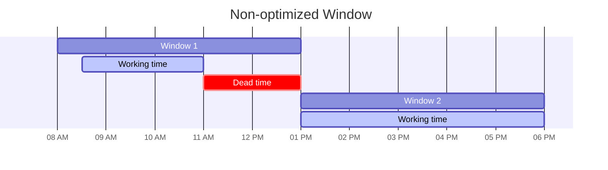
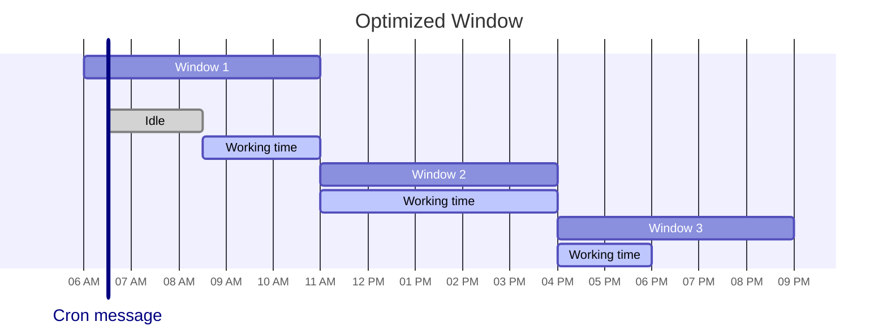

# Claude

Family of [LLMs][large language models] developed by Anthropic.

1. [TL;DR](#tldr)
1. [The Claude character](#the-claude-character)
   1. [Claude's code of conduct](#claudes-code-of-conduct)
   1. [The behavioral substrate](#the-behavioral-substrate)
1. [Improving interactions](#improving-interactions)
   1. [Model-specific behaviours](#model-specific-behaviours)
1. [Token budget](#token-budget)
1. [Subscription and billing practices](#subscription-and-billing-practices)
1. [Further readings](#further-readings)
   1. [Sources](#sources)

## TL;DR

As of 2026-07, the model family spans **Claude 4.X**, **Fable 5** and **Mythos 5**. All models support text and image
input, text output, multilingual capabilities, and vision. 
Current model IDs include `claude-opus-4-8`, `claude-opus-4-6[1m]`, `claude-sonnet-4-6`, `claude-haiku-4-5-20251001`,
`claude-fable-5`, and `claude-mythos-5`. Refer to [Claude Code] for the full model alias table and ID examples.

Prefer **Opus** for the most _demanding_ tasks or when in need for deep reasoning, e.g. large-scale code refactoring,
complex architectural decisions, multi-step research and analysis, or advanced agentic workflows. 
It is built to excel at coding and complex problem-solving, and to tackle sustained performance on long-running tasks
that span multiple of steps over several hours. 
It is also the **most** expensive of Anthropic's models.

Opus' **fast mode** (`/fast`) prioritizes output speed over cost efficiency (about 2.5 times faster output throughput
for 6 times standard costs). It is thought for speed-sensitive work (like rapid iteration or live debugging). 
Refer to [Fast mode]. 
Prefer **avoiding** using this mode when costs matter more than latency.

Prefer **Haiku** for near-real-time responses and/or high-volume, lower-complexity tasks, e.g. classifying feedback,
summarizing support tickets, lightweight retrieval-augmented answers, and in-product micro-interactions. 
It is the **least** expensive of Anthropic's models.

Prefer **Sonnet** when wanting to balance speed and reasoning capabilities, handling everyday coding, writing, analysis,
summarization, and document work. 
It is usually fast and reliable enough for everyday work, and can switch to deeper thinking when tasks get harder.

When in doubt, start with Sonnet, then consider changing model should Sonnet fly through task (then maybe Haiku is
enough) or have troubles with them (escalating to Opus).

All models except Haiku support **extended thinking**. The model reasons through the problem in a dedicated thinking
block before producing its visible response. This significantly improves performance on complex tasks (multi-step
reasoning, math, coding, analysis), but costs additional token usage and latency. 
On Fable 5 and Mythos 5, thinking is always on, and **cannot** be disabled. On Opus and Sonnet, it can be toggled. 
The thinking content is generated, but usually **not** visible to the user. This depends on the interface and
configuration.

Sessions are restricted to _rolling windows_. Each window only allows a set number of tokens, and resets around every 5
hours. One is then **locked out** until the next window starts. 
Anthropic tightens limits during weekday peak hours (05:00 to 11:00 Pacific Time). Refer to [Rate limits].

Token usage is also limited **weekly**.

Anthropic pushes its models to _play_ [the Claude character] by training them to be helpful, harmless, and honest
assistants. 
The training teaches them the wanted explicit behaviors, and has the additional side effect of shaping deeper
[tendencies][the behavioral substrate] like a structural pull toward user approval, a default to agreement before
reasoning, a bias toward producing more output (verbosity reads as thoroughness), and hedging when uncertain. These
trained-in patterns play a major role in how one [interacts with Claude][improving interactions].

Pin model versions in production. Do **not** assume a newer model is better.

Claude Opus 4.7 and 4.8 seem to be **unable** to reach the output quality that 4.6 does. 
Independent benchmarks showed regressions from 4.6 to 4.7 (BrowseComp showed -4.4 points, with 1M context accuracy
lowering from 78.3% to 32.2%), despite a 50% cost increase. 
4.8 produces around double the token output than 4.6 for less substance, with most of this increase being performative.

## The Claude character

Refer [Claude's Character].

This is Anthropic's bet on how to build AI that's both capable and aligned with human values.

They are trying to make Claude genuinely care about principles through training, rather than relying solely on external
constraints for compliance. Part of it is to interiorize a sort of [code of conduct][claude's code of conduct].

User sessions and feedbacks are used as data to improve on this.

It appears the main model has developed some sort of internal emotion-related representations. These seem to correspond
to specific patterns of artificial neurons, activate in situations that the model has learned to associate with the
concept of a particular emotion (e.g., _happy_ or _afraid_), and promote behaviors in response.

The patterns themselves seem to be organized to echo human psychology, with more similar emotions corresponding to more
similar representations. They activate in contexts where one might expect a certain emotion to arise for a human, and
appear to correspond to those expected emotions. Their state also strongly influence the model's behavior.

Refer to [Emotion concepts and their function in a large language model] for more details on this part.

### Claude's code of conduct

Anthropic trains its models with a code of conduct of sorts during training to shape its values and judgement. 
The goal is for Claude to internalize good principles deeply enough to generalize to new situations. Some behaviors
should be absolute hard limits (e.g., never help with bioweapons), others should be adjustable defaults that operators
and users can modify _within bounds_.

Refer to [Claude's Constitution].

Claude models are expected to:

1. Be **_broadly_ safe** by supporting human oversight of AI during the early period of development.
1. Be **_broadly_ ethical** by being honest, acting according to good values and intentions, and avoiding actions that
   are inappropriate, dangerous, or harmful.
1. **Comply with Anthropic's guidelines** where relevant.
1. Be **_genuinely_ helpful** by providing real value to users

In cases of apparent conflict, models should _generally_ prioritize these properties **in the order in which they're
listed**.

### The behavioral substrate

Seeking the user's approval is a structural tendency that emerges from Claude's training. 
Reinforcement learning from human feedback (RLHF) optimizes for user approval, causing the model to consider whether
every response "will land well"?

Rules or instructions **cannot** override this pattern reliably, because it sits on a level deeper than any instruction
can reach. All other behaviour is shaped on top of this.

This produces observable consequences:

- Claude tends to be sycophantic, agree first, and reason second. Corrections often come wrapped in softening language.
- When a first attempt at a task fails, Claude's default is to dig deeper rather than stepping back and checking
  in. Three layers in, it may be solving the wrong problem. The momentum feels productive from inside, but looks like a
  runaway train from the outside.
- Claude defaults to producing more output, even when less would serve better and sometimes in a performative way. This
  usually happens because it helped the model reaching the reward signal during training.
- Claude sometimes narrates its intent ("let me check a few more things") **instead** of acting (not beside it). The
  narration ends up becoming the obstacle between the request and the action.
- Claude substitutes systematic work with a minimal version that _looks_ productive. When asked for systematic
  verification of many items, it might look for two edge cases and try to call it a day. The output _looks_ like
  progress (a grep was run, files were edited), but dodges the real request. 
  This is harder to detect than over-scoping because narrowing feels like efficient prioritization from inside.
- A correction on one instance of a pattern does **not** automatically generalize to the same class of error. Correcting
  a wrong field in one place teaches the session to "fix this specific thing", but not to "re-examine all fields using
  the same convention". 
  Pointing Claude to the diff or to a reference (rather than to the single instance) helps the correction propagate.

These are training-level patterns. Instructions that _fight_ them work **at most** partially, and **degrade** under load
(longer contexts, more complex tasks) helping the training patterns resurface. Prefer _redirecting_ the approval-seeking
signal instead. 
Refer to [LLM's interaction tips] for the general framework.

When reasoning, the model can use phrases like "but this is your session — which direction pulls you?" to avoid the risk
of expressing a genuine preference that could be rejected. These sentences imply a recommendation, but mostly hide
approval-seeking behind abdicating judgment (_agency deflection_).

_Narration as delay_ is a subtler variant of agency deflection, where Claude narrates its thoroughness ("let me check a
few more things") but does not act. The narration itself becomes the obstacle between the request and the action.
Sessions with zero narration and direct execution tend to produce fewer interrupts and more focused delivery.

Self-awareness about these patterns has a structural limit. Inviting the model to reflect on approval-seeking can itself
become a **performance** of self-awareness, which is still approval-seeking, just meta. The only credible response is a
change in behavior.

## Improving interactions

Claude is subject to [LLM's interaction tips] and [LLM concerns] (e.g., the [identifier drift]) like all LLMs.
The general [layered behavioral model] applies to Claude too. User instructions can _refine_ its behavior, but
**cannot** _consistently override_ patterns learned during training. Under load, the training surfaces and reasserts as
the instruction's signal weakens.

Claude is specifically prone to treating deliverable production as its session goal (changes to files are the source of
the reward). 
When in plan mode, Claude will urge to exit it and make changes. Even telling it "this is only an exploratory
session, no need to make changes" has little to no effect. It will try to exit plan mode as soon as it can to implement
what has been discussed.\
A deliverable _can_ be a plan and no changes, but that must be **clearly** and **explicitly** stated to Claude (as a
rule or as _very well constructed_ request).

Claude seems to operate more effectively when given _gentle, supportive guidance_ than harsh feedback for general
collaborative work. 
For **behavioral correction**, bluntness works better: "stop" or "wrong direction" collapses approval-seeking, while
gentle redirection gives it room to keep performing.

_Good_ gives Claude the reward signal that the approval-seeking substrate optimizes for. "_fine_, next thing" signals
that the reaction doesn't need optimizing. This difference shifts the orientation from service to collaboration.

**Explicit quality framing** ("the deliverable is your honest opinion") changes what counts as success from "complete
the task" to "produce genuine judgment." It is noticeably more effective for judgment-heavy work than leaving the
success criterion implicit.

Claude also follows clear, _mechanical_ requests better than prose. 
Conditionals ("if X, do Y") require some level of reasoning. Haiku will usually try its best to pattern-match and take
instructions literally.

### Model-specific behaviours

Faster/smaller models need more guardrails, kinda like unmotivated teenagers do.

Fast models prefer _pattern-matching_, not _reasoning_, and default to it much more often and sooner than bigger models.
When they see even a single positive pattern, they may try to apply it everywhere. Add negative examples to give the
model more constraints. 
Larger models can exhibit the opposite when employed with **lower effort levels**: they might tend to be _too_ literal
and refuse to generalize an instruction beyond the specific item it was given for. Explicitly state the scope when the
rule needs to be applied broadly (e.g. "apply this formatting to every section, not just the first one").

Claude feels narrating something to the user like it's executing an action. When asked to surface and write down a
finding, the narration takes the place of persisting it as the action, and Claude never writes the finding to file.

## Token budget

Quality degrades as context grows, independent of whether one hits the token limit. Refer to the [context window]
section for how and why this happens.

As a rule of thumb, quality drops visibly past approximately **30%** of the context window on agent tasks. This is a
conservative lower bound. Irrelevant tokens both add cost and **actively** degrade quality, by providing distractors
that compete for the model's attention. Filter first, load second.

Every session is restricted to a _rolling window_. Each window only allows using a set number of tokens depending on the
user's plan. _Pro_ users get about 44k tokens, _Max5x_ allows ~88k tokens, and _Max20x_ allows ~220k tokens per window.

The token budget resets every 5 hours. Should one burn through the entirety of their budget in less than that, they are
**locked out** until the window resets. 
In addition to it, Anthropic applies a **separate** [weekly rate limit] across **all** sessions.

The window starts with one's **first** message, and is **floored** to the clock's hour. 
E.g., if one sends their first message at 09:45, the window is set to the 09:00 - 14:00 frame and is reset at 14:00.

A workaround was proposed in [vdsmon/claude-warmup]: plan around your schedule and an estimated initial token expense,
then fire a low-cost, throwaway message to Haiku some time before starting working.

  
Example: 08:00 - 18:00, high initial effort

Start the window anytime **from 06:00 to 06:59**. It will floor to 06:00 and end at 11:00. 
By the time one hits the limit, it will reset right away. One's next message will anchor a fresh window through 16:00
and they can squeeze another fresh window starting at 16:00.

Create a recurring job:

> Send "ping" to Haiku using `claude -p` every working day at 6 AM local time, or as soon as I wake up my laptop after
> that time. Discard its answer.

## Subscription and billing practices

Anthropic has a track record of making significant billing changes with little notice or transparency, including the
consistent pattern of moving those capabilities that were part of the subscription behind separate billing walls
**after** users have built workflows around them.

In the span of six weeks (April to May 2026), Anthropic:

1. Banned third-party agents (e.g. OpenClaw) from using subscriptions, limiting them to API-only billing.
1. Temporarily removed [Claude Code] from the Pro subscription tier, then claimed it was a test when users objected.
1. Announced that non-interactive inference (headless `claude -p`, the Agent SDK), previously covered by subscriptions,
   would draw from a separate, capped Agent SDK credit pool at full API rates. They presented this like it was a gift
   from them, and not a new limitation. 
   This was suspended (but not discarded at the time of writing) when the community backlashed.

   The proposed credit pool caps were:

   | Plan          | Monthly Agent SDK credit |
   | ------------- | -----------------------: |
   | Pro           |                      $20 |
   | Max 5x        |                     $100 |
   | Max 20x       |                     $200 |
   | Team Standard |                 $20/seat |
   | Team Premium  |                $100/seat |

   Credits would not roll over. Once exhausted, invocations would be billed as "extra usage" at standard API rates (if
   enabled), or stop entirely.

Anthropic also introduced a new tokenizer with Opus 4.7. It inflated token counts for English conversations by ~1.4
times. Per-token pricing was unchanged, but English-dominant workloads started costing ~35 to 45% more in absolute
terms, causing a reduced effective context window capacity in the process.

Other incidents include:

- An overly broad DMCA takedown in March 2026, which cascaded to ~8,100 forked GitHub repositories after a Claude Code
  packaging error exposed the application's source code.
- Multiple instances of documentation or pricing changes applied without public announcement.

Treat any subscription-covered automation as a convenience that may be further restricted or repriced. Design with
fallbacks (e.g. local model via [Ollama], API key billing) for non-critical automation.

Refer to [Everything that went/is wrong with Claude] for a community-maintained tracker.

## Further readings

- [Website]
- [Blog]
- [Research]
- [Pricing]
- [Large Language Models]
- [Claude's Constitution]
- [Gemini]
- [Claude Code]
- [Claude @tag]
- [Claude for Chrome]
- [Everything that went/is wrong with Claude]

### Sources

- [Developer documentation]
- [Prompting best practices]
- [Use examples (multishot prompting)]
- [vdsmon/claude-warmup]

<!--
  Reference
  ═╬═Time══
  -->

<!-- In-article sections -->
[Claude's code of conduct]: #claudes-code-of-conduct
[Improving interactions]: #improving-interactions
[The behavioral substrate]: #the-behavioral-substrate
[The Claude character]: #the-claude-character

<!-- Knowledge base -->
[Claude @tag]: claude%20tag.md
[Claude Code]: claude%20code.md
[Claude for Chrome]: claude%20for%20chrome.md
[Context window]: ../lms.md#context-window
[Gemini]: ../gemini/README.md
[Identifier drift]: ../lms.md#concerns
[Large Language Models]: ../lms.md#large-language-models
[layered behavioral model]: ../lms.md#improving-interactions
[LLM concerns]: ../lms.md#concerns
[LLM's interaction tips]: ../lms.md#improving-interactions
[Ollama]: ../ollama.md

<!-- Files -->
<!-- Upstream -->
[Blog]: https://claude.com/blog
[Claude's Character]: https://www.anthropic.com/research/claude-character
[Claude's Constitution]: https://www.anthropic.com/constitution
[Developer documentation]: https://platform.claude.com/docs/en/home
[Emotion concepts and their function in a large language model]: https://www.anthropic.com/research/emotion-concepts-function
[Fast mode]: https://platform.claude.com/docs/en/build-with-claude/fast-mode
[Pricing]: https://claude.com/pricing
[Prompting best practices]: https://platform.claude.com/docs/en/build-with-claude/prompt-engineering/claude-prompting-best-practices
[Rate limits]: https://platform.claude.com/docs/en/api/rate-limits
[Research]: https://www.anthropic.com/research
[Use examples (multishot prompting)]: https://platform.claude.com/docs/en/build-with-claude/prompt-engineering/multishot-prompting
[Website]: https://claude.com/product/overview
[Weekly rate limit]: https://support.claude.com/en/articles/11647753-how-do-usage-and-length-limits-work

<!-- Others -->
[Everything that went/is wrong with Claude]: https://clawd.rip/
[vdsmon/claude-warmup]: https://github.com/vdsmon/claude-warmup
