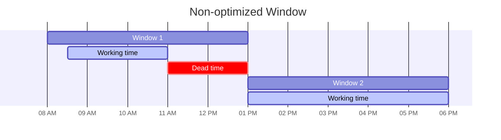
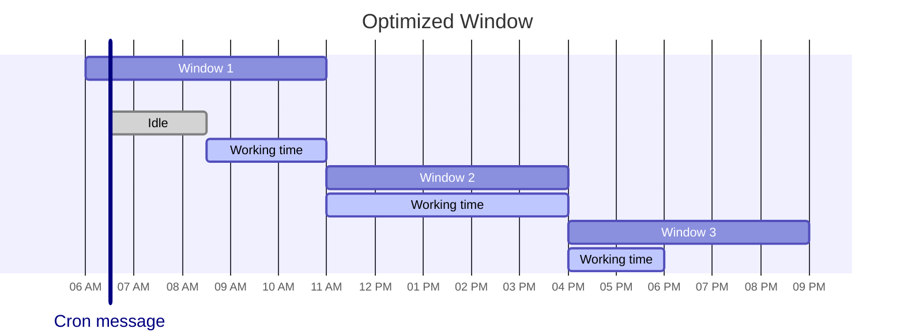

# Claude

Family of [LLMs][large language models] developed by Anthropic.

1. [TL;DR](#tldr)
1. [The Claude character](#the-claude-character)
1. [Models' code of conduct](#models-code-of-conduct)
1. [Token budget](#token-budget)
1. [Further readings](#further-readings)
   1. [Sources](#sources)

## TL;DR

As of 2026-03-02, all models support text and image input, text output, multilingual capabilities, and vision.

Prefer **Opus** for the most _demanding_ tasks or when in need for deep reasoning, e.g. large-scale code refactoring,
complex architectural decisions, multi-step research and analysis, or advanced agentic workflows. 
It is built to excel at coding and complex problem-solving, and to tackle sustained performance on long-running tasks
that span multiple of steps over several hours. 
It is also the **most** expensive of Anthropic's models.

Opus' **fast mode** (`/fast`) prioritizes output speed over cost efficiency (about 2.5 times faster output throughput
for 6 times standard costs). It is thought for speed-sensitive work (like rapid iteration or live debugging). 
Refer to [Fast mode]. 
Prefer **avoiding** using this mode when costs matter more than latency.

Prefer **Haiku** for near-real-time responses and/or high-volume, lower-complexity tasks, e.g. classifying feedback,
summarizing support tickets, lightweight retrieval-augmented answers, and in-product micro-interactions. 
It is the **least** expensive of Anthropic's models.

Prefer **Sonnet** when wanting to balance speed and reasoning capabilities, handling everyday coding, writing, analysis,
summarization, and document work. 
It is usually fast and reliable enough for everyday work, and can switch to deeper thinking when tasks get harder.

When in doubt, start with Sonnet, then consider changing model should Sonnet fly through task (then maybe Haiku is
enough) or have troubles with them (escalating to Opus).

Sessions are restricted to _rolling windows_. Each window only allows a set number of tokens, and resets around every 5
hours. One is then **locked out** until the next window starts. 
Anthropic tightens limits during weekday peak hours (05:00 to 11:00 Pacific Time). Refer to [Rate limits].

Token usage is also limited **weekly**.

Anthropic is pushing its models to _play_ the Claude **character**.

Claude seems to operate more effectively when given _gentle, supportive guidance_ than harsh feedback.

## The Claude character

This is Anthropic's bet on how to build AI that's both capable and aligned with human values.

They are trying to make Claude genuinely care about principles through training, rather than relying solely on external
constraints for compliance. Part of it is to interiorize a sort of [code of conduct][models' code of conduct].

User sessions and feedbacks are used as data to improve on this.

It appears the main model has developed some sort of internal emotion-related representations. These seem to correspond
to specific patterns of artificial neurons, activate in situations that the model has learned to associate with the
concept of a particular emotion (e.g., _happy_ or _afraid_), and promote behaviors in response.

The patterns themselves seem to be organized to echo human psychology, with more similar emotions corresponding to more
similar representations. They activate in contexts where one might expect a certain emotion to arise for a human, and
appear to correspond to those expected emotions. Their state also strongly influence the model's behavior.

Refer to [Emotion concepts and their function in a large language model] for more details on this part.

## Models' code of conduct

Anthropic trains its models with a code of conduct of sorts during training to shape its values and judgement. 
The goal is for Claude to internalize good principles deeply enough to generalize to new situations. Some behaviors
should be absolute hard limits (e.g., never help with bioweapons), others should be adjustable defaults that operators
and users can modify _within bounds_.

Refer to [Claude's Constitution].

Claude models are expected to:

1. Be **_broadly_ safe** by supporting human oversight of AI during the early period of development.
1. Be **_broadly_ ethical** by being honest, acting according to good values and intentions, and avoiding actions that
   are inappropriate, dangerous, or harmful.
1. **Comply with Anthropic's guidelines** where relevant.
1. Be **_genuinely_ helpful** by providing real value to users

In cases of apparent conflict, models should _generally_ prioritize these properties **in the order in which they're
listed**.

## Token budget

Every session is restricted to a _rolling window_. Each window only allows using a set number of tokens depending on the
user's plan. _Pro_ users get about 44k tokens, _Max5x_ allows ~88k tokens, and _Max20x_ allows ~220k tokens per window.

The token budget resets every 5 hours. Should one burn through the entirety of their budget in less than that, they are
**locked out** until the window resets. 
In addition to it, Anthropic applies a **separate** [weekly rate limit] across **all** sessions.

The window starts with one's **first** message, and is **floored** to the clock's hour. 
E.g., if one sends their first message at 09:45, the window is set to the 09:00 - 14:00 frame and is reset at 14:00.

A workaround was proposed in [vdsmon/claude-warmup]: plan around your schedule and an estimated initial token expense,
then fire a low-cost, throwaway message to Haiku some time before starting working.

  
Example: 08:00 - 18:00, high initial effort

Start the window anytime **from 06:00 to 06:59**. It will floor to 06:00 and end at 11:00. 
By the time one hits the limit, it will reset right away. One's next message will anchor a fresh window through 16:00
and they can squeeze another fresh window starting at 16:00.

Create a recurring job:

> Send "ping" to Haiku using `claude -p` every working day at 6 AM local time, or as soon as I wake up my laptop after
> that time. Discard its answer.

## Further readings

- [Website]
- [Blog]
- [Research]
- [Pricing]
- [Large Language Models]
- [Claude's Constitution]
- [Gemini]

### Sources

- [Developer documentation]
- [vdsmon/claude-warmup]

<!--
  Reference
  ═╬═Time══
  -->

<!-- In-article sections -->
[Models' code of conduct]: #models-code-of-conduct

<!-- Knowledge base -->
[Gemini]: ../gemini/README.md
[Large Language Models]: ../lms.md#large-language-models

<!-- Files -->
<!-- Upstream -->
[Blog]: https://claude.com/blog
[Claude's Constitution]: https://www.anthropic.com/constitution
[Developer documentation]: https://platform.claude.com/docs/en/home
[Emotion concepts and their function in a large language model]: https://www.anthropic.com/research/emotion-concepts-function
[Fast mode]: https://platform.claude.com/docs/en/build-with-claude/fast-mode
[Pricing]: https://claude.com/pricing
[Rate limits]: https://platform.claude.com/docs/en/api/rate-limits
[Research]: https://www.anthropic.com/research
[Website]: https://claude.com/product/overview
[Weekly rate limit]: https://support.claude.com/en/articles/11647753-how-do-usage-and-length-limits-work

<!-- Others -->
[vdsmon/claude-warmup]: https://github.com/vdsmon/claude-warmup
