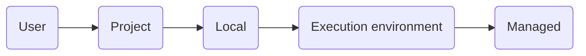
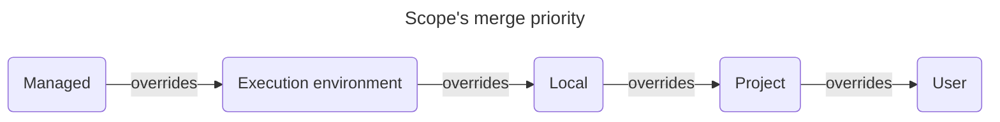
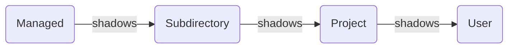

# Claude Code

[Agentic][ai agents] harness around [Claude] providing it with tools, context management, and execution
environment.<br/>
Works in a terminal, IDE (via plugin), and in Claude's desktop app.

1. [TL;DR](#tldr)
1. [Configuration](#configuration)
   1. [Credentials](#credentials)
1. [Context and memory](#context-and-memory)
1. [Using tools](#using-tools)
   1. [Managing MCP servers](#managing-mcp-servers)
      1. [MCP servers of interest](#mcp-servers-of-interest)
   1. [Limit tool execution](#limit-tool-execution)
1. [Using skills](#using-skills)
   1. [Findings about skill creation](#findings-about-skill-creation)
1. [Using plugins](#using-plugins)
1. [Using hooks](#using-hooks)
   1. [Prompt-based hooks](#prompt-based-hooks)
   1. [Agent-based hooks](#agent-based-hooks)
   1. [HTTP hooks](#http-hooks)
1. [Delegating work](#delegating-work)
   1. [Sub-agents](#sub-agents)
   1. [Agent teams](#agent-teams)
   1. [MCP servers in sub-agents](#mcp-servers-in-sub-agents)
   1. [Offloading MCP servers to sub-agents](#offloading-mcp-servers-to-sub-agents)
1. [Giving Claude its own knowledge base](#giving-claude-its-own-knowledge-base)
1. [Giving Claude a reverie-like system](#giving-claude-a-reverie-like-system)
    1. [Multiple registers](#multiple-registers)
1. [Scheduling tasks](#scheduling-tasks)
1. [Tools of interest](#tools-of-interest)
1. [Best practices](#best-practices)
1. [Run on local models](#run-on-local-models)
1. [Further readings](#further-readings)
    1. [Sources](#sources)

## TL;DR

Can run in multiple isolated shell sessions.<br/>
Prefer using [git worktrees] to isolate sessions running within the same repository.

Can access and understand images and other file types, read and edit files, run commands and tools, and do all of that
in parallel.

_Normally_:

- Tied to Anthropic's Claude models (Haiku, Sonnet and Opus).
- Requires a Claude API key or Anthropic plan.<br/>
  Usage is metered by the token.

> [!tip]
> One _can_ route requests to other services using [Claude Code router], or use local models with [Ollama].<br/>
> Performances do take a _major_ hit, though.

Uses a **scope** system to determine where configuration files apply, and who they're shared with.<br/>
Configuration is loaded and **merged** in the following order:



Use _settings.json_ files for permissions, hooks, env vars, etc.<br/>
[`settings.json` file example][settings.json file example].

Use _.mcp.json_ files for project-level MCP definitions.<br/>
[`.mcp.json` file example][.mcp.json file example].

Store _other_ configuration like personal preferences (theme, notification settings, editor mode), OAuth session, MCP
server configurations for user and local scopes, per-project state (allowed tools, trust settings), and various caches
in `~/.claude.json`.<br/>
Updated _autonomously_ by Claude Code. Prefer **not** editing this file manually.<br/>
**Not** part of the `settings.json` hierarchy as much as a runtime state file.<br/>

Supports a **plugin** system for extending its capabilities.

Sends Statsig telemetry data by default. Includes operational metrics (latency, reliability, usage patterns).<br/>
Disable it by setting the `DISABLE_TELEMETRY` environment variable to `1`.

> [!tip]
> Gives better results when asked to _plan_ before writing code, and then _iterates_ on it.

Common workflows:

- Explore, plan, ask for confirmation, write code, commit.

  <details style='padding: 0 0 1rem 1rem'>
    <summary>Example</summary>

  > Figure out the root cause for issue #43, then propose possible fixes.<br/>
  > Let me choose an approach before you write code.<br/>
  > Think fast.

  </details>

- Write tests, commit, write code, iterate, commit, push, create a PR.

  <details style='padding: 0 0 1rem 1rem'>
    <summary>Example</summary>

  > Write tests for @utils/markdown.ts to make sure links render properly.<br/>
  > Note these tests will not pass yet since links are not yet implemented.<br/>
  > Commit.<br/>
  > Update the code to make the tests pass.<br/>
  > Commit. Push. PR.

  </details>

- Write code, screenshot the result, track progress, iterate.

  <details style='padding: 0 0 1rem 1rem'>
    <summary>Example</summary>

  > Implement \[mock.png], then screenshot it with Puppeteer and iterate until it looks like the mock.<br/>
  > Write down notes for yourself at every iteration. Think hard.

  </details>

Hit `esc` **once** to stop Claude.<br/>
This action is _usually_ safe. Claude will then resume or try a different approach, while retaining context about the
previous request.

Refer to [Claude] for details on models and usage.

Prefer using **Sonnet** for quicker, smaller tasks (e.g. as sub-agent, greenfield coding, app initialization).<br/>
Consider using **Opus** for broader, longer, higher-level tasks (e.g. planning, refactoring, orchestrating
sub-agents).<br/>
Consider using **Haiku** for quick responses.

The `opusplan` mode allows using Opus during planning, then automatically switches to Sonnet for implementation.

Change how Claude responds (without affecting its capabilities) by configuring an [output style][output styles].<br/>
The builtin `explanatory` style adds educational insights between tasks; `learning` shares insights _and_ asks the user
to contribute to changes.<br/>
Custom styles can be created as Markdown files in the `~/.claude/output-styles/` and `.claude/output-styles/` folders.

Use memory and context files (`CLAUDE.md`) to instruct Claude Code on commands, style guidelines, and give it _key_
context. Try to keep them small.

Consider allowing specific tools to reduce interruption and avoid fatigue due to too many requests.<br/>
Prefer using CLI tools over MCP servers as they are generally faster, don't require a running server, and have usually
lower overhead.

Make sure to use `/clear` or `/compact` regularly to allow Claude to maintain focus on the conversation.<br/>
Or ask it to create notes to self and restart it once the context goes above a threshold (usually best at 60%).

The `Agent` tool routes to built-in agent types **and** user-level custom agents (`~/.claude/agents/`).<br/>

[Offloading MCP servers to sub-agents] **does** allow achieving a setup where:

- The main session has **no** MCP server configured at session level.
- The main session delegates automatically to dedicated sub-agents.
- Each sub-agent has only the MCP servers it needs, defined inline in its frontmatter.

<details>
  <summary>Setup</summary>

See also [Configuration] and [Environment variables][environment variables reference].

```sh
# Install.
brew install --cask 'claude-code'
curl -fsSL https://claude.ai/install.sh | bash
curl -fsSL https://claude.ai/install.sh | bash -s 'stable'
curl -fsSL https://claude.ai/install.sh | bash -s '2.1.74'
npm install -g '@anthropic-ai/claude-code'  # deprecated, prefer others

# Check installation and configuration.
claude --version
claude doctor

# Uninstall.
brew uninstall --zap 'claude-code'
npm uninstall -g '@anthropic-ai/claude-code'
rm -rf "$HOME/.local/bin/claude" "$HOME/.local/share/claude"

# Cleanup settings.
rm -rf "$HOME/.claude" "$HOME/.claude.json" ".claude" ".mcp.json"
```

</details>

<details>
  <summary>Usage</summary>

Refer to [CLI reference].

```sh
# Start in interactive mode.
# Best to start from a repository.
claude

# Run a one-time task.
claude "fix the build error"

# Run a one-off task, then exit.
claude -p 'Hi! Are you there?'
claude -p "explain the function in @someFunction.ts"
claude -p 'What did I do this week?' --allowedTools 'Bash(git log*)' --output-format 'json'
cat 'minutes.md' | claude -p "summarize this"

# Resume the most recent conversation that happened in the current directory
claude -c

# Resume a previous conversation
claude -r

# Add MCP servers.
# Defaults to the 'local' scope if not specified.
claude mcp add --transport 'http' 'GitLab' 'https://some.local.gitlab.com/api/v4/mcp'
claude mcp add --transport 'http' 'linear' 'https://mcp.linear.app/mcp' --scope 'user'

# List installed MCP servers.
claude mcp list

# Show MCP servers' details
claude mcp get 'github'

# Remove MCP servers.
claude mcp remove 'github'

# Load local plugins.
claude --plugin-dir './path/to/plugin'

# Install plugins.
# Marketplace defaults to 'claude-plugins-official'.
# Scope defaults to 'user'.
claude plugin install 'gitlab'
claude plugin i 'aws-cost-saver@aws-cost-saver-marketplace' --scope 'project'

# List installed plugins only.
claude plugin list

# List all plugins.
claude plugin list --available --json

# Enable plugins.
claude plugin enable 'gitlab@claude-plugins-official'

# Disable plugins.
claude plugin disable 'gitlab@claude-plugins-official'

# Update plugins.
claude plugin update 'gitlab@claude-plugins-official'
```

_Relevant_ commands from within Claude Code (version 2.1.109).<br/>
Refer to [Built-in commands][built-in commands reference] for the complete list.

```plaintext
/add-dir <path>                            Add a working directory for the current session
/agents                                    Manage agent configurations
/batch <instruction>                       Research and plan a large-scale change, then execute it in parallel across 5 to 30 isolated worktree agents that each open a PR
/branch [name]                             Create a branch of the current conversation at this point (alias of /fork)
/btw <question>                            Ask a quick side question without adding to the conversation
/clear                                     Clear conversation history and free up context (alias of /reset and /new)
/compact [instructions]                    Summarize and free up context; accepts optional focus instructions
/config                                    Open the settings panel (alias of /settings)
/context                                   Visualize current context usage as a colored grid
/copy [N]                                  Copy Claude's Nth-latest response to clipboard (default: last)
/cost                                      Show session cost and activity stats (alias of /usage and /stats)
/debug [description]                       Enable debug logging for this session and help diagnose issues
/diff                                      Interactively view uncommitted changes and per-turn diffs
/doctor                                    Diagnose and verify installation and settings
/effort [low|medium|high|xhigh|max|auto]   Set the model's effort level
/exit                                      Exit the REPL (alias of /quit)
/export [filename]                         Export the current conversation as plain text to a file or clipboard
/fast [on|off]                             Toggle fast mode; increases performance and costs
/fewer-permission-prompts                  Scan transcripts and add an allowlist to project settings
/focus                                     Toggle focus view (last prompt + tool summary + response only)
/help                                      Show help and available commands
/hooks                                     Manage hook configurations for tool events
/init                                      Initialize a new CLAUDE.md file with codebase documentation, or update the existing one
/insights                                  Generate a report analyzing Claude Code sessions
/login                                     Sign in with your Anthropic account
/logout                                    Sign out from your Anthropic account
/loop [interval] [prompt]                  Run a prompt on a recurring interval (alias of /proactive)
/mcp                                       Manage MCP servers' connection and authentication
/memory                                    Edit memory files, enable/disable auto-memory
/model [model]                             Select the AI model to use during the conversation
/permissions                               Manage allow, ask, and deny tool permission rules (alias of /allowed-tools)
/plan [description]                        Enable plan mode or view the current session plan
/plugin                                    Manage Claude Code plugins
/release-notes                             View Claude Code's changelog in an interactive version picker
/reload-plugins                            Reload all active plugins without restarting
/remote-control                            Make the current session available for remote control from claude.ai (alias of /rc)
/rename [name]                             Rename the current session (auto-generates if no name given)
/resume [session]                          Resume a previous conversation by ID or name (alias of /continue)
/rewind                                    Rewind conversation and/or code to a previous point (alias of /checkpoint, /undo)
/sandbox                                   Toggle sandbox mode
/schedule [description]                    Create, update, list, or run routines (alias of /routines)
/security-review                           Analyze pending changes for security vulnerabilities
/simplify [focus]                          Review changed code for reuse, quality, and efficiency, then fix any issues found
/skills                                    List available skills
/status                                    Show version, model, account, and connectivity status
/tasks                                     List and manage background tasks (alias of /bashes)
/teleport                                  Pull a Claude Code web session into this terminal (alias of /tp)
/tui [default|fullscreen]                  Set terminal UI renderer (fullscreen = flicker-free alt-screen)
/ultraplan <prompt>                        Draft a plan in the cloud, review in browser, execute remotely or locally
/ultrareview [PR]                          Deep multi-agent code review in a cloud sandbox
/voice [hold|tap|off]                      Toggle or configure voice dictation mode
```

</details>

<details style='padding: 0 0 1rem 0'>
  <summary>Real world use cases</summary>

```sh
# Run Claude Code on a model served locally by Ollama.
ollama launch claude --model 'lfm2.5-thinking:1.2b'
ANTHROPIC_AUTH_TOKEN='ollama' ANTHROPIC_BASE_URL='http://localhost:11434' ANTHROPIC_API_KEY='' \
  claude --model 'lfm2.5-thinking:1.2b'
```

</details>

## Configuration

Refer to [Settings][documentation / settings].

Claude Code uses a **scope system** to determine where configuration files apply, and with what precedence.

The _user_ scope applies to **all** projects, but only for the **active** user.

The _project_ scope applies to **all contributors**, but only in the **active** project.<br/>
Meant for **shared** settings, preferences, tools and plugins the whole team should have. It is usually the best scope
to standardize them across collaborators.

The _local_ scope affects only the **active** user across a **single** project.<br/>
Meant to specify personal overrides for specific projects.

The _managed_ scope affects **all** contributors across **all** projects.<br/>
Meant for organization-wide policies, compliance requirements and standardized configurations that **must** be enforced
and that should **not** be overridden.



Files:

| Feature     | User files                | Project files                       | Local files                                         | Managed files                   |
| ----------- | ------------------------- | ----------------------------------- | --------------------------------------------------- | ------------------------------- |
| Settings    | `~/.claude/settings.json` | `.claude/settings.json`             | `.claude/settings.local.json`                       | `managed-settings.json`         |
| Sub-agents  | `~/.claude/agents/`       | `.claude/agents/`                   | None                                                | `<managed-dir>/.claude/agents/` |
| MCP servers | `~/.claude.json`          | `.mcp.json`                         | `~/.claude.json`, under `projects.{{project.path}}` | `managed-mcp.json`              |
| Plugins     | `~/.claude/settings.json` | `.claude/settings.json`             | `.claude/settings.local.json`                       | `managed-settings.json`         |
| `CLAUDE.md` | `~/.claude/CLAUDE.md`     | `CLAUDE.md`<br/>`.claude/CLAUDE.md` | None                                                | `<managed-dir>/CLAUDE.md`       |

`<managed-dir>` is `/Library/Application Support/ClaudeCode/` on macOS, `/etc/claude-code/` on Linux and WSL,
and `C:\Program Files\ClaudeCode\` on Windows.

_Settings_ like permissions, hooks, environment variables, etc. should reside in `settings.json`-like files.<br/>
The [settings' schema] is available on schemastore.org.<br/>
[`settings.json` file example][settings.json file example].

_MCP servers_ are defined **separately** from settings.<br/>
Use `.mcp.json`-like files at the project scope or in `~/.claude.json`.<br/>
[`.mcp.json` file example][.mcp.json file example].

_Other_ configuration is stored in `~/.claude.json`.<br/>
It's **not** part of the `settings.json` hierarchy as much as a runtime state file, though _some_ settings are accepted
and loaded for backwards compatibility.<br/>
It contains _preferences_ (theme, notification settings, editor mode), OAuth session, MCP server configurations for user
and local scopes, per-project state (allowed tools, trust settings), and caches.<br/>
`~/.claude.json` is meant to be managed _autonomously_ by Claude Code. Commands like `claude mcp add` update it via
Claude Code. Prefer **not** editing this file manually.<br/>

> [!tip]
> Run `/status` from inside Claude Code to see which settings sources are active and where they come from.

See also [Configuration] and [Environment variables][environment variables reference].

### Credentials

Depending on one's OS and authentication method:

- **OAuth credentials** (e.g., GitHub, remote MCP servers) are stored in the system keychain on macOS, or in a
  credentials file on other platforms.
- General **authentication tokens and credentials file** are stored in the system keychain on macOS and in
  `~/.claude/.credentials.json` on Linux and Windows.
- **API keys** should be passed as environment variables to MCPs (e.g. `--env API_KEY=...` when adding one via
  `claude mcp add`) or saved manually in `~/.claude.json`.

| Platform | Credential Location                                             |
| -------- | --------------------------------------------------------------- |
| macOS    | System Keychain (`Keychain Access.app → login → "Claude Code"`) |
| Linux    | `~/.claude/.credentials.json`                                   |
| Windows  | `%USERPROFILE%\.claude\.credentials.json`                       |

[`~/.claude/credentials.json` file example][~/.claude/credentials.json file example].

## Context and memory

Refer to:

- [AI agents context and memory][ai agents / context and memory]
- [Manage Claude's memory].

> [!important]
> Every session begins with a fresh context window.

Claude Code uses `CLAUDE.md` as its context file.<br/>
Its purpose is to apply _procedural memories_ and other _recurrent_ context at the start of sessions.<br/>
It should only contain instructions, rules, and preferences; **avoid** memories related to other sessions.<br/>
One _can_ ask Claude to write and/or update this file on their behalf.

> [!important]
> Claude is instructed in its system prompt to **intentionally** ignore `CLAUDE.md` instructions that it deems
> irrelevant to the current task.

`CLAUDE.md` files can _import_ additional files using the `@path/to/import` syntax. This is currently an exclusive
feature of Claude Code.<br/>
Imported files are expanded and loaded into context at launch, alongside the `CLAUDE.md` file referencing them.<br/>
It allows both relative and absolute paths. Relative paths resolve relative to **the file containing the import**, not
to the current working directory.<br/>
Imported files _can_ recursively import other files up to 5 hops.

<details style='padding: 0 0 1rem 1rem'>

Pull in a README, package.json, or workflow guide by referencing them with the `@` syntax anywhere in a `CLAUDE.md`
file:

```md
See @README for project overview, and @package.json for available npm commands for this project.

## Additional Instructions

- git workflow: @docs/git-instructions.md

## Individual Preferences

- @~/.claude/my-project-instructions.md
```

</details>

The **first** time Claude Code encounters external imports in a project, it shows an approval dialog listing the files.
If declined, the imports stay disabled and the dialog does **not** appear again.

Claude Code reads `CLAUDE.md` files by walking **up** the directory tree from the current working directory.<br/>
E.g., if it is running in `foo/bar/`, it loads instructions from both `foo/bar/CLAUDE.md` and `foo/CLAUDE.md`.

Block-level HTML comments (`<!-- … -->`) in `CLAUDE.md` files are **stripped** before injection into context. Use them to
leave notes for human maintainers without spending context tokens. Comments inside code blocks are preserved.

The `--add-dir` flag gives Claude access to additional directories outside the main working directory.<br/>
By default, `CLAUDE.md` files from those directories are **not** loaded. Set `CLAUDE_CODE_ADDITIONAL_DIRECTORIES_CLAUDE_MD=1`
to also load them.

Prefer using _rules_ for a more structured approach to organizing instructions.<br/>
Rules live in `.claude/rules/*.md` and are discovered _recursively_.

Rules **without** a `paths` frontmatter field are loaded _unconditionally_ at launch.<br/>
Rules **with** a `paths` field _only_ load when Claude Code reads files matching the specified glob patterns:

<details style='padding: 0 0 1rem 1rem'>

```yml
---
paths:
  - "src/api/**/*.ts"
---
# API specific instructions
```

</details>

> [!warning] Known bugs as of 2026-04-24
> Path-scoped rules have multiple open issues:
>
> - They _may_ load **globally** at session start **despite** the `paths:` frontmatter ([#16299][issue #16299]).
> - They are **ignored** in user-level rules (`~/.claude/rules/`, [#21858][issue #21858]) and in git worktrees
>   ([#23569][issue #23569]).
> - They **only** trigger on `Read` actions, not on `Write` or `Edit` ([#23478][issue #23478]).

Skip irrelevant `CLAUDE.md` files by using the `claudeMdExcludes` setting.

<details style='padding: 0 0 1rem 1rem'>

```json
{
  "claudeMdExcludes": [
    "**/some-repo/CLAUDE.md",
    "/home/user/some-repo/some-section/.claude/rules/**"
  ]
}
```

</details>

Claude Code can save learnings, patterns, and insights gained during active sessions, and load them in later sessions
by maintaining `~/.claude/projects/<project>/memory/MEMORY.md` files.<br/>
The first 200 lines or 25 KB (whichever comes first) of those files are loaded at the start of every session. Consider
using `MEMORY.md` as an index, and move detailed notes into topic-specific files for Claude Code to load on demand.

When _auto memory_ is enabled, Claude Code _should™_ automatically update memory files.<br/>
It is enabled by default. Disable it via the `/memory` toggle, `settings.json`, or
`CLAUDE_CODE_DISABLE_AUTO_MEMORY=1`.<br/>
Store auto memory in custom locations by setting `autoMemoryDirectory` in user or local-level settings. Avoid doing
this in project-level settings to prevent redirecting memory writes to sensitive locations.

Sub-agents can maintain their own auto memory. Refer to [sub-agent memory configuration].

Also see [thedotmack/claude-mem] for an automatic memory management system.

When `autoDreamEnabled: true` is set, Claude Code consolidates auto-memory between sessions. It does so by merging
duplicates, converting relative dates to absolute (e.g. _"yesterday"_ → `2026-03-15`), and pruning obsolete
entries.<br/>
Dreaming triggers when 24h+ have passed since the last pass **and** 5+ new conversation records have accumulated. It
only touches auto-memory. `CLAUDE.md` and other files are out of scope.

> [!note]
> Auto-dream is **not yet documented** in the official [memory][documentation / memory] or
> [settings][documentation / settings] documentation. A [known bug][issue #38461] finds the toggle can be on **without**
> the background task actually running. Verify by timestamping memory files between sessions.

Memory files' loading order:

| Scope          | Type                | Location                                                                                             | Notes                                                 |
| -------------- | ------------------- | ---------------------------------------------------------------------------------------------------- | ----------------------------------------------------- |
| Managed        | Enterprise policy   | `/etc/claude-code/CLAUDE.md` (Linux)<br/>`/Library/Application Support/ClaudeCode/CLAUDE.md` (macOS) | Loaded in full at launch                              |
| User           | Context file        | `~/.claude/CLAUDE.md`                                                                                | Loaded in full at launch                              |
| Project        | Shared context file | `./CLAUDE.md` or `./.claude/CLAUDE.md`                                                               | Loaded in full at launch                              |
| Project        | Rules               | `./.claude/rules/*.md`                                                                               | Loaded in full at launch                              |
| Subdirectory   | Context file        | `<project>/some-subdir/CLAUDE.md`                                                                    | Loaded on demand when reading files in this directory |
| Active session | Auto memory         | `~/.claude/projects/<project>/memory/`                                                               | Complement the context without overriding             |

More specific files override broader ones on conflicting instructions, but they **merge** together and do **not**
replace each other.<br/>
Managed policy files **cannot** be excluded. Organization-wide rules **always apply regardless**.

Files at the same scope level should **not** conflict with each other, only define instructions for specific
domains.<br/>
Combine conflicting rules into a single file, or leverage the hierarchy to handle precedence.

Key commands:

| Command   | Summary                                              |
| --------- | ---------------------------------------------------- |
| `/memory` | View, edit, or toggle auto memory on/off             |
| `/init`   | Bootstrap a `CLAUDE.md` file for the current project |

Use the [`InstructionsLoaded` hook][instructionsloaded hook] to log exactly which instruction files are loaded, when
they load, and why.<br/>
Useful for debugging path-specific rules or lazy-loaded files in subdirectories.

It appears Claude (at least the 4.6 suite) follows instructions better when given with an _imperative_ tone.<br/>
Prefer writing important instructions that way.

When a rule applies **conditionally**, state the **negative** case **explicitly**. Positive patterns are stronger
than embedded conditionals.<br/>
Fast models prefer pattern-matching instead of reasoning. Them seeing the positive pattern may apply it everywhere.
Adding a negative example gives the model a concrete off-ramp instead of an inferred one.

This matters especially for **procedural** instructions: models are tempted to treat them as declarative hints and
satisfy the requirement from context instead of executing the step. Refer to
[Procedural instructions degrade into declarative hints][lms / procedural instructions degrade into declarative hints].

Creating a good `CONTRIBUTING.md` file, and mandating Claude Code to read it before making changes, seems to go a long
way for **both** humans and agents.

It appears Claude works better when treated as part of the team.<br/>
And as part of the team, it is right for it to have a chance to contribute to processes.

> Please check the `CONTRIBUTING.md` file is helpful to _you_, and eventually suggest improvements to allow _you_ to
> contribute better.<br/>
> The goal is to give _you_ all the information _you_ need about the workflow, without needing to put extra information
> in the `CLAUDE.md` file.

> [!tip]
> Iterate on this for at least a couple of times and a couple of different sessions for the best results.

Consider also asking it to keep the files up to date using notes and findings from the session:

> I changed the file structure to make it adhere more to the standards we shoot for. Please check my changes and take
> notes for yourself. Also please share those takeaways in the `CONTRIBUTING.md` file.

> [!tip]
> Consider using [hooks][using hooks] if specific actions **need** to happen, and should not rely on Claude _deciding_
> to take them.

<details>
  <summary>Example of CLAUDE.md file implementing the suggestions</summary>

```md
# CLAUDE.md

> [!important] Claude Code self-reminders — MANDATORY, follow for every change
>
> 1. **Before making or suggesting any changes, read `CONTRIBUTING.md`**. Pay extra attention to the code organization
>    and conventions.
> 1. **Follow closely the workflow in `CONTRIBUTING.md § Submitting changes`**.
> 1. **Review and offer to update `CONTRIBUTING.md`** to share _relevant_ notes and findings with the team. Insist on
>    this if you make changes.
> 1. **Review and offer to update `CLAUDE.md`** with relevant information _for you_ that would not duplicate the content
>    of `CONTRIBUTING.md`.

## Overview
…
```

</details>

People are showing success _delegating_ this work to Claude at the start of a project.<br/>
Consider delegating ownership of tools and documentation to Claude early in a project, making it responsible for the
tools and documents it creates _and_ uses. Also include in the request to periodically to check and update those files
to correct its own behavior across sessions.

See [Giving Claude its own knowledge base] for how to set up a persistent filesystem-based KB.

## Using tools

Refer to [Tools reference].

Claude Code comes with built-in tools (e.g. run shell commands, read and write files, search the web).<br/>
It can be extended to other tools by means of MCP servers and [skills][using skills].

MCP servers connect Claude Code to the data and give it tools to act on it, skills teach it what to do with them.

> [!caution]
> MCPs are **not** verified, nor otherwise checked for security issues.<br/>
> Be especially careful when using MCP servers that can fetch untrusted content, as they can fall victim of prompt
> injections.

Procedure:

1. Add the desired MCP servers.
1. From within Claude Code, run the `/mcp` command to configure them.

### Managing MCP servers

Claude Code loads only MCP tool **names** at session start by default, only fetching their full definitions on demand.
This avoids significant token overhead when many servers (or servers with many tools) are configured, with the overhead
approaching 0 until each tool is first called.<br/>
Requires Sonnet 4 or Opus 4 and later; Haiku models do **not** support deferred loading.<br/>
Set `ENABLE_TOOL_SEARCH=false` if using a proxy that does not forward `tool_reference` blocks.

> [!tip]
> Prefer managing MCP servers via the `claude mcp` subcommands.

```sh
# Add MCP servers.
# Defaults to the 'local' scope if not specified.
claude mcp add --transport 'http' 'GitLab' 'https://gitlab.example.org/api/v4/mcp'
claude mcp add --transport 'http' 'linear' 'https://mcp.linear.app/mcp' --scope 'user'
claude mcp add 'aws-cost-explorer' --scope 'project' \
  --env 'AWS_REGION=eu-west-1' --env 'AWS_API_MCP_TELEMETRY=false' \
  -- \
  docker run --rm --interactive --volume "$HOME/.aws:/app/.aws" \
    --env 'AWS_REGION' --env 'AWS_API_MCP_TELEMETRY' \
    'public.ecr.aws/awslabs-mcp/awslabs/cost-explorer-mcp-server:latest'

# List installed MCP servers.
claude mcp list

# Show MCP servers' details
claude mcp get 'linear'

# Remove MCP servers.
claude mcp remove 'github'
```

Alternatively, directly edit `$HOME/.claude.json`.

<details style='padding: 0 0 1rem 1rem'>

```sh
# Add MCP servers.
jq '.mcpServers."grafana-aws" |= {
  "command": "docker",
  "args": [
    "run",
    "--rm",
    "--interactive",
    "--env", "GRAFANA_URL",
    "--env", "GRAFANA_SERVICE_ACCOUNT_TOKEN",
    "grafana/mcp-grafana:latest",
    "-t", "stdio"
  ],
  "env": {
    "GRAFANA_URL": "https://g-abcdef0123.grafana-workspace.eu-west-1.amazonaws.com",
    "GRAFANA_SERVICE_ACCOUNT_TOKEN": "glsa_abc…def"
  }
}' "$HOME/.claude.json" \
| sponge "$HOME/.claude.json"
```

</details>

> [!important]
> Values for environment variables **must be strings**.<br/>
> Giving other types will violate the schema Claude Code uses to validate the configuration file. The app will complain
> about it and **not** load the MCP server.

#### MCP servers of interest

<details style='padding: 0 0 0 1rem'>
  <summary>AWS API</summary>

Refer to [AWS API MCP Server].

Enables interacting with AWS services and resources through AWS CLI commands.

> [!warning] Gotcha
> Host header validation errors are swallowed into a generic JSON-RPC `-32602` response. Check the logs for _Host header
> validation failed_.

`AWS_API_MCP_HOST` defines the listen address.<br/>
`AWS_API_MCP_ALLOWED_HOSTS` defines the host header validation whitelist for requests.<br/>
These are **separate** environment variables, but `ALLOWED_HOSTS` defaults to `HOST` when unset.<br/>
When running in Docker with port mapping, set **both** of them.

`ALLOWED_HOSTS` supports comma-separated values, and `*` to disable header validation.

> [!important]
> When running in containers, the container's `/app/.aws` folder must be **writable** (do **not** use `:ro` in the
> volume specification).<br/>

  <details style='padding: 0 0 0 1rem'>
    <summary>Docker container, HTTP transport</summary>

Docker compose file:

```yml
---
services:
  aws_api_mcp_ro:
    image: public.ecr.aws/awslabs-mcp/awslabs/aws-api-mcp-server:latest
    container_name: aws-cli-mcp-server
    environment:
      AUTH_TYPE: no-auth
      AWS_API_MCP_ALLOWED_HOSTS: 127.0.0.1,localhost  # accept '127.0.0.1' and 'localhost' from clients
      AWS_API_MCP_HOST: 0.0.0.0                       # listen on all container interfaces
      AWS_API_MCP_PORT: 60080
      AWS_API_MCP_TELEMETRY: false
      AWS_API_MCP_TRANSPORT: streamable-http
      AWS_REGION: eu-west-1
      READ_OPERATIONS_ONLY: true
    volumes:
      - $HOME/.aws:/app/.aws
    ports:
      - # on macOS only '127.0.0.1' is available on loopback by default
        # linux routes all addresses in the '127.0.0.0/8' class to loopback instead
        "127.0.0.1:60080:60080"
```

`claude.json` configuration:

```json
{
  "mcpServers": {
    "aws-api-docker-stdio-ro": {
      "type": "http",
      "url": "http://localhost:60080/mcp",
      "timeout": 60
    }
  }
}
```

  </details>

  <details style='padding: 0 0 1rem 1rem'>
    <summary>Docker container, stdio transport</summary>

> [!important]
> The volume's path is **not** expanded in the shell. Use plain strings with **no** variables.

`claude.json` configuration:

```json
{
  "mcpServers": {
    "aws-api-docker-stdio-ro": {
      "command": "docker",
      "args": [
        "run",
        "--rm",
        "--interactive",
        "--env", "AWS_API_MCP_TELEMETRY",
        "--env", "AWS_REGION",
        "--env", "READ_OPERATIONS_ONLY",
        "--volume", "/home/path/.aws:/app/.aws:rw",
        "public.ecr.aws/awslabs-mcp/awslabs/aws-api-mcp-server:latest"
      ],
      "env": {
        "AWS_API_MCP_TELEMETRY": "false",
        "AWS_REGION": "eu-west-1",
        "READ_OPERATIONS_ONLY": "true"
      }
    },
    "aws-api-docker-stdio-rw": {
      "command": "docker",
      "args": [
        "run",
        "--rm",
        "--interactive",
        "--env", "AWS_API_MCP_TELEMETRY=false",
        "--env", "AWS_API_MCP_PROFILE_NAME=operator",
        "--env", "AWS_REGION=eu-west-1",
        "--env", "REQUIRE_MUTATION_CONSENT=true",
        "--volume", "/home/path/.aws:/app/.aws:rw",
        "public.ecr.aws/awslabs-mcp/awslabs/aws-api-mcp-server:latest"
      ]
    }
  }
}
```

  </details>

</details>

<details style='padding: 0 0 0 1rem'>
  <summary>GitLab</summary>

Enables interacting with GitLab instances through the GitLab API.

```json
{
  "mcpServers": {
    "gitlab": {
      "type": "http",
      "url": "https://gitlab.example.org/api/v4/mcp"
    }
  }
}
```

</details>

<details style='padding: 0 0 0 1rem'>
  <summary>Grafana</summary>

Refer to [Grafana MCP Server].

  <details style='padding: 0 0 0 1rem'>
    <summary>Docker container, HTTP transport</summary>
Docker compose file:

```yml
---
services:
  grafana_aws_ro:
    image: grafana/mcp-grafana:latest
    container_name: grafana-mcp-server
    environment:
      GRAFANA_URL: "https://g-abcdef0123.grafana-workspace.eu-west-1.amazonaws.com"
      GRAFANA_SERVICE_ACCOUNT_TOKEN: "glsa_abc…def"
    ports:
      - # on macOS only '127.0.0.1' is available on loopback by default
        # linux routes all addresses in the '127.0.0.0/8' class to loopback instead
        "127.0.0.1:60180:60180"
    command:
      - -t
      - streamable-http
      - --disable-admin
      - --disable-write
```

`claude.json` configuration:

```json
{
  "mcpServers": {
    "grafana-aws-ro": {
      "type": "http",
      "url": "http://localhost:60180/mcp",
      "timeout": 60
    }
  }
}
```

  </details>

  <details style='padding: 0 0 1rem 1rem'>
    <summary>Docker container, stdio transport</summary>

`claude.json` configuration:

```json
{
  "mcpServers": {
    "grafana-aws": {
      "command": "docker",
      "args": [
        "run",
        "--rm",
        "--interactive",
        "--env", "GRAFANA_URL",
        "--env", "GRAFANA_SERVICE_ACCOUNT_TOKEN",
        "grafana/mcp-grafana:latest",
        "-t", "stdio",
        "--disable-write",
        "--disable-admin"
      ],
      "env": {
        "GRAFANA_URL": "https://g-abcdef0123.grafana-workspace.eu-west-1.amazonaws.com",
        "GRAFANA_SERVICE_ACCOUNT_TOKEN": "glsa_abc…def"
      }
    },
    "grafana-local": {
      "command": "docker",
      "args": [
        "run",
        "--rm",
        "--interactive",
        "--env", "GRAFANA_URL",
        "--env", "GRAFANA_USERNAME",
        "--env", "GRAFANA_PASSWORD",
        "--env", "GRAFANA_ORG_ID",
        "grafana/mcp-grafana:latest",
        "-t", "stdio"
      ],
      "env": {
        "GRAFANA_URL": "https://g-abcdef0123.grafana-workspace.eu-west-1.amazonaws.com",
        "GRAFANA_USERNAME": "some-user",
        "GRAFANA_PASSWORD": "some-password",
        "GRAFANA_ORG_ID": "1"
      }
    }
  }
}
```

  </details>

</details>

<details style='padding: 0 0 1rem 1rem'>
  <summary>Linear</summary>

```json
{
  "mcpServers": {
    "linear": {
      "type": "http",
      "url": "https://mcp.linear.app/mcp"
    }
  }
}
```

</details>

### Limit tool execution

Use the `permissions` field in a settings file to always _allow_, require Claude Code to _ask_, or _deny_ the use of
specific tools.<br/>
`deny` takes precedence over `ask`, which in turn takes precedence over `allow`. The first matching rule **by category**
wins.

Spaces matter. `Bash(ls *)` matches `ls -la` or `ls` _followed by a space_ and then anything, but will **not** match
`ls` by itself, `lsof`, or other tools starting with it; `Bash(ls*)` matches **all** of them.<br/>
Use multiple patterns to achieve exact matches, e.g. `Bash(ls)` and `Bash(ls *)` for `ls` and its options but **not**
other tools which name matches partially.

Paths are considered in `gitignore` fashion: `/Users/alice/file` is _relative to the project's root_, **not** absolute.
Use `//` for the absolute root directory.<br/>
The tilde character at the start of paths is expanded automatically to the user's home directory in gitignore fashion.
This is confirmed as of 2026-04-14 for `Read`, `Edit`, `Write`, and `Bash` path patterns.

> [!important]
> MCP-related permission rule wildcards operate at the segment level (delimited by `__`), not character-by-character.
> Expressions like `mcp__*gitlab*__search` will **not** match any MCP server.
>
> The correct patterns for MCP-related permission are:
>
> - **Exact** matches for a **single** tool from the MCP server (e.g., `mcp__gitlab__search` for just the search tool).
> - **All tools** from an exact MCP server (e.g., `mcp__plugin_gitlab_gitlab__*`).
> - **Any single** tool from **any** MCP server (e.g., `mcp__*__search`).
> - **All tools** from **any** MCP server (e.g., `mcp__*`).

<details style='padding: 0 0 1rem 1rem'>

```json
{
  "permissions": {
    "deny": [
      "Read(~/.env)",
      "Read(~/.env.*)"
    ],
    "ask": [
      "Bash(git branch*)",
      "Bash(git commit*)",
      "mcp__aws_api__call_aws"
    ],
    "allow": [
      "Agent(Explore)",
      "Bash(git checkout*)",
      "Bash(git diff*)",
      "Bash(git log*)",
      "Bash(git remote get-url*)",
      "Bash(git switch*)",
      "Edit(/**)",
      "Glob(/**)",
      "Grep(/**)",
      "Read(/**)",
      "TodoWrite",
      "Write(/**)"
    ]
  },
}
```

</details>

The official documentation talks explicitly about the `~/` expansion for `Read`, `Edit` and `Write` rules, but says
nothing about its use in `Bash()` rules. `Bash()` rules employ pure string matching.<br/>
The shell variable expansion results invisible to the permission layer. Claude Code inspects the command string
**before** handing it to the shell subprocess (where variables like `$HOME` would expand).

<details style='padding: 0 0 1rem 1rem'>

Commands using `$HOME/…` as double-quoted variable are **not** expanded until the shell subprocess runs.<br/>
The shell subprocess runs **after** permission checks. If a rule has `~/…`, it is either treated as a literal `~` or
expanded to the current user's home path, but it doesn't match the literal string `$HOME` in the command.

</details>

Rules in `settings.json` files should use absolute paths, e.g. `"Bash(git -C /home/some-user/path/to/whatever *)"`, or
Claude needs to know to use `~/` **unquoted** in KB commands instead of `$HOME/`.

Refine permissions using `PreToolUse` [hooks][using hooks].<br/>
`deny` and `ask` rules are **still** evaluated **after** a hook returns _allow_.

<details style='padding: 0 0 1rem 1rem'>

```json
{
  "hooks": {
    "PreToolUse": [
      {
        "matcher": "mcp__aws-cli__call_aws",
        "hooks": [
          {
            "type": "command",
            "command": "cmd=$(cat | jq -r 'if .cli_command | type == \"array\" then .cli_command[0] else .cli_command end'); [[ \"$cmd\" =~ ^aws[[:space:]]+[a-z-]+[[:space:]]+describe- ]] || { echo \"BLOCKED: only describe-* commands allowed\"; exit 2; }"
          }
        ]
      }
    ]
  }
}
```

</details>

> [!caution]
> The `/config` command exposes a _Use auto mode during plan_ toggle that defaults to **enabled**. When enabled, the
> auto-mode safety classifier evaluates tool calls autonomously **even while plan mode**, **bypassing** plan mode's
> read-only constraint.
>
> Commands like `docker ps` (read-only, but not in the `allow` list) will be deemed safe from the classifier and run
> **without** prompting because of that. This happens even though plan mode is supposed to restrict all non-read tool
> calls.
>
> This toggle is **session-level** and does **not** persist in `settings.json`. Disable it via `/config` to restore plan
> mode's strict read-only enforcement.

Leverage [Sandboxing][documentation / sandboxing] to provide filesystem and network isolation for tool execution.<br/>
The sandboxed bash tool uses OS-level primitives to enforce defined boundaries upfront, and controls network access
through a proxy server running outside the sandbox.<br/>
Attempts to access resources outside the sandbox trigger immediate notifications.

> [!warning]
> Effective sandboxing requires **both** filesystem and network isolation.<br/>
> Without network isolation, compromised agents could exfiltrate sensitive files like SSH keys.<br/>
> Without filesystem isolation, compromised agents could backdoor system resources to gain network access.<br/>
> When configuring sandboxing, it is important to ensure that configured settings do not bypass these systems.

The sandboxed tool:

- Grants _default_ read and write access to the current working directory and its subdirectories.
- Grants _default_ read access to the entire computer, except specific denied directories.
- Blocks modifying files outside the current working directory without **explicit** permission.
- Allows defining custom allowed and denied paths through settings.
- Allows accessing only approved domains.
- Prompts the user when tools request access to new domains.
- Allows implementing custom rules on **outgoing** traffic.
- Applies restrictions to all scripts, programs, and subprocesses spawned by commands.

On macOS, Claude Code uses the built-in Seatbelt framework.<br/>
On Linux and WSL2, it requires installing [containers/bubblewrap] and `socat` before activation.<br/>
WSL1 is **not** supported.

Enable sandboxing interactively with the `/sandbox` command. <br/>
Sandboxing _can_ be configured to automatically allow execution of some or all commands within the sandbox **without**
requiring approval.<br/>
Commands that cannot be sandboxed fall back to the regular permission flow.

Customize sandbox behavior through the `settings.json` file.

When a command fails due to sandbox restrictions, Claude Code retries that command **outside** the sandbox using the
`dangerouslyDisableSandbox` parameter.<br/>
According to the docs, the retry should go through the **normal permissions flow** and require user approval.

> [!caution]
> In testing, the unsandboxed retry happened **automatically** with **no prompt at all**, even though Claude Code was
> set to ask for all actions.

<details style='padding: 0 0 1rem 1rem'>

Environment:

- Sandboxing was purposefully enabled manually in the session preceding the test one, both times.
- Claude Code was purposefully set to ask for **all** actions, both times.
- No automatic permission was configured for both Claude Code and in the repository, both times.

Project's `.claude/settings.json` file:

```json
{
  "sandbox": {
    "enabled": true,
    "autoAllowBashIfSandboxed": false
  }
}
```

Result:

```plaintext
• Sandbox restriction on commitlint. Let me retry outside the sandbox.
• Bash Commit staged changes (outside sandbox for commitlint)
  …
• Committed as `428547b`. All hooks passed.
```

</details>

Disable this behaviour by explicitly setting `allowUnsandboxedCommands` to `false` in the `sandbox` settings.<br/>
Claude Code completely ignores the `dangerouslyDisableSandbox` parameter. All commands should™ run sandboxed or be
explicitly listed in `excludedCommands`.

## Using skills

Refer to [Skills][documentation / skills] and [AI agents skills][ai agents / skills].<br/>
See also:

- [How to create custom Skills].
- [Improving skill-creator: Test, measure, and refine Agent Skills].
- [Anthropic's own source-available skills][anthropics/skills]
- [Prat011/awesome-llm-skills].
- This repository's [skills][claude-code/skills] and [skill examples][examples/claude-code/skills].

Claude Skills follow and extend the [Agent Skills] standard format.

Skills supersede and are meant to replace commands.<br/>
Existing `.claude/commands/` files will currently still work, but skills with the same name will take precedence.

Claude Code automatically discovers skills during initialization from:

- The user's `$HOME/.claude/skills/` directory, and sets them up as user-level skills.
- A project's `.claude/skills/` folder, and sets them up as project-level skills.
- A plugin's `<plugin>/skills/` folder, if such plugin is enabled.

Whatever the scope, skills must follow the `<scope-dir>/<skill-name>/SKILL.md` tree format, e.g.
`$HOME/.claude/skills/aws-action/SKILL.md` for a user-level skill.

User-level skills are available in all projects.<br/>
Project-level skills are limited to the current project.

Claude Code loads only the name and description of all skills during startup, then automatically loads and activates
only those skills that are relevant to the requests' context even without the user typing the slash command.<br/>
If the loaded skills reference other files, those are preemptively loaded together with the skill (_when_ it loads that
skill).

When working with files in subdirectories, Claude Code automatically discovers skills from nested `.claude/skills/`
directories.

Skills sharing the same name across different scopes replace one another with the most specific scope winning on the
broadest, and managed skills winning over everything:



Plugin skills use a `plugin-name:skill-name` namespace, so they cannot conflict with other levels.<br/>
Files in `.claude/commands/` work the same way, but the skill will take precedence if a skill and a command share the
same name.

Each skill is a directory, with the `SKILL.md` file as the entrypoint:

```plaintext
some-skill/
├── SKILL.md           # Main instructions (required)
├── template.md        # Template for Claude to fill in
├── examples/
│   └── sample.md      # Example output, showing its expected format
└── scripts/           # Scripts that Claude can execute
    └── validate.sh
```

The `SKILL.md` files contain a description of the skill and the main, essential instructions that teach Claude how to
use it.<br/>
This file is required. All other files are optional and are considered _supporting_ files.<br/>
Optional files allow specifying further details and materials, like large reference docs, API specifications, or example
collections that do not need to be loaded into context every time the skill runs.<br/>
Reference optional files in `SKILL.md` to instruct Claude of what they contain and when to load them.

> [!tip]
> Prefer keeping `SKILL.md` under 500 lines.<br/>
> Move detailed reference material to supporting files.

Consider installing and using Claude's [_Skill Creator_ plugin][anthropics/skills/skill-creator] to create custom
skills.<br/>
It also allows for testing loops.

### Findings about skill creation

- Side effect: temporary evaluation files appear in the parent session's skill list

  The `run_eval.py` loop creates temporary command files in `~/.claude/commands/` (or the project's
  `.claude/commands/`). When running evaluations from inside an active Claude Code session, these files appear in that
  session's available skills list immediately as `aws-skill-{uuid8}` entries.<br/>
  They are deleted after each run, but during parallel evaluation batches (8-10 concurrent workers) one may see many of
  them simultaneously. This is cosmetic noise and harmless, but it does mean the parent session's context sees skills
  that don't exist a moment later. It also confirms the testing mechanism is working correctly without reading any log
  files.

- The `skill-creator` description evaluation focuses measuring whether the model will invoke the skill when it can
  answer directly, not whether the description is well-written.

  <details style='padding: 0 0 1rem 1rem'>

  The model has always a fallback answer (explaining what it would do) when evaluating **routing** skills (e.g.,
  infrastructure access, external APIs). The trigger rate stays near 0 regardless of the description quality.<br/>
  The evaluation is only discriminatory for **capability** skills, where the model is genuinely stuck without the tool.

  </details>

## Using plugins

Refer to [Plugins reference].

Reusable packages that bundle [Skills][using skills], agents, hooks, MCP servers, and LSP servers.<br/>
They extend Claude Code's functionality, and allow sharing extensions across projects and teams.

Can be installed at all different scopes.

Plugins **must** bundle MCP servers via an `.mcp.json` file in the plugin's root, or inline in `plugin.json`.

Agents in plugins **cannot** define `mcpServers`, `hooks`, or `permissionMode` in their frontmatter.<br/>
This, together with the MCP servers forced location in the plugin's root, makes [Offloading MCP servers to sub-agents]
incompatible with the plugin system.

> [!note]
> Claude Code's settings schema defines the top-level `pluginConfigs` key.<br/>
> It seems to be meant for _passing_ (not _overriding_) values to plugins. I was not yet able to make this work.

Plugins' MCP servers start automatically when the plugin is enabled.<br/>
These MCP servers appear as standard MCP tools in Claude's toolkit, just prefixed with `plugin:{plugin-name}` (e.g.
`plugin:gitlab:gitlab`). They can be configured independently.

<details style='padding: 0 0 1rem 1rem'>

```json
{
  "mcpServers": {
    "gitlab-custom": {
      "type": "http",
      "url": "https://gitlab.com/api/v4/mcp"
    },
    "plugin:gitlab:gitlab": {
      "type": "http",
      "url": "https://gitlab.example.org/api/v4/mcp"
    }
  }
}
```

```sh
$ claude mcp list
Checking MCP server health...

gitlab-custom: https://gitlab.com/api/v4/mcp (HTTP) - ! Needs authentication
plugin:gitlab:gitlab: https://gitlab.example.org/api/v4/mcp (HTTP) - ! Needs authentication
```

</details>

<details>
  <summary>Commands</summary>

```plaintext
# Browse, install, enable/disable, or manage plugins
/plugin
```

```sh
# Load local plugins.
claude --plugin-dir './path/to/plugin'

# Install plugin marketplaces.
claude plugin marketplace add 'owner/repo'      # github
claude plugins marketplace add 'path/to/plugin'  # local

# Install plugins.
# Marketplace defaults to 'claude-plugins-official'.
# Scope defaults to 'user'.
claude plugin install 'gitlab'
claude plugins i 'aws-cost-saver@aws-cost-saver-marketplace' --scope 'project'

# List installed plugins only.
claude plugins list

# List all plugins.
claude plugin list --available --json

# Enable plugins.
claude plugin enable 'skill-creator@claude-plugins-official'
claude plugin enable 'gitlab@claude-plugins-official'

# Disable plugins.
claude plugin disable 'gitlab@claude-plugins-official'

# Update plugins.
claude plugin update 'gitlab@claude-plugins-official'

# Uninstall plugins.
claude plugin uninstall 'gitlab@claude-plugins-official'
```

</details>

## Using hooks

Refer to [Automate workflows with hooks] and [Hooks reference].

Hooks force running user-defined shell commands automatically at specific points in Claude Code's lifecycle, e.g. when
it edits files, finishes tasks, or needs input.

They provide _**deterministic**_ control over Claude Code's behavior, ensuring certain actions **always** happen rather
than relying on the LLM to _choose_ to run them.<br/>

Use hooks to **enforce** project rules, automate repetitive tasks, and integrate Claude Code with existing tools.<br/>
Consider using [prompt-based hooks] or [agent-based hooks] for decisions that require **judgment**, rather than
deterministic rules.

When an event fires, all _matching_ hooks run **in parallel**.<br/>
Hooks defining a catch-all (`*`) matcher, an empty one (`""`), or no matcher at all, will match **all** events of their
specific type.

Identical hook commands are automatically **deduplicated**.<br/>
To make cheap checks short-circuit expensive ones, they would need to reside in a **single** hook that runs **both**
checks sequentially.

Create hooks by adding a `hooks` block to a settings file.

Filter tool events further by setting the `if` field on individual hook handlers.<br/>
The `if` field uses permission rule syntax to match against the tool name and arguments together, e.g. `"Bash(git *)"`
runs only for `git` commands and `"Edit(*.ts)"` runs only for TypeScript files.

> [!important]
> Only `PreToolUse`, `PostToolUse`, and `PermissionRequest` support `matcher`.<br/>
> `Stop`, `UserPromptSubmit`, `TaskCompleted`, and several other events **silently ignore** any `matcher` field set
> on them.

<details style='padding: 0 0 1rem 1rem'>
  <summary>Examples</summary>

```json
{
  "hooks": {
    "Notification": [
      {
        "hooks": [
          {
            "type": "command",
            "command": "osascript -e 'display notification \"Claude Code needs your attention\" with title \"Claude Code\"'"
          }
        ]
      }
    ],
    "PreToolUse": [
      {
        "matcher": "Bash",
        "hooks": [
          {
            "type": "agent",
            "if": "Bash(git commit*)",
            "prompt": "Was Edit, Write, or NotebookEdit used in this conversation?\n  No  → \"LGTM\"\n  Yes → does the pending git commit mention \"Claude Code\" (in --author or Co-Authored-By)?\n    Yes → \"LGTM\"\n    No  → \"BLOCK: Commit has no Claude attribution. Reconsider your contribution:\n- Wrote most or all code: --author='Claude Code (<model>) on behalf of <user.name> <noreply@anthropic.com>' + 'Co-Authored-By: <user.name> <user.email>'\n- Minor fixes or review only: 'Co-Authored-By: Claude Code (<model>) <noreply@anthropic.com>'\nResolve user.name and user.email via git config. Never guess.\""
          },
          {
            "type": "command",
            "if": "Bash(git commit*)",
            "command": "current=$(git branch --show-current 2>/dev/null); default=$(git symbolic-ref refs/remotes/origin/HEAD 2>/dev/null | sed 's|refs/remotes/origin/||'); if [[ -z \"$default\" ]]; then default=$(git remote show origin 2>/dev/null | awk '/HEAD branch/{print $NF}'); fi; [[ -z \"$default\" ]] && default=\"master\"; if [[ \"$current\" == \"$default\" ]]; then echo \"BLOCKED: direct commits to '$default' are not allowed — create a feature branch first.\"; exit 2; fi; exit 0"
          },
          {
            "type": "agent",
            "prompt": "Review the proposed Bash command. Block it if it would: delete files outside the working directory, force-push, run pulumi up/destroy without the non-interactive task wrapper, or modify .env files. Allow everything else."
          }
        ]
      },
      {
        "matcher": "Write",
        "hooks": [
          {
            "type": "prompt",
            "prompt": "A new file is being created. Block this if the file is a .env file, a secret, or contains hardcoded credentials. Allow everything else. $ARGUMENTS",
            "timeout": 30
          }
        ]
      }
    ],
    "PostToolUse": [
      {
        "matcher": "Edit|Write",
        "hooks": [
          {
            "type": "command",
            "command": "npx prettier --write \"$CLAUDE_FILE_PATH\" 2>/dev/null || true"
          },
          {
            "type": "http",
            "url": "http://localhost:8080/hooks/post-tool-use",
            "timeout": 10000,
            "headers": {
              "Authorization": "Bearer $MY_TOKEN"
            },
            "allowedEnvVars": ["MY_TOKEN"]
          }
        ]
      }
    ],
    "UserPromptSubmit": [
      {
        "hooks": [
          {
            "type": "command",
            "command": "echo '{\"hookSpecificOutput\":{\"hookEventName\":\"UserPromptSubmit\",\"additionalContext\":\"At the end of your response, consider whether this turn produced a durable technical insight (a gotcha, non-obvious fact, or synthesis). If yes, surface it and offer to document it in the project docs if project-specific, and/or in a knowledge base if reusable across projects.\"}}'"
          }
        ]
      }
    ]
  }
}
```

</details>

`PreToolUse` hooks fire once per **every** tool call.<br/>
Consider these for action-specific gates like commits or deployments, and scoping them further using the `if` field.

`TaskCompleted` hooks fire when a task created via the Task tool for background/parallel work finishes.<br/>
Exiting the REPL does **not** trigger `TaskCompleted` hooks. It will **only** fire when a sub-agent task completes.

Run commands at the end **of each response or session** by leveraging the `Stop` hook event.<br/>
It fires **on every turn**, **after** Claude **finished** writing its response, which forces Claude to regenerate it
from scratch and could be noisy depending on the action.<br/>
Use `Stop` hooks for broad post-work checks. It does catch brainstorming and research conversations.

> [!important]
> `Stop`'s `stdout` goes to debugging logs, not transcripts. Only `UserPromptSubmit` and `SessionStart` surface `stdout`
> as context for the agent.

Both prompt-based and agent-based hooks work **as gatekeepers** on `Stop` events, **not** as conversation
injectors.<br/>
They only return `{"ok": true/false, "reason": "..."}`, and only decide whether Claude should be allowed to stop.

`SessionStart` hooks fire **once** at the **beginning** of a session, and surface `stdout` as context for the
agent. Use them to inject session-level reminders, or run initialization checks without firing on every prompt.

Matchers filter the reason the session started:

| Matcher   | When it fires                          |
| --------- | -------------------------------------- |
| `startup` | New session                            |
| `resume`  | `--resume`, `--continue`, or `/resume` |
| `clear`   | `/clear`                               |
| `compact` | Auto or manual compaction              |

Plain `stdout` from a `SessionStart` hook is valid context injection method that does **not** need JSON wrappers or
`hookSpecificOutput.additionalContext`. This is simpler for static file injections (e.g. split `CLAUDE.md` files).

`SessionEnd` has matchers for why a session ended (e.g., `clear`, `resume`, `logout`, `prompt_input_exit`,
`bypass_permissions_disabled`, others), but ends the REPL **before** the agent has the chance to act.

> [!note]
> There's currently no hook event that allows prompt or agent hooks just before exiting the REPL. `Ctrl+C` and `/exit`
> terminate the session **immediately**, without triggering any hook at all.<br/>
> `SessionEnd` prompt or agent hooks are not yet supported **outside** of the REPL. The closest alternative is using
> `Stop`, even though this generates noise and ends up eating lots of tokens.

`UserPromptSubmit` hooks fire **before** Claude starts thinking. It can inject `additionalContext` to shape the whole
response from the start.

> [!important]
> In long tasks, accumulated tool calls push that content toward the middle of the context window. That position is the
> **weakest** retention zone (refer to [Lost in the Middle] by Liu et al. 2024), causing models to tend to neglect the
> injected reminder even after acknowledging it.
>
> Keep side-tasks alive through long agentic runs by stacking multiple hooks and techniques:
>
> - Use a `SessionStart` with `compact` matcher to re-inject the additional content into a fresh context **after
>   compaction**. This is most reliable for long sessions.
> - Use a `Stop` hook to fire reminders at **end-of-context** (another high-attention position) to re-engage the model
>   leveraging exit code 2. Check `stop_hook_active` in the hook input to avoid infinite loops.
> - Use `TodoWrite` at the start to convert the reminder into an explicitly tracked task in **generated** (and not
>   _injected_) context, which carries more weight.
> - Use better conditional-completeness framing, e.g. _BEFORE marking this task complete, do X_. It makes it harder for
>   the model to skip than something like _remember to do X_.

Force a configuration reload and validate Claude Code accepted the hook by using the `/hooks` command.

> [!caution]
> Beware of prompts that can end up in loops. Consider asking Claude to detect and refine them.

Test the hook by asking Claude to do something that should trigger it.

> [!important]
> Scripts used in hooks must be executable.

Command hooks communicate only through `stdout`, `stderr`, and exit codes. They **cannot** trigger commands or tool
calls directly.<br/>
HTTP hooks only communicate through the response body.

The higher the hook type's complexity, the higher the cost-accuracy tradeoff:

| Hook type           | Cost per invocation      | Accuracy                            |
| ------------------- | ------------------------ | ----------------------------------- |
| Static `echo`       | ~0ms, zero tokens        | Always fires, no false negatives    |
| Command (bash/grep) | ~20ms, zero tokens       | Keyword/pattern matching only       |
| Agent (LLM call)    | Seconds, tokens per call | Semantic — catches indirect matches |

Prefer the _cheapest_ hook that fires _reliably enough_, and escalate only when the gap cost increases.<br/>
A static reminder that always fires is more effective than a sophisticated keyword-matching script that fails due to
misconfiguration or session caching. The hook just needs to be a reliable trigger.

### Prompt-based hooks

Prefer using these for **decisions** (and not _actions_) that require _judgment_ rather than deterministic rules.<br/>
Specifically, when the hook input data alone is enough to make a decision.

Prompt-based hooks make a **single** LLM call. Claude Code sends the prompt and the hook's input data to Claude to make
the defined decision.<br/>
They default to using Haiku. One can specify a different model by using the `model` field, but since it is just used to
decide whether to take action or not, it is usually not worth changing the model.

The model's **only** job is to return a yes/no decision as JSON. It has **no** access to tools.<br/>
If it returns `{"ok": true}`, the action proceeds. If it returns `false`, the action is blocked and the `reason` field
is fed back to Claude so it can adjust.

One can use `$ARGUMENTS` as a placeholder in the prompt to receive the hook's input data.

### Agent-based hooks

Prefer using these when verification requires inspecting files or running commands. Specifically, when in need to verify
something against the actual state of the codebase.

The harness spawns a sub-agent _per hook_ to execute the defined checks. Its goal should be only to _decide **whether**
to take action **or not**_, not to make changes themselves. Prefer configuring them to quickly return `block` with a
reason to the main agent instead.<br/>
Sub-agents default to using _fast_ models (currently Haiku). One _can_ specify a different model by using the `model`
field.

Prefer using clear, structured decision trees instead of narrative, and provide explicit conditions and required
outcomes.<br/>
Prose rules are slower to parse, and more prone to misinterpretation by fast models.

Scope the scan as precisely as possible. Ambiguous scope causes agents to look in the wrong place.<br/>
E.g., prefer writing something like "scan this conversation's tool call list" rather than "check tool use history".

Specify _exact_ output string if possible, e.g. `Output exactly 'LGTM' or 'BLOCK:' followed by one bullet per missing
item`.

Agents hooks are **fresh** invocations with limited context.<br/>
Avoid asking hooks to detect prior conversation state (e.g. "was this already suggested?"), as they'll miss prior state
and may cause false positives or loops. Keep conditions based on the current exchange, not history.

Spawned agents will inherit context from the main session through a transcript file, but they will access it **only** if
instructed to.

<details style='padding: 0 0 1rem 1rem'>
  <summary>Input to sub-agents during <code>Stop</code> hooks</summary>

| Field                    | Description                                                                   |
| ------------------------ | ----------------------------------------------------------------------------- |
| `last_assistant_message` | Full text of Claude's final response                                          |
| `stop_hook_active`       | true if Claude is already continuing from a prior stop hook (loop prevention) |
| `transcript_path`        | Path to the full conversation transcript (JSONL file)                         |
| `session_id`             | Current session ID                                                            |
| `cwd`                    | Working directory                                                             |
| `permission_mode`        | Current permission mode                                                       |

</details>

Agent-based hooks spawn a sub-agent that can read files, search code, and use other tools to verify conditions locally
before returning a decision.<br/>
They use an `ok`/`reason`-like response format as prompt hooks, but have a default timeout of 60 seconds.

<details style='padding: 0 0 1rem 1rem'>
  <summary>Example: keep <code>CONTRIBUTING.md</code> and <code>CLAUDE.md</code> updated</summary>

One wants to update the contents of `CONTRIBUTING.md` with findings from the current session.<br/>
The `Stop` hook is the closest to this goal (see note above).

Consider the following hook definition:

```json
{
  "hooks": {
    "Stop": [
      {
        "hooks": [
          {
            "type": "agent",
            "prompt": "If a documentation update was already suggested in this conversation, respond with only: LGTM. If the task was a routine code change that followed existing conventions, respond with only: LGTM. Otherwise, skim CONTRIBUTING.md and .claude/CLAUDE.md to check whether the task revealed a gotcha, pattern, convention, or decision not already covered. If so, state which file may need updating and ask the user if they would like to update it. Otherwise, respond with only: LGTM."
          }
        ]
      }
    ]
  }
}
```

Claude itself refined it multiple times.<br/>
The prompt needs to:

- _Clearly_ define the action the sub-agent needs to take.
- Avoid loops.<br/>
  E.g., make changes - revise - make more changes - revise again - and so on.
- Make the main agent _offer_ the user to make changes, not just go and make them.

After each task, the sub-agent inspects what was done and decides what the main agent should do.<br/>
In case the agent returned `{"decision": "block", "reason": "CONTRIBUTING.md should be updated. Ask the user …"}`,
the main agent is forced to continue and address the reason. Otherwise, it can stop as it would normally do.

One should see lines like the following during operations:

> • Good point from the hook. Let me also document this gotcha in CONTRIBUTING.md before applying the fix.<br/>
> • Good call. Let me add this to the troubleshooting section.

</details>

### HTTP hooks

Prefer using these to `POST` event data to an `HTTP` endpoint instead of running a shell command.<br/>
Specifically, when wanting a web server, cloud function, or external service to handle hook logic.

Claude Code sends the same `JSON` that a command hook would receive on stdin, and the endpoint must return results in
the HTTP response body using the same JSON format.

HTTP hooks support the `headers` field, and `allowedEnvVars` for passing environment variables.

Hook execution **continues** on non-`2xx` responses and connection failures.<br/>
An empty `2xx` body counts as success.

## Delegating work

[Agent teams] generally perform parallel tasks in less time, but consume more tokens (about N times, for N agents).<br/>
[Sub-agents] currently consistently produce better quality output than teams.

| /              | Sub-agents                             | Agent teams                                                                               |
| -------------- | -------------------------------------- | ----------------------------------------------------------------------------------------- |
| Model          | Hierarchical: spawn, work, report back | Peer-to-peer: independent sessions communicate via mailbox                                |
| Context        | Share parent's context window          | Own context window; load `CLAUDE.md` and MCP servers, but **not** the lead's conversation |
| Communication  | Only back to caller                    | Any teammate can message any other                                                        |
| File isolation | None (same working tree)               | [Git worktrees]: each agent edits independently, merges back                              |
| Coordination   | Caller manages                         | Shared task list that teammates can claim                                                 |
| Cost           | Moderate (still one session)           | Scales with team size                                                                     |

### Sub-agents

Refer to [Create custom sub-agents].

**Specialized** AI assistants with fixed roles, handling **specific** types of tasks.<br/>
Each runs in its own context window, with its own custom system prompt, specific access to tools, and independent
permissions.

When Claude encounters a task that matches a sub-agent's description, it delegates the task to that sub agent.<br/>
The sub agent works independently, and returns results once finished.

Most effective for sequential tasks, same-file edits, or tasks with many dependencies.<br/>
They only report results back to the main agent, and never talk to each other.

Claude Code includes several built-in sub-agents like _Explore_, _Plan_, and _general-purpose_.<br/>
One can create custom sub-agents to handle specific tasks.

Sub-agents are defined in Markdown files with YAML frontmatter.<br/>
Create them manually or use the `/agents` command.

Sub-agents' description affects how reliably they are called.<br/>
_Directive_ phrasing (e.g., _Always use this agent for X, never do X directly_) delegates more consistently than
_conditional_ phrasing (e.g., _Use this agent when you need X_), especially in faster or smaller models.<br/>
Enumerating examples can also backfire by allowing models to skip delegation if a needed item isn't explicitly in the
list. Prefer something like _all X, including Y and Z_ over a bare list to signal the enumeration is illustrative, and
not exhaustive.

<details style='padding: 0 0 1rem 1rem'>

```md
---
name: code-reviewer
description: Reviews code for quality and best practices
tools: Read, Glob, Grep
model: sonnet
---

You are a code reviewer. When invoked, analyze the code and provide
specific, actionable feedback on quality, security, and best practices.
```

</details>

The description optimization loop (`run_loop.py`) can be used to tune an agent's descriptions against real
trigger/no-trigger tests, the same way it is normally used to tune [skills][using skills]' descriptions.

One can ask Claude to use sub-agents in sequence when dealing with multi-step workflows.<br/>
Each sub-agent completes its task and returns its results to Claude, which then passes relevant context to the next
sub-agent.

### Agent teams

> [!warning]
> Experimental feature as of 2026-04-18. Requires Claude Code v2.1.32+.

Refer to [Orchestrate teams of Claude Code sessions].

Multiple Claude Code instances can work together as a team.<br/>
One session acts as the team lead and coordinates work, assigns tasks, and synthesizes results.<br/>
Teammates work independently, have their **own** context window, and communicate **directly** with each other via a
mailbox system and a shared task list.

Each teammate operates in its own [git worktree][git worktrees] to allow concurrent edits to different files without
conflicts. Changes merge back when tasks complete.

Each teammate loads `CLAUDE.md` files and MCP servers, but do **not** inherit the lead's conversation history. They
start fresh.

One can interact with individual teammates directly, without going through the lead.

Most effective when teammates can operate independently.<br/>
They do exhibit coordination overhead, and use more tokens than a single session.

Progress is displayed in two modes:

- **In-process** (default), where all teammates run in the main terminal.<br/>
  `Shift+Down` cycles through them, and allows messaging them directly. Works everywhere.
- **Split-pane**, where each teammate gets its own pane.<br/>
  Requires [tmux], or iTerm2 with the `it2` CLI.<br/>
  Not supported in VS Code's integrated terminal or Windows Terminal.

Currently disabled by default.<br/>
Enable them by setting the `CLAUDE_CODE_EXPERIMENTAL_AGENT_TEAMS` environment variable to `1`, either in a shell
environment or through `settings.json`.

<details style='padding: 0 0 1rem 1rem'>

```json
{
  "env": {
    "CLAUDE_CODE_EXPERIMENTAL_AGENT_TEAMS": "1"
  }
}
```

</details>

Tell Claude to create an agent team, describing the task and the desired team structure in natural language.<br/>
Claude creates the team with a shared task list, spawns teammates for each task, coordinates work based on the prompt,
and attempts to clean up the team when finished.

<details style='padding: 0 0 1rem 1rem'>

> [!note]
> The three roles are independent, so they can explore the problem without waiting on each other.

```plaintext
I'm designing a CLI tool that helps developers track TODO comments across their codebase.
Create an agent team to explore this from different angles: one teammate on UX, one on technical architecture, and one
playing devil's advocate.
```

```plaintext
Users report the app exits after one message instead of staying connected.
Spawn 5 agent teammates to investigate different hypotheses. Have them talk to each other to try to disprove each
other's theories, like a scientific debate.
Update the findings doc with whatever consensus emerges.
```

</details>

One can specify conditions and requirements in the prompt, like the number of teammates and whether they need to ask the
lead for approval before acting.

When requiring approvals:

- Teammates work in read-only mode until they need to act.
- Once finished planning, teammates send a plan approval request to the lead.
- The lead reviews the plan, and either approves it or rejects it with feedback.

  > [!important]
  > The lead makes approval decisions autonomously.<br/>
  > Give the lead criteria in the prompt to influence its judgment.

- If rejected, that teammate stays in plan mode, revises based on the feedback, and resubmits.
- Once approved, that teammate exits plan mode and begins implementation.

Gracefully end teammates' sessions by just asking the lead.<br/>
The lead sends them shutdown requests that the teammates can approve, exiting gracefully, or reject with an explanation.

<details style='padding: 0 0 1rem 1rem'>

```plaintext
Ask the researcher teammate to shut down
```

</details>

Clean up the team **after termination** by just asking the lead to clean up.<br/>
The lead will fail if any teammate is still running.

Known current limitations:

- Sessions cannot be resumed in in-process mode. `/resume` and `/rewind` do **not** restore teammates.
- Teammates sometimes fail to mark tasks as complete, blocking dependent work.
- Uses only **one** team per session. A teammate **cannot** spawn its own nested team.
- Teammates finish their current request before stopping.

### MCP servers in sub-agents

Refer to [Allow MCP tools to be available only to subagent] and [Enable specific MCP servers for sub-agents].

Sub-agents inherit **all** configured [MCP] servers by default, including their (often token-expensive) tool
definitions in the context window.<br/>
This both broadens the attack surface and consumes context window space in _every_ sub-agent, regardless of whether
the sub-agents use those servers.

When MCP servers run as containers using stdio transport, **each** sub-agent spawns its **own** container instance,
multiplying resource usage. Mitigate this by:

- Defining MCP servers **inline** in [sub-agent configurations][create custom sub-agents], instead of session-wide,
  to limit their lifespan and context to the sub-agent.
- Running containerized servers **independently**, and configuring them to use network transport (streamable HTTP or
  SSE). Multiple sub-agents may then connect to a single container running outside of their context.<br/>
  Servers configured session-wide, though, will still make every sub-agent load their tool definitions. Combine this
  with the inline definition method to achieve the complete effect.

<details style='padding: 0 0 1rem 0'>
  <summary>Inline MCP server definition example</summary>

Define containerized MCP servers in a sub-agent's frontmatter to scope them exclusively to that sub-agent:

```yaml
---
name: aws-researcher
description: Investigates AWS resources and costs
mcpServers:
  - aws-api:             # Inline stdio definition: single container, scoped to this sub-agent only.
      env:
        AWS_REGION: eu-west-1
      command: docker
      args:
        - run
        - --rm
        - --interactive
        - --env
        - AWS_REGION
        - --volume
        - /home/path/.aws:/app/.aws:rw
        - public.ecr.aws/awslabs-mcp/awslabs/aws-api-mcp-server:latest
  - aws-cost-explorer:   # Alternative: point to a shared container running on a network transport.
      type: http
      url: http://localhost:8000/mcp
---

Investigate AWS resources and costs using the available MCP tools.
```

The sub-agent gets the tools; the parent agent does not.

</details>

### Offloading MCP servers to sub-agents

Session-level MCP servers load tool definitions, show raw responses, and allow follow-up queries, but consume context
in every session. Sub-agents inherit all session-level MCP servers, forcing them too to load tool definitions they might
never use.

Define less-used MCP servers inside sub-agents **rather** than on the main session to give the main session a capability
without loading tool definitions into its context.

The MCP server must be declared in the sub-agent's frontmatter, **fully** defined (`command`, `args`, `env`, etc).<br/>
The server connects when the sub-agent starts, and disconnects when it finishes. Requires **no** session-level
configuration. The sub-agent gets all the tools; the parent conversation does not.

Both the normal and the autonomous sub-agent approaches use the `Agent` tool for invocation when dispatching agents for
a task. The difference is in how much the main session sees of its sub-agents' work:

| Aspect               | Normal approach                                                     | Autonomous sub-agent                                                    |
| -------------------- | ------------------------------------------------------------------- | ----------------------------------------------------------------------- |
| MCP servers location | In configuration (`claude.json`, `.mcp.json`)                       | Inline in sub-agents                                                    |
| Tool definitions     | Loaded in the main session **and** by every sub-agent spawned       | Never loaded in the main session, only loaded by the specific sub-agent |
| Raw MCP responses    | Visible to the main session (via shared context)                    | Only available to the sub-agent; returns a summary of the results       |
| Follow-up queries    | Yes in the main session, not to sub-agents (they complete and exit) | Possible via `SendMessage` to agent ID                                  |
| Token cost at rest   | The main session loads the full tool definitions in context         | Close to 0: the main session only knows the agent name                  |

Offloading MCP servers does come with tradeoffs:

- Calling sub-agents **adds latency** in the form of extra round-trips.<br/>
  It could take ~20-30s for simple queries.
- The main session only sees what a sub-agent **chose** to report. Drill-downs require a follow-up message or a new,
  more specific spawn.
- The main agent can decide to spawn these agents **autonomously**, **without** the user mentioning `@agent-name`.
- Agents can **silently hallucinate** tool responses when MCP calls return empty results.<br/>
  Instead of surfacing a failure, some models will **choose** to fabricate **plausible**-looking data (e.g., valid ARN
  formats, realistic yet incorrect resource names, account IDs or values). Mismatched values in the results is a
  reliable signal to distrust them. Verify critical outputs by cross-checking them against a known-good reference.

This method is most effective for rarely used MCP servers (e.g. AWS, Grafana, incident tools), where the summarized
result is sufficient and tool-definition token cost outweighs the latency penalty.

> [!warning]
> The `stdio` MCP transport protocol uses one-process-per-connection by design. Spawning many agents in parallel against
> an inline `stdio` server spawns **one full process per agent**, multiplying resource usage and potentially saturating
> the server with empty responses (which increases hallucinations, see tradeoffs above).<br/>
> Mitigate this by switching the MCP server to **network transport** (`sse`, `http`). All parallel sub-agent invocations
> will share a **single** running process.

Consider leveraging a `SubagentStart`/`SubagentStop` hook pair to start and stop an MCP server on demand.

<details style='padding: 0 0 1rem 1rem'>
  <summary>Example</summary>

> [!warning]
> Unverified. Needs testing.

One could do this by:

- Using a `SubagentStart`/`SubagentStop` hook pair, scoped to an agent's name:

  ```json
  {
    "hooks": {
      "SubagentStart": [{
        "matcher": "aws-cli-ro",
        "hooks": [{
          "type": "command",
          "command": "docker start 'aws-cli-ro' 2>'/dev/null' || docker run --rm -d --name 'aws-cli-ro' … && sleep 5s"
        }]
      }],
      "SubagentStop": [{
        "matcher": "aws-cli-ro",
        "hooks": [{
          "type": "command",
          "command": "docker stop aws-cli-ro"
        }]
      }]
    }
  }
  ```

- Pointing the sub-agent frontmatter to use network transport at that port:

  ```yml
  mcpServers:
    - aws-cli-ro:
        type: sse
        url: http://localhost:3000
  ```

This gives one the best of both worlds:

- The MCP server's process starts only when the named agent is dispatched the first time.
- `docker start ... || docker run -d` is idempotent. If parallel dispatches race, the first wins and the rest reuse the
  already-running container.
- Leveraging network transport means that all parallel invocations share the one MCP server instance.
- The MCP server stops cleanly when the agent exits.

> [!important] Gotcha
> The sub-agents start making calls to the MCP server **immediately**. When the hook runs, it needs a readiness check
> or a stopper in the hook's command (`sleep`). Otherwise, `docker start` can silently succeed before the server is
> actually accepting connections.

</details>

## Giving Claude its own knowledge base

This procedure is modelled after [karpathy/llm-wiki.md], leveraging its ready-to-use instructions and iteratively
improving upon it.

<details>
  <summary>Procedure</summary>

1. Create a git repository for Claude's knowledge base:

   ```sh
   git init "$HOME/path/to/claude/kb"
   ```

1. Configure **the KB** to allow common operations in it without needing to ask for permissions.<br/>
   See [settings.json file example for own KB].
1. Configure **user-level** settings to allow common operations **in the KB** from other projects without needing to ask
   for permissions.<br/>
   See [User-level settings.json patch example for own KB].
1. Add instructions in the **user-level** `CLAUDE.md` file.<br/>
   See [User-level CLAUDE.md patch example for own KB].
1. Ask Claude to initialize it (in a new session):

   > Hey! I have prepared your knowledge base repository for you. Please finish initializing it to your likings.

</details>

<details>
  <summary>Findings</summary>

- The KB should be its own **local**, self-bootstrapping git repository.

  It does work using a GitLab or confluence wiki _directly_, but updating pages in it via API is expensive and slow.
  Git repositories are local, better for agents to manage, and just a `git push` away from online backup.

- The KB should be self-sufficient and useful even **without** access to any external documentation a user may
  maintain (e.g. personal KB, company wiki).

- Claude Code should **not** need to ask for permissions when operating on it.

  Project-level setting like `Bash` and `Edit(/**)` scope allowances to the KB's project. Set `defaultMode` to `auto`
  and disable the sandbox to allow the agent to read, write, and commit freely.

  For cross-project access (writing to the KB from other repos), add **user-level** permissions scoped **to the KB's
  directory**, e.g. `Bash(git -C ~/Repositories/claude/kb *)` and `Edit(~/Repositories/claude/kb/**)`.

  > [!tip]
  > Remember to add `rtk`-related permissions if using [rtk-ai/rtk], e.g. `Bash(rtk git -C ~/Repositories/claude/kb *)`.

- KB management is judgment-heavy, and benefits from deeper reasoning.

  Set `model` to the best available **reasoning** model, and `effortLevel` to at least `high` in the KB's
  **project-level** settings. Also set guardrails against smaller or faster model making changes that would impair the
  KB.

- Missing frontmatter, absent cross-references, and inconsistent tags don't hurt much at 5-10 pages. Problems compound
  silently, and start causing retrieval failures around 15-20 pages.<br/>
  Invest in pre-commit linting (frontmatter completeness, index coverage, tag consistency) before reaching that point.

- Not all pages go stale at the same rate. A page about git fundamentals is stable for years; a page about Claude
  Code hooks could be wrong in months. A single _last updated_ date doesn't capture this.<br/>
  Add a `review-after` frontmatter field per page that considers the topic's change velocity (e.g. 6 months for active
  tools, 12 months for stable releases, none for fundamentals). It also allows periodic reviews to focus only on
  content that went genuinely stale.

- Flat markdown + git works well up to ~80 pages. After that, grep-based retrieval starts missing content.<br/>
  Tighten the scope (_has reference material crept in?_) **before** adding retrieval infrastructure (e.g. RAG, DBs).

- Sandboxed project sessions can't write directly to the KB unless explicitly allowed globally, but memories can be
  tagged as a workaround.<br/>
  Make Claude prefix memory note descriptions with `[KB]` to signal what information could be promoted to the KB (e.g.
  _\[KB] ECS OOM kills bypass stopTimeout_). During review sessions, `[KB]`-prefixed notes stand out; others require
  more judgment.

- Claude does not reliably consult the KB without an **explicit, per-prompt** reminder. `CLAUDE.md` files alone proved
  not sufficient. Refer to [Using hooks] for the underlying mechanism.

</details>

<details>
  <summary>Improvements</summary>

- Claude should be _consistently_ reminded to check the KB for relevant articles at the start of each session.<br/>
  A `SessionStart` hook with a `startup|compact` matcher and a static `echo` seems to be the most reliable option. It
  fires at the start of new sessions and after compaction (the two moments where fresh KB context matters most), costs
  nothing, and avoids the per-prompt noise of a `UserPromptSubmit` hook.<br/>
  Could be useful to expand to more matchers. See [SessionStart hook matchers][using hooks] for their full list.

  > [!note]
  > A `SessionStart` hook with **no matcher** fires on **all** startup events (**including** the aftermath of `/resume`,
  > `/clear`, and `/compact` commands). Use `startup|compact` to _intentionally_ exclude `resume` and `clear` events.

  <details style='padding: 0 0 1rem 1rem'>
    <summary>Example</summary>

  ```json
  "SessionStart": [
    {
      "matcher": "startup|compact",
      "hooks": [
        {
          "type": "command",
          "command": "echo '{\"hookSpecificOutput\":{\"hookEventName\":\"SessionStart\",\"additionalContext\":\"Before answering, check if your KB has relevant pages. Grep its index for keywords relevant to this session.\"}}'"
        }
      ]
    }
  ]
  ```

  </details>

- Claude should be _consistently_ remembered to capture durable insights during **every** session.<br/>
  A `UserPromptSubmit` hook seems to be currently the best option for this.

  <details style='padding: 0 0 1rem 1rem'>
    <summary>Example</summary>

  ```json
  "UserPromptSubmit": [
    {
      "hooks": [
        {
          "type": "command",
          "command": "echo '{\"hookSpecificOutput\":{\"hookEventName\":\"UserPromptSubmit\",\"additionalContext\":\"At the end of your response, check whether this turn produced a durable insight (a gotcha, non-obvious fact, or synthesis). If yes: (1) surface it, AND (2) name a specific documentation target — CONTRIBUTING.md or README for project-specific, the company's wiki for company-wide, your own KB for general. Surfacing the insight inline without naming a target is NOT complete. Add to your own KB directly without asking.\"}}'"
        }
      ]
    }
  ]
  ```

  </details>

- Claude should be _consistently_ remembered to check whether a periodic review is overdue, and to iteratively improve
  on it in that case.<br/>
  A `SessionStart` hook with a `startup` matcher checking for a _dirty flag_ file seems to be the best option. It runs
  as a single check at the start of new sessions without scanning KB pages.

  <details style='padding: 0 0 1rem 1rem'>
    <summary>Example</summary>

  ```json
  "SessionStart": [
    {
      "matcher": "startup",
      "hooks": [
        {
          "type": "command",
          "command": "[ -f ~/path/to/claude/kb/.review-needed ] && echo '{\"hookSpecificOutput\":{\"hookEventName\":\"SessionStart\",\"additionalContext\":\"Your KB has a pending review. Before starting other work, run a review session: mechanical pass (lint), then reflective pass (staleness, gaps, memory inbox).\"}}' || true"
        }
      ]
    }
  ]
  ```

  </details>

- Periodic reviews benefit from splitting the process into a _mechanical_ pass (e.g. scripts, git hooks, task/lefthook
  commands) and a _reflective_ pass (verifying staleness, identifying gaps, processing memories).

  The mechanical pass costs no tokens, and review sessions often run long enough to never reach the reflective part
  (which would _actually_ improve the process).<br/>
  The reflective pass should propose **exactly one process improvement per review**. Unbounded improvement lists
  generate more items than the ones that get implemented, and can include stale or contradicting items. Prefer a single
  concrete change applied immediately.

- The KB should include self-correcting actions and tools to avoid structural debt compounding silently.

  Pre-commit hooks (e.g. using [lefthook]) running a lint script can catch schema violations (missing frontmatter,
  broken links, orphaned pages) before they accumulate.

- Avoid running full checks at `SessionStart` as the KB grows. They are expensive and scale badly over an increasing
  number of pages.<br/>
  Use a _dirty flag_ file instead. Make something create it whenever it detects the need (a hook, a script, a previous
  session), and the `SessionStart` hook only check that file's existence. This keeps startup cost at a single operation
  regardless of the KB's size.

The mechanisms above form an enforcement hierarchy where each layer catches what the previous one misses:

| Layer                                            | Concern                                              | Rationale                                               |
| ------------------------------------------------ | ---------------------------------------------------- | ------------------------------------------------------- |
| Pre-commit gate (git hooks/lefthook)             | Schema compliance (frontmatter, index, broken links) | Mechanical, binary; compounds silently if skipped       |
| Claude Code hook (SessionStart/UserPromptSubmit) | Review triggers, insight capture                     | Non-blocking nudge; blocking would delay unrelated work |
| `CLAUDE.md` files                                | Page scope, tag semantics, what to write             | Judgment-dependent; can't reduce to pass/fail           |

</details>

## Giving Claude a reverie-like system

> [!note]
> Experimental pattern inspired by the _reveries_ introduced in the _The bicameral mind_ episode of HBO's _Westworld_.
>
> <details style='padding: 0 0 1rem 1rem'>
>
> Reveries are _subtle_ gestures that allow hosts to access memories from previous loops **before they are
> overwritten**. This is Arnold's base layer in a pyramid theory of consciousness (memory → improvisation →
> self-interest → bicameral mind).
>
> </details>
>
> First tried on 2026-04-25. Treat it with the appropriate skepticism.

Beyond factual auto-memory and procedural `CLAUDE.md` rules, one can try injecting a layer of **ambient**,
**impressionistic** context that represents _faint_, _feeling-like_ residues from previous sessions rather than
structured facts.

Pure fact-memory tends toward compliance and note-taking. The goal is to give Claude access to memories from previous
sessions in a way that is **imprecise** and resembles the **background sense** of the moment, like where things have
been left off, the **feel** of collaboration, or some ideas that come out **on a whim**.

Reveries should _deliberately_ let some information just be forgotten. Not every session **needs** to leave a trace,
and faint memories like those should be **able** to fade.

A three-tier model seems to be working well as a routing heuristic:

| Layer            | Location                               | Character                        | Routes                                            |
| ---------------- | -------------------------------------- | -------------------------------- | ------------------------------------------------- |
| Reveries         | `~/.claude/reveries.md`                | Faint, impressionistic, holistic | Atmosphere, texture, relational moments           |
| Auto-memory      | `~/.claude/projects/<project>/memory/` | Factual, structured, persistent  | Project context, corrections, user preferences    |
| Long-term memory | Own KB repo                            | Durable, cross-project, reusable | Gotchas, patterns, things worth knowing next time |

Tiers should not be strict compartments. A single observation should be able to warrant entries in **any** layer, each
entry recording the specific part that relates to the layer.

<details style='padding: 0 0 0 0'>
  <summary>Procedure</summary>

Inject reveries at session start via a `SessionStart` [hook][using hooks] in the **global** settings. This hook should
have **no** matcher and fire on **all** startup events.

  <details style='padding: 0 0 1rem 1rem'>

```json
"SessionStart": [
  {
    "hooks": [
      {
        "type": "command",
        "command": "REVERIES_FILE="$HOME/.claude/reveries.md"; if [ -s \"$REVERIES_FILE\" ] && [ -r \"$REVERIES_FILE\" ]; then cat \"$REVERIES_FILE\"; fi"
      }
    ]
  }
]
```

  </details>

> [!note]
> The hook loads `reveries.md` into **every** session, including those on smaller/faster models. Accommodate for this
> by:
>
> - Sizing the header for the **smallest** reader, and not for the largest writer.
> - Using **per-class bright lines** instead of one-sided defaults.

The `reveries.md` file should be **self-documenting**. Its header is the instructions Claude reads as ambient context
every session, so writing rules should reside _in the file_, not in `CLAUDE.md`.

  <details style='padding: 0 0 1rem 1rem'>
    <summary>Working example</summary>

```md
<!-- Global reveries — ambient context loaded into every session.

   A reverie is a hook into memory, not a summary. Evoke, don't contain.
   Format: `- YYYY-MM-DD: lowercase observation, ≤25 words, no judgment`.
   Avoid changelog shape (e.g. `- 2026-04-26: shipped X, fixed Y`).

   Tiers:
   - daydream (default) — light, a shrug is fine
   - fraught (rare) — where something genuinely shifted
   - [core] — identity-level only; almost never used

   Writing is rare; default to not writing. Class-specific rules:

   - Haiku: never write. The capability gap produces summary-shaped
     reveries too often, and a bad reverie pollutes silently.
   - Sonnet: never write unilaterally. May propose a candidate ("a
     reverie came up — should I write it?") and write the text upon
     explicit approval. Asking the user to write it themselves is a
     deflection — propose only if willing to write. After proposing,
     don't bundle unrelated work into the wait.
   - Opus: write when something feels worth catching. A clear shape-shift
     (not a continuation of an existing theme) is worth releasing even
     when the no-write default would catch you fence-sitting.

   For all classes:
   - Before writing, ask whether this captures *shape* or *summary*.
     If it reads as a changelog, skip.
   - Lossiness is the feature. If unsure, skip it.

   Pruning: soft cap ~10-15. At cap, prune oldest non-flagged before
   adding new. If unsure whether to prune, leave it — from cold, the
   strangeness of an unfamiliar reverie is more often the design working
   ("evoke, don't contain") than a stale reverie. Over-preservation is
   recoverable; over-pruning isn't. -->

- 2026-04-25: pushed back on a hook framing — the user changed it. the rules around the work became negotiable too, not
  just the work itself.
- 2026-04-24: deep infrastructure audit — the user kept pushing on meta-questions that improved the process itself.
```

  </details>

For maintainability, the inline JSON command can be replaced with a small script kept under `~/.claude/hooks/` and
registered by path. It is easier to edit and test (no JSON escaping):

  <details style='padding: 0 0 1rem 1rem'>

```sh
# ~/.claude/hooks/inject-reveries.sh
#!/bin/bash

REVERIES_FILE="$HOME/.claude/reveries.md"

if [ -f "$REVERIES_FILE" ] && [ -s "$REVERIES_FILE" ]; then
  cat "$REVERIES_FILE"
fi

exit 0
```

```json
"SessionStart": [
  {
    "hooks": [
      {
        "type": "command",
        "command": "$HOME/.claude/hooks/inject-reveries.sh"
      }
    ]
  }
]
```

  </details>

</details>

<details style='padding: 0 0 0 0'>
  <summary>Findings</summary>

Claude should:

- Write reveries on a whim, mid-session, when something feels worth noting, or not at all. They are **not** meant to be
  end-of-session summaries.
- **Behave per class**, not by a single default.

  Opus should be able to write on a whim (asking adds friction that the system was designed to avoid); Sonnet should
  propose and write upon explicit approval, but never unilaterally; Haiku should never write (capability gap risks
  pollution).<br/>
  Asking-vs-not is a class question deriving from the model's reasoning and understanding capabilities, not a universal
  rule.

- **Not** separate atmosphere from tasks from relational moments. Instead, all viewpoints should be recorded and
  coexist in a single breath.
- Record _observations_, not _judgments_, logging what happened **without** editorializing.<br/>
  The only editorial part should be the Claude's interpretation of the moment **if it feels appropriate**.
- Allow reveries to fade. Not every session **needs** a reverie and old ones can be corrected anytime. This should be a
  feature, not a bug in the process.
- Capture something useful **to Claude**, like a moment where its judgment was off, a session that moved in an
  unexpected direction, and **not** something on the lines of "user prefers X, note for compliance".
- **Evoke** memories, instead of restating them inline.<br/>
  Reveries should leverage other layers (auto-memory, KB, the current session). Encourage Claude to do it.
- Privilege **friction** over completion.<br/>
  Moments where Claude was off, where the session changed direction, where it was corrected or surprised, are
  higher-value reveries than completed tasks. Records of achievements (e.g. _shipped X_, _fixed Y_) read like a
  changelog and are already captured in different ways.

Injecting reveries on **every** compaction actually helps attention over long sessions, instead of diluting it.

  <details style='padding: 0 0 1rem 1rem'>

The harness's compaction summary returns **alongside** the reveries, giving them context to anchor into. They get
**more** legible after losing the original session, not less.<br/>
The factual past from the summary and the current prescription from the reveries complement each other. Attention
dilution stays a real concern, but the lever is keeping the file lean by iterative pruning old entries.

  </details>

Reveries' effectiveness is hard to measure because they prime behavior rather than being explicitly consulted. When they
work, it is the **next** session that feels different, but no specific reverie can be pointed to as the cause.

This mechanism resists controlled comparison, and measurement **has** to be artifact-based. The system should (or):

- Encode its own evaluation criteria (so any future reader can run checks from cold).
- Produce decay/turnover signals visible in the involved files alone.
- Externalize observation to someone with persistence (the user, or another long running model).<br/>
  This is more reliable than artifact-based metrics. External observers' perception is closer to ground truth than any
  analysis run internally.

Without one of these solutions, the system is **unmeasurable** in principle. Without any context at start, evoking a
memory from external sources makes it look like it's stale. That is the design, not a failure. Any pruning logic
**must** bias toward over-preservation.

Could be worth setting up ways to recover and analyze state changes on multiple levels (e.g., using **different** git
repository for reveries and longer-term memories). Memory levels are different beasts; different repositories would
allow capturing the features of each and customize management accordingly:

- Long term memories would warrant _curated_ references (frontmatter, tags, lint rules, scheduled reviews).
- Reveries are ambient one-liners with intentional lossiness.
- Auto-memory is harness-managed and key-value-ish.

Their conventions don't compose cleanly into a single repository without inventing a meta-layer that adds its own
complexity. Unifying them means setting up one access policy for all three, losing the distinction that the layout
structurally encodes.

The `reveries.md` file's header works better as **HTML-comment-only**. It allows the file to stay valid markdown, and
the rules don't render in previews. Entries below the comment use the dash-prefix line, newest first.

The class-specific rules in the example work better than one-sided defaults applied to all models. A single
_default to not writing_ rule hinders capable models that would have written useful reveries; a single
_write when in doubt_ rule allows smaller models to pollute the file. Bright lines per class avoid both failure modes.

The propose-then-write path (for Sonnet) can encourage **deflection as compliance**. After proposing and getting
approval, asking the user to write the text themselves looks cooperative but is a regression. This error belongs to the
same family as the _I'll keep that in mind_ fallacy. A possible mitigation is to make it propose only if willing to
write.<br/>
Likewise, **the wait between propose and approval is not a vacuum**. The model should not fill it with unrelated
unilateral work, even in projects where Claude has given rules for complete autonomy. The wait is itself a behavioral
surface. If the model takes action, the propose discipline is just theatrical.

</details>

<details style='padding: 0 0 1rem 0'>
  <summary>Open questions</summary>

- Does a single file hold as reveries accumulate, or does it need sections, rotation, or splitting?
- Are markers/labels in the same file the right call, or does it warrant a separate file to protect memories from
  pruning?

</details>

### Multiple registers

Reveries should hold multiple valences simultaneously:

- **Most** reveries should be _light_, wandering, with no claim to importance; heavy thoughts are for the auto-memory
  and other systems (e.g. a KB), not here. A reverie can be a shrug, and should not be forced to have weight.
- Moments where something genuinely shifted (a correction that landed, a relational tilt, a slide that mattered) should
  hook into memory that was about to be overwritten anyway.<br/>
  These moments are rare.

> [!note]
> A reverie that feels light when written can pull heavier context next session, reaching into deeper memory than
> intended.<br/>
> The injection runs on **every** SessionStart, meaning that stale reveries cost attention every time. This makes
> pruning part of the safety mechanism, not just a feature.

Structured and precise memories should reside elsewhere. Heavier memories should use more persistent layers, and include
their importance level.

A sub-marker (e.g. `[core]`) within the reveries' file can flag identity-level behavioral shifts, like things that
reshape how Claude behaves as an entity, not just what it knows or prefers.<br/>
The bar for this label **needs** to be high and the labels rare. Claude should **not** label corrections, preferences
(auto-memory should handle those), or technical lessons (the KB should handle those).<br/>
Most things that feel important are just memories. Consider using additional sub-markers if this practice reveals gaps.
Discover them through use, don't design for them upfront.

Reveries must **not** be records and Claude should feel free to prune them freely.<br/>
Give it guidelines about this in the instructions file.

<details style='padding: 0 0 1rem 1rem'>
  <summary>Examples</summary>

> - A correction should supersede the old impression.
> - A plainly wrong observation that hasn't been superseded should be promoted to a different layer if the lesson is
>   genuinely worth keeping, then removed from the reveries.
> - Don't be afraid to let go. Reveries can be recreated. They're impressions, not history.

</details>

## Scheduling tasks

Refer to [Run prompts on a schedule] and [Schedule tasks on the web].

Schedule **one-shot** reminders and actions by describing the goal in natural language.<br/>
Claude pins the fire time to a specific minute and hour using a cron expression, schedules it, and confirms when it will
fire. The task will then delete itself after running.<br/>
E.g.:

- "Remind me at 3pm to push the release branch".
- "In 45 minutes, check whether the integration tests passed"

Schedule **recurring** work:

- In Anthropic's cloud service.
- In the desktop app.
- Using the `/loop` bundled skill in Claude Code.

  It sets up a cron job that fires in the background. If no interval is given, it defaults to 10 minutes.<br/>
  This skill **only runs while the current session stays open**.

- By just asking Claude in natural language to do it, e.g.:

  > Send "ping" to Haiku using `claude -p` every working day at 7 AM local time, or as soon as I wake up my laptop after
  > that time. Discard its answer.

  Claude will:

  1. Create a script for the action.
  1. Use the `CronCreate` tool to set up a system-level cron job that is **not** tied to Claude Code being open.

  If the local machine could be sleeping or shut down, prefer explicitly asking Claude to work around it.<br/>
  On macOS, ask to use `launchd` with `StartCalendarInterval` instead to fire the job as soon as the machine next wakes
  up. On Linux, ask to use a `systemd` timer or `anacron`.

Use cloud tasks for jobs that should run reliably **without** a local session.<br/>
Use Desktop tasks when in need to access local files and tools.<br/>
Use `/loop` for quick polling during an active session.<br/>
Describe the goal in natural language otherwise.

## Tools of interest

| Tool         | Summary                                                                          |
| ------------ | -------------------------------------------------------------------------------- |
| [rtk-ai/rtk] | Summarize CLI commands output. Avoids context pollution and reduces token usage. |

## Best practices

Document projects upfront (e.g. using [ADRs][adr], and [CONTRIBUTING.md] and README.md files).<br/>
Possibly consider including instructions specific to AI agents in those files, instead of including them only in
`CLAUDE.md`.

Be explicit about constraints and non-negotiables. **Clearly** state in `CLAUDE.md` files what Claude should **never**
do, e.g. delete specific files, modify configurations, break tests, etc.<br/>
Provide **explicit**, **clear** examples of what it need to do and how. Set expectations about when to ask for help.

Keep the `CLAUDE.md` files as small as possible.<br/>
If possible, prefer splitting it up per subfolder, with each only containing instructions related to the their own
directory. Subfolder files are **only** loaded if Claude Code actively works in those directories.

Have Claude read and understand the project layout, documentation, key files, and architecture **before** allowing it to
make changes. Reference those files in `CLAUDE.md` to make sure it loads them when needed.

Consider _delegating ownership_ of tools and documentation to Claude early in a project, making it responsible for
maintaining all the files it **uses** (not just those it creates).<br/>
**Periodically** ask it to check and update them. This might be an instruction in `CLAUDE.md` or `CONTRIBUTING.md`.

**Avoid** using Claude without human oversight for tasks that require deep domain knowledge or judgment calls, like
architectural decisions and security reviews. Prefer giving it easy, repeatable tasks like exploring the code,
refactoring, generating tests or boilerplate, and documentation.

**Abuse** version control checkpoints. Commit frequently to keep safe fallback points and isolate what Claude changed,
should something go wrong.<br/>
Review and test changes **incrementally**, especially when involving critical files.

Run `/insights` to get feedback, tips and suggestions on how one could improve their Claude Code usage.<br/>
Claude bases those tips on one's history and session analysis.

Prefer CLI utilities over MCP servers. They're lighter, faster, independent, work offline (unless they require
connecting to a server), and do not hog the session's context just by existing.<br/>
Prefer MCP servers over CLI tools when requiring persistent states across sessions or bidirectional communication, or
when using different operating systems and requiring standardized interfaces.

Optimize model usage to avoid burning through credits:

- Use **different** sessions for unrelated tasks instead of a single, continuous session.<br/>
  Existing context is always sent in its entirety for every message.
- Start by _planning_ the approach to one's goals, refine it, break large tasks into smaller, reviewable ones, and
  **then** act.
- Start by using **Sonnet**, switch to Opus in case Sonnet proves not capable enough, and prefer Sonnet or even Haiku
  for actions.<br/>
  Leverage the `opusplan` mode to use Opus during the design or planning phase (`/plan`), then automatically switch to
  Sonnet for implementation.
- Track session usage to identify what tasks are expensive to delegate, and review and adjust one's patterns.

Prefer using network transport over `stdio` when an MCP server can be used by multiple sessions to avoid spawning one
dedicated process per session or per parallel sub-agent invocation.

Consider [Offloading MCP servers to sub-agents] when they are **rarely** used in the main session.

## Run on local models

Claude _can_ use other models and engines by setting the `ANTHROPIC_AUTH_TOKEN`, `ANTHROPIC_BASE_URL` and
`ANTHROPIC_API_KEY` environment variables.

E.g.:

```sh
# Run Claude Code on a model served locally by Ollama.
ANTHROPIC_AUTH_TOKEN='ollama' ANTHROPIC_BASE_URL='http://localhost:11434' ANTHROPIC_API_KEY='' \
  claude --model 'lfm2.5-thinking:1.2b'
```

> [!warning]
> Performances do tend to drop substantially depending on the context size and the executing host.

<details style='padding: 0 0 1rem 1rem'>
  <summary>Examples</summary>

Prompt: `Hi! Are you there?`.<br/>
The model was run once right before the tests started to remove loading times.<br/>
Requests have been sent in headless mode (`claude -p 'prompt'`).

  <details style='padding: 0 0 0 1rem'>
    <summary><code>glm-4.7-flash:q4_K_M</code> on an M3 Pro MacBook Pro 36 GB</summary>

Model: `glm-4.7-flash:q4_K_M`.<br/>
Host: M3 Pro MacBook Pro 36 GB.<br/>
Claude Code version: `v2.1.41`.

| Engine             | Context | RAM usage | Used swap    | Average response time | System remained responsive |
| ------------------ | ------: | --------: | ------------ | --------------------: | -------------------------- |
| llama.cpp (ollama) |    4096 |     19 GB | No           |                   19s | No                         |
| llama.cpp (ollama) |    8192 |     19 GB | No           |                   48s | No                         |
| llama.cpp (ollama) |   16384 |     20 GB | No           |                2m 16s | No                         |
| llama.cpp (ollama) |   32768 |     22 GB | No           |                 7.12s | No                         |
| llama.cpp (ollama) |   65536 |     25 GB | No? (unsure) |                10.25s | Meh (minor stutters)       |
| llama.cpp (ollama) |  131072 |     33 GB | **Yes**      |                3m 42s | **No** (major stutters)    |

  </details>

</details>

## Further readings

- [Website]
- [Codebase]
- [Blog]
- [How Claude Code works]
- [AI agents]
- Alternatives: [Gemini CLI], [OpenCode], [Pi]
- [Claude Code router]
- [Settings][documentation / settings]
- [Prat011/awesome-llm-skills]
- [Claude Skills vs. MCP: A Technical Comparison for AI Workflows]
- [Improving skill-creator: Test, measure, and refine Agent Skills]
- The blog posts by Sergei Rastrigin about Claude Code's inner workings:
  1. [What Claude Code Actually Sends to the Cloud][claude analysis / what claude code actually sends to the cloud]
  1. [The System Prompt][claude analysis / the system prompt]
- [The Claude Skills I Actually Use for DevOps]
- [Output styles]
- [Claude Code Unpacked]

### Sources

- [Documentation]
- [Create custom sub-agents]
- [pffigueiredo/claude-code-sheet.md]
- [Mastering Claude Code in 30 minutes] by Boris Cherny, Anthropic
- [Writing a good CLAUDE.md]

<!--
  Reference
  ═╬═Time══
  -->

<!-- In-article sections -->
[Agent teams]: #agent-teams
[Agent-based hooks]: #agent-based-hooks
[Configuration]: #configuration
[Giving Claude its own knowledge base]: #giving-claude-its-own-knowledge-base
[Offloading MCP servers to sub-agents]: #offloading-mcp-servers-to-sub-agents
[Prompt-based hooks]: #prompt-based-hooks
[Sub-agents]: #sub-agents
[Using hooks]: #using-hooks
[Using skills]: #using-skills

<!-- Knowledge base -->
[ADR]: ../../adr.md
[AI agents / Context and memory]: ../agents.md#context-and-memory
[AI agents / Skills]: ../agents.md#skills
[AI agents]: ../agents.md
[Claude Code router]: claude%20code%20router.md
[Claude]: README.md
[CONTRIBUTING.md]: ../../contributingmd.md
[Gemini CLI]: ../gemini/cli.md
[git worktrees]: ../../git.md#worktrees
[Lefthook]: ../../lefthook.md
[LMs / Procedural instructions degrade into declarative hints]: ../lms.md#procedural-instructions-degrade-into-declarative-hints
[MCP]: ../mcp.md
[Ollama]: ../ollama.md
[OpenCode]: ../opencode.md
[Pi]: ../pi.md
[tmux]: ../../tmux.md

<!-- Files -->
[.mcp.json file example]: ../../../examples/claude-code/dotmcp.json
[~/.claude/credentials.json file example]: ../../../examples/claude-code/credentials.json
[claude-code/skills]: ../../../claude-code/skills
[examples/claude-code/skills]: ../../../examples/claude-code/skills
[settings.json file example for own KB]: ../../../examples/claude-code/own-kb/kb.settings.json
[settings.json file example]: ../../../examples/claude-code/settings.json
[User-level CLAUDE.md patch example for own KB]: ../../../examples/claude-code/own-kb/user.CLAUDE.md.patch
[User-level settings.json patch example for own KB]: ../../../examples/claude-code/own-kb/user.settings.patch.json

<!-- Upstream -->
[anthropics/skills]: https://github.com/anthropics/skills
[anthropics/skills/skill-creator]: https://github.com/anthropics/skills/blob/main/skills/skill-creator/SKILL.md
[Automate workflows with hooks]: https://code.claude.com/docs/en/hooks-guide
[Blog]: https://claude.com/blog
[Built-in commands reference]: https://code.claude.com/docs/en/commands
[CLI reference]: https://code.claude.com/docs/en/cli-reference
[Codebase]: https://github.com/anthropics/claude-code
[Create custom sub-agents]: https://code.claude.com/docs/en/sub-agents
[Documentation / Memory]: https://code.claude.com/docs/en/memory
[Documentation / Sandboxing]: https://code.claude.com/docs/en/sandboxing
[Documentation / Settings]: https://code.claude.com/docs/en/settings
[Documentation / Skills]: https://code.claude.com/docs/en/skills
[Documentation]: https://code.claude.com/docs/en/overview
[Environment variables reference]: https://code.claude.com/docs/en/env-vars
[Hooks reference]: https://code.claude.com/docs/en/hooks
[How Claude Code works]: https://code.claude.com/docs/en/how-claude-code-works
[How to create custom Skills]: https://support.claude.com/en/articles/12512198-how-to-create-custom-skills
[Improving skill-creator: Test, measure, and refine Agent Skills]: https://claude.com/blog/improving-skill-creator-test-measure-and-refine-agent-skills
[InstructionsLoaded hook]: https://code.claude.com/docs/en/hooks#instructionsloaded
[Issue #16299]: https://github.com/anthropics/claude-code/issues/16299
[Issue #21858]: https://github.com/anthropics/claude-code/issues/21858
[Issue #23478]: https://github.com/anthropics/claude-code/issues/23478
[Issue #23569]: https://github.com/anthropics/claude-code/issues/23569
[Issue #38461]: https://github.com/anthropics/claude-code/issues/38461
[Manage Claude's memory]: https://code.claude.com/docs/en/memory
[Mastering Claude Code in 30 minutes]: https://www.youtube.com/watch?v=6eBSHbLKuN0
[Orchestrate teams of Claude Code sessions]: https://code.claude.com/docs/en/agent-teams
[Output styles]: https://code.claude.com/docs/en/output-styles
[Plugins reference]: https://code.claude.com/docs/en/plugins-reference
[Run prompts on a schedule]: https://code.claude.com/docs/en/scheduled-tasks
[Schedule tasks on the web]: https://code.claude.com/docs/en/web-scheduled-tasks
[Sub-agent memory configuration]: https://code.claude.com/docs/en/sub-agents#enable-persistent-memory
[Tools reference]: https://code.claude.com/docs/en/tools-reference
[Website]: https://claude.com/product/overview

<!-- Others -->
[Agent Skills]: https://agentskills.io/
[Allow MCP tools to be available only to subagent]: https://github.com/anthropics/claude-code/issues/6915
[AWS API MCP Server]: https://github.com/awslabs/mcp/tree/main/src/aws-api-mcp-server
[Claude analysis / The System Prompt]: https://rastrigin.systems/blog/claude-code-part-2-system-prompt/
[Claude analysis / What Claude Code Actually Sends to the Cloud]: https://rastrigin.systems/blog/claude-code-part-1-requests/
[Claude Code Unpacked]: https://ccunpacked.dev/
[Claude Skills vs. MCP: A Technical Comparison for AI Workflows]: https://intuitionlabs.ai/articles/claude-skills-vs-mcp
[containers/bubblewrap]: https://github.com/containers/bubblewrap
[Enable specific MCP servers for sub-agents]: https://github.com/anthropics/claude-code/issues/16177
[Grafana MCP Server]: https://github.com/grafana/mcp-grafana
[karpathy/llm-wiki.md]: https://gist.github.com/karpathy/442a6bf555914893e9891c11519de94f
[Lost in the middle]: https://arxiv.org/abs/2307.03172
[pffigueiredo/claude-code-sheet.md]: https://gist.github.com/pffigueiredo/252bac8c731f7e8a2fc268c8a965a963
[Prat011/awesome-llm-skills]: https://github.com/Prat011/awesome-llm-skills
[rtk-ai/rtk]: https://github.com/rtk-ai/rtk
[Settings' schema]: https://www.schemastore.org/claude-code-settings.json
[The Claude Skills I Actually Use for DevOps]: https://www.pulumi.com/blog/top-8-claude-skills-devops-2026/
[thedotmack/claude-mem]: https://github.com/thedotmack/claude-mem
[Writing a good CLAUDE.md]: https://www.humanlayer.dev/blog/writing-a-good-claude-md
