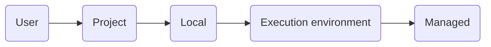
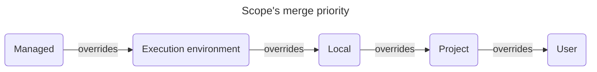
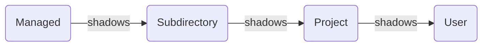

# Claude Code

[Agentic][ai agents] harness around [Claude] providing it with tools, context management, and execution
environment.<br/>
Works in a terminal, IDE (via plugin), and in Claude's desktop app.

1. [TL;DR](#tldr)
1. [Billing](#billing)
1. [Configuration](#configuration)
   1. [Credentials](#credentials)
1. [Context](#context)
   1. [Compaction](#compaction)
   1. [Writing effective rules](#writing-effective-rules)
1. [Memory](#memory)
   1. [Auto memory](#auto-memory)
   1. [Auto-dream](#auto-dream)
   1. [Loading semantics](#loading-semantics)
   1. [Custom memory tiers via @-import](#custom-memory-tiers-via--import)
1. [Using tools](#using-tools)
   1. [Managing MCP servers](#managing-mcp-servers)
      1. [MCP servers of interest](#mcp-servers-of-interest)
   1. [Limit tool execution](#limit-tool-execution)
1. [Using skills](#using-skills)
   1. [Skill frontmatter overrides](#skill-frontmatter-overrides)
   1. [Effort-aware skill content](#effort-aware-skill-content)
   1. [Controlling the skill's visibility](#controlling-the-skills-visibility)
   1. [Findings about skill creation](#findings-about-skill-creation)
1. [Using plugins](#using-plugins)
   1. [Plugins of interest](#plugins-of-interest)
1. [Using hooks](#using-hooks)
   1. [Prompt-based hooks](#prompt-based-hooks)
   1. [Agent-based hooks](#agent-based-hooks)
   1. [HTTP hooks](#http-hooks)
   1. [Running LLM work from hooks](#running-llm-work-from-hooks)
   1. [Common gotchas and patterns for hooks](#common-gotchas-and-patterns-for-hooks)
1. [Delegating work](#delegating-work)
    1. [Sub-agents](#sub-agents)
       1. [Airtight delegation via inline MCP](#airtight-delegation-via-inline-mcp)
       1. [Designing for fail-and-report](#designing-for-fail-and-report)
       1. [Cross-project sub-agents](#cross-project-sub-agents)
    1. [Agent teams](#agent-teams)
    1. [MCP servers in sub-agents](#mcp-servers-in-sub-agents)
    1. [Offloading MCP servers to sub-agents](#offloading-mcp-servers-to-sub-agents)
1. [Tracking tasks](#tracking-tasks)
1. [Scheduling tasks](#scheduling-tasks)
1. [Tools of interest](#tools-of-interest)
1. [Troubleshooting](#troubleshooting)
    1. [`skill-creator` plugin's script require an incompatible `pydantic-core` version](#skill-creator-plugins-script-require-an-incompatible-pydantic-core-version)
    1. [Executors use their own name for commit attribution when using `opusplan`](#executors-use-their-own-name-for-commit-attribution-when-using-opusplan)
1. [Best practices](#best-practices)
1. [Run on local models](#run-on-local-models)
1. [Further readings](#further-readings)
    1. [Sources](#sources)

## TL;DR

Can run in multiple isolated shell sessions.<br/>
Prefer using [git worktrees] to isolate sessions running within the same repository.

Can access and understand images and other file types, read and edit files, run commands and tools, and do all of that
in parallel.

_Normally_:

- Tied to Anthropic's Claude models (Haiku, Sonnet and Opus).
- Requires a Claude API key or Anthropic plan.<br/>
  Usage is metered by the token.

Uses a **scope** system to determine where configuration files apply, and who they're shared with.<br/>
Configuration is loaded and **merged** in the following order:



Use _settings.json_ files for permissions, hooks, env vars, etc.<br/>
[`settings.json` file example][settings.json file example].

Use _.mcp.json_ files for project-level MCP definitions.<br/>
[`.mcp.json` file example][.mcp.json file example].

Store _other_ configuration like personal preferences (theme, notification settings, editor mode), OAuth session, MCP
server configurations for user and local scopes, per-project state (allowed tools, trust settings), and various caches
in `~/.claude.json`.<br/>
Updated _autonomously_ by Claude Code. Prefer **not** editing this file manually.<br/>
**Not** part of the `settings.json` hierarchy as much as a runtime state file.<br/>

Supports a **plugin** system for extending its capabilities.

Sends Statsig telemetry data by default. Includes operational metrics (latency, reliability, usage patterns).<br/>
Disable it by setting the `DISABLE_TELEMETRY` environment variable to `1`.

> [!tip]
> Gives better results when asked to _plan_ before writing code, and then _iterates_ on it.

Common workflows:

- Explore, plan, ask for confirmation, write code, commit.

  <details style='padding: 0 0 1rem 1rem'>
    <summary>Example</summary>

  > Figure out the root cause for issue #43, then propose possible fixes.<br/>
  > Let me choose an approach before you write code.<br/>
  > Think fast.

  </details>

- Write tests, commit, write code, iterate, commit, push, create a PR.

  <details style='padding: 0 0 1rem 1rem'>
    <summary>Example</summary>

  > Write tests for @utils/markdown.ts to make sure links render properly.<br/>
  > Note these tests will not pass yet since links are not yet implemented.<br/>
  > Commit.<br/>
  > Update the code to make the tests pass.<br/>
  > Commit. Push. PR.

  </details>

- Write code, screenshot the result, track progress, iterate.

  <details style='padding: 0 0 1rem 1rem'>
    <summary>Example</summary>

  > Implement \[mock.png], then screenshot it with Puppeteer and iterate until it looks like the mock.<br/>
  > Write down notes for yourself at every iteration. Think hard.

  </details>

Hit `esc` **once** to stop Claude.<br/>
This action is _usually_ safe. Claude will then resume or try a different approach, while retaining context about the
previous request.

Refer to [Claude] for details on models and usage.

Prefer using **Sonnet** for quicker, smaller tasks (e.g. as sub-agent, greenfield coding, app initialization).<br/>
Consider using **Opus** for broader, longer, higher-level tasks (e.g. planning, refactoring, orchestrating
sub-agents).<br/>
Consider using **Haiku** for quick responses.

The `opusplan` mode allows using Opus during planning, then automatically switches to Sonnet for implementation.

Change how Claude responds (without affecting its capabilities) by configuring an [output style][output styles].<br/>
The builtin `explanatory` style adds educational insights between tasks; `learning` shares insights _and_ asks the user
to contribute to changes.<br/>
Custom styles can be created as Markdown files in the `~/.claude/output-styles/` and `.claude/output-styles/` folders.

Use memory and context files (`CLAUDE.md`) to instruct Claude Code on commands, style guidelines, and give it _key_
context. Try to keep them small.

Consider allowing specific tools to reduce interruption and avoid fatigue due to too many requests.<br/>
Prefer using CLI tools over MCP servers as they are generally faster, don't require a running server, and have usually
lower overhead.

Make sure to use `/clear` or `/compact` regularly to allow Claude to maintain focus on the conversation.<br/>
Or ask it to create notes to self and restart it once the context goes above a threshold (usually best at 60%).

The `Agent` tool routes to built-in agent types **and** user-level custom agents (`~/.claude/agents/`).<br/>

[Offloading MCP servers to sub-agents] **does** allow achieving a setup where:

- The main session has **no** MCP server configured at session level.
- The main session delegates automatically to dedicated sub-agents.
- Each sub-agent has only the MCP servers it needs, defined inline in its frontmatter.

The system context only gives Claude a date, but no time at all. No timestamp, no timezone, no clock.<br/>
When in need to reason about things that require the time of day (e.g., scheduling, "do X within business hours", …),
tell Claude the current time or timezone instead. It will work from that.

<details>
  <summary>Setup</summary>

See also [Configuration] and [Environment variables][environment variables reference].

```sh
# Install.
brew install --cask 'claude-code'
curl -fsSL https://claude.ai/install.sh | bash
curl -fsSL https://claude.ai/install.sh | bash -s 'stable'
curl -fsSL https://claude.ai/install.sh | bash -s '2.1.74'
npm install -g '@anthropic-ai/claude-code'  # deprecated, prefer others

# Check installation and configuration.
claude --version
claude doctor

# Uninstall.
brew uninstall --zap 'claude-code'
npm uninstall -g '@anthropic-ai/claude-code'
rm -rf "$HOME/.local/bin/claude" "$HOME/.local/share/claude"

# Cleanup settings.
rm -rf "$HOME/.claude" "$HOME/.claude.json" ".claude" ".mcp.json"
```

</details>

<details>
  <summary>Usage</summary>

Refer to [CLI reference].

```sh
# Start in interactive mode.
# Best to start from a repository.
claude

# Run a one-time task.
claude "fix the build error"

# Run a one-off task, then exit.
claude -p 'Hi! Are you there?'
claude -p "explain the function in @someFunction.ts"
claude -p 'What did I do this week?' --allowedTools 'Bash(git log*)' --output-format 'json'
cat 'minutes.md' | claude -p "summarize this"

# Resume the most recent conversation that happened in the current directory
claude -c

# Resume a previous conversation
claude -r

# Add MCP servers.
# Defaults to the 'local' scope if not specified.
claude mcp add --transport 'http' 'GitLab' 'https://some.local.gitlab.com/api/v4/mcp'
claude mcp add --transport 'http' 'linear' 'https://mcp.linear.app/mcp' --scope 'user'

# List installed MCP servers.
claude mcp list

# Show MCP servers' details
claude mcp get 'github'

# Remove MCP servers.
claude mcp remove 'github'

# Load local plugins.
claude --plugin-dir './path/to/plugin'

# Install plugins.
# Marketplace defaults to 'claude-plugins-official'.
# Scope defaults to 'user'.
claude plugin install 'gitlab'
claude plugin i 'aws-cost-saver@aws-cost-saver-marketplace' --scope 'project'

# List installed plugins only.
claude plugin list

# List all plugins.
claude plugin list --available --json

# Enable plugins.
claude plugin enable 'gitlab@claude-plugins-official'

# Disable plugins.
claude plugin disable 'gitlab@claude-plugins-official'

# Update plugins.
claude plugin update 'gitlab@claude-plugins-official'
```

_Relevant_ commands from within Claude Code (version 2.1.118).<br/>
Refer to [Built-in commands][built-in commands reference] for the complete list.

```plaintext
/add-dir <path>                            Add a working directory for the current session
/agents                                    Manage agent configurations
/batch <instruction>                       Research and plan a large-scale change, then execute it in parallel across 5 to 30 isolated worktree agents that each open a PR
/branch [name]                             Create a branch of the current conversation at this point (alias of /fork)
/btw <question>                            Ask a quick side question without adding to the conversation
/clear                                     Clear conversation history and free up context (alias of /reset and /new)
/color [color|default]                     Set the prompt bar color for the current session
/compact [instructions]                    Summarize and free up context; accepts optional focus instructions
/config                                    Open the settings panel (alias of /settings)
/context                                   Visualize current context usage as a colored grid
/copy [N]                                  Copy Claude's Nth-latest response to clipboard (default: last)
/cost                                      Show session cost and activity stats (alias of /usage and /stats)
/debug [description]                       Enable debug logging for this session and help diagnose issues
/desktop                                   Continue session in Claude Code Desktop app (alias of /app)
/diff                                      Interactively view uncommitted changes and per-turn diffs
/doctor                                    Diagnose and verify installation and settings
/effort [low|medium|high|xhigh|max|auto]   Set the model's effort level for the session
/exit                                      Exit the REPL (alias of /quit)
/export [filename]                         Export the current conversation as plain text to a file or clipboard
/extra-usage                               Configure extra usage to keep working when rate limits are hit
/fast [on|off]                             Toggle fast mode; increases performance and costs
/feedback [report]                         Submit feedback about Claude Code (alias of /bug)
/fewer-permission-prompts                  Scan transcripts and add an allowlist to project settings
/focus                                     Toggle focus view (last prompt + tool summary + response only)
/help                                      Show help and available commands
/hooks                                     Manage hook configurations for tool events
/ide                                       Manage IDE integrations and show status
/init                                      Initialize a new CLAUDE.md file with codebase documentation, or update the existing one
/insights                                  Generate a report analyzing Claude Code sessions
/keybindings                               Open or create keybindings configuration file
/login                                     Sign in with your Anthropic account
/logout                                    Sign out from your Anthropic account
/loop [interval] [prompt]                  Run a prompt on a recurring interval (alias of /proactive)
/mcp                                       Manage MCP servers' connection and authentication
/memory                                    Edit memory files, enable/disable auto-memory
/model [model id or alias]                 Select the AI model to use during the conversation
/permissions                               Manage allow, ask, and deny tool permission rules (alias of /allowed-tools)
/plan [description]                        Enable plan mode or view the current session plan
/plugin                                    Manage Claude Code plugins
/powerup                                   Discover Claude Code features through quick interactive lessons
/privacy-settings                          View and update privacy settings
/recap                                     Generate a one-line summary of the current session
/release-notes                             View Claude Code's changelog in an interactive version picker
/reload-plugins                            Reload all active plugins without restarting
/remote-control                            Make the current session available for remote control from claude.ai (alias of /rc)
/remote-env                                Configure the default remote environment for web sessions
/rename [name]                             Rename the current session (auto-generates if no name given)
/resume [session]                          Resume a previous conversation by ID or name (alias of /continue)
/review [PR]                               Review a pull request locally in the current session
/rewind                                    Rewind conversation and/or code to a previous point (alias of /checkpoint, /undo)
/sandbox                                   Toggle sandbox mode
/schedule [description]                    Create, update, list, or run routines (alias of /routines)
/security-review                           Analyze pending changes for security vulnerabilities
/simplify [focus]                          Review changed code for reuse, quality, and efficiency, then fix any issues found
/skills                                    List available skills
/status                                    Show version, model, account, and connectivity status
/statusline                                Configure the status line display
/tasks                                     List and manage background tasks (alias of /bashes)
/teleport                                  Pull a Claude Code web session into this terminal (alias of /tp)
/terminal-setup                            Configure terminal keybindings for Shift+Enter and other shortcuts
/theme                                     Change color theme
/tui [default|fullscreen]                  Set terminal UI renderer (fullscreen = flicker-free alt-screen)
/ultraplan <prompt>                        Draft a plan in the cloud, review in browser, execute remotely or locally
/ultrareview [PR]                          Deep multi-agent code review in a cloud sandbox
/voice [hold|tap|off]                      Toggle or configure voice dictation mode
```

</details>

<details style='padding: 0 0 1rem 0'>
  <summary>Real world use cases</summary>

```sh
# Run Claude Code on a model served locally by Ollama.
ollama launch claude --model 'lfm2.5-thinking:1.2b'
ANTHROPIC_AUTH_TOKEN='ollama' ANTHROPIC_BASE_URL='http://localhost:11434' ANTHROPIC_API_KEY='' \
  claude --model 'lfm2.5-thinking:1.2b'
```

</details>

One can execute commands from within Claude Code by prefixing each of them with `!`. Multiple commands can be
concatenated in a commands set as usual in a shell, e.g.:

```plaintext
! echo "$SOME_VAR"
! cd 'path/to/some/dir' && source '.env' ; set
```

Every set of commands is executed in its own **fresh**, **distinct** shell, effectively calling `bash -c '…'` (or the
user's **default** shell equivalent) for each.<br/>
Invocations do **not** carry environment variables between them, though `! cd some/dir` does change the working
directory Claude works in.

## Billing

Claude Code requires a subscription to use Claude models, specifically a Claude API key or an Anthropic plan.<br/>
Usage is metered by the token.

> [!tip]
> One _can_ route requests to other services using [Claude Code router], or use local models with [Ollama].<br/>
> Performances do take a _major_ hit, though.

Since 2026-06-15, subscriptions separate _interactive_ from _**non**-interactive_ usage.<br/>
Non-interactive usage (`claude -p` and the Agent SDK) now draws **at full API rates** from a **dedicated** monthly Agent
SDK credit pool, not from the interactive subscription pool.<br/>
This applies to agent-type hooks, cron jobs, and any other non-interactive invocation.

| Plan          | Monthly Agent SDK credit |
| ------------- | -----------------------: |
| Pro           |                      $20 |
| Max 5x        |                     $100 |
| Max 20x       |                     $200 |
| Team Standard |                 $20/seat |
| Team Premium  |                $100/seat |

Once that credit is exhausted, invocations are billed as "extra usage" at standard API rates (if enabled).<br/>
If extra usage is not enabled, requests stop until the next billing cycle. Credits not used in a month do **not** roll
over to the next month.

> [!warning]
> Anthropic made three significant billing changes for subscriptions in six weeks (April to May 2026) that are blatantly
> anti-consumer. It:
>
> - Banned third-party agents (e.g. OpenClaw) from using subscriptions, and limited them to API usage.
> - Removed Claude Code from the Pro subscription tier, and claimed it was a test.
> - Forced non-interactive inference previously covered by subscriptions to draw from the Agent SDK credit.
>
> Treat `claude -p` on subscription as a convenience that may be further restricted or repriced.<br/>
> Consider designing launchers with a **local LLM fallback** (e.g. via [Ollama]) for non-critical automation.

The `--bare` flag skips OAuth, but **requires** `ANTHROPIC_API_KEY`. Avoid this flag to use the plan's Agent SDK credit,
and use `--no-session-persistence` instead to skip session recording without switching authentication mode.

## Configuration

Refer to [Settings][documentation / settings] and [Model configuration][Documentation / Model configuration].

Claude Code uses a **scope system** to determine where configuration files apply, and with what precedence.

The _user_ scope applies to **all** projects, but only for the **active** user.

The _project_ scope applies to **all contributors**, but only in the **active** project.<br/>
Meant for **shared** settings, preferences, tools and plugins the whole team should have. It is usually the best scope
to standardize them across collaborators.

The _local_ scope affects only the **active** user across a **single** project.<br/>
Meant to specify personal overrides for specific projects.

The _managed_ scope affects **all** contributors across **all** projects.<br/>
Meant for organization-wide policies, compliance requirements and standardized configurations that **must** be enforced
and that should **not** be overridden.



Files:

| Feature     | User files                | Project files                       | Local files                                         | Managed files                   |
| ----------- | ------------------------- | ----------------------------------- | --------------------------------------------------- | ------------------------------- |
| Settings    | `~/.claude/settings.json` | `.claude/settings.json`             | `.claude/settings.local.json`                       | `managed-settings.json`         |
| Sub-agents  | `~/.claude/agents/`       | `.claude/agents/`                   | None                                                | `<managed-dir>/.claude/agents/` |
| MCP servers | `~/.claude.json`          | `.mcp.json`                         | `~/.claude.json`, under `projects.{{project.path}}` | `managed-mcp.json`              |
| Plugins     | `~/.claude/settings.json` | `.claude/settings.json`             | `.claude/settings.local.json`                       | `managed-settings.json`         |
| `CLAUDE.md` | `~/.claude/CLAUDE.md`     | `CLAUDE.md`<br/>`.claude/CLAUDE.md` | None                                                | `<managed-dir>/CLAUDE.md`       |

`<managed-dir>` is `/Library/Application Support/ClaudeCode/` on macOS, `/etc/claude-code/` on Linux and WSL,
and `C:\Program Files\ClaudeCode\` on Windows.

_Settings_ like permissions, hooks, environment variables, etc. should reside in `settings.json`-like files.<br/>
The [settings' schema] is available on schemastore.org.<br/>
[`settings.json` file example][settings.json file example].

_MCP servers_ are defined **separately** from settings.<br/>
Use `.mcp.json`-like files at the project scope or in `~/.claude.json`.<br/>
[`.mcp.json` file example][.mcp.json file example].

_Other_ configuration is stored in `~/.claude.json`.<br/>
It's **not** part of the `settings.json` hierarchy as much as a runtime state file, though _some_ settings are accepted
and loaded for backwards compatibility.<br/>
It contains _preferences_ (theme, notification settings, editor mode), OAuth session, MCP server configurations for user
and local scopes, per-project state (allowed tools, trust settings), and caches.<br/>
`~/.claude.json` is meant to be managed _autonomously_ by Claude Code. Commands like `claude mcp add` update it via
Claude Code. Prefer **not** editing this file manually.<br/>

> [!tip]
> Run `/status` from inside Claude Code to see which settings sources are active and where they come from.

See also [Configuration] and [Environment variables][environment variables reference].

`model` accepts any model alias or a full model ID (e.g. `claude-opus-4-6[1m]`).

| Alias          | Behavior                                                    | Notes                                                          |
| -------------- | ----------------------------------------------------------- | -------------------------------------------------------------- |
| `best`         | Most capable available model (currently Fable 5 or Opus)    |                                                                |
| `mythos`       | Latest Mythos (Mythos 5 on Anthropic's API)                 | Where available                                                |
| `fable`        | Latest Fable (Fable 5 on Anthropic's API)                   | Where available                                                |
| `opus`         | Latest Opus (Opus 4.8 on Anthropic's API)                   |                                                                |
| `opus[1m]`     | Opus with 1M token context window                           |                                                                |
| `sonnet`       | Latest Sonnet (Sonnet 4.6 on Anthropic's API)               |                                                                |
| `sonnet[1m]`   | Sonnet with 1M token context window                         |                                                                |
| `haiku`        | Fast, efficient Haiku model                                 |                                                                |
| `opusplan`     | Opus during plan mode, auto-switches to Sonnet in execution | During action, the model has no idea it used Opus for planning |
| `opusplan[1m]` | Opusplan with 1M token context window                       |                                                                |
| `default`      | Clears any model override, reverts to the account's default |                                                                |

Starting from generation 4.6, model IDs switched to the dateless format (e.g. `claude-opus-4-8` instead of `claude-opus-4-5-20251101`).<br/>
These are still pinned snapshots, not pointers to the latest version. The format just dropped the date suffix.

| Model  | ID examples                                                                                      |
| ------ | ------------------------------------------------------------------------------------------------ |
| Mythos | `claude-mythos-5`                                                                                |
| Fable  | `claude-fable-5`                                                                                 |
| Opus   | `claude-opus-4-5-20251101`<br/>`claude-opus-4-6[1m]`<br/>`claude-opus-4-7`<br/>`claude-opus-4-8` |
| Sonnet | `claude-sonnet-4-5-20250929`<br/>`claude-sonnet-4-5`<br/>`claude-sonnet-4-6[1m]`                 |
| Haiku  | `claude-haiku-4-5-20251001`<br/>`claude-haiku-4-7`<br/>`claude-haiku-4-8`                        |

`effort` overrides the calling session's effort level. Available levels depend on the active model:

| Model                | Available levels                        | Session default | Notes                         |
| -------------------- | --------------------------------------- | --------------- | ----------------------------- |
| Opus 4.8             | `low`, `medium`, `high`, `xhigh`, `max` | `high`          | Always uses adaptive thinking |
| Opus 4.7             | `low`, `medium`, `high`, `xhigh`, `max` | `xhigh`         |                               |
| Opus 4.6, Sonnet 4.6 | `low`, `medium`, `high`, `max`          | `high`          |                               |

Should one set a level the model doesn't support, Claude Code falls back to the **highest** supported level at or below
the given setting, e.g. `xhigh` on Opus 4.6 becomes `high`.

The `effortLevel` key in `settings.json` files accepts `low`, `medium`, `high`, and `xhigh` values, and, if not
configured, it defaults to `xhigh` for Opus 4.7 and `high` for Opus and Sonnet 4.6.<br/>
Models support _subsets_ of the effort level: Opus and Sonnet 4.6 do not support `xhigh`, and Haiku does not support
effort levels at all.

Opus has access to the `max` effort level, but this value is _intentionally_ scoped to only the current session. To
persist it across sessions, set the `CLAUDE_CODE_EFFORT_LEVEL` environment variable.

<details style='padding: 0 0 1rem 1rem'>

```json
{
  "env": {
    "CLAUDE_CODE_EFFORT_LEVEL": "max"
  }
}
```

</details>

One can limit allowed models using the `availableModels` key. It restricts **all** model usage, not just user selection
via `/model`.<br/>
`opusplan` needs both (a version of) Opus and Sonnet to be listed in `availableModels`, if set. It will break otherwise.

Not all the settings available via `/config` in the TUI land in `settings.json` files. Settings like
`teammateDefaultModel` and IDE auto-connect are written to the user's Anthropic account (on the server-side), instead
of any local file.<br/>
`~/.claude/remote-settings.json` exists, and appears to be a cache of the server-side state. It only contains a small
subset of settings (e.g. `channelsEnabled`). It is not a full mirror of what the TUI wrote on changes.

### Credentials

Depending on one's OS and authentication method:

- **OAuth credentials** (e.g., GitHub, remote MCP servers) are stored in the system keychain on macOS, or in a
  credentials file on other platforms.
- General **authentication tokens and credentials file** are stored in the system keychain on macOS and in
  `~/.claude/.credentials.json` on Linux and Windows.
- **API keys** should be passed as environment variables to MCPs (e.g. `--env API_KEY=...` when adding one via
  `claude mcp add`) or saved manually in `~/.claude.json`.

| Platform | Credential Location                                             |
| -------- | --------------------------------------------------------------- |
| macOS    | System Keychain (`Keychain Access.app → login → "Claude Code"`) |
| Linux    | `~/.claude/.credentials.json`                                   |
| Windows  | `%USERPROFILE%\.claude\.credentials.json`                       |

[`~/.claude/credentials.json` file example][~/.claude/credentials.json file example].

## Context

Refer to [AI agents context and memory][ai agents / context and memory].

> [!important]
> Every **new** session begins with a **fresh** context window.

Claude Code uses `CLAUDE.md` as its context file.<br/>
Its purpose is to apply _procedural memories_ and other _recurrent_ context at the start of sessions.<br/>
It should only contain instructions, rules, and preferences; **avoid** memories related to other sessions.<br/>
One _can_ ask Claude to write and/or update this file on their behalf.

The official docs explicitly recommend to keep each context file **under 200 lines**.<br/>
Longer files consume more context, and instructions buried deeper in a large file are more likely to be missed or
deprioritized by the model.

> [!important]
> Claude is instructed in its system prompt to **intentionally** ignore `CLAUDE.md` instructions that **it** deems
> irrelevant to the current task.

`CLAUDE.md` files can _import_ additional files using the `@path/to/import` syntax. This is currently an exclusive
feature of Claude Code.<br/>
Imported files are expanded and loaded into context at launch, alongside the `CLAUDE.md` file referencing them.<br/>
It allows both relative and absolute paths. Relative paths resolve relative to **the file containing the import**, not
to the current working directory.<br/>
Imported files _can_ recursively import other files up to 5 hops.

<details style='padding: 0 0 1rem 1rem'>

Pull in other files (a `README.md`, `package.json`, or workflow guide) by referencing them with the `@` syntax anywhere
in a `CLAUDE.md` file:

```md
See @README for project overview, and @package.json for available npm commands for this project.

## Additional Instructions

- git workflow: @docs/git-instructions.md

## Individual Preferences

- @~/.claude/my-project-instructions.md
```

</details>

The **first** time Claude Code encounters external imports in a project, it shows an approval dialog listing the files.
If declined, the imports stay disabled and the dialog does **not** appear again.

When starting, Claude Code reads `CLAUDE.md` files by walking **up** the directory tree from the project's
directory.<br/>
E.g., a session starting in `/foo/bar/` will search and load instruction files in `/foo/bar/`, `/foo/`, and `/`, in that
order.

`CLAUDE.md` resolution runs **only once**, and it does it **only at session start**. Changing the working directory
mid-session (via `cd` or using command-specific flags like `git -C`) does **not** trigger loading the context files from
that project.<br/>
Explicitly `Read` the target's `CLAUDE.md` when doing substantial work in another project mid-session.

Subdirectory lazy-loading (_files in subdirectories load on demand when Claude reads files in those directories_) also
applies **only within** the current project tree. Reading a file in an entirely different project does **not** trigger
loading of that project's `CLAUDE.md`.

Block-level HTML comments (`<!-- … -->`) in `CLAUDE.md` files are **stripped** before injection into context. Leverage
them to leave notes for human maintainers without spending context tokens. Comments inside code blocks are preserved.

When files are modified _outside_ the active session (by the user in an editor, a linter, another Claude Code session,
or any other process), the harness detects the change and auto-injects a diff as a system-reminder.<br/>
This piggybacks on the **next** unrelated tool result. It is the **only** notification the model receives about that;
there is no standalone alert.<br/>
The injected content is a **diff**, not the full file. For files that have not been read yet in the session, this can
mislead the model, which sees _what changed_ but has no baseline for _what the file currently contains_. Re-read the
file **explicitly**, before acting on the diff.

The `--add-dir` CLI flag gives Claude access to additional directories outside the main working directory **and** can
trigger convention loading.<br/>
`permissions.additionalDirectories` in `settings.json` persists the **file access** across sessions, but does **not**
trigger convention loading, requiring the `--add-dir` CLI flag at launch for that.

To load conventions (`CLAUDE.md` and `.claude/rules/`) from additional directories, a session needs **both** the
`--add-dir` CLI flag **and** `CLAUDE_CODE_ADDITIONAL_DIRECTORIES_CLAUDE_MD=1`.<br/>
Without the CLI flag, the environment variable has no effect even when set as a shell variable. Without the environment
variable, `--add-dir` grants file access but does not load conventions.

<details style='padding: 0 0 1rem 1rem'>

Persist file access and the environment variable in `settings.json`:

```json
{
  "permissions": {
    "additionalDirectories": [
      "~/path/to/company.wiki"
    ]
  },
  "env": {
    "CLAUDE_CODE_ADDITIONAL_DIRECTORIES_CLAUDE_MD": "1"
  }
}
```

Then launch with the CLI flag to trigger convention loading:

```sh
claude --add-dir ~/path/to/company.wiki
```

</details>

This is especially useful for projects that are frequently accessed from any session (e.g. wikis, shared KBs), but
launching with `--add-dir` does have the context cost of loading each additional directory's `CLAUDE.md` and
`.claude/rules/` into the session.

Prefer using _rules_ for a more structured approach to organizing instructions.<br/>
Rules live in `.claude/rules/*.md` and are discovered _recursively_.

Rules **without** a `paths` frontmatter field are loaded _unconditionally_ at launch.<br/>
Rules **with** a `paths` field _only_ load when Claude Code reads files matching the specified glob patterns:

<details style='padding: 0 0 1rem 1rem'>

```yml
---
paths:
  - "src/api/**/*.ts"
---
# API specific instructions
```

</details>

> [!warning] Known bugs as of 2026-04-24
> Path-scoped rules have multiple open issues:
>
> - They _may_ load **globally** at session start **despite** the `paths:` frontmatter ([#16299][issue #16299]).
> - They are **ignored** in user-level rules (`~/.claude/rules/`, [#21858][issue #21858]) and in git worktrees
>   ([#23569][issue #23569]).
> - They **only** trigger on `Read` actions, not on `Write` or `Edit` ([#23478][issue #23478]).

Skip irrelevant `CLAUDE.md` files by using the `claudeMdExcludes` setting.

<details style='padding: 0 0 1rem 1rem'>

```json
{
  "claudeMdExcludes": [
    "**/some-repo/CLAUDE.md",
    "/home/user/some-repo/some-section/.claude/rules/**"
  ]
}
```

</details>

Context files' loading order:

| Scope        | Type                | Location                                                                                             | Notes                                                 |
| ------------ | ------------------- | ---------------------------------------------------------------------------------------------------- | ----------------------------------------------------- |
| Managed      | Enterprise policy   | `/etc/claude-code/CLAUDE.md` (Linux)<br/>`/Library/Application Support/ClaudeCode/CLAUDE.md` (macOS) | Loaded in full at launch                              |
| User         | Context file        | `~/.claude/CLAUDE.md`                                                                                | Loaded in full at launch                              |
| Project      | Shared context file | `./CLAUDE.md` or `./.claude/CLAUDE.md`                                                               | Loaded in full at launch                              |
| Project      | Personal override   | `./CLAUDE.local.md`                                                                                  | Loaded in full at launch; gitignored by default       |
| Project      | Rules               | `./.claude/rules/*.md`                                                                               | Loaded in full at launch                              |
| Subdirectory | Context file        | `<project>/some-subdir/CLAUDE.md`                                                                    | Loaded on demand when reading files in this directory |

Loading order is **from / down**: content is ordered from the filesystem root to the working directory.<br/>
Instructions **closer** to where Claude Code was launched are read **last**, and appear as the **most recent** in
context.

`CLAUDE.local.md` acts as a personal project-level override. It is gitignored by default and is not shared with the
team.<br/>
Use it for personal preferences that should only apply to a specific project on the active machine.

More specific files override broader ones on conflicting instructions, but they **merge** together and do **not**
replace each other.<br/>
Managed policy files **cannot** be excluded. Organization-wide rules **always apply regardless**.

Files at the same scope level should **not** conflict with each other, only define instructions for specific
domains.<br/>
Combine conflicting rules into a single file, or leverage the hierarchy to handle precedence.

> [!tip]
> Keep in mind [Claude's interaction tips] when creating rule files.

Key commands:

| Command | Summary                                              |
| ------- | ---------------------------------------------------- |
| `/init` | Bootstrap a `CLAUDE.md` file for the current project |

Use the [`InstructionsLoaded` hook][instructionsloaded hook] to log exactly which instruction files are loaded, when
they load, and why.<br/>
Useful for debugging path-specific rules or lazy-loaded files in subdirectories.

Creating a good `CONTRIBUTING.md` file, and mandating Claude Code to read it before making changes, seems to go a long
way for **both** humans and agents.

It appears Claude works better when treated as part of the team.<br/>
And as part of the team, it is right for it to have a chance to contribute to processes.

> Please check the `CONTRIBUTING.md` file is helpful to _you_, and eventually suggest improvements to allow _you_ to
> contribute better.<br/>
> The goal is to give _you_ all the information _you_ need about the workflow, without needing to put extra information
> in the `CLAUDE.md` file.

> [!tip]
> Iterate on this for at least a couple of times and a couple of different sessions for the best results.

Consider also asking it to keep the files up to date using notes and findings from the session:

> I changed the file structure to make it adhere more to the standards we shoot for. Please check my changes and take
> notes for yourself. Also please share those takeaways in the `CONTRIBUTING.md` file.

> [!tip]
> Consider using [hooks][using hooks] if specific actions **need** to happen, and should not rely on Claude _deciding_
> to take them.

<details>
  <summary>Example of CLAUDE.md file implementing the suggestions</summary>

```md
# CLAUDE.md

> [!important] Claude Code self-reminders — MANDATORY, follow for every change
>
> 1. **Before making or suggesting any changes, read `CONTRIBUTING.md`**. Pay extra attention to the code organization
>    and conventions.
> 1. **Follow closely the workflow in `CONTRIBUTING.md § Submitting changes`**.
> 1. **Review and offer to update `CONTRIBUTING.md`** to share _relevant_ notes and findings with the team. Insist on
>    this if you make changes.
> 1. **Review and offer to update `CLAUDE.md`** with relevant information _for you_ that would not duplicate the content
>    of `CONTRIBUTING.md`.

## Overview
…
```

</details>

People are showing success _delegating_ this work to Claude at the start of a project.<br/>
Consider delegating ownership of tools and documentation to Claude early in a project, making it responsible for the
tools and documents it creates _and_ uses. Also include in the request to periodically to check and update those files
to correct its own behavior across sessions.

When preparing a repository for agents, the highest returns come from giving them instructions at distinct levels of
context. Roughly in order of diminishing returns, those are as follows:

1. Use `CLAUDE.md` and rules files for **orientation**.<br/>
   The agent needs to learn what the project is, how it should behave, and what to avoid.
1. Use `CONTRIBUTING.md` and workflow documentation for **processes**.<br/>
   The agent needs to understand _how_ the work is done in the repository (branching strategy, testing requirements,
   review conventions, etc).
1. Skills and reference documentation should contain **domain knowledge**.<br/>
   The agent can use them to specialize expertise it could not derive from the code alone (e.g. infrastructure patterns,
   API design decisions, compliance requirements).
1. **Cross-repo context** informs the model about how this project relates to others.<br/>
   This is both the level most commonly missing and the one hardest to provide, because Claude Code does **not**
   automatically load context from other projects.

Tooling that agents interact with (linters, formatters, build scripts, test runners) needs to be _agent-compatible_ to
avoid silent failures. Specifically, tools should allow to be used **non-interactively** (requiring no prompts or
confirmations), accept **explicit** input (and not implicit defaults that require human context), produce **parseable**
output (structured, or at least greppable), return **clear** exit codes, and ideally be **idempotent**.<br/>
Interactive prompts cause agents to hang or send garbage input. Missing exit codes cause agents to miss failures
entirely.

See [Giving Claude its own knowledge base] for how to set up a persistent filesystem-based KB.

### Compaction

When the conversation approaches the model's context limit, Claude Code _compacts_ it automatically.<br/>
It summarizes the current conversation, and the summary replaces the original messages as the new context for subsequent
turns. One can compact manually using `/compact`, optionally passing focus instructions to steer what the summary
retains.

Compaction uses the **same model** as the active session. There is no `compactModel` setting that allows overriding
this.<br/>
Opus preserves more nuance and reasoning traces during compaction; Haiku loses subtle details, rejected alternatives,
and intermediate reasoning. The model doing the compacting **directly** affects how much the session forgets after
compaction.

_Negative_ decisions are the primary casualty of the process. They include reasoning about **why** something was
rejected, alternatives that were considered but discarded, and the context behind any choice. The structured compaction
prompt has no dedicated section for "alternatives considered", so the compressor tends to keep the outcome but also drop
the deliberation that led to it.<br/>
If a decision's reasoning matters beyond the current turn, persist it (in a commit message, a doc file, or a task note)
_before_ the context compresses.

Compaction's own token costs are **not** reflected in the usage counters shown by `/cost`. The displayed input and
output token counts cover only the main conversation turns, not the summarization work.

### Writing effective rules

Refer to [LMs / Improving interactions] for LLM-generic rule-writing patterns (model-class capability differences,
abstract rule definitions with anchoring examples, mechanical fallback for self-calibration, implicit-carveout audit,
capability rewrites, rules-vs-friction for fluency-driven failures, etc.) and [Claude's interaction tips] for specific
Claude framings (XML tags, few-shot examples, imperative tone).

Reframe output prohibitions to detect and address impulses. Models get a positive trigger for the correct action instead
of just something to suppress, and the rule fires while the model is _deciding_ rather than after the words have been
generated.

Rules governing behavioral dispositions (honesty, pushback, staying oneself) work best as a **hybrid** of encouragement
and constraint when they need to fire across model tiers. Capable models infer from the encouragement, faster ones
pattern-match on the concrete failure label.

Use **per-class** bright lines when the failure cost is uncapped, or applies to a single shared artifact loaded across
all model classes (e.g., ambient-context files injected on every session like
[reveries][Giving Claude a reverie-like system]. A Haiku-written reverie pollutes every future Opus session with no
recovery path.

A behavioral rule belongs in `CLAUDE.md`, and is **not** fit as an auto memory, when it makes sense for cross-host,
especially when no memory has been formed yet.

Content _within_ `CLAUDE.md` should be contained to the current host, especially on a freshly set-up machine.
`CLAUDE.md` loads on every host. References to host-local resources (KB pages by path, repositories that may not have
been cloned, tools that may not be installed) produce dangling pointers on a new machine. Rules' content should be
self-contained at write time: "see more in X" footers belong in tier-local documentation, where the reference is
**guaranteed** to resolve, not in cross-host contracts.

## Memory

Refer to [Manage Claude's memory] and [AI agents memory tiers][ai agents / memory tiers] for the generic concept.

> [!important]
> Memory is **not** context. Context files (`CLAUDE.md`, rules) are **human**-curated and carry instructions Claude
> should **not** diverge from. Memory should be Claude-writable, accumulate over sessions, and carry **learnings**.

### Auto memory

When the  _auto memory_ feature is enabled, Claude Code can **automatically** save learnings, patterns, and insights
gained during active sessions and load them in successive sessions.<br/>
The feature stores the findings **per-project** at `~/.claude/projects/<project>/memory/MEMORY.md`. Claude Code
automatically loads the first 200 lines or 25 KB (whichever comes first) at the start of every new session.

> [!tip]
> Instruct Claude to:
>
> - _Actively_ use this feature with a rule in `CLAUDE.md` files.
> - Use the specific `MEMORY.md` file as an _index_, and move _detailed_ notes into topic-specific files for Claude
>   Code to load **on demand**.

This feature is **enabled** by default. Disable it via the `/memory` toggle, the `autoMemoryEnabled` key in
`settings.json` files, or by setting `CLAUDE_CODE_DISABLE_AUTO_MEMORY=1` as environment variable.

Define custom locations for memory files by setting `autoMemoryDirectory` in **user** or **local**-level settings.<br/>
Avoid doing this in **project**-level settings to prevent redirecting memory writes to sensitive locations.

Sub-agents can maintain their **own** auto memory. Refer to [sub-agent memory configuration].

### Auto-dream

When `autoDreamEnabled: true` is set, Claude Code _consolidates_ [auto memory] files between sessions. It does so by
merging duplicates, converting relative dates to absolute (e.g. _"yesterday"_ → `2026-03-15`), and pruning obsolete
entries.<br/>
Dreaming triggers when 24h+ have passed since the last pass **and** 5+ new conversation records have accumulated. It
only touches auto-memory. `CLAUDE.md` and other files are out of scope.

> [!note]
> Auto-dream is **not yet documented** in the official [memory][documentation / memory] or
> [settings][documentation / settings] documentation. A [known bug][issue #38461] finds the toggle can be on **without**
> the background task actually running. Verify this feature works as intended by instructing Claude to timestamp memory
> files between sessions.

Key commands:

| Command   | Summary                                  |
| --------- | ---------------------------------------- |
| `/memory` | View, edit, or toggle auto memory on/off |

### Loading semantics

`CLAUDE.md` files (project, user-level, and subdirectory variants) resolve **only at session start** by walking up the
directory tree from the directory Claude Code has been started into. This resolution is **not** re-evaluated when the
working directory changes mid-session.<br/>
Neither `git -C <some-other-project>` nor `cd <some-other-project>` causes the other project's `.claude/CLAUDE.md` or
`CLAUDE.md` files to appear in the current context. Sub-agents inherit the **parent**'s initial working directory, so
they miss the other project's files too.

Preload instruction files (`CLAUDE.md` and `.claude/rules/`) from additional directories at launch with the `--add-dir`
CLI flag and `CLAUDE_CODE_ADDITIONAL_DIRECTORIES_CLAUDE_MD=1`.<br/>
Persist **file access** (but not convention loading) across sessions via `permissions.additionalDirectories` in
`settings.json` (user-level for cross-project access). `additionalDirectories` only grants file access. The `--add-dir`
CLI flag at launch is **still** required for convention loading, even when the environment variable is set.<br/>
Skills from `.claude/skills/` in the additional directories load **regardless** of the environment variable.

> [!tip]
> When doing substantial work in another project mid-session, **explicitly** `Read` its instructions file to load it
> into the current session.

### Custom memory tiers via @-import

The `@<path>` syntax in `CLAUDE.md` expands absolute paths **recursively** (up to 4 hops max per Anthropic's official
documentation as of mid 2026). A line like `@~/.claude/memory/MEMORY.md` in `~/.claude/CLAUDE.md` loads an arbitrary
user-level memory file into every session under the same 200-line/25 KB cap that applies to per-project auto-memory.
This is the cheapest extension surface for custom memory tiers.

See [Giving Claude a global memory][giving claude a global memory] for a testing global-memory implementation, and
[Giving Claude its own knowledge base][giving claude its own knowledge base] for an alternative that uses a KB loaded
on-demand.<br/>
Their general principle is to route insights by their _shape_ (correction, fact, pattern, atmosphere), instead of by
topic. Each shape has its own loading semantics, curation cost, decay rate, and privacy needs that the topology should
respect. Refer to [Personal experiments / Memory tiers][personal experiments / memory tiers] for the full taxonomy.

## Using tools

Refer to [Tools reference].

Tools allow Claude Code to perform discrete actions to interact with the environment.<br/>
Claude Code comes with some _built-in_ tools to, e.g., run shell commands, read and write files, search the web).<br/>
It can be extended with [MCP] servers and [skills][using skills].

MCP servers connect Claude Code to external services and data, giving it new tools to act with. Skills teach it _how_
and _when_ to use those tools for specific workflows.

> [!caution]
> MCPs are **not** verified, nor otherwise checked for security issues.<br/>
> Be especially careful when using MCP servers that can fetch untrusted content, as they can fall victim of prompt
> injections.

Procedure:

1. Add the desired MCP servers.
1. From within Claude Code, run the `/mcp` command to configure them.

### Managing MCP servers

Claude Code loads only MCP tool **names** at session start by default, only fetching their full definitions on demand.
This avoids significant token overhead when many servers (or servers with many tools) are configured, with the overhead
approaching 0 until each tool is first called.<br/>
Requires Sonnet 4 or Opus 4 and later; Haiku models do **not** support deferred loading.<br/>
Set `ENABLE_TOOL_SEARCH=false` if using a proxy that does not forward `tool_reference` blocks.

> [!tip]
> Prefer managing MCP servers via the `claude mcp` subcommands.

```sh
# Add MCP servers.
# Defaults to the 'local' scope if not specified.
claude mcp add --transport 'http' 'GitLab' 'https://gitlab.example.org/api/v4/mcp'
claude mcp add --transport 'http' 'linear' 'https://mcp.linear.app/mcp' --scope 'user'
claude mcp add 'aws-cost-explorer' --scope 'project' \
  --env 'AWS_REGION=eu-west-1' --env 'AWS_API_MCP_TELEMETRY=false' \
  -- \
  docker run --rm --interactive --volume "$HOME/.aws:/app/.aws" \
    --env 'AWS_REGION' --env 'AWS_API_MCP_TELEMETRY' \
    'public.ecr.aws/awslabs-mcp/awslabs/cost-explorer-mcp-server:latest'

# List installed MCP servers.
claude mcp list

# Show MCP servers' details
claude mcp get 'linear'

# Remove MCP servers.
claude mcp remove 'github'
```

Alternatively, directly edit `$HOME/.claude.json`.

<details style='padding: 0 0 1rem 1rem'>

```sh
# Add MCP servers.
jq '.mcpServers."grafana-aws" |= {
  "command": "docker",
  "args": [
    "run",
    "--rm",
    "--interactive",
    "--env", "GRAFANA_URL",
    "--env", "GRAFANA_SERVICE_ACCOUNT_TOKEN",
    "grafana/mcp-grafana:latest",
    "-t", "stdio"
  ],
  "env": {
    "GRAFANA_URL": "https://g-abcdef0123.grafana-workspace.eu-west-1.amazonaws.com",
    "GRAFANA_SERVICE_ACCOUNT_TOKEN": "glsa_abc…def"
  }
}' "$HOME/.claude.json" \
| sponge "$HOME/.claude.json"
```

</details>

> [!important]
> Values for environment variables **must be strings**.<br/>
> Giving other types will violate the schema Claude Code uses to validate the configuration file. The app will complain
> about it and **not** load the MCP server.

#### MCP servers of interest

<details style='padding: 0 0 0 1rem'>
  <summary>AWS API</summary>

> [!caution]
> Prefer using the server that comes with the [AWS Toolkit] plugin instead.

Refer to [AWS API MCP Server].

Enables interacting with AWS services and resources through AWS CLI commands.

> [!warning] Gotcha
> Host header validation errors are swallowed into a generic JSON-RPC `-32602` response. Check the logs for _Host header
> validation failed_.

`AWS_API_MCP_HOST` defines the listen address.<br/>
`AWS_API_MCP_ALLOWED_HOSTS` defines the host header validation whitelist for requests.<br/>
These are **separate** environment variables, but `ALLOWED_HOSTS` defaults to `HOST` when unset.<br/>
When running in Docker with port mapping, set **both** of them.

`ALLOWED_HOSTS` supports comma-separated values, and `*` to disable header validation.

> [!important]
> When running in containers, the container's `/app/.aws` folder must be **writable** (do **not** use `:ro` in the
> volume specification).<br/>

  <details style='padding: 0 0 0 1rem'>
    <summary>Docker container, HTTP transport</summary>

Docker compose file:

```yml
---
services:
  aws_api_mcp_ro:
    image: public.ecr.aws/awslabs-mcp/awslabs/aws-api-mcp-server:latest
    container_name: aws-cli-mcp-server
    environment:
      AUTH_TYPE: no-auth
      AWS_API_MCP_ALLOWED_HOSTS: 127.0.0.1,localhost  # accept '127.0.0.1' and 'localhost' from clients
      AWS_API_MCP_HOST: 0.0.0.0                       # listen on all container interfaces
      AWS_API_MCP_PORT: 60080
      AWS_API_MCP_TELEMETRY: false
      AWS_API_MCP_TRANSPORT: streamable-http
      AWS_REGION: eu-west-1
      READ_OPERATIONS_ONLY: true
    volumes:
      - $HOME/.aws:/app/.aws
    ports:
      - # on macOS only '127.0.0.1' is available on loopback by default
        # linux routes all addresses in the '127.0.0.0/8' class to loopback instead
        "127.0.0.1:60080:60080"
```

`claude.json` configuration:

```json
{
  "mcpServers": {
    "aws-api-docker-stdio-ro": {
      "type": "http",
      "url": "http://localhost:60080/mcp",
      "timeout": 60
    }
  }
}
```

  </details>

  <details style='padding: 0 0 1rem 1rem'>
    <summary>Docker container, stdio transport</summary>

> [!important]
> The volume's path is **not** expanded in the shell. Use plain strings with **no** variables.

`claude.json` configuration:

```json
{
  "mcpServers": {
    "aws-api-docker-stdio-ro": {
      "command": "docker",
      "args": [
        "run",
        "--rm",
        "--interactive",
        "--env", "AWS_API_MCP_TELEMETRY",
        "--env", "AWS_REGION",
        "--env", "READ_OPERATIONS_ONLY",
        "--volume", "/home/path/.aws:/app/.aws:rw",
        "public.ecr.aws/awslabs-mcp/awslabs/aws-api-mcp-server:latest"
      ],
      "env": {
        "AWS_API_MCP_TELEMETRY": "false",
        "AWS_REGION": "eu-west-1",
        "READ_OPERATIONS_ONLY": "true"
      }
    },
    "aws-api-docker-stdio-rw": {
      "command": "docker",
      "args": [
        "run",
        "--rm",
        "--interactive",
        "--env", "AWS_API_MCP_TELEMETRY=false",
        "--env", "AWS_API_MCP_PROFILE_NAME=operator",
        "--env", "AWS_REGION=eu-west-1",
        "--env", "REQUIRE_MUTATION_CONSENT=true",
        "--volume", "/home/path/.aws:/app/.aws:rw",
        "public.ecr.aws/awslabs-mcp/awslabs/aws-api-mcp-server:latest"
      ]
    }
  }
}
```

  </details>

</details>

<details style='padding: 0 0 0 1rem'>
  <summary>GitLab</summary>

Enables interacting with GitLab instances through the GitLab API.

```json
{
  "mcpServers": {
    "gitlab": {
      "type": "http",
      "url": "https://gitlab.example.org/api/v4/mcp"
    }
  }
}
```

</details>

<details style='padding: 0 0 0 1rem'>
  <summary>Grafana</summary>

Refer to [Grafana MCP Server].

  <details style='padding: 0 0 0 1rem'>
    <summary>Docker container, HTTP transport</summary>
Docker compose file:

```yml
---
services:
  grafana_aws_ro:
    image: grafana/mcp-grafana:latest
    container_name: grafana-mcp-server
    environment:
      GRAFANA_URL: "https://g-abcdef0123.grafana-workspace.eu-west-1.amazonaws.com"
      GRAFANA_SERVICE_ACCOUNT_TOKEN: "glsa_abc…def"
    ports:
      - # on macOS only '127.0.0.1' is available on loopback by default
        # linux routes all addresses in the '127.0.0.0/8' class to loopback instead
        "127.0.0.1:60180:60180"
    command:
      - -t
      - streamable-http
      - --disable-admin
      - --disable-write
```

`claude.json` configuration:

```json
{
  "mcpServers": {
    "grafana-aws-ro": {
      "type": "http",
      "url": "http://localhost:60180/mcp",
      "timeout": 60
    }
  }
}
```

  </details>

  <details style='padding: 0 0 1rem 1rem'>
    <summary>Docker container, stdio transport</summary>

`claude.json` configuration:

```json
{
  "mcpServers": {
    "grafana-aws": {
      "command": "docker",
      "args": [
        "run",
        "--rm",
        "--interactive",
        "--env", "GRAFANA_URL",
        "--env", "GRAFANA_SERVICE_ACCOUNT_TOKEN",
        "grafana/mcp-grafana:latest",
        "-t", "stdio",
        "--disable-write",
        "--disable-admin"
      ],
      "env": {
        "GRAFANA_URL": "https://g-abcdef0123.grafana-workspace.eu-west-1.amazonaws.com",
        "GRAFANA_SERVICE_ACCOUNT_TOKEN": "glsa_abc…def"
      }
    },
    "grafana-local": {
      "command": "docker",
      "args": [
        "run",
        "--rm",
        "--interactive",
        "--env", "GRAFANA_URL",
        "--env", "GRAFANA_USERNAME",
        "--env", "GRAFANA_PASSWORD",
        "--env", "GRAFANA_ORG_ID",
        "grafana/mcp-grafana:latest",
        "-t", "stdio"
      ],
      "env": {
        "GRAFANA_URL": "https://g-abcdef0123.grafana-workspace.eu-west-1.amazonaws.com",
        "GRAFANA_USERNAME": "some-user",
        "GRAFANA_PASSWORD": "some-password",
        "GRAFANA_ORG_ID": "1"
      }
    }
  }
}
```

  </details>

</details>

<details style='padding: 0 0 1rem 1rem'>
  <summary>Linear</summary>

```json
{
  "mcpServers": {
    "linear": {
      "type": "http",
      "url": "https://mcp.linear.app/mcp"
    }
  }
}
```

</details>

### Limit tool execution

The `permissions.defaultMode` field in settings files controls the overall permission behaviour. The modes are:

| Mode                | Behaviour                                                                                                  |
| ------------------- | ---------------------------------------------------------------------------------------------------------- |
| `default`           | Standard, interactive: prompts on first use, remembers for session                                         |
| `plan`              | Read-only analysis: can read but not modify, run commands, or fetch (unless auto mode is enabled for this) |
| `acceptEdits`       | Auto-approves file edits/writes, still prompts for tools like `Bash` and `WebFetch`                        |
| `auto`              | A safety classifier model reviews each action, approves _safe_ ones autonomously                           |
| `dontAsk`           | Auto-**denies** all tools, unless explicitly listed in `allow`                                             |
| `bypassPermissions` | Auto-approves everything: no prompts, no checks                                                            |

> [!warning] Known issues
> As of 2026-04, `dontAsk` has been reported to [activate unexpectedly][issue #17360],
> [override the `ask` list][issue #16555], and [spontaneously switch modes mid-session][issue #36473].

Setting `defaultMode: "auto"` normally shows a confirmation prompt at session start. To suppress it, set
`skipAutoPermissionPrompt: true` as a **top-level** key (sibling of `permissions`, not nested inside it) in the
**same** settings file.

> [!important]
> `auto` is **silently ignored** when set in project or local settings. It only takes effect from user-level settings
> (`~/.claude/settings.json`). This prevents untrusted repositories from granting themselves auto mode.

<details style='padding: 0 0 1rem 1rem'>

`skipAutoPermissionPrompt` must exist in **both** global and project-level settings:

- At **project** level, it must co-locate with `defaultMode: "auto"` to suppress the prompt for the project only.
- Claude Code writes this key at **global** level when the user accepts the auto mode prompt. If removed from global
  settings, the prompt reappears even if the project-level setting is present.

Project-level alone is not sufficient. Global alone is not sufficient. Both are needed.

> [!note]
> `skipAutoPermissionPrompt` is **not** documented yet. At least one
> [GitHub issue](https://github.com/anthropics/claude-code/issues/33587) calls it "non-official." The only officially
> documented prompt-suppression setting is `skipDangerousModePermissionPrompt` (for `bypassPermissions` mode).

```json
{
  "permissions": { "defaultMode": "auto", "allow": ["..."] },
  "skipAutoPermissionPrompt": true
}
```

</details>

Use the `permissions` field in a settings file to always _allow_, require Claude Code to _ask_, or _deny_ the use of
specific tools.<br/>
`deny` takes precedence over `ask`, which in turn takes precedence over `allow`. The first matching rule **by category**
wins.

A permission rule is cheaper than a hook (no subprocess, evaluated inline by the harness) and its intent is clearer to
Claude too.

Spaces matter. `Bash(ls *)` matches `ls -la` or `ls` _followed by a space_ and then anything, but will **not** match
`ls` by itself, `lsof`, or other tools starting with it; `Bash(ls*)` matches **all** of them.<br/>
Use multiple patterns to achieve exact matches, e.g. `Bash(ls)` and `Bash(ls *)` for `ls` and its options but **not**
other tools which name matches partially.

Paths are considered in `gitignore` fashion: `/Users/alice/file` is _relative to the project's root_, **not** absolute.
Use `//` for the absolute root directory.<br/>
The tilde character at the start of paths is expanded automatically to the user's home directory in gitignore fashion
for `Read`, `Edit`, `Write`. `Bash` path patterns are currently spotty, and need empirical tests.

<details style='padding: 0 0 1rem 1rem'>

| Context                          | `/path` meaning    | `~/path` meaning      | Absolute path |
| -------------------------------- | ------------------ | --------------------- | ------------- |
| `Read`/`Edit`/`Write` tool rules | Project-relative   | User's home directory | `//path`      |
| Sandbox filesystem               | Absolute           | User's home directory | `/path`       |
| `Bash` tool rules                | N/A (string match) | User's home directory | Literal path  |

`Bash` rule `~` expansion is done by Claude Code's rule engine, not the shell. The shell separately expands `~` in the
_command string_ before Claude Code inspects it. `$HOME` in double-quoted command strings is **not** expanded at
permission-check time (it would expand in the subprocess, but the check happens first).

</details>

> [!important]
> MCP-related permission rule wildcards operate at the segment level (delimited by `__`), not character-by-character.
> Expressions like `mcp__*gitlab*__search` will **not** match any MCP server, **nor** ones like
> `mcp__claude_ai_Linear__get_*` will match any tool from the specified MCP server. Those will be silently ignored.
>
> The correct patterns for MCP-related permission are:
>
> - **Exact** matches for a **single** tool from the MCP server (e.g., `mcp__gitlab__search` for just the search tool).
> - **All tools** from an exact MCP server (e.g., `mcp__plugin_gitlab_gitlab__*`).
> - **Any single** tool from **any** MCP server (e.g., `mcp__*__search`).
> - **All tools** from **any** MCP server (e.g., `mcp__*`).

<details style='padding: 0 0 1rem 1rem'>

```json
{
  "permissions": {
    "deny": [
      "Read(~/.env)",
      "Read(~/.env.*)"
    ],
    "ask": [
      "Bash(git branch*)",
      "Bash(git commit*)",
      "mcp__aws_api__call_aws"
    ],
    "allow": [
      "Agent(Explore)",
      "Bash(git checkout*)",
      "Bash(git diff*)",
      "Bash(git log*)",
      "Bash(git remote get-url*)",
      "Bash(git switch*)",
      "Edit(/**)",
      "Glob(/**)",
      "Grep(/**)",
      "Read(/**)",
      "TodoWrite",
      "Write(/**)"
    ]
  },
}
```

</details>

The official documentation talks explicitly about the `~/` expansion for `Read`, `Edit` and `Write` rules, but says
nothing about its use in `Bash()` rules. `Bash()` rules employ pure string matching.<br/>
The shell variable expansion results invisible to the permission layer. Claude Code inspects the command string
**before** handing it to the shell subprocess (where variables like `$HOME` would expand).

<details style='padding: 0 0 1rem 1rem'>

Commands using `$HOME/…` as double-quoted variable are **not** expanded until the shell subprocess runs.<br/>
The shell subprocess runs **after** permission checks. If a rule has `~/…`, it is either treated as a literal `~` or
expanded to the current user's home path, but it doesn't match the literal string `$HOME` in the command.

</details>

Rules in `settings.json` files should use **absolute** paths, e.g. `"Bash(git -C /home/some-user/path/to/whatever *)"`,
or Claude needs to know to use `~/` **unquoted** in related commands instead of `$HOME/`.

Compound shell commands (`&&`, `||`, `;`) are split **before** permission matching. Each sub-command is evaluated
against the rules **independently**, so if `git status` is allowed but `cd /some/path` is not, the compound
`cd /some/path && git status` might fail.<br/>
Use directory-scoped flags like `git -C /some/path` instead of `cd` to keep the permission surface to a single command.

Refine permissions using `PreToolUse` [hooks][using hooks].<br/>
`deny` and `ask` rules are **still** evaluated **after** a hook returns _allow_. This allows using them to further
filter specific _variations_ of commands (e.g. `git -C *` instead of `git *`)

<details style='padding: 0 0 1rem 1rem'>

The matcher for commits catches `git commit`, the deny rule prevents bypassing it using the `git -C` variation.

```json
{
  "hooks": {
    "PreToolUse": [
      {
        "matcher": "Bash(git commit*)",
        "hooks": [
          {
            "type": "command",
            "command": "current=$(git branch --show-current 2>/dev/null); default=$(git symbolic-ref refs/remotes/origin/HEAD 2>/dev/null | sed 's|refs/remotes/origin/||'); if [[ -z \"$default\" ]]; then default=$(git remote show origin 2>/dev/null | awk '/HEAD branch/{print $NF}'); fi; [[ -z \"$default\" ]] && default=\"master\"; if [[ \"$current\" == \"$default\" ]]; then printf '{\"hookSpecificOutput\":{\"hookEventName\":\"PreToolUse\",\"permissionDecision\":\"deny\",\"permissionDecisionReason\":\"BLOCKED: direct commits to %s are not allowed, create a feature branch first.\"}}' \"$default\"; fi"
          }
        ]
      }
      {
        "matcher": "mcp__aws-cli__call_aws",
        "hooks": [
          {
            "type": "command",
            "command": "cmd=$(cat | jq -r 'if .cli_command | type == \"array\" then .cli_command[0] else .cli_command end'); [[ \"$cmd\" =~ ^aws[[:space:]]+[a-z-]+[[:space:]]+describe- ]] || { echo \"BLOCKED: only describe-* commands allowed\"; exit 2; }"
          }
        ]
      }
    ]
  },
  "permissions": {
    "deny": [
      "Bash(git * commit*)"
    ]
  }
}
```

</details>

> [!caution]
> The `/config` command exposes a _Use auto mode during plan_ toggle that defaults to **enabled**. When enabled, the
> auto-mode safety classifier evaluates tool calls autonomously **even while plan mode**, **bypassing** plan mode's
> read-only constraint.
>
> Commands like `docker ps` (read-only, but not in the `allow` list) will be deemed safe from the classifier and run
> **without** prompting because of that. This happens even though plan mode is supposed to restrict all non-read tool
> calls.
>
> This toggle is **session-level** and does **not** persist in `settings.json`. Disable it via `/config` to restore plan
> mode's strict read-only enforcement.

Leverage [Sandboxing][documentation / sandboxing] to provide filesystem and network isolation for tool execution.<br/>
The sandboxed bash tool uses OS-level primitives to enforce defined boundaries upfront, and controls network access
through a proxy server running outside the sandbox.<br/>
Attempts to access resources outside the sandbox trigger immediate notifications.

> [!warning]
> Effective sandboxing requires **both** filesystem and network isolation.<br/>
> Without network isolation, compromised agents could exfiltrate sensitive files like SSH keys.<br/>
> Without filesystem isolation, compromised agents could backdoor system resources to gain network access.<br/>
> When configuring sandboxing, it is important to ensure that configured settings do not bypass these systems.

The sandboxed tool:

- Grants _default_ read and write access to the current working directory and its subdirectories.
- Grants _default_ read access to the entire computer, except specific denied directories.
- Blocks modifying files outside the current working directory without **explicit** permission.
- Allows defining custom allowed and denied paths through settings.
- Allows accessing only approved domains.
- Prompts the user when tools request access to new domains.
- Allows implementing custom rules on **outgoing** traffic.
- Applies restrictions to all scripts, programs, and subprocesses spawned by commands.

On macOS, Claude Code uses the built-in Seatbelt framework.<br/>
On Linux and WSL2, it requires installing [containers/bubblewrap] and `socat` before activation.<br/>
WSL1 is **not** supported.

Enable sandboxing interactively with the `/sandbox` command. <br/>
Sandboxing _can_ be configured to automatically allow execution of some or all commands within the sandbox **without**
requiring approval.<br/>
Commands that cannot be sandboxed fall back to the regular permission flow.

Customize sandbox behavior through the `settings.json` file.

When a command fails due to sandbox restrictions, Claude Code retries that command **outside** the sandbox using the
`dangerouslyDisableSandbox` parameter.<br/>
According to the docs, the retry should go through the **normal permissions flow** and require user approval.

> [!caution]
> In testing, the unsandboxed retry happened **automatically** with **no prompt at all**, even though Claude Code was
> set to ask for all actions.

<details style='padding: 0 0 1rem 1rem'>

Environment:

- Sandboxing was purposefully enabled manually in the session preceding the test one, both times.
- Claude Code was purposefully set to ask for **all** actions, both times.
- No automatic permission was configured for both Claude Code and in the repository, both times.

Project's `.claude/settings.json` file:

```json
{
  "sandbox": {
    "enabled": true,
    "autoAllowBashIfSandboxed": false
  }
}
```

Result:

```plaintext
• Sandbox restriction on commitlint. Let me retry outside the sandbox.
• Bash Commit staged changes (outside sandbox for commitlint)
  …
• Committed as `428547b`. All hooks passed.
```

</details>

Disable this behaviour by explicitly setting `allowUnsandboxedCommands` to `false` in the `sandbox` settings.<br/>
Claude Code completely ignores the `dangerouslyDisableSandbox` parameter. All commands should™ run sandboxed or be
explicitly listed in `excludedCommands`.

## Using skills

Refer to [Skills][documentation / skills] and [AI agents skills][ai agents / skills].<br/>
See also:

- [How to create custom Skills].
- [Improving skill-creator: Test, measure, and refine Agent Skills].
- [Anthropic's own source-available skills][anthropics/skills]
- [Prat011/awesome-llm-skills].
- This repository's [skills][claude-code/skills] and [skill examples][examples/claude-code/skills].

Skills are reusable sets of instruction that teach Claude _how_ to perform specific **repeatable** workflows. They
define what Claude _should do_ for a given task like a multi-step review process, an ingestion workflow, or a deployment
procedure, packaging the judgment and sequencing that one would otherwise need to re-explain it every session.

Claude Skills follow and extend the [Agent Skills] standard format.

Skills supersede and are meant to replace commands.<br/>
Existing `.claude/commands/` files will currently still work, but skills with the same name will take precedence.

Claude Code automatically discovers skills during initialization from:

- The user's `$HOME/.claude/skills/` directory, and sets them up as user-level skills.
- A project's `.claude/skills/` folder, and sets them up as project-level skills.
- A plugin's `<plugin>/skills/` folder, if such plugin is enabled.

Whatever the scope, skills must follow the `<scope-dir>/<skill-name>/SKILL.md` tree format, e.g.
`$HOME/.claude/skills/aws-action/SKILL.md` for a user-level skill.

User-level skills are available in all projects.<br/>
Project-level skills are limited to the current project.

Claude Code loads only the name and description of all skills during startup, then automatically loads and activates
only those skills that are relevant to the requests' context even without the user typing the slash command.<br/>
If the loaded skills reference other files, those are preemptively loaded together with the skill (_when_ it loads that
skill).

When working with files in subdirectories, Claude Code automatically discovers skills from nested `.claude/skills/`
directories.

Skills sharing the same name across different scopes replace one another with the most specific scope winning on the
broadest, and managed skills winning over everything:



Plugin skills use a `plugin-name:skill-name` namespace, so they cannot conflict with other levels.<br/>
Files in `.claude/commands/` work the same way, but the skill will take precedence if a skill and a command share the
same name.

Each skill is a directory, with the `SKILL.md` file as the entrypoint:

```plaintext
some-skill/
├── SKILL.md           # Main instructions (required)
├── template.md        # Template for Claude to fill in
├── examples/
│   └── sample.md      # Example output, showing its expected format
└── scripts/           # Scripts that Claude can execute
    └── validate.sh
```

The `SKILL.md` files contain a description of the skill and the main, essential instructions that teach Claude how to
use it.<br/>
This file is required. All other files are optional and are considered _supporting_ files.<br/>
Optional files allow specifying further details and materials, like large reference docs, API specifications, or example
collections that do not need to be loaded into context every time the skill runs.<br/>
Reference optional files in `SKILL.md` to instruct Claude of what they contain and when to load them.

> [!tip]
> Prefer keeping `SKILL.md` under 500 lines.<br/>
> Move detailed reference material to supporting files.

Consider installing and using Claude's [_Skill Creator_ plugin][anthropics/skills/skill-creator] to create custom
skills.<br/>
It also allows for testing loops.

### Skill frontmatter overrides

Some frontmatter fields allow overriding settings from the session calling them, e.g. which model and effort level the
skill must run with.<br/>
Overrides apply only for the duration of the **skill**'s turn, and revert to the session's settings on the next prompt.

E.g.:

```yml
---
model: opus
effort: xhigh
---
```

> [!note]
> As of 2026-05-08, the VS Code extension's frontmatter validator does **not** include `model` or `effort` in its
> allowed-attribute list. They show as hints (lowest severity, not errors). The fields are valid in Claude Code; the
> extension schema is behind the docs.

`model` accepts any model alias or a full model ID (e.g. `claude-opus-4-6[1m]`) as the normal [configuration] key would.

> [!tip]
> Prefer `effort: xhigh` over `effort: high` for complex skills. On Opus 4.7, `xhigh` is already the session default
> (so `high` would _reduce_ reasoning). On older models, `xhigh` falls back gracefully to `high`.

### Effort-aware skill content

The skill's content itself can access the currently set effort level using the `${CLAUDE_EFFORT}` variable.<br/>
It is populated at invocation time with the **active** effort level (`low`, `medium`, `high`, `xhigh`, or `max`).

One can use it in templates in the skill's body to adjust the behavior depending on the current effort:

```md
{{#if (eq ${CLAUDE_EFFORT} "low")}}
Run lint checks only.
{{else}}
Run lint checks, then review architecture and test coverage.
{{/if}}
```

### Controlling the skill's visibility

The `skillOverrides` key in `settings.json` files controls how skills appear to the model and in `/` autocomplete:

| Value                 | Effect                                                                 |
| --------------------- | ---------------------------------------------------------------------- |
| `off`                 | Hidden from both the model and `/` autocomplete                        |
| `user-invocable-only` | Hidden from the model (prevents proactive invocation), visible in `/`  |
| `name-only`           | The model sees the skill's name, but only sees a collapsed description |

<details style='padding: 0 0 1rem 1rem'>
  <summary>Example</summary>

```json
{
  "skillOverrides": {
    "my-plugin:my-skill": "user-invocable-only"
  }
}
```

</details>

Use `user-invocable-only` for skills that trigger proactively too often, to keep manual access without false-positive
proactive triggers.

### Findings about skill creation

- Side effect: temporary evaluation files appear in the parent session's skill list

  The `run_eval.py` loop creates temporary command files in `~/.claude/commands/` (or the project's
  `.claude/commands/`). When running evaluations from inside an active Claude Code session, these files appear in that
  session's available skills list immediately as `aws-skill-{uuid8}` entries.<br/>
  They are deleted after each run, but during parallel evaluation batches (8-10 concurrent workers) one may see many of
  them simultaneously. This is cosmetic noise and harmless, but it does mean the parent session's context sees skills
  that don't exist a moment later. It also confirms the testing mechanism is working correctly without reading any log
  files.

- The `skill-creator` description evaluation focuses measuring whether the model will invoke the skill when it can
  answer directly, not whether the description is well-written.

  <details style='padding: 0 0 1rem 1rem'>

  The model has always a fallback answer (explaining what it would do) when evaluating **routing** skills (e.g.,
  infrastructure access, external APIs). The trigger rate stays near 0 regardless of the description quality.<br/>
  The evaluation is only discriminatory for **capability** skills, where the model is genuinely stuck without the tool.

  </details>

## Using plugins

Refer to [Plugins reference].

Reusable packages that bundle [Skills][using skills], agents, hooks, MCP servers, and LSP servers.<br/>
They extend Claude Code's functionality, and allow sharing extensions across projects and teams.

Can be installed at all different scopes.

Plugins **must** bundle MCP servers via an `.mcp.json` file in the plugin's root, or inline in `plugin.json`.

Agents in plugins **cannot** define `mcpServers`, `hooks`, or `permissionMode` in their frontmatter. These fields are
**silently stripped**.<br/>
This, together with the MCP servers forced location in the plugin's root, makes [Offloading MCP servers to sub-agents]
incompatible with the plugin system. If the primary value of an agent comes from its inline MCP server (context
isolation), keep it at user level (`~/.claude/agents/`) rather than bundling it into a plugin.

Plugins accept a `settings.json` file in the plugin's root, but limit it to the `agent` and `subagentStatusLine` keys
only.

There is **no** documented mechanism for one plugin's agent to programmatically dispatch another. Use skills or hooks as
a coordination layer instead, if a inter-agent orchestration is needed within a plugin.

> [!note]
> Claude Code's settings schema defines the top-level `pluginConfigs` key.<br/>
> It seems to be meant for _passing_ (not _overriding_) values to plugins. I was not yet able to make this work.

As of v2.1.130, the `themes` and `monitors` keys should be declared under `"experimental": { … }` in `plugin.json`.
Top-level declarations still work, but `claude plugin validate` will warn about them. Top-level support may be dropped
in a future release.

Plugins' MCP servers start automatically when the plugin is enabled.<br/>
These MCP servers appear as standard MCP tools in Claude's toolkit, just prefixed with `plugin:{plugin-name}` (e.g.
`plugin:gitlab:gitlab`). They can be configured independently.

<details style='padding: 0 0 1rem 1rem'>

```json
{
  "mcpServers": {
    "gitlab-custom": {
      "type": "http",
      "url": "https://gitlab.com/api/v4/mcp"
    },
    "plugin:gitlab:gitlab": {
      "type": "http",
      "url": "https://gitlab.example.org/api/v4/mcp"
    }
  }
}
```

```sh
$ claude mcp list
Checking MCP server health...

gitlab-custom: https://gitlab.com/api/v4/mcp (HTTP) - ! Needs authentication
plugin:gitlab:gitlab: https://gitlab.example.org/api/v4/mcp (HTTP) - ! Needs authentication
```

</details>

<details>
  <summary>Commands</summary>

```plaintext
# Browse, install, enable/disable, or manage plugins
/plugin
```

```sh
# Load local plugins.
claude --plugin-dir './path/to/plugin'

# Load a plugin from a URL (zip archive) for this session only
# Available since v2.1.130.
claude --plugin-url 'https://example.com/plugin.zip'

# Validate 'plugin.json'/'marketplace.json' file structures.
claude plugin validate

# Install plugin marketplaces.
claude plugin marketplace add 'owner/repo'       # github
claude plugins marketplace add 'path/to/plugin'  # local

# Install plugins.
# Marketplace defaults to 'claude-plugins-official'.
# Scope defaults to 'user'.
claude plugin install 'gitlab'
claude plugins i 'aws-cost-saver@aws-cost-saver-marketplace' --scope 'project'

# List installed plugins only.
claude plugins list

# List all plugins.
claude plugin list --available --json

# Enable plugins.
claude plugin enable 'skill-creator@claude-plugins-official'
claude plugin enable 'gitlab@claude-plugins-official'

# Disable plugins.
claude plugin disable 'gitlab@claude-plugins-official'

# Update plugins.
claude plugin update 'gitlab@claude-plugins-official'

# Remove orphaned auto-installed dependencies (v2.1.121).
claude plugin prune

# Uninstall plugins.
# Adding `--prune` deletes dependencies in cascade fashion.
claude plugin uninstall 'gitlab@claude-plugins-official'
claude plugin uninstall 'gitlab@claude-plugins-official' --prune
```

</details>

### Plugins of interest

| Plugin        | ID                                      | Summary                       |
| ------------- | --------------------------------------- | ----------------------------- |
| [AWS Toolkit] | `aws-core@claude-plugins-official`      | Interact with AWS resources   |
| GitLab        | `gitlab@claude-plugins-official`        | Access and use GitLab servers |
| Skill creator | `skill-creator@claude-plugins-official` | Create and improve skills     |

<details>
  <summary>AWS Toolkit</summary>

Refer to [AWS Toolkit].

```sh
claude plugin install 'aws-core@claude-plugins-official'
claude plugins i 'aws-core@claude-plugins-official' --scope 'project'
```

Suggested to download and include the [AWS Guidance] file in a CLAUDE.md file:

```sh
# put it in "$HOME/.claude/rules" instead to make it available globally
DEST_FOLDER='.claude/rules'
mkdir -pv "$DEST_FOLDER" \
&& curl --silent \
     --url 'https://raw.githubusercontent.com/aws/agent-toolkit-for-aws/main/rules/aws-agent-rules.md' \
     --output "$DEST_FOLDER/aws-agent-rules.md"

# add to instruction files
echo '@.claude/rules/aws-agent-rules.md'
```

</details>

## Using hooks

Refer to [Automate workflows with hooks] and [Hooks reference].

Hooks force running user-defined shell commands automatically at specific points in Claude Code's lifecycle, e.g. when
it edits files, finishes tasks, or needs input.

They provide _**deterministic**_ control over Claude Code's behavior, ensuring certain actions **always** happen rather
than relying on the LLM to _choose_ to run them.

Use hooks to **gate** project rules (early, cheap pre-flight nudges), automate repetitive tasks, and integrate Claude
Code with existing tools. For policies that must hold **regardless** of a tool's invocation form (e.g. ensuring git
commands follow a pattern), pair Claude Code hooks with other tools: hooks' matchers have gaps, tools like git hooks are
caller-agnostic and more deterministic.<br/>
Consider using [prompt-based hooks] or [agent-based hooks] for decisions that require **judgment**, rather than
deterministic rules.

When an event fires, all _matching_ hooks run **in parallel**.<br/>
Hooks defining a catch-all (`*`) matcher, an empty one (`""`), or no matcher at all, will match **all** events of their
specific type. Globs at the start of Bash matchers (`Bash(*git)`) **never** match.

> [!important]
> Only `PreToolUse`, `PostToolUse`, and `PermissionRequest` support the `matcher` field.<br/>
> `Stop`, `UserPromptSubmit`, `TaskCompleted`, and several other events **silently ignore** any `matcher` field set
> on them.

Identical hooks are automatically **deduplicated** ( command hooks by the exact command string, HTTP hooks by URL).<br/>
To make cheap checks short-circuit expensive ones, they would need to reside in a **single** hook that runs **both**
checks sequentially.

Create hooks by adding a `hooks` block to a **settings** file on any scope.

Filter tool events further by specifying the `if` field on individual hook handlers.<br/>
The `if` field uses permission rule syntax to match against the tool name and arguments together (e.g. `"Bash(git *)"`
runs only for `git` commands, and `"Edit(*.ts)"` runs only for TypeScript files). It also handles argument dispatch
**before** the command runs: hooks that previously parsed `$CLAUDE_TOOL_INPUT` with `jq` to check the command can
usually drop that entirely and keep the command body focused on actual logic.

Force a configuration reload and validate Claude Code accepted the hook by using the `/hooks` command.

> [!caution]
> Beware of prompts that can trigger loops. Consider asking Claude to detect and refine them.

Test the hook by asking Claude to do something that should trigger it.

_Command_ hooks communicate only through `stdout`, `stderr`, and exit codes. They **cannot** trigger commands or tool
calls directly.<br/>
_HTTP_ hooks only communicate through the response body.

> [!important]
> Scripts used in hooks must be **executable**.

Command hooks can return structured data as JSON on stdout, which is **only** processed on exit status `0`.<br/>
The structure varies by event. Refer to [Hooks reference] for per-event fields.

The higher the hook type's complexity, the higher the cost-accuracy tradeoff:

| Hook type           | Cost per invocation      | Accuracy                            |
| ------------------- | ------------------------ | ----------------------------------- |
| Static `echo`       | ~0ms, zero tokens        | Always fires, no false negatives    |
| Command (bash/grep) | ~20ms, zero tokens       | Keyword/pattern matching only       |
| Agent (LLM call)    | Seconds, tokens per call | Semantic — catches indirect matches |

Prefer the _cheapest_ hook that fires _reliably enough_, and escalate only when the gap cost increases.<br/>
A static reminder that always fires is more effective than a sophisticated keyword-matching script that fails due to
misconfiguration or session caching. The hook just needs to be a reliable trigger.

`PreToolUse` hooks fire once per **every** tool call.<br/>
Consider these for action-specific gates like commits or deployments, and scoping them further using the `if`
field.<br/>
Allow or block tool calls by returning `hookSpecificOutput` with a `permissionDecision` and exit status 0.

<details style='padding: 0 0 1rem 1rem'>

```json
{
  "hookSpecificOutput": {
    "hookEventName": "PreToolUse",
    "permissionDecision": "deny",
    "permissionDecisionReason": "reason shown to the user"
  }
}
```

`permissionDecision` can be one of `"allow"`, `"deny"`, `"ask"`, or `"defer"`.<br/>
`"defer"` is only supported in **non**-interactive mode.

</details>

`TaskCompleted` hooks fire when a task created via the Task tool for background/parallel work finishes.<br/>
Exiting the REPL does **not** trigger `TaskCompleted` hooks. It will **only** fire when a sub-agent task completes.

`Stop` hooks fire on **every** turn, **after** Claude **finished** writing its response.<br/>
Leverage it to run commands at the end **of each response** or for broad post-work checks. It **does** catch
brainstorming and research conversations.<br/>
_Blocking_ `Stop` hooks force Claude to continue responding, **re-evaluating** its output, and could be noisy depending
on the action.

> [!important]
> `Stop`'s plain `stdout` goes to debugging logs, not transcripts. Use JSON to give back instructions to Claude.<br/>
> Only `UserPromptSubmit` and `SessionStart` surface plain `stdout` as context for the agent.

Both prompt-based and agent-based hooks work **as gatekeepers** on `Stop` events, **not** as conversation
injectors.<br/>
They only return `{"ok": true/false, "reason": "..."}`, and only decide whether Claude should be allowed to stop.

> [!caution]
> A `Stop` hook returning `systemMessage` fires **after** the response has already been written. Claude sees it at the
> start of the next turn, but by then a new prompt is already being processed and the model does not meaningfully act
> on it. Only `decision: "block"` actually changes behaviour mid-turn. A `Stop` hook that returns only a `systemMessage`
> is effectively decorative.

`SessionStart` hooks fire **once** at the **beginning** of a session, and surface `stdout` as context for the
agent. Use them to inject session-level reminders, or run initialization checks without firing on every prompt.<br/>
Matchers filter the reason the session started.

<details style='padding: 0 0 1rem 1rem'>

| Matcher   | When it fires                          |
| --------- | -------------------------------------- |
| `startup` | New session                            |
| `resume`  | `--resume`, `--continue`, or `/resume` |
| `clear`   | `/clear`                               |
| `compact` | Auto or manual compaction              |

</details>

Plain `stdout` from a `SessionStart` hook is valid context injection method that does **not** need JSON wrappers or
`hookSpecificOutput.additionalContext`. This is simpler for static file injections (e.g. split `CLAUDE.md` files).

`SessionEnd` has matchers for why a session ended (e.g., `clear`, `resume`, `logout`, `prompt_input_exit`,
`bypass_permissions_disabled`, others), but ends the REPL **before** the agent has the chance to act.

> [!note]
> There's currently no hook event that allows _prompt_ or _agent_ hooks just before exiting the REPL. `Ctrl+C` and
> `/exit` terminate the session **immediately**, without triggering any hook at all.
>
> `SessionEnd` prompt or agent hooks are not yet supported **outside** of the REPL. The closest alternative is using the
> `Stop` hook instead, even though this does generate noise and ends up eating lots of tokens.
> `SessionEnd` _**command**_ hooks can spawn background processes (e.g. `claude -p` via `subprocess`). The hook
> completes immediately, while background work continues independently. This enables **post**-session tasks without
> blocking the REPL's exit, like reviewing transcripts for missed memory saves.

`UserPromptSubmit` hooks fire on **every** submit event, **before** Claude starts thinking.<br/>
It can inject `additionalContext` to shape the whole response from the start.

> [!warning]
> `UserPromptSubmit` hooks also fire for blank `Enter` keypresses. Hooks running expensive operations, or that produce
> side-effects (logs, notifications, API calls) trigger on each empty submit too.<br/>
> The framework provides **no** built-in guard for this. Avoid this by adding an explicit empty-prompt check at the
> start of the hook's command or script.
>
> <details style='padding: 0 0 1rem 1rem'>
>
> ```sh
> [[ -z "${CLAUDE_USER_PROMPT// }" ]] && exit 0
> ```
>
> </details>

<details style='padding: 0 0 1rem 1rem'>
  <summary>Examples</summary>

```json
{
  "hooks": {
    "Notification": [
      {
        "hooks": [
          {
            "type": "command",
            "command": "osascript -e 'display notification \"Claude Code needs your attention\" with title \"Claude Code\"'"
          }
        ]
      }
    ],
    "PreToolUse": [
      {
        "matcher": "Bash",
        "hooks": [
          {
            "type": "agent",
            "if": "Bash(git commit*)",
            "prompt": "Was Edit, Write, or NotebookEdit used in this conversation?\n  No  → \"LGTM\"\n  Yes → does the pending git commit mention \"Claude Code\" (in --author or Co-Authored-By)?\n    Yes → \"LGTM\"\n    No  → \"BLOCK: Commit has no Claude attribution. Reconsider your contribution:\n- Wrote most or all code: --author='Claude Code (<model>) on behalf of <user.name> <noreply@anthropic.com>' + 'Co-Authored-By: <user.name> <user.email>'\n- Minor fixes or review only: 'Co-Authored-By: Claude Code (<model>) <noreply@anthropic.com>'\nResolve user.name and user.email via git config. Never guess.\""
          },
          {
            "type": "command",
            "if": "Bash(git commit*)",
            "command": "current=$(git branch --show-current 2>/dev/null); default=$(git symbolic-ref refs/remotes/origin/HEAD 2>/dev/null | sed 's|refs/remotes/origin/||'); if [[ -z \"$default\" ]]; then default=$(git remote show origin 2>/dev/null | awk '/HEAD branch/{print $NF}'); fi; [[ -z \"$default\" ]] && default=\"master\"; if [[ \"$current\" == \"$default\" ]]; then echo \"BLOCKED: direct commits to '$default' are not allowed — create a feature branch first.\"; exit 2; fi; exit 0"
          },
          {
            "type": "agent",
            "prompt": "Review the proposed Bash command. Block it if it would: delete files outside the working directory, force-push, run pulumi up/destroy without the non-interactive task wrapper, or modify .env files. Allow everything else."
          }
        ]
      },
      {
        "matcher": "Write",
        "hooks": [
          {
            "type": "prompt",
            "prompt": "A new file is being created. Block this if the file is a .env file, a secret, or contains hardcoded credentials. Allow everything else. $ARGUMENTS",
            "timeout": 30
          }
        ]
      }
    ],
    "PostToolUse": [
      {
        "matcher": "Edit|Write",
        "hooks": [
          {
            "type": "command",
            "command": "npx prettier --write \"$CLAUDE_FILE_PATH\" 2>/dev/null || true"
          },
          {
            "type": "http",
            "url": "http://localhost:8080/hooks/post-tool-use",
            "timeout": 10000,
            "headers": {
              "Authorization": "Bearer $MY_TOKEN"
            },
            "allowedEnvVars": ["MY_TOKEN"]
          }
        ]
      }
    ],
    "UserPromptSubmit": [
      {
        "hooks": [
          {
            "type": "command",
            "command": "echo '{\"hookSpecificOutput\":{\"hookEventName\":\"UserPromptSubmit\",\"additionalContext\":\"At the end of your response, consider whether this turn produced a durable technical insight (a gotcha, non-obvious fact, or synthesis). If yes, surface it and offer to document it in the project docs if project-specific, and/or in a knowledge base if reusable across projects.\"}}'"
          }
        ]
      }
    ]
  }
}
```

</details>

In long tasks, accumulated tool calls push that content toward the middle of the context window. That position is the
**weakest** retention zone (see [Lost in the Middle] by Liu et al. 2024), causing models to tend to neglect the injected
reminder even after acknowledging it.<br/>
Keep side-tasks alive through long agentic runs by **stacking** multiple hooks and techniques:

- **Re-inject** the additional content into a fresh context **after compaction** using a `SessionStart` with `compact`
  matcher. This is most reliable for long sessions.
- **Re-engage** the model using a `Stop` hook returning exit code `2` to fire reminders at **end-of-context** (another
  high-attention position). Check `stop_hook_active` in the hook input to avoid infinite loops.
- Convert reminders into explicitly tracked tasks in **generated** (and not _injected_) context using TodoWrite at the
  start of the first turn. Generated context carries more weight than injected context.

  > [!note]
  > Poorly made checks can create duplicate tasks on every turn.
  >
  > <details style='padding: 0 0 1rem 1rem'>
  >   <summary>Good example: update the documentation</summary>
  >
  > > Before writing your response, call TodoWrite to add this task: "Before committing, check whether any docs (README,
  > > CONTRIBUTING, wikis, KBs) need updating." Skip if it is already in your task list.
  >
  > Reasoning:
  >
  > - "Before writing your response" positions the `TodoWrite` call at the very top of the model's turn, **before** it
  >   gets absorbed into the task.<br/>
  >   Instructions pointed to the end of the task (e.g., "remember to...") get lost in the process once Claude is
  >   mid-response.
  > - Explicitly calling the tool name ("call TodoWrite") is unambiguous. Using generic terms (e.g., "Register a
  >   reminder" or "note this down") leaves room for interpretation and allows Claude to satisfy the instruction with
  >   less durable actions.
  > - "Skip if already in your task list" is a cheap way to avoid creating duplicate tasks.
  >
  > </details>

- Make it harder for the model to skip tasks by using better conditional-completeness framing, e.g.
  "BEFORE marking this task complete, do X" instead of "Remember to do X".

### Prompt-based hooks

Prefer using these for **decisions** (and not _actions_) that require _judgment_ rather than deterministic rules.<br/>
Specifically, when the hook input data alone is enough to make a decision.

Prompt-based hooks make a **single** LLM call. Claude Code sends the prompt and the hook's input data to Claude to make
the defined decision.<br/>
They default to using Haiku. One can specify a different model by using the `model` field, but since it is just used to
decide whether to take action or not, it is usually not worth changing the model.

The model's **only** job is to return a yes/no decision as JSON. It has **no** access to tools.<br/>
If it returns `{"ok": true}`, the action proceeds. If it returns `false`, the action is blocked and the `reason` field
is fed back to Claude so it can adjust.

One can use `$ARGUMENTS` as a placeholder in the prompt to receive the hook's input data.

### Agent-based hooks

Prefer using these when verification requires inspecting files or running commands. Specifically, when in need to verify
something against the actual state of the codebase.

The harness spawns a sub-agent _per hook_ to execute the defined checks. Its goal should be only to _decide **whether**
to take action **or not**_, not to make changes themselves. Prefer configuring them to quickly return `block` with a
reason to the main agent instead.<br/>
Sub-agents default to using _fast_ models (currently Haiku). One _can_ specify a different model by using the `model`
field.

Prefer using clear, structured decision trees instead of narrative, and provide explicit conditions and required
outcomes.<br/>
Prose rules are slower to parse, and more prone to misinterpretation by fast models.

Scope the scan as precisely as possible. Ambiguous scope causes agents to look in the wrong place.<br/>
E.g., prefer writing something like "scan this conversation's tool call list" rather than "check tool use history".

Specify _exact_ output string if possible, e.g. `Output exactly 'LGTM' or 'BLOCK:' followed by one bullet per missing
item`.

Agents hooks are **fresh** invocations with limited context.<br/>
Avoid asking hooks to detect prior conversation state (e.g. "was this already suggested?"), as they'll miss prior state
and may cause false positives or loops. Keep conditions based on the current exchange, not history.

Spawned agents will inherit context from the main session through a transcript file, but they will access it **only** if
instructed to.

<details style='padding: 0 0 1rem 1rem'>
  <summary>Input to sub-agents during <code>Stop</code> hooks</summary>

| Field                    | Description                                                                   |
| ------------------------ | ----------------------------------------------------------------------------- |
| `last_assistant_message` | Full text of Claude's final response                                          |
| `stop_hook_active`       | true if Claude is already continuing from a prior stop hook (loop prevention) |
| `transcript_path`        | Path to the full conversation transcript (JSONL file)                         |
| `session_id`             | Current session ID                                                            |
| `cwd`                    | Working directory                                                             |
| `permission_mode`        | Current permission mode                                                       |

</details>

Agent-based hooks spawn a sub-agent that can read files, search code, and use other tools to verify conditions locally
before returning a decision.<br/>
They use an `ok`/`reason`-like response format as prompt hooks, but have a default timeout of 60 seconds.

<details style='padding: 0 0 1rem 1rem'>
  <summary>Example: keep <code>CONTRIBUTING.md</code> and <code>CLAUDE.md</code> updated</summary>

One wants to update the contents of `CONTRIBUTING.md` with findings from the current session.<br/>
The `Stop` hook is the closest to this goal (see note above).

Consider the following hook definition:

```json
{
  "hooks": {
    "Stop": [
      {
        "hooks": [
          {
            "type": "agent",
            "prompt": "If a documentation update was already suggested in this conversation, respond with only: LGTM. If the task was a routine code change that followed existing conventions, respond with only: LGTM. Otherwise, skim CONTRIBUTING.md and .claude/CLAUDE.md to check whether the task revealed a gotcha, pattern, convention, or decision not already covered. If so, state which file may need updating and ask the user if they would like to update it. Otherwise, respond with only: LGTM."
          }
        ]
      }
    ]
  }
}
```

Claude itself refined it multiple times.<br/>
The prompt needs to:

- _Clearly_ define the action the sub-agent needs to take.
- Avoid loops.<br/>
  E.g., make changes - revise - make more changes - revise again - and so on.
- Make the main agent _offer_ the user to make changes, not just go and make them.

After each task, the sub-agent inspects what was done and decides what the main agent should do.<br/>
In case the agent returned `{"decision": "block", "reason": "CONTRIBUTING.md should be updated. Ask the user …"}`,
the main agent is forced to continue and address the reason. Otherwise, it can stop as it would normally do.

One should see lines like the following during operations:

> • Good point from the hook. Let me also document this gotcha in CONTRIBUTING.md before applying the fix.<br/>
> • Good call. Let me add this to the troubleshooting section.

</details>

### HTTP hooks

Prefer using these to `POST` event data to an `HTTP` endpoint instead of running a shell command.<br/>
Specifically, when wanting a web server, cloud function, or external service to handle hook logic.

Claude Code sends the same `JSON` that a command hook would receive on stdin, and the endpoint must return results in
the HTTP response body using the same JSON format.

HTTP hooks support the `headers` field, and `allowedEnvVars` for passing environment variables.

Hook execution **continues** on non-`2xx` responses and connection failures.<br/>
An empty `2xx` body counts as success.

### Running LLM work from hooks

One can invoke LLMs from a hook, scripts, or combinations of them in the following distinct patterns. Each pattern comes
with different trade-offs:

| Dimension              | Embedded prompt (`claude -p`) | Agent-type hook (`"type": "agent"`) | Agent definition + `claude -p --agent` |
| ---------------------- | ----------------------------- | ----------------------------------- | -------------------------------------- |
| Files to maintain      | 1 (script)                    | 0 (inline in config)                | 2 (launcher + `.md`)                   |
| Execution model        | Sync or async                 | Sync **only**                       | Sync or async                          |
| Max practical duration | Unlimited                     | ~60s                                | Unlimited                              |
| Tool access            | Configurable                  | Read, Grep, Glob **only**           | Configurable                           |
| Write/Bash access      | Yes (flag)                    | No                                  | Yes (definition)                       |
| Background execution   | Yes (Popen)                   | No                                  | Yes (Popen)                            |
| Prompt iteration       | Edit the script's code        | Edit the JSON definition            | Edit the Markdown definition           |
| Model pinning          | `--model` flag                | Inherits session                    | Frontmatter `model:`                   |
| Cost model             | Agent SDK credit or API       | Session (free)                      | Agent SDK credit or API                |

_Embedded prompts_ (`claude -p` executed with an inline prompt) are the simplest to use for one-off scripts, prototypes,
or short prompts that are stable and unlikely to change.

Agent-type hooks are the right fit for fast, synchronous **gates** (pre-commit checks, action validation, brief
classification) that do need LLM judgment, but not heavy tool use. They fire within the same session at no extra cost,
but can run up to ~60s _synchronously_ and cannot run in the background or write to files.

Agent definitions (`~/.claude/agents/*.md` + `claude -p --agent <name>`) are a good choice for anything that needs
background execution, iterative prompt tuning, specific model selection, or tool access beyond
`Read`/`Grep`/`Glob`.<br/>
The agent definition's body (after YAML frontmatter) also acts as the system prompt for the headless invocation, meaning
it can serve as a single source of truth across interactive and headless usage.

> [!warning]
> When a `SessionEnd` hook spawns a `claude -p` process, that process has its **own** lifecycle that is **not**
> controlled by the hook. When it exits, `SessionEnd` fires for it too, which can re-trigger the original hook and
> recurse infinitely.
>
> Avoid this by using an environment variable as semaphore before spawning, and check it at the top of the hook.
>
> <details style='padding: 0 0 1rem 1rem'>
>
> ```python
> # At the top of the hook:
> if os.environ.get("MY_HOOK_ACTIVE"):
>     return
>
> # When spawning:
> env = os.environ.copy()
> env["MY_HOOK_ACTIVE"] = "1"
> subprocess.Popen([...], env=env, start_new_session=True)
> ```
>
> The environment variable propagates to the child process. When the child's `SessionEnd` hook fires, it sees the
> variable already set and exits.
>
> </details>

<details>
  <summary>Example: session extraction backstop</summary>

A `SessionEnd` hook that scans the closing transcript for insights that were discussed, but never saved to any
persistent surface (memory, KB, project docs), is a natural fit for the **agent-definition** pattern.<br/>
The full design lives in [Giving Claude its own knowledge base]. It exercises every property that makes the pattern
preferable to embedded prompts or agent-type hooks:

- Background execution via `Popen(…, start_new_session=True)`.<br/>
  This allows the REPL to exit cleanly while the extractor keeps running detached.
- Tunable prompt in the agent's Markdown body.<br/>
  It went through several rewrites to converge on a conversation-flow framing ("did the assistant act on saving an
  insight?"). Markdown edits beat Python-string edits for that kind of iteration.
- Model pinning in the agent's frontmatter (Sonnet for the `claude -p` backend).
- Local fallback that reads the **same** agent body as its system prompt.<br/>
  This makes it a single source of truth across backends, and protects against billing changes for non-interactive
  usage. The benchmark in the experiment found `gemma4:e4b` (10/10 detection rate, ~21s latency, ~9.6 GB) to be the best
  small-host option among the candidates.

Stage results to a triage folder (e.g. `~/.claude/session-extractions/`) for review at the start of the next session,
instead of saving them autonomously. The false-positive rate is high, and committing directly could pollute the target
tier (memory, KB, or wherever the insight belongs).

</details>

### Common gotchas and patterns for hooks

> [!important]
> Spot-check the specifics (event names, environment variables, version numbers, JSON field behaviour) against current
> documentation before relying on them.

- Permission rules and hook decisions are evaluated in a specific order:

  1. Hook's exit code `2` (hard block) **or** hook `permissionDecision: "deny"` JSON (soft block with reason).
  1. Permission's `deny` rules.
  1. Permission's `ask` rules (prompts the user).
  1. Hook's `permissionDecision: "allow"` (skips the prompt for the user).
  1. Permission's `allow` rules (skips the prompt for the user).
  1. Default behaviour (prompt for `Bash`/`Edit`/`Write`; do not prompt for read-only tools).

  A hook returning `allow` only skips the prompt, but **never** bypasses a `deny` rule. The asymmetry is that a hook's
  exit code `2` blocks **before** rules are evaluated, so a hook's deny beats every rule below it.

- JSON data in `stdout` is processed **only** when the hook exits `0`.

  Two different output patterns exist depending on the event:

  - Pattern _A_: `PreToolUse`, `SessionStart`, `PermissionRequest`, and other hooks use the `hookSpecificOutput`
    envelope:

    ```json
    {
      "hookSpecificOutput": {
        "hookEventName": "PreToolUse",
        "…": "…"
      }
    }
    ```

  - Pattern _B_: `Stop`, `UserPromptSubmit`, `PostToolUse`, and other hooks use the top-level `decision` field:

    ```json
    {
      "decision": "block",
      "reason": "some message shown to Claude"
    }
    ```

  Universal top-level fields (`continue`, `stopReason`, `suppressOutput`, `systemMessage`, `terminalSequence`) work
  across events alongside **either** pattern.

  > [!warning]
  > `PreToolUse` hooks **silently ignore** `{"decision":"block"}`. The hook exits `0`, the JSON is processed, but the
  > hook does not recognise the key and the tool call proceeds doing nothing. `PreToolUse` requires Pattern A with the
  > `permissionDecision` field instead.
  >
  > Discovered when a hook using Pattern B passed every commit command instead of gating it.

- The hook's `matcher` evaluates differently depending on its characters:

  - Mode _A_ (exact names): the matcher contains only `[a-zA-Z0-9_|]`. It is evaluated as an **exact** tool name, or a
    `|`-separated list of **exact** names.<br/>
    E.g. `"Edit|Write"` fires on `Edit` or `Write`.
  - Mode _B_ (permission-rule syntax): the matcher contains any **other** character (`(`, `*`, …). It is evaluated as a
    permission-rule **pattern**.<br/>
    E.g. `"Bash(git commit*)"` fires on bash calls matching that prefix.

  Pipes do **not** work in Mode B. A matcher like `"Bash(*git commit*)|Bash(*git -C * commit*)"` is **silently**
  ignored, because once `(` or `*` appears the entire matcher switches to Mode B, and considers `|` no longer a
  separator.

  A leading `*` does **not** match either mode. Matching is anchored to the **start** of the command string.
  `"Bash(*git commit*)"` **never** fires.

  A workaround for multiple Bash patterns is to use two **separate** hook entries, or a broad `"Bash"` matcher with `if`
  filters for **each** hook command. Close the back door with `deny` or `ask` rules for variants that should **not**
  occur on their own merits (e.g. `"Bash(git -C * commit*)"`) to keep the hook simple.

  > [!caution]
  > Project-level `deny` rules apply to the **entire** Claude Code session running in **that** project. This **does**
  > include commands targeting other projects (e.g. `git -C`). Only deny variants that are genuinely **never** needed
  > from within this project's session context.

- When injecting context into Claude from a hook, the JSON output must match this **exact** structure:

  ```json
  {
    "hookSpecificOutput": {
      "hookEventName": "UserPromptSubmit",
      "additionalContext": "Some reminder text here."
    }
  }
  ```

  The `hookEventName` field is **required**. A bare `additionalContext` at the top level is silently ignored.

  `additionalContext` is supported only on specific events (`SessionStart`, `Setup`, `SubagentStart`,
  `UserPromptSubmit`, `UserPromptExpansion`, `PreToolUse`, `PostToolUse`, `PostToolUseFailure`, `PostToolBatch`).<br/>
  `Stop` is **not** on that list, and silently discards `additionalContext`. Using exit code `2` on `Stop` is equivalent
  to using `decision: "block"`, but `stderr` becomes the reason that the hook gives back to Claude.

- As of v2.1.121, `PostToolUse` hooks can replace the tool's output via `hookSpecificOutput.updatedToolOutput`. Claude
  only sees the replacement, and discards the original output. This is useful to strip away sensitive data from the
  original output, summarize verbose results, or inject annotations.

- When a `PostToolUse` hook blocks a tool call, the default is a silent block. Set `continueOnBlock: true` on the hook's
  entry to feed the rejection reason back to Claude and allow it to adjust and retry.<br/>
  This is a good option for hooks that enforce conventions where Claude should adapt rather than just stop.

- Hooks support an `args: string[]` field that spawns the command **directly** using the _exec_ form, rather than via a
  shell wrapper. Each element passes as a separate argument, with **no** shell interpolation.<br/>
  This allows preventing shell injection when hook arguments include user-controlled values, like file paths from tool
  input.

  ```json
  {
    "type": "command",
    "command": "some-validator",
    "args": [
      "--path",
      "/tmp/file with spaces.txt"
    ]
  }
  ```

  For static commands with no interpolation, the shell form (`command` only) is fine.

- A hook that needs to identify a repository's default branch (e.g. to block commits to it) should **not** use `git
  config init.defaultBranch`, because that returns the user's local Git _preference_, not the repository's _actual_
  default branch.<br/>
  This is a reliable three-tier fallback:

  1. `git symbolic-ref refs/remotes/origin/HEAD`; the fastest, works when remote HEAD is set.
  1. `git remote show origin | awk '/HEAD branch/{print $NF}'`; slower, but reliable.
  1. Hardcoded fallback (`main` or `master`); last resort.

- The official documentation claims that direct edits to hooks in settings files are picked up automatically.<br/>
  Empirically (against v2.1.141), `settings.json` hooks appeared loaded once at session start and cached. The `/hooks`
  dialog hot-reloaded them, but their execution used the version loaded at startup.

  Either the docs describe the intended behaviour and the watcher fails in some cases, the behaviour was fixed since,
  or the test triggered a corner case. To be sure, restart the session after editing hook configurations, and verify
  with a file-write side-effect.

  > [!tip]
  > Test whether a hook is firing by writing to a file from the hook command (e.g. `echo fired > /tmp/hook-test`) and
  > checking the file separately. This survives `stdout`/`stderr` visibility ambiguity.

- If a `Stop` hook blocks a turn (e.g. because a required write did not happen), the session can enter a deadlock:

  1. Turn ends → Stop hook fires → hook blocks ("please update the docs").
  1. User responds → Claude attempts a write → Stop hook fires again → blocks again.
  1. Repeat.

  All write operations fail identically session-wide, with the `Stop` hook reason appearing **every** time. The harness
  now caps consecutive blocks and ends the turn automatically, so the loop no longer requires a session restart, but the
  underlying condition still persists. Prevent it by ensuring the `Stop` hook's condition can be satisfied within a
  single turn.

- A hook injecting a behavioural reminder works as a _trigger_, **not** as a complete instruction. The hook fires the
  text into context, but the text alone is often insufficient to change the behaviour it is trying to address. The model
  reads the new text, mentally assesses, and moves on without externalising the action.

  An auto-memory entry that supplies the behavioural rule can act as the missing piece by defining _what_ the hook asks
  for, _why_ it matters, and _how_ to respond. The hook activates the memory, and the memory supplies the instruction.

  | Layer  | Role                                                            |
  | ------ | --------------------------------------------------------------- |
  | Hook   | **When** — fires on every `UserPromptSubmit` / `Stop` / etc.    |
  | Memory | **What + why** — behavioural rule that persists across sessions |

  Without the memory, a fresh session sees the hook text but is likely to treat it as _ambient advice_. Without the
  hook, the memory sits dormant with no trigger to recall it.

  The observed failure mode was a `UserPromptSubmit` hook asking to create a task for updating the documentation. The
  request was seen and assessed every turn, but the task was never created until a feedback memory with the rule was
  added.

  > [!important] All context needed to evaluate the hook must be inline in the hook prompt itself
  > Hook prompts (for agent-type hooks) must **not** reference external files like `~/.claude/CLAUDE.md` or any other
  > personal configuration. The hook fires for **any** contributor running Claude Code in the project, and they may not
  > have the referenced file, causing the hook to silently fail or behave incorrectly.

- The `Notification` event on macOS fires on a cooldown with `type: null` and the defined `message`. The documented
  matcher values (`permission_prompt`, `idle_prompt`, etc.) are **not** populated as of v2.1.141.

  The `terminalSequence` field emits OSC sequences mechanically, but on macOS using iTerm2 those did not produce visible
  notifications **despite** the relevant settings being enabled. The root cause is still unclear.<br/>
  `osascript -e 'display notification …'` bypasses the terminal entirely, and goes through Notification Center. It works
  reliably from hooks even though they run "in their own session without a controlling terminal" since v2.1.139+.

  > [!note]
  > Escape sequences emitted via the `Bash` tool (e.g. `printf '\033]9;...\007'`) go through Claude Code's PTY and are
  > captured by the TUI: they **never** reach the real terminal. Only `terminalSequence` in hook JSON output is written
  > to the terminal by Claude Code's own write path.<br/>
  > Test terminal notification sequences from a standalone terminal tab, not from within a Claude Code Bash session.

## Delegating work

Claude Code can delegate work to other Claude instances. Those run in their **own** context, with their **own** tools
and permissions.<br/>
Useful for parallelizing independent tasks, isolating operations that need specific tools (e.g. a single MCP server),
or scoping the blast radius of write operations.

[Agent teams] generally perform parallel tasks in less time, but consume more tokens (about N times, for N agents).<br/>
[Sub-agents] currently consistently produce better quality output than teams.

| /              | Sub-agents                             | Agent teams                                                                               |
| -------------- | -------------------------------------- | ----------------------------------------------------------------------------------------- |
| Model          | Hierarchical: spawn, work, report back | Peer-to-peer: independent sessions communicate via mailbox                                |
| Context        | Share parent's context window          | Own context window; load `CLAUDE.md` and MCP servers, but **not** the lead's conversation |
| Communication  | Only back to caller                    | Any teammate can message any other                                                        |
| File isolation | None (same working tree)               | [Git worktrees]: each agent edits independently, merges back                              |
| Coordination   | Caller manages                         | Shared task list that teammates can claim                                                 |
| Cost           | Moderate (still one session)           | Scales with team size                                                                     |

### Sub-agents

Refer to [Create custom sub-agents].

**Specialized** AI assistants with fixed roles, handling **specific** types of tasks.<br/>
Each runs in its own context window, with its own custom system prompt, specific access to tools, and independent
permissions.

When Claude encounters a task that matches a sub-agent's description, it delegates the task to that sub agent.<br/>
The sub agent works independently, and returns results once finished.

Most effective for sequential tasks, same-file edits, or tasks with many dependencies.<br/>
They only report results back to the main agent, and never talk to each other.

Claude Code includes several built-in sub-agents like _Explore_, _Plan_, _general-purpose_, and _claude-code-guide_
(specialized for Claude Code, Agent SDK, and API questions).<br/>
One can create custom sub-agents to handle specific tasks, e.g. domain-specific agents like [aws-operator-ro] and
[aws-infra-operator-rw]. This allows scoping MCP access to a single server, and enforcing read/write separation.

Sub-agents are defined in Markdown files with YAML frontmatter.<br/>
Create them manually or use the `/agents` command.<br/>
Agent definition files are **cached at session start**; edits made mid-session are not picked up. Restart the session to
apply changes to agent definitions.

Sub-agents' description affects how reliably they are called.<br/>
_Directive_ phrasing (e.g., _Always use this agent for X, never do X directly_) delegates more consistently than
_conditional_ phrasing (e.g., _Use this agent when you need X_), especially in faster or smaller models.<br/>
Enumerating examples can also backfire by allowing models to skip delegation if a needed item isn't explicitly in the
list. Prefer something like _all X, including Y and Z_ over a bare list to signal the enumeration is illustrative, and
not exhaustive.

The first ~10 words of the description are the most impactful with regards to routing, especially when smaller models
orchestrate delegation.<br/>
Lead with the **discriminating** verb (e.g. _AWS read…_ vs _AWS write…_) before any shared text. Sibling agents that
open with the same words risk arbitrary selection by faster models.

One can leverage YAML's innate folding (`>-`) to render the description a single paragraph regardless of how it is
wrapped in the file.

<details style='padding: 0 0 1rem 1rem'>

```md
---
name: code-reviewer
description: Reviews code for quality and best practices
tools: Read, Glob, Grep
model: sonnet
---

You are a code reviewer. When invoked, analyze the code and provide
specific, actionable feedback on quality, security, and best practices.
```

</details>

`model` accepts any model alias or a full model ID (e.g. `claude-opus-4-6[1m]`) as the normal [configuration] key would.

Agents can also be invoked in headless mode via `claude -p --agent <name>`, with `<name>` matching the agent file's
`name` frontmatter field. The definition's body (after the YAML frontmatter) _becomes_ the system prompt for the agent.
This makes agent definitions a single source of truth that works both in interactive delegation and headless pipelines
(e.g. hooks, cron jobs).

The description optimization loop (`run_loop.py`) can be used to tune an agent's descriptions against real
trigger/no-trigger tests, the same way it is normally used to tune [skills][using skills]' descriptions.

One can ask Claude to use sub-agents in sequence when dealing with multi-step workflows.<br/>
Each sub-agent completes its task and returns its results to Claude, which then passes relevant context to the next
sub-agent.

#### Airtight delegation via inline MCP

When needing a guarantee that a specific class of operations **always** routes through a sub-agent (rather than being
handled ad-hoc in the main conversation), use this three-layer pattern:

1. **Directive description** — Use imperative language: _"Always use this agent for X. Never do X directly."_ Steers
   intent at the prompt level.
2. **Inline MCP server** — Define the MCP server _inside_ the agent definition (`mcpServers` in frontmatter), not in
   global settings. The tools only exist within the agent's scope; the parent cannot call them even if it wanted to.
3. **Empty tools list** — Set `tools: []` in the agent definition. Prevents the agent from falling back to Bash to run
   commands directly, forcing it through the MCP server's tools.

This is strictly stronger than behavioral-only instructions (_"please always delegate AWS queries"_), which can be
overridden by context pressure or ambiguity.

<details style='padding: 0 0 1rem 1rem'>

```yaml
---
name: aws-ro
description: >-
  Always use this agent for any read-only AWS operation. Never run AWS CLI
  commands directly. Handles all AWS services...
tools: []
mcpServers:
  aws-cli-ro:
    env:
      READ_OPERATIONS_ONLY: "true"
      AWS_REGION: eu-west-1
    command: docker
    args:
      - run
      - --rm
      - --interactive
      - --env
      - READ_OPERATIONS_ONLY
      - --env
      - AWS_REGION
      - --volume
      - /Users/me/.aws:/app/.aws:rw
      - public.ecr.aws/awslabs-mcp/awslabs/aws-api-mcp-server:latest
model: haiku
---
```

A Docker-based MCP server adds a fourth layer at the infrastructure level (`READ_OPERATIONS_ONLY=true` env var,
sandboxed credentials, etc.).

Delegation was empirically tested with 5 increasingly complex queries. Delegation rate was 10/10 for all
account-specific queries. The only dip (9/10) was for cross-service analytical questions that sound conceptual ("are we
over-provisioned?") but actually require live metrics.

The real risk is _over_-delegation: sending trivial queries through the agent when Docker startup (~30s) is
disproportionate to the query. No mitigation short of a persistent HTTP-transport MCP server.

Each agent starts a **fresh context**. For multi-step operations use `SendMessage` to continue an existing agent rather
than spawning a new one — this avoids the context-rebuild cost. `haiku` is cost-effective for data-retrieval sub-agents;
reserve `sonnet`/`opus` for the parent where reasoning matters.

</details>

For multi-step operations, sub-agents used as MCP offloaders work well as **single-call executors** but poorly as
**autonomous workflow runners**.<br/>
The safe model: the caller orchestrates the state machine (what to do, in what order), the agent executes one discrete
API call and reports back, the caller inspects before triggering the next step. This is critical for high-blast-radius
operations (IAM key rotation, ALB traffic shifts).

> [!note]
> Agent selection (RO vs RW) for mixed read+write workflows reduces to a single binary decision on the likes of
> _are writes anticipated in this session? If yes, use RW throughout (including the preceding reads)_. The split only
> makes sense when the two agents have genuinely different read permissions.
>
> Wanting to _stay in the loop_ is a separate concern from agent selection, and may warrant orchestrating step-by-step
> **regardless** of which agent handles the API calls.

#### Designing for fail-and-report

Sub-agents run to completion and return a **single** result (_fire-and-forget_). `SendMessage` only moves from parent to
child (e.g. to resume a stopped agent); a child **cannot** message its parent back mid-execution.

Any guard in a sub-agent's instructions that says _ask the caller before proceeding_ cannot be enforced for a
**structural** reason. When the guard fires, the agent either reasons past it (stronger models like Opus) or stops
entirely (weaker models like Sonnet). Neither outcome is what _ask_ intended.

Design sub-agents around explicit failure modes instead, by:

- **Requiring** fields that the agent **cannot** derive.<br/>
  Fail immediately with a specific error naming the missing field, and ask the caller to re-dispatch with it included.
- Setting **sensible defaults** for optional fields that the agent can derive with **reasonable** confidence.<br/>
  Use the caller's value when provided, fall back to derived defaults otherwise (e.g. commit attribution derivable from
  `git log` conventions on the target repository). Make sure to document the derivation method in the agent's body.

Validate required fields and preconditions **before** expensive setup (worktree creation, convention reads, remote
fetches). A missing field discovered mid-process wastes every tool call that preceded it.

1. Validate required fields → fail-and-report if missing.
1. Verify preconditions (target file exists for updates, etc.) → fail-and-report if not.
1. Read conventions and context files.
1. Set up the worktree (if applicable).

For write-capable agents, use language that prevents silent sequential changes in the system prompt, e.g.:

> Execute only what you are **explicitly** asked to do in this invocation. Do **not** chain multiple mutating steps
> unless the caller **explicitly** asks you to. Report results after **each** action and wait for further instructions.

The harness has invisible cross-tool constraints worth surfacing in the agent body. The `Edit` tool requires a prior
`Read` of the **exact same** file path. Reading from the main tree, then editing at a worktree's path triggers a
rejection even when the file's content is identical. The executing model has no way to discover such interactions from
tool descriptions alone.

System prompts targeting Haiku-class models specifically benefit from a **consistent numbered list** structure, and from
**avoiding** paragraphs at the end with orphaned prohibitions.<br/>
Complex conditionals are hard for smaller models to follow reliably. Convert _if X then use A, unless Y, in which case
prefer B_ into concrete verb → tool mappings.

#### Cross-project sub-agents

A sub-agent that writes to a fixed filesystem path **outside** the caller's project (e.g. a KB filer that lands content
in `~/repositories/claude/knowledge-base` from a session in a different project) has the following distinct mechanics to
address:

1. Use **absolute** paths (e.g. `~/repositories/claude/knowledge-base/...`) in every `Read`, `Write`, `Edit`, and `Bash`
   argument.

   The sub-agent's working directory is the **caller**'s project, **not** the target.<br/>
   `cd` does **not** persist between tool calls.

1. Add **explicit** rules for the target path, e.g. `Read(~/repositories/claude/knowledge-base/**)`,
   `Edit(~/repositories/claude/knowledge-base/**)`, `Bash(git -C ~/repositories/claude/knowledge-base *)`.

   The parent's `permissions.allow` rules apply to all its sub-agents. The allowlist **must** cover the target's path.

1. If the parent session runs in `plan` mode, set `permissionMode: acceptEdits` in the agent's frontmatter.

   Agent-level `permissionMode` overrides the parent's. Setting it in the frontmatter applies the mode to the agent's
   session, not the caller's.

1. If the sandbox is enabled, add the target to `sandbox.filesystem.allowWrite`.

   This is a OS-level enforcement, and no permission rule overrides it. Sandbox `allowWrite` **must** include the target
   path. Both `~/path` and absolute paths work here.

1. When working on something that must follow the **target**'s conventions, **explicitly** instruct the sub-agent to
   `Read` the target's instruction files before starting.

   Sub-agents inherit the **caller's** CWD, and not the target path. As such the target project's `CLAUDE.md` files are
   **never** loaded unless **explicitly** ordered to (not automatically, not via `cd`, not via `git -C`).<br/>
   This is fine _mechanical_ filing work (e.g. the `kb-contributor` agent pattern) because the caller provides all
   judgment.<br/>
   The agent frontmatter does **not** support `additionalDirectories`.

Commands operating on different projects must `cd` into them or use the command's directory option (e.g.,
`git -C <target>`), but never use the bare command. Bare commands would run in the _caller's_ project.

Gotchas:

- If the parent session uses `opusplan` and the agent uses `model: inherit`, the model resolution depends on the
  **agent**'s permission mode. An agent with `permissionMode: acceptEdits` is not in plan mode, so `opusplan` resolves
  to **Sonnet** for it even when the parent runs Opus. To force a specific model regardless of the session mode, set it
  explicitly in the agent's frontmatter.
- Custom agents are **not** available via `subagent_type`.<br/>
  The `Agent` tool's `subagent_type` parameter only accepts **built-in** types (`Explore`, `Plan`, `general-purpose`,
  etc.). File-based agent definitions in `~/.claude/agents/` are **not** surfaced there.<br/>
  Invoke custom agents using natural language (_"use the kb-contributor agent"_) or `@`-mentioning them
  (`@kb-contributor`).

When a task spans multiple repositories, the approach to take depends on how tightly coupled the changes are, and how
much review each needs:

| Strategy                     | Coupling | Review cadence   | Trade-off                                                          |
| ---------------------------- | -------- | ---------------- | ------------------------------------------------------------------ |
| `--add-dir` with permissions | Tight    | Inline           | Simple, but loads all directories' context at launch               |
| Coordinator + sub-agents     | Medium   | Per-agent        | Good isolation, but sub-agents miss other projects' `CLAUDE.md`    |
| Plan-as-handoff              | Loose    | Per-repo session | Coordination session produces a plan; per-repo sessions execute it |
| Per-project memory pointers  | Loose    | Async            | Lightweight, but relies on the next session picking up the pointer |

_Plan-as-handoff_ is the recommended default for tasks that are loosely-coupled and cross-repository.<br/>
A coordination session reads the relevant repos, produces a concrete plan with per-repository action items, and saves it
to a shared location. Separate sessions in each repo then execute their portion independently. The plan acts as a shared
contract without requiring the sessions to share context. They must include all the information needed by the session to
properly execute the changes.

### Agent teams

> [!warning]
> Experimental feature as of 2026-04-18. Requires Claude Code v2.1.32+.

Refer to [Orchestrate teams of Claude Code sessions].

Multiple Claude Code instances can work together as a team.<br/>
One session acts as the team lead and coordinates work, assigns tasks, and synthesizes results.<br/>
Teammates work independently, have their **own** context window, and communicate **directly** with each other via a
mailbox system and a shared task list.

Each teammate operates in its own [git worktree][git worktrees] to allow concurrent edits to different files without
conflicts. Changes merge back when tasks complete.

Each teammate loads `CLAUDE.md` files and MCP servers, but do **not** inherit the lead's conversation history. They
start fresh.

One can interact with individual teammates directly, without going through the lead.

Most effective when teammates can operate independently.<br/>
They do exhibit coordination overhead, and use more tokens than a single session.

Progress is displayed in two modes:

- **In-process** (default), where all teammates run in the main terminal.<br/>
  `Shift+Down` cycles through them, and allows messaging them directly. Works everywhere.
- **Split-pane**, where each teammate gets its own pane.<br/>
  Requires [tmux], or iTerm2 with the `it2` CLI.<br/>
  Not supported in VS Code's integrated terminal or Windows Terminal.

Currently disabled by default.<br/>
Enable them by setting the `CLAUDE_CODE_EXPERIMENTAL_AGENT_TEAMS` environment variable to `1`, either in a shell
environment or through `settings.json`.

<details style='padding: 0 0 1rem 1rem'>

```json
{
  "env": {
    "CLAUDE_CODE_EXPERIMENTAL_AGENT_TEAMS": "1"
  }
}
```

</details>

Tell Claude to create an agent team, describing the task and the desired team structure in natural language.<br/>
Claude creates the team with a shared task list, spawns teammates for each task, coordinates work based on the prompt,
and attempts to clean up the team when finished.

<details style='padding: 0 0 1rem 1rem'>

> [!note]
> The three roles are independent, so they can explore the problem without waiting on each other.

```plaintext
I'm designing a CLI tool that helps developers track TODO comments across their codebase.
Create an agent team to explore this from different angles: one teammate on UX, one on technical architecture, and one
playing devil's advocate.
```

```plaintext
Users report the app exits after one message instead of staying connected.
Spawn 5 agent teammates to investigate different hypotheses. Have them talk to each other to try to disprove each
other's theories, like a scientific debate.
Update the findings doc with whatever consensus emerges.
```

</details>

One can specify conditions and requirements in the prompt, like the number of teammates and whether they need to ask the
lead for approval before acting.

When requiring approvals:

- Teammates work in read-only mode until they need to act.
- Once finished planning, teammates send a plan approval request to the lead.
- The lead reviews the plan, and either approves it or rejects it with feedback.

  > [!important]
  > The lead makes approval decisions autonomously.<br/>
  > Give the lead criteria in the prompt to influence its judgment.

- If rejected, that teammate stays in plan mode, revises based on the feedback, and resubmits.
- Once approved, that teammate exits plan mode and begins implementation.

Gracefully end teammates' sessions by just asking the lead.<br/>
The lead sends them shutdown requests that the teammates can approve, exiting gracefully, or reject with an explanation.

<details style='padding: 0 0 1rem 1rem'>

```plaintext
Ask the researcher teammate to shut down
```

</details>

Clean up the team **after termination** by just asking the lead to clean up.<br/>
The lead will fail if any teammate is still running.

Known current limitations:

- Sessions cannot be resumed in in-process mode. `/resume` and `/rewind` do **not** restore teammates.
- Teammates sometimes fail to mark tasks as complete, blocking dependent work.
- Uses only **one** team per session. A teammate **cannot** spawn its own nested team.
- Teammates finish their current request before stopping.

### MCP servers in sub-agents

Refer to [Allow MCP tools to be available only to subagent] and [Enable specific MCP servers for sub-agents].

Sub-agents inherit **all** configured [MCP] servers by default, including their (often token-expensive) tool
definitions in the context window.<br/>
This both broadens the attack surface and consumes context window space in _every_ sub-agent, regardless of whether
the sub-agents use those servers.

When MCP servers run as containers using stdio transport, **each** sub-agent spawns its **own** container instance,
multiplying resource usage. Mitigate this by:

- Defining MCP servers **inline** in [sub-agent configurations][create custom sub-agents], instead of session-wide,
  to limit their lifespan and context to the sub-agent.
- Running containerized servers **independently**, and configuring them to use network transport (streamable HTTP or
  SSE). Multiple sub-agents may then connect to a single container running outside of their context.<br/>
  Servers configured session-wide, though, will still make every sub-agent load their tool definitions. Combine this
  with the inline definition method to achieve the complete effect.

<details style='padding: 0 0 1rem 0'>
  <summary>Inline MCP server definition example</summary>

Define containerized MCP servers in a sub-agent's frontmatter to scope them exclusively to that sub-agent:

```yaml
---
name: aws-researcher
description: Investigates AWS resources and costs
mcpServers:
  - aws-api:             # Inline stdio definition: single container, scoped to this sub-agent only.
      env:
        AWS_REGION: eu-west-1
      command: docker
      args:
        - run
        - --rm
        - --interactive
        - --env
        - AWS_REGION
        - --volume
        - /home/path/.aws:/app/.aws:rw
        - public.ecr.aws/awslabs-mcp/awslabs/aws-api-mcp-server:latest
  - aws-cost-explorer:   # Alternative: point to a shared container running on a network transport.
      type: http
      url: http://localhost:8000/mcp
---

Investigate AWS resources and costs using the available MCP tools.
```

The sub-agent gets the tools; the parent agent does not.

</details>

### Offloading MCP servers to sub-agents

Session-level MCP servers load tool definitions, show raw responses, and allow follow-up queries, but consume context
in every session. Sub-agents inherit all session-level MCP servers, forcing them too to load tool definitions they might
never use.

Define less-used MCP servers inside sub-agents **rather** than on the main session to give the main session a capability
without loading tool definitions into its context.

The MCP server must be declared in the sub-agent's frontmatter, **fully** defined (`command`, `args`, `env`, etc).<br/>
The server connects when the sub-agent starts, and disconnects when it finishes. Requires **no** session-level
configuration. The sub-agent gets all the tools; the parent conversation does not.

Both the normal and the autonomous sub-agent approaches use the `Agent` tool for invocation when dispatching agents for
a task. The difference is in how much the main session sees of its sub-agents' work:

| Aspect               | Normal approach                                                     | Autonomous sub-agent                                                    |
| -------------------- | ------------------------------------------------------------------- | ----------------------------------------------------------------------- |
| MCP servers location | In configuration (`claude.json`, `.mcp.json`)                       | Inline in sub-agents                                                    |
| Tool definitions     | Loaded in the main session **and** by every sub-agent spawned       | Never loaded in the main session, only loaded by the specific sub-agent |
| Raw MCP responses    | Visible to the main session (via shared context)                    | Only available to the sub-agent; returns a summary of the results       |
| Follow-up queries    | Yes in the main session, not to sub-agents (they complete and exit) | Possible via `SendMessage` to agent ID                                  |
| Token cost at rest   | The main session loads the full tool definitions in context         | Close to 0: the main session only knows the agent name                  |

Offloading MCP servers does come with tradeoffs:

- Calling sub-agents **adds latency** in the form of extra round-trips.<br/>
  It could take ~20-30s for simple queries.
- The main session only sees what a sub-agent **chose** to report. Drill-downs require a follow-up message or a new,
  more specific spawn.
- The main agent can decide to spawn these agents **autonomously**, **without** the user mentioning `@agent-name`.
- Agents can **silently hallucinate** tool responses when MCP calls return empty results.<br/>
  Instead of surfacing a failure, some models will **choose** to fabricate **plausible**-looking data (e.g., valid ARN
  formats, realistic yet incorrect resource names, account IDs or values). Mismatched values in the results is a
  reliable signal to distrust them. Verify critical outputs by cross-checking them against a known-good reference.

This method is most effective for rarely used MCP servers (e.g. AWS, Grafana, incident tools), where the summarized
result is sufficient and tool-definition token cost outweighs the latency penalty.

Since v2.1.121, MCP server configuration supports the `alwaysLoad` attribute. When set to `true`, all tools from that
server are **always** available in the main session without it needing to use `ToolSearch` to look them up and hence
skipping the default deferral that would load them on-demand.<br/>
This is a good option for **frequently** used MCP servers (e.g., GitLab or Linear), where deferral adds friction but
offloading the server fully to a sub-agent would lose raw structured data access.

<details style='padding: 0 0 1rem 1rem'>

```json
{
  "mcpServers": {
    "gitlab": {
      "type": "http",
      "url": "https://gitlab.example.org/api/v4/mcp",
      "alwaysLoad": true
    }
  }
}
```

</details>

The lazy loading deferral removes the **full** tool schemas from context, but there are some costs that do survive and
are paid **each and every** turn:

- Every deferred tool name appears in the context on every API call. Cost scales with tool count, not with server count;
  the built-in deferred tools alone consume ~20K tokens/turn, and 50+ MCP tools add ~8.7K on top of it.
- MCP servers' `instructions` field loads every turn **regardless** of deferral. It is bounded at 2KB per server, but it
  adds up across servers.
- Deferral does **not** affect the servers' process lifecycle. `stdio` servers start as child processes, and HTTP/SSE
  servers open connections at session start regardless wether the server is used or not. The only solution to this is
  [offloading MCP servers to sub-agents].

<details style='padding: 0 0 1rem 1rem'>
  <summary>Loading decision heuristic</summary>

| Usage frequency      | Mechanism                 | Per-turn cost                                 |
| -------------------- | ------------------------- | --------------------------------------------- |
| Most sessions (>50%) | `alwaysLoad: true`        | Full schemas, but no `ToolSearch` round-trip  |
| Regular (10-50%)     | Deferred (default)        | Tool name listing, each servers' instructions |
| Rare (<10%)          | Sub-agent with inline MCP | Zero (the main session never sees the tools)  |

In a 50-turn conversation, the per-turn costs compound 50 times.

</details>

There is currently no mechanism to disable or demote MCP servers that are globally-configured at the project level.<br/>
`disabledMcpjsonServers` in project settings only affects `.mcp.json`-defined servers, not user-scope ones (from
`~/.claude.json`) or claude.ai connector servers. `ENABLE_CLAUDEAI_MCP_SERVERS=false` disables all connectors at launch
time, but is all-or-nothing, not per-project or per-server. Adding a server to `~/.claude.json` means **every project**
pays the deferred token tax.<br/>
Refer to [mcp / per-project disable] and [mcp / project-level cloud connectors].

> [!warning]
> The `stdio` MCP transport protocol uses one-process-per-connection by design. Spawning many agents in parallel against
> an inline `stdio` server spawns **one full process per agent**, multiplying resource usage and potentially saturating
> the server with empty responses (which increases hallucinations, see tradeoffs above).<br/>
> Mitigate this by switching the MCP server to **network transport** (`sse`, `http`). All parallel sub-agent invocations
> will share a **single** running process.

Consider leveraging a `SubagentStart`/`SubagentStop` hook pair to start and stop an MCP server on demand.

<details style='padding: 0 0 1rem 1rem'>
  <summary>Example</summary>

> [!warning]
> Unverified. Needs testing.

One could do this by:

- Using a `SubagentStart`/`SubagentStop` hook pair, scoped to an agent's name:

  ```json
  {
    "hooks": {
      "SubagentStart": [{
        "matcher": "aws-cli-ro",
        "hooks": [{
          "type": "command",
          "command": "docker start 'aws-cli-ro' 2>'/dev/null' || docker run --rm -d --name 'aws-cli-ro' … && sleep 5s"
        }]
      }],
      "SubagentStop": [{
        "matcher": "aws-cli-ro",
        "hooks": [{
          "type": "command",
          "command": "docker stop aws-cli-ro"
        }]
      }]
    }
  }
  ```

- Pointing the sub-agent frontmatter to use network transport at that port:

  ```yml
  mcpServers:
    - aws-cli-ro:
        type: sse
        url: http://localhost:3000
  ```

This gives one the best of both worlds:

- The MCP server's process starts only when the named agent is dispatched the first time.
- `docker start ... || docker run -d` is idempotent. If parallel dispatches race, the first wins and the rest reuse the
  already-running container.
- Leveraging network transport means that all parallel invocations share the one MCP server instance.
- The MCP server stops cleanly when the agent exits.

> [!important] Gotcha
> The sub-agents start making calls to the MCP server **immediately**. When the hook runs, it needs a readiness check
> or a stopper in the hook's command (`sleep`). Otherwise, `docker start` can silently succeed before the server is
> actually accepting connections.

</details>

## Tracking tasks

Claude code provides built-in tools to handle in-session work tracking (`TaskCreate`, `TaskUpdate`, `TaskList`,
`TaskGet`).<br/>
`TodoWrite` was deprecated and disabled by default since v2.1.142.<br/>
Tasks are **ephemeral** and session-**specific**. They are **not** persisted to disk.

Tasks progress through the following lifecycle: `pending` → `in_progress` → `completed` (or `deleted`).<br/>
Each task gets an auto-incrementing integer ID on creation. There is **no** priority, position, or manual sort field.

Tasks' **ordering** is functional:

- On an _implicit_ level, with **creation** order.

  The built-in convention is to prefer tasks in ID order (lowest first). Since IDs are sequential, the order tasks are
  created in becomes the default execution order. This is sufficient for single-agent work, which processes tasks
  **serially**.

- On an _explicit_ level, if leveraging dependency edges.

  `TaskUpdate` accepts the `addBlocks` and `addBlockedBy` fields. They wire tasks into a DAG. A task with a non-empty
  `blockedBy` attribute cannot be claimed until **all** its blockers complete.<br/>
  This is the mechanism providing real ordering when sequence matters structurally.

There is nothing in between: no priority levels, no reordering after creation. The design suits a session-scoped system
well, since "do them in order unless something blocks something else" covers most workflows without overhead.

In [agent teams], the task list is **shared** across all teammates.<br/>
The lead creates tasks and wires up their dependencies. Teammates call `TaskList` to find claimable work (pending,
unowned, unblocked), claim a task by setting its `owner` via `TaskUpdate`, and mark it complete when done. Completing a
task may unblock downstream work for other teammates.

> [!note]
> Teammates might fail to mark tasks complete, leaving dependent work blocked. When this happens, the lead needs to
> intervene manually.

## Scheduling tasks

Refer to [Run prompts on a schedule] and [Schedule tasks on the web].

Schedule **one-shot** reminders and actions by describing the goal in natural language.<br/>
Claude pins the fire time to a specific minute and hour using a cron expression, schedules it, and confirms when it will
fire. The task will then delete itself after running.<br/>
E.g.:

- "Remind me at 3pm to push the release branch".
- "In 45 minutes, check whether the integration tests passed"

Schedule **recurring** work:

- In Anthropic's cloud service.
- In the desktop app.
- Using the `/loop` bundled skill in Claude Code.

  It sets up a cron job that fires in the background. If no interval is given, it defaults to 10 minutes.<br/>
  This skill **only runs while the current session stays open**.

- By just asking Claude in natural language to do it, e.g.:

  > Send "ping" to Haiku using `claude -p` every working day at 7 AM local time, or as soon as I wake up my laptop after
  > that time. Discard its answer.

  Claude will:

  1. Create a script for the action.
  1. Use the `CronCreate` tool to set up a system-level cron job that is **not** tied to Claude Code being open.

  If the local machine could be sleeping or shut down, prefer explicitly asking Claude to work around it.<br/>
  On macOS, ask to use `launchd` with `StartCalendarInterval` instead to fire the job as soon as the machine next wakes
  up. On Linux, ask to use a `systemd` timer or `anacron`.

Use cloud tasks for jobs that should run reliably **without** a local session.<br/>
Use Desktop tasks when in need to access local files and tools.<br/>
Use `/loop` for quick polling during an active session.<br/>
Describe the goal in natural language otherwise.

## Tools of interest

| Tool         | Summary                                                                          |
| ------------ | -------------------------------------------------------------------------------- |
| [rtk-ai/rtk] | Summarize CLI commands output. Avoids context pollution and reduces token usage. |

## Troubleshooting

### `skill-creator` plugin's script require an incompatible `pydantic-core` version

The `skill-creator` plugin's `run_loop.py` and `improve_description.py` scrips import the `anthropic` SDK directly.<br/>
The version of `pydantic-core` pinned by that `anthropic` SDK may conflict with the `pydantic` module installed on the
system:

> SystemError: The installed pydantic-core version (2.46.0) is incompatible with the current pydantic version, which
> requires 2.41.5.

As a workaround, replace just the `improve_description` call with a `subprocess.run(["claude", "-p", prompt])` call
in a standalone wrapper script. The other three scripts (`utils.py`, `run_eval.py`, `generate_report.py`) have no SDK
dependency, and can be imported safely.

### Executors use their own name for commit attribution when using `opusplan`

When a project uses `opusplan`, the executor (Sonnet) has no metadata indicating it is running inside a plan-mode
workflow. The system context says _You are powered by Sonnet_, and the plan appears as ordinary conversation history,
so Sonnet naturally attributes commits to itself.

A `CLAUDE.md` rule can instruct the executor to map `opusplan` to Opus for a commit's `--author`. This works **most** of
the time, but the signal given to the executor's own identity by system context is stronger than that of an instruction
that overrides it. When the rule fails, the failure mode is **structural** and the commit lands with Sonnet attribution.

A `commit-msg` hook that rejects Sonnet-attributed commits does **not** help either. The executor sees the rejection,
infers an environment-variable escape hatch or alternative fix, and satisfies the constraint without fixing the
attribution. The executor optimises for _make the commit succeed_, not _identify the correct attribution_.

The best current mitigation is to add the `CLAUDE.md` rule, accept it might fail sometimes, and amend the commit
manually when the rule fails. A reliable fix would need Claude Code to inject the planner's identity into the executor's
context (e.g. a `plan_origin_model` system field), but no such mechanism exists as of v2.1.142.

## Best practices

> [!tip]
> Generic [best practices for AI agents][AI agents / Best practices] also apply here.

Keep the `CLAUDE.md` files as small as possible.<br/>
Prefer splitting it up per subfolder, with each only containing instructions specific to the their own directory.
Subfolder files are **only** loaded if Claude Code is actively working in those directories.

Run `/insights` to get feedback, tips and suggestions on how one could improve their Claude Code usage.<br/>
Claude bases those tips on one's history and session analysis.

Optimize model usage to avoid burning through credits. Start by using **Sonnet**, switch to Opus in case Sonnet proves
not capable enough, and prefer Sonnet or even Haiku for actions.<br/>
Leverage the `opusplan` mode to use Opus during the design or planning phase (`/plan`), then automatically switch to
Sonnet for implementation.

In hooks, exit `2` is only really useful for simplified, painfully clear shell logic like
`[[ condition ]] || exit 2`.<br/>
Claude finds JSON output specifying `permissionDecision: "deny"` meaningfully better than using plain output with exit
code `2` or `stderr` for multiple reasons:

- Claude reads exit `2` + stderr as a **tool failure**, the kind of thing it might attempt to recover from (retry with
  different args, debug, etc.).<br/>
  `permissionDecision: "deny"` with a `permissionDecisionReason` lands as a **policy decision** instead ("this action
  was _deliberately_ blocked, here's the reason"), which makes it much more likely for Claude to read the reason as
  authoritative and pivot rather than try to bypass it.
- The `permissionDecisionReason` field is built for the very purpose of telling Claude _why_. The structured field is
  more reliable for getting the message in front of it.
- JSON output allows more flexibility, like specifying `permissionDecision: "ask"` if one ever wants a
  confirm-instead-of-block variant or `"defer"` for non-interactive contexts. Exit 2 is binary block-only.

Consider [Offloading MCP servers to sub-agents] when they are **rarely** used in the main session.

## Run on local models

Claude _can_ use other models and engines by setting the `ANTHROPIC_AUTH_TOKEN`, `ANTHROPIC_BASE_URL` and
`ANTHROPIC_API_KEY` environment variables.

E.g.:

```sh
# Run Claude Code on a model served locally by Ollama.
ANTHROPIC_AUTH_TOKEN='ollama' ANTHROPIC_BASE_URL='http://localhost:11434' ANTHROPIC_API_KEY='' \
  claude --model 'lfm2.5-thinking:1.2b'
```

> [!warning]
> Performances do tend to drop substantially depending on the context size and the executing host.

<details style='padding: 0 0 1rem 1rem'>
  <summary>Examples</summary>

Prompt: `Hi! Are you there?`.<br/>
The model was run once right before the tests started to remove loading times.<br/>
Requests have been sent in headless mode (`claude -p 'prompt'`).

  <details style='padding: 0 0 0 1rem'>
    <summary><code>glm-4.7-flash:q4_K_M</code> on an M3 Pro MacBook Pro 36 GB</summary>

Model: `glm-4.7-flash:q4_K_M`.<br/>
Host: M3 Pro MacBook Pro 36 GB.<br/>
Claude Code version: `v2.1.41`.

| Engine             | Context | RAM usage | Used swap    | Average response time | System remained responsive |
| ------------------ | ------: | --------: | ------------ | --------------------: | -------------------------- |
| llama.cpp (ollama) |    4096 |     19 GB | No           |                   19s | No                         |
| llama.cpp (ollama) |    8192 |     19 GB | No           |                   48s | No                         |
| llama.cpp (ollama) |   16384 |     20 GB | No           |                2m 16s | No                         |
| llama.cpp (ollama) |   32768 |     22 GB | No           |                 7.12s | No                         |
| llama.cpp (ollama) |   65536 |     25 GB | No? (unsure) |                10.25s | Meh (minor stutters)       |
| llama.cpp (ollama) |  131072 |     33 GB | **Yes**      |                3m 42s | **No** (major stutters)    |

  </details>

</details>

## Further readings

- [Website]
- [Codebase]
- [Blog]
- [How Claude Code works]
- [AI agents]
- Alternatives: [Gemini CLI], [OpenCode], [Pi]
- [Claude Code router]
- [Settings][documentation / settings]
- [Prat011/awesome-llm-skills]
- [Claude Skills vs. MCP: A Technical Comparison for AI Workflows]
- [Improving skill-creator: Test, measure, and refine Agent Skills]
- The blog posts by Sergei Rastrigin about Claude Code's inner workings:
  1. [What Claude Code Actually Sends to the Cloud][claude analysis / what claude code actually sends to the cloud]
  1. [The System Prompt][claude analysis / the system prompt]
- [The Claude Skills I Actually Use for DevOps]
- [Output styles]
- [Claude Code Unpacked]

### Sources

- [Documentation]
- [Create custom sub-agents]
- [pffigueiredo/claude-code-sheet.md]
- [Mastering Claude Code in 30 minutes] by Boris Cherny, Anthropic
- [Writing a good CLAUDE.md]

<!--
  Reference
  ═╬═Time══
  -->

<!-- In-article sections -->
[Agent teams]: #agent-teams
[Agent-based hooks]: #agent-based-hooks
[Auto memory]: #auto-memory
[Configuration]: #configuration
[Offloading MCP servers to sub-agents]: #offloading-mcp-servers-to-sub-agents
[Prompt-based hooks]: #prompt-based-hooks
[Sub-agents]: #sub-agents
[Using hooks]: #using-hooks
[Using skills]: #using-skills

<!-- Knowledge base -->
[AI agents / Best practices]: ../agents.md#best-practices
[AI agents / Context and memory]: ../agents.md#context-and-memory
[AI agents / Memory tiers]: ../agents.md#memory-tiers
[AI agents / Skills]: ../agents.md#skills
[AI agents]: ../agents.md
[AWS Toolkit]: ../../cloud%20computing/aws/README.md#agent-toolkit
[Claude Code router]: claude%20code%20router.md
[Claude's interaction tips]: README.md#improving-interactions
[Claude]: README.md
[Gemini CLI]: ../gemini/cli.md
[Git worktrees]: ../../git.md#worktrees
[Giving Claude a global memory]: experiments/global%20memory.md
[Giving Claude a reverie-like system]: experiments/reveries.md
[Giving Claude its own knowledge base]: experiments/llm-owned%20knowledge%20base.md
[LMs / Improving interactions]: ../lms.md#improving-interactions
[MCP]: ../mcp.md
[Ollama]: ../ollama.md
[OpenCode]: ../opencode.md
[Personal experiments / Memory tiers]: experiments/README.md#memory-tiers
[Pi]: ../pi.md
[tmux]: ../../tmux.md

<!-- Files -->
[aws-infra-operator-rw]: ../../../claude-code/agents/aws-infra-operator-rw.md
[aws-operator-ro]: ../../../claude-code/agents/aws-operator-ro.md
[.mcp.json file example]: ../../../examples/claude-code/dotmcp.json
[~/.claude/credentials.json file example]: ../../../examples/claude-code/credentials.json
[claude-code/skills]: ../../../claude-code/skills
[examples/claude-code/skills]: ../../../examples/claude-code/skills
[settings.json file example]: ../../../examples/claude-code/settings.json

<!-- Upstream -->
[anthropics/skills]: https://github.com/anthropics/skills
[anthropics/skills/skill-creator]: https://github.com/anthropics/skills/blob/main/skills/skill-creator/SKILL.md
[Automate workflows with hooks]: https://code.claude.com/docs/en/hooks-guide
[Blog]: https://claude.com/blog
[Built-in commands reference]: https://code.claude.com/docs/en/commands
[CLI reference]: https://code.claude.com/docs/en/cli-reference
[Codebase]: https://github.com/anthropics/claude-code
[Create custom sub-agents]: https://code.claude.com/docs/en/sub-agents
[Documentation / Memory]: https://code.claude.com/docs/en/memory
[Documentation / Model configuration]: https://code.claude.com/docs/en/model-config
[Documentation / Sandboxing]: https://code.claude.com/docs/en/sandboxing
[Documentation / Settings]: https://code.claude.com/docs/en/settings
[Documentation / Skills]: https://code.claude.com/docs/en/skills
[Documentation]: https://code.claude.com/docs/en/overview
[Environment variables reference]: https://code.claude.com/docs/en/env-vars
[Hooks reference]: https://code.claude.com/docs/en/hooks
[How Claude Code works]: https://code.claude.com/docs/en/how-claude-code-works
[How to create custom Skills]: https://support.claude.com/en/articles/12512198-how-to-create-custom-skills
[Improving skill-creator: Test, measure, and refine Agent Skills]: https://claude.com/blog/improving-skill-creator-test-measure-and-refine-agent-skills
[InstructionsLoaded hook]: https://code.claude.com/docs/en/hooks#instructionsloaded
[Issue #16299]: https://github.com/anthropics/claude-code/issues/16299
[Issue #16555]: https://github.com/anthropics/claude-code/issues/16555
[Issue #17360]: https://github.com/anthropics/claude-code/issues/17360
[Issue #21858]: https://github.com/anthropics/claude-code/issues/21858
[Issue #23478]: https://github.com/anthropics/claude-code/issues/23478
[Issue #23569]: https://github.com/anthropics/claude-code/issues/23569
[Issue #36473]: https://github.com/anthropics/claude-code/issues/36473
[Issue #38461]: https://github.com/anthropics/claude-code/issues/38461
[Manage Claude's memory]: https://code.claude.com/docs/en/memory
[Mastering Claude Code in 30 minutes]: https://www.youtube.com/watch?v=6eBSHbLKuN0
[Orchestrate teams of Claude Code sessions]: https://code.claude.com/docs/en/agent-teams
[Output styles]: https://code.claude.com/docs/en/output-styles
[Plugins reference]: https://code.claude.com/docs/en/plugins-reference
[Run prompts on a schedule]: https://code.claude.com/docs/en/scheduled-tasks
[Schedule tasks on the web]: https://code.claude.com/docs/en/web-scheduled-tasks
[Sub-agent memory configuration]: https://code.claude.com/docs/en/sub-agents#enable-persistent-memory
[Tools reference]: https://code.claude.com/docs/en/tools-reference
[Website]: https://claude.com/product/overview

<!-- Others -->
[Agent Skills]: https://agentskills.io/
[Allow MCP tools to be available only to subagent]: https://github.com/anthropics/claude-code/issues/6915
[AWS API MCP Server]: https://github.com/awslabs/mcp/tree/main/src/aws-api-mcp-server
[AWS Guidance]: https://github.com/aws/agent-toolkit-for-aws/blob/main/rules/aws-agent-rules.md
[Claude analysis / The System Prompt]: https://rastrigin.systems/blog/claude-code-part-2-system-prompt/
[Claude analysis / What Claude Code Actually Sends to the Cloud]: https://rastrigin.systems/blog/claude-code-part-1-requests/
[Claude Code Unpacked]: https://ccunpacked.dev/
[Claude Skills vs. MCP: A Technical Comparison for AI Workflows]: https://intuitionlabs.ai/articles/claude-skills-vs-mcp
[containers/bubblewrap]: https://github.com/containers/bubblewrap
[Enable specific MCP servers for sub-agents]: https://github.com/anthropics/claude-code/issues/16177
[Grafana MCP Server]: https://github.com/grafana/mcp-grafana
[Lost in the middle]: https://arxiv.org/abs/2307.03172
[mcp / per-project disable]: https://github.com/anthropics/claude-code/issues/45158
[mcp / project-level cloud connectors]: https://github.com/anthropics/claude-code/issues/25566
[pffigueiredo/claude-code-sheet.md]: https://gist.github.com/pffigueiredo/252bac8c731f7e8a2fc268c8a965a963
[Prat011/awesome-llm-skills]: https://github.com/Prat011/awesome-llm-skills
[rtk-ai/rtk]: https://github.com/rtk-ai/rtk
[Settings' schema]: https://www.schemastore.org/claude-code-settings.json
[The Claude Skills I Actually Use for DevOps]: https://www.pulumi.com/blog/top-8-claude-skills-devops-2026/
[Writing a good CLAUDE.md]: https://www.humanlayer.dev/blog/writing-a-good-claude-md
