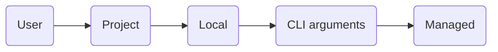

# Claude Code

[Agentic][ai agents] harness around [Claude] providing it with tools, context management, and execution
environment.<br/>
Works in a terminal, IDE, browser, and as a desktop app.

1. [TL;DR](#tldr)
1. [Using tools](#using-tools)
   1. [Managing MCP servers](#managing-mcp-servers)
1. [Limit tool execution](#limit-tool-execution)
1. [Memory](#memory)
1. [Using skills](#using-skills)
1. [Using plugins](#using-plugins)
1. [Delegating work](#delegating-work)
   1. [Sub agents](#sub-agents)
   1. [Agent teams](#agent-teams)
1. [Run on local models](#run-on-local-models)
1. [Further readings](#further-readings)
   1. [Sources](#sources)

## TL;DR

Can run in multiple isolated shell sessions.<br/>
Prefer using [git worktrees] to isolate sessions running in the same repository.

Fully multimodal.<br/>
Can access and understand images and other file types.<br/>
Can use read and edit files, run commands and tools, and do it in parallel.

_Normally_:

- Tied to Anthropic's Claude models (Haiku, Sonnet and Opus).
- Requires a Claude API key or Anthropic plan.<br/>
  Usage is metered by the token.

> [!tip]
> One _can_ use [Claude Code router] or [Ollama] to run on a local server or shared LLM instead.

Uses a **scope system** to determine where configurations apply and who they're shared with.

| Scope                   | Location                             | Area of effect                     | Shared                                    |
| ----------------------- | ------------------------------------ | ---------------------------------- | ----------------------------------------- |
| Managed (A.K.A. System) | System-level `managed-settings.json` | All users on the host              | Yes (usually deployed by IT)              |
| User                    | `$HOME/.claude/` directory           | Single user, across all projects   | No                                        |
| Project                 | `.claude/` directory in a repository | All collaborators, repository only | Yes (usually committed to the repository) |
| Local                   | `.claude/*.local.*` files            | Single user, repository only       | No (usually gitignored)                   |

The [settings' schema] is available on schemastore.org.<br/>
[Config file example].

When multiple scopes are active, settings are merged as follows:



Supports a plugin system for extending its capabilities.

Sends Statsig telemetry data by default. Includes operational metrics (latency, reliability, usage patterns).<br/>
Disable it by setting the `DISABLE_TELEMETRY` environment variable to `1`.

Gives better results when asked to make a plan before writing code, and when tries multiple times (iterates).<br/>
Common workflows:

- Explore, plan, ask for confirmation, write code, commit.

  <details style='padding: 0 0 1rem 1rem'>
    <summary>Example</summary>

  > Figure out the root cause for issue \#43, then propose possible fixes.<br/>
  > Let me choose an approach before you write code.<br/>
  > Ultrathink.

  </details>

- Write tests, commit, write code, iterate, commit, push, create a PR.

  <details style='padding: 0 0 1rem 1rem'>
    <summary>Example</summary>

  > Write tests for @utils/markdown.ts to make sure links render properly.<br/>
  > Note these tests will not pass yet since links are not yet implemented.<br/>
  > Commit.<br/>
  > Update the code to make the tests pass.<br/>
  > Commit. Push. PR.

  </details>

- Write code, screenshot the result, track progress, iterate.

  <details style='padding: 0 0 1rem 1rem'>
    <summary>Example</summary>

  > Implement \[mock.png], then screenshot it with Puppeteer and iterate until it looks like the mock.<br/>
  > Write down notes for yourself at every iteration. Think hard.

  </details>

Hit `esc` once to stop Claude.<br/>
This action is usually safe. Claude will then resume or make things differently, but will have a context.

Prefer using **Sonnet** for quicker, smaller tasks (e.g. as sub-agent, greenfield coding, app initialization).<br/>
Consider using **Opus** for broader, longer, higher-level tasks (e.g. planning, refactoring, orchestrating
sub-agents).<br/>
Consider using **Haiku** for quick responses.

Use memory and context files (`CLAUDE.md`) to instruct Claude Code on commands, style guidelines, and give it _key_
context. Try to keep them small.

Consider allowing specific tools to reduce interruption and avoid fatigue due to too many requests.<br/>
Prefer using CLI tools over MCP servers.

Make sure to use `/clear` or `/compact` regularly to allow Claude to maintain focus on the conversation.<br/>
Or make it create notes to self and restart it once the context goes above a threshold (usually best at 60%).

<details>
  <summary>Setup</summary>

```sh
brew install --cask 'claude-code'
```

</details>

<details>
  <summary>Usage</summary>

```sh
# Start in interactive mode.
claude

# Run a one-time task.
claude "fix the build error"

# Run a one-off task, then exit.
claude -p 'Hi! Are you there?'
claude -p "explain the function in @someFunction.ts"
claude -p 'What did I do this week?' --allowedTools 'Bash(git log:*)' --output-format 'json'
cat 'minutes.md' | claude -p "summarize this"

# Resume the most recent conversation that happened in the current directory
claude -c

# Resume a previous conversation
claude -r

# Add MCP servers.
# Defaults to the 'local' scope if not specified.
claude mcp add --transport 'http' 'GitLab' 'https://some.local.gitlab.com/api/v4/mcp'
claude mcp add --transport 'http' 'linear' 'https://mcp.linear.app/mcp' --scope 'user'

# List installed MCP servers.
claude mcp list

# Show MCP servers' details
claude mcp get 'github'

# Remove MCP servers.
claude mcp remove 'github'

# Load local plugins.
claude --plugin-dir './path/to/plugin'

# Install plugins.
# Marketplace defaults to 'claude-plugins-official`.
# Scope defaults to 'user'.
claude plugin install 'gitlab'
claude plugin i 'aws-cost-saver@aws-cost-saver-marketplace' --scope 'project'

# List installed plugins only.
claude plugin list

# List all plugins.
claude plugin list --available --json

# Enable plugins.
claude plugin enable 'gitlab@claude-plugins-official'

# Disable plugins.
claude plugin disable 'gitlab@claude-plugins-official'

# Update plugins.
claude plugin update 'gitlab@claude-plugins-official'
```

From within Claude Code:

```plaintext
/mcp  manage MCP servers
```

</details>

<details style='padding: 0 0 1rem 0'>
  <summary>Real world use cases</summary>

```sh
# Run Claude Code on a model served locally by Ollama.
ollama launch claude --model 'lfm2.5-thinking:1.2b'
ANTHROPIC_AUTH_TOKEN='ollama' ANTHROPIC_BASE_URL='http://localhost:11434' ANTHROPIC_API_KEY='' \
  claude --model 'lfm2.5-thinking:1.2b'
```

</details>

## Using tools

Claude Code comes with built-in tools (e.g. run shell commands, read and write files, search the web).<br/>
It can be extended to other tools by means of MCP servers and [skills][using skills].

MCP servers connect Claude Code to the data and gives it tools to act on it, skills teach it what to do with them.

> [!caution]
> MCPs are **not** verified, nor otherwise checked for security issues.<br/>
> Be especially careful when using MCP servers that can fetch untrusted content, as they can fall victim of prompt
> injections.

Procedure:

1. Add the desired MCP servers.
1. From within Claude Code, run the `/mcp` command to configure them.

### Managing MCP servers

Prefer managing MCP servers via the `claude mcp` subcommands.

```sh
# Add MCP servers.
# Defaults to the 'local' scope if not specified.
claude mcp add --transport 'http' 'GitLab' 'https://gitlab.example.org/api/v4/mcp'
claude mcp add --transport 'http' 'linear' 'https://mcp.linear.app/mcp' --scope 'user'
claude mcp add 'aws-cost-explorer' --scope 'project' \
  --env 'AWS_REGION=eu-west-1' --env 'AWS_API_MCP_TELEMETRY=false' \
  -- \
  docker run --rm --interactive --volume "$HOME/.aws:/app/.aws" \
    --env 'AWS_REGION' --env 'AWS_API_MCP_TELEMETRY' \
    'public.ecr.aws/awslabs-mcp/awslabs/cost-explorer-mcp-server:latest'

# List installed MCP servers.
claude mcp list

# Show MCP servers' details
claude mcp get 'linear'

# Remove MCP servers.
claude mcp remove 'github'
```

Alternatively, directly edit `$HOME/.claude.json`.

<details style='padding: 0 0 1rem 1rem'>

```sh
# Add MCP servers.
jq '.mcpServers."grafana-aws" |= {
  "command": "docker",
  "args": [
    "run",
    "--rm",
    "--interactive",
    "--env", "GRAFANA_URL",
    "--env", "GRAFANA_SERVICE_ACCOUNT_TOKEN",
    "grafana/mcp-grafana:latest",
    "-t", "stdio"
  ],
  "env": {
    "GRAFANA_URL": "https://g-abcdef0123.grafana-workspace.eu-west-1.amazonaws.com",
    "GRAFANA_SERVICE_ACCOUNT_TOKEN": "glsa_abc…def",
  }
}' "$HOME/.claude.json" \
| sponge "$HOME/.claude.json"
```

</details>

> [!important]
> Values for environment variables **must be strings**.<br/>
> Giving other types will violate the schema Claude Code uses to validate the configuration file. The app will complain
> about it and **not** load the MCP server.

Configuration examples:

<details style='padding: 0 0 0 1rem'>
  <summary>AWS API</summary>

Refer to [AWS API MCP Server].

Enables interacting with AWS services and resources through AWS CLI commands.

```json
{
  "mcpServers": {
    "aws-api-ro": {
      "command": "docker",
      "args": [
        "run",
        "--rm",
        "--interactive",
        "--env", "AWS_API_MCP_TELEMETRY",
        "--env", "AWS_REGION",
        "--env", "READ_OPERATIONS_ONLY",
        "--volume", "/home/path/.aws:/app/.aws",
        "public.ecr.aws/awslabs-mcp/awslabs/aws-api-mcp-server:latest"
      ],
      "env": {
        "AWS_API_MCP_TELEMETRY": "false",
        "AWS_REGION": "eu-west-1",
        "READ_OPERATIONS_ONLY": "true"
      }
    },
    "aws-api-rw": {
      "command": "docker",
      "args": [
        "run",
        "--rm",
        "--interactive",
        "--env", "AWS_API_MCP_TELEMETRY=false",
        "--env", "AWS_API_MCP_PROFILE_NAME=operator",
        "--env", "AWS_REGION=eu-west-1",
        "--env", "REQUIRE_MUTATION_CONSENT=true",
        "--volume", "/home/path/.aws:/app/.aws",
        "public.ecr.aws/awslabs-mcp/awslabs/aws-api-mcp-server:latest"
      ]
    }
  }
}
```

</details>

<details style='padding: 0 0 0 1rem'>
  <summary>AWS Cost Explorer</summary>

Refer to [AWS Cost Explorer MCP Server].

Enables analyzing AWS costs and usage data through the AWS Cost Explorer API.

```json
{
  "mcpServers": {
    "aws-cost-explorer": {
      "command": "docker",
      "args": [
        "run",
        "--rm",
        "--interactive",
        "--env", "AWS_API_MCP_TELEMETRY",
        "--env", "AWS_REGION",
        "--volume", "/home/path/.aws:/app/.aws",
        "public.ecr.aws/awslabs-mcp/awslabs/cost-explorer-mcp-server:latest"
      ]
    }
  }
}
```

</details>

<details style='padding: 0 0 0 1rem'>
  <summary>GitLab</summary>

Enables interacting with GitLab instances through the GitLab API.

```json
{
  "mcpServers": {
    "gitlab": {
      "type": "http",
      "url": "https://gitlab.example.org/api/v4/mcp"
    }
  }
}
```

</details>

<details style='padding: 0 0 0 1rem'>
  <summary>Grafana</summary>

Refer to [Grafana MCP Server].

```json
{
  "mcpServers": {
    "grafana-aws": {
      "command": "docker",
      "args": [
        "run",
        "--rm",
        "--interactive",
        "--env", "GRAFANA_URL",
        "--env", "GRAFANA_SERVICE_ACCOUNT_TOKEN",
        "grafana/mcp-grafana:latest",
        "-t", "stdio",
        "--disable-write",
        "--disable-admin"
      ],
      "env": {
        "GRAFANA_URL": "https://g-abcdef0123.grafana-workspace.eu-west-1.amazonaws.com",
        "GRAFANA_SERVICE_ACCOUNT_TOKEN": "glsa_abc…def"
      }
    },
    "grafana-local": {
      "command": "docker",
      "args": [
        "run",
        "--rm",
        "--interactive",
        "--env", "GRAFANA_URL",
        "--env", "GRAFANA_USERNAME",
        "--env", "GRAFANA_PASSWORD",
        "--env", "GRAFANA_ORG_ID",
        "grafana/mcp-grafana:latest",
        "-t", "stdio"
      ],
      "env": {
        "GRAFANA_URL": "https://g-abcdef0123.grafana-workspace.eu-west-1.amazonaws.com",
        "GRAFANA_USERNAME": "some-user",
        "GRAFANA_PASSWORD": "some-password",
        "GRAFANA_ORG_ID": "1"
      }
    }
  }
}
```

</details>

<details style='padding: 0 0 1rem 1rem'>
  <summary>Linear</summary>

```json
{
  "mcpServers": {
    "linear": {
      "type": "http",
      "url": "https://mcp.linear.app/mcp"
    },
  }
}
```

</details>

## Limit tool execution

Leverage [Sandboxing][documentation / sandboxing] to provide filesystem and network isolation for tool execution.<br/>
The sandboxed bash tool uses OS-level primitives to enforce defined boundaries upfront, and controls network access
through a proxy server running outside the sandbox.<br/>
Attempts to access resources outside the sandbox trigger immediate notifications.

> [!warning]
> Effective sandboxing requires **both** filesystem and network isolation.<br/>
> Without network isolation, compromised agents could exfiltrate sensitive files like SSH keys.<br/>
> Without filesystem isolation, compromised agents could backdoor system resources to gain network access.<br/>
> When configuring sandboxing, it is important to ensure that configured settings do not bypass these systems.

The sandboxed tool:

- Grants _default_ read and write access to the current working directory and its subdirectories.
- Grants _default_ read access to the entire computer, except specific denied directories.
- Blocks modifying files outside the current working directory without **explicit** permission.
- Allows defining custom allowed and denied paths through settings.
- Allows accessing only approved domains.
- Prompts the user when tools request access to new domains.
- Allows implementing custom rules on **outgoing** traffic.
- Applies restrictions to all scripts, programs, and subprocesses spawned by commands.

On Mac OS X, Claude Code uses the built-in Seatbelt framework. On Linux and WSL2, it requires installing
[containers/bubblewrap] before activation.

Sandboxes _can_ be configured to execute commands within the sandbox **without** requiring approval.<br/>
Commands that cannot be sandboxed fall back to the regular permission flow.

Customize sandbox behavior through the `settings.json` file.

## Memory

Refer to:

- [AI agents memory][ai agents / memory]
- [Manage Claude's memory][documentation / manage claude's memory].

Claude Code can save learnings, patterns, and insights gained during active sessions, and load them in a later sessions.

One can write and maintain `CLAUDE.md` Markdown files with instructions, rules, and preferences themselves (or ask
Claude to do it on their behalf).<br/>
When _auto memory_ is enabled, Claude automatically updates `~/.claude/projects/<project>/memory/MEMORY.md` files. The
first 200 lines of those are loaded at the start of every session.

Auto memory is enabled by default.<br/>
It can be disabled via the `/memory` toggle, `settings.json`, or `CLAUDE_CODE_DISABLE_AUTO_MEMORY=1`.

Memory hierarchy (from broadest to most specific):

| Type              | Location                                                    |
| ----------------- | ----------------------------------------------------------- |
| Managed policy    | `/Library/Application Support/ClaudeCode/CLAUDE.md` (macOS) |
| Project memory    | `./CLAUDE.md` or `./.claude/CLAUDE.md`                      |
| Project rules     | `./.claude/rules/*.md`                                      |
| User memory       | `~/.claude/CLAUDE.md`                                       |
| Project overrides | `./CLAUDE.local.md`                                         |
| Auto memory       | `~/.claude/projects/<project>/memory/`                      |

Key commands:

| Command   | Summary                                              |
| --------- | ---------------------------------------------------- |
| `/memory` | View, edit, or toggle auto memory on/off             |
| `/init`   | Bootstrap a `CLAUDE.md` file for the current project |

## Using skills

Refer [Skills][documentation / skills].<br/>
See also:

- [How to create custom Skills].
- [Improving skill-creator: Test, measure, and refine Agent Skills].
- [Anthropic's own source-available skills][anthropics/skills]
- [Prat011/awesome-llm-skills].

Claude Skills follow and extend the [Agent Skills] standard format.

Skills superseded commands.<br/>
Existing `.claude/commands/` files will currently still work, but skills with the same name will take precedence.

Claude Code automatically discovers skills from:

- The user's `$HOME/.claude/skills/` directory, and sets them up as user-level skills.
- A project's `.claude/skills/` folder, and sets them up as project-level skills.
- A plugin's `<plugin>/skills/` folder, if such plugin is enabled.

Whatever the scope, skills must follow the `<scope-dir>/<skill-name>/SKILL.md` tree format, e.g.
`$HOME/.claude/skills/aws-action/SKILL.md` for a user-level skill.

User-level skills are available in all projects.<br/>
Project-level skills are limited to the current project.

Claude Code loads only the name and description of all skills during startup, then automatically loads and activates
only those skills that are relevant to the requests' context.<br/>
If the loaded skills reference other files, those are preemptively loaded together with the skill (_when_ it loads that
skill).

When working with files in subdirectories, Claude Code automatically discovers skills from nested `.claude/skills/`
directories.

When skills share the same name across different scopes, the **more** specific scope wins (enterprise > personal >
project > subdirectory).<br/>
Plugin skills use a `plugin-name:skill-name` namespace, so they cannot conflict with other levels.<br/>
Files in `.claude/commands/` work the same way, but the skill will take precedence if a skill and a command share the
same name.

Each skill is a directory, with the `SKILL.md` file as the entrypoint:

```plaintext
some-skill/
├── SKILL.md           # Main instructions (required)
├── template.md        # Template for Claude to fill in
├── examples/
│   └── sample.md      # Example output, showing its expected format
└── scripts/           # Scripts that Claude can execute
    └── validate.sh
```

The `SKILL.md` files contains a description of the skill and the main, essentials instructions that teach Claude how to
use it.<br/>
This file is required. All other files are optional and are considered _supporting_ files.<br/>
Optional files allow to specify more details and materials, like Large reference docs, API specifications, or example
collections that do not need to be loaded into context every time the skill runs.<br/>
Reference optional files in `SKILL.md` to instruct Claude of what they contain and when to load them.

> [!tip]
> Prefer keeping `SKILL.md` under 500 lines.<br/>
> Move detailed reference material to supporting files.

Consider installing and using Claude's [_Skill Creator_ plugin][anthropics/skills/skill-creator] to create custom
skills.<br/>
It also allows for testing.

## Using plugins

Reusable packages that bundle [Skills][using skills], agents, hooks, MCP servers, and LSP configurations.<br/>
They allow extending Claude Code's functionality, and sharing extensions across projects and teams.

Can be installed at all different scopes.

<details>
  <summary>Commands</summary>

```plaintext
# Browse, install, enable/disable, or manage plugins
/plugin
```

```sh
# Load local plugins.
claude --plugin-dir './path/to/plugin'

# Install plugin marketplaces.
claude plugin marketplace add 'owner/repo'      # github
claude plugin marketplace add 'path/to/plugin'  # local

# Install plugins.
# Marketplace defaults to 'claude-plugins-official`.
# Scope defaults to 'user'.
claude plugin install 'gitlab'
claude plugin i 'aws-cost-saver@aws-cost-saver-marketplace' --scope 'project'

# List installed plugins only.
claude plugin list

# List all plugins.
claude plugin list --available --json

# Enable plugins.
claude plugin enable 'skill-creator@claude-plugins-official'
claude plugin enable 'gitlab@claude-plugins-official'

# Disable plugins.
claude plugin disable 'gitlab@claude-plugins-official'

# Update plugins.
claude plugin update 'gitlab@claude-plugins-official'

# Uninstall plugins.
claude plugin uninstall 'gitlab@claude-plugins-official'
```

</details>

## Delegating work

[Agent teams] generally perform parallel tasks in less time, but consume more tokens.<br/>
[Sub agents] currently consistently produce better quality output than teams.

### Sub agents

Refer to [Create custom subagents][Documentation / Create custom subagents].

**Specialized** AI assistants with fixed roles, handling **specific** types of tasks.<br/>
Each runs in its own context window, with its own custom system prompt, specific access to tools, and independent
permissions.

When Claude encounters a task that matches a subagent's description, it delegates the task to that sub agent.<br/>
The sub agent works independently, and returns results once finished.

Most effective for sequential tasks, same-file edits, or tasks with many dependencies.<br/>
They only report results back to the main agent, and never talk to each other.

Claude Code includes several built-in subagents like _Explore_, _Plan_, and _general-purpose_.<br/>
One can create custom subagents to handle specific tasks.

Subagents are defined in Markdown files with YAML frontmatter.<br/>
Create them manually or use the `/agents` command.

<details style='padding: 0 0 1rem 1rem'>

```md
---
name: code-reviewer
description: Reviews code for quality and best practices
tools: Read, Glob, Grep
model: sonnet
---

You are a code reviewer. When invoked, analyze the code and provide
specific, actionable feedback on quality, security, and best practices.
```

</details>

One can ask Claude to use subagents in sequence when dealing with multi-step workflows.<br/>
Each subagent completes its task and returns its results to Claude, which then passes relevant context to the next
subagent.

### Agent teams

> [!warning]
> Experimental feature as of 2026-03-02.

Refer to [Orchestrate teams of Claude Code sessions][documentation / orchestrate teams of claude code sessions].

Multiple Claude Code instances can work together as a team.<br/>
One session acts as the team lead and coordinates work, assigns tasks, and synthesizes results.<br/>
Teammates work independently, have their own context window, and communicate directly with each other.

One can interact with individual teammates directly, without going through the lead.

Most effective when teammates can operate independently.<br/>
They do exhibit coordination overhead, and use more tokens than a single session.

Currently disabled by default.<br/>
Enable them by setting the `CLAUDE_CODE_EXPERIMENTAL_AGENT_TEAMS` environment variable to `1`, either in a shell
environment or through `settings.json`.

<details style='padding: 0 0 1rem 1rem'>

```json
{
  "env": {
    "CLAUDE_CODE_EXPERIMENTAL_AGENT_TEAMS": "1"
  }
}
```

</details>

Tell Claude to create an agent team, describing the task and the desired team structure in natural language.<br/>
Claude creates the team with a shared task list, spawns teammates for each task, coordinates work based on the prompt,
and attempts to clean up the team when finished.

<details style='padding: 0 0 1rem 1rem'>

> [!note]
> The three roles are independent, so they can explore the problem without waiting on each other.

```plaintext
I'm designing a CLI tool that helps developers track TODO comments across their codebase.
Create an agent team to explore this from different angles: one teammate on UX, one on technical architecture, and one
playing devil's advocate.
```

```plaintext
Users report the app exits after one message instead of staying connected.
Spawn 5 agent teammates to investigate different hypotheses. Have them talk to each other to try to disprove each
other's theories, like a scientific debate.
Update the findings doc with whatever consensus emerges.
```

</details>

One can specify conditions and requirements in the prompt, like the number of teammates and whether they need to ask the
lead for approval before acting.

When requiring approvals:

- Teammates work in read-only mode until they need to act.
- Once finished planning, teammates send a plan approval request to the lead.
- The lead reviews the plan, and either approves it or rejects it with feedback.

  > [!important]
  > The lead makes approval decisions autonomously.<br/>
  > Give the lead criteria in the prompt to influence its judgment.

- If rejected, that teammate stays in plan mode, revises based on the feedback, and resubmits.
- Once approved, that teammate exits plan mode and begins implementation.

Gracefully end teammates' sessions by just asking the lead.<br/>
The lead sends them shutdown requests that the teammates can approve, exiting gracefully, or reject with an explanation.

<details style='padding: 0 0 1rem 1rem'>

```plaintext
Ask the researcher teammate to shut down
```

</details>

Clean up the team **after termination** by just asking the lead to clean up.<br/>
The lead will fail if any teammate is still running.

## Run on local models

Claude _can_ use other models and engines by setting the `ANTHROPIC_AUTH_TOKEN`, `ANTHROPIC_BASE_URL` and
`ANTHROPIC_API_KEY` environment variables.

E.g.:

```sh
# Run Claude Code on a model served locally by Ollama.
ANTHROPIC_AUTH_TOKEN='ollama' ANTHROPIC_BASE_URL='http://localhost:11434' ANTHROPIC_API_KEY='' \
  claude --model 'lfm2.5-thinking:1.2b'
```

> [!warning]
> Performances do tend to drop substantially depending on the context size and the executing host.

<details style='padding: 0 0 1rem 1rem'>
  <summary>Examples</summary>

Prompt: `Hi! Are you there?`.<br/>
The model was run once right before the tests started to remove loading times.<br/>
Requests have been sent in headless mode (`claude -p 'prompt'`).

  <details style='padding: 0 0 0 1rem'>
    <summary><code>glm-4.7-flash:q4_K_M</code> on an M3 Pro MacBook Pro 36 GB</summary>

Model: `glm-4.7-flash:q4_K_M`.<br/>
Host: M3 Pro MacBook Pro 36 GB.<br/>
Claude Code version: `v2.1.41`.<br/>

| Engine             | Context | RAM usage | Used swap    | Average response time | System remained responsive |
| ------------------ | ------: | --------: | ------------ | --------------------: | -------------------------- |
| llama.cpp (ollama) |    4096 |     19 GB | No           |                   19s | No                         |
| llama.cpp (ollama) |    8192 |     19 GB | No           |                   48s | No                         |
| llama.cpp (ollama) |   16384 |     20 GB | No           |                2m 16s | No                         |
| llama.cpp (ollama) |   32768 |     22 GB | No           |                 7.12s | No                         |
| llama.cpp (ollama) |   65536 |     25 GB | No? (unsure) |                10.25s | Meh (minor stutters)       |
| llama.cpp (ollama) |  131072 |     33 GB | **Yes**      |                3m 42s | **No** (major stutters)    |

  </details>

</details>

## Further readings

- [Website]
- [Codebase]
- [Blog]
- [How Claude Code works]
- [AI agents]
- Alternatives: [Gemini CLI], [OpenCode], [Pi]
- [Claude Code router]
- [Settings][documentation / settings]
- [Prat011/awesome-llm-skills]
- [Claude Skills vs. MCP: A Technical Comparison for AI Workflows]
- [Improving skill-creator: Test, measure, and refine Agent Skills]

### Sources

- [Documentation]
- [pffigueiredo/claude-code-sheet.md]
- [Mastering Claude Code in 30 minutes] by Boris Cherny, Anthropic

<!--
  Reference
  ═╬═Time══
  -->

<!-- In-article sections -->
[Agent teams]: #agent-teams
[Sub agents]: #sub-agents
[Using Skills]: #using-skills

<!-- Knowledge base -->
[AI agents]: ../agents.md
[AI agents / Memory]: ../agents.md#memory
[Claude Code router]: claude%20code%20router.md
[Claude]: README.md
[Gemini CLI]: ../gemini/cli.md
[git worktrees]: ../../git.md#worktrees
[Ollama]: ../ollama.md
[OpenCode]: ../opencode.md
[Pi]: ../pi.md

<!-- Files -->
[Config file example]: ../../../examples/claude/claude.json

<!-- Upstream -->
[anthropics/skills]: https://github.com/anthropics/skills
[anthropics/skills/skill-creator]: https://github.com/anthropics/skills/blob/main/skills/skill-creator/SKILL.md
[Blog]: https://claude.com/blog
[Codebase]: https://github.com/anthropics/claude-code
[Documentation / Create custom subagents]: https://code.claude.com/docs/en/sub-agents
[Documentation / Manage Claude's memory]: https://code.claude.com/docs/en/memory
[Documentation / Orchestrate teams of Claude Code sessions]: https://code.claude.com/docs/en/agent-teams
[Documentation / Sandboxing]: https://code.claude.com/docs/en/sandboxing
[Documentation / Settings]: https://code.claude.com/docs/en/settings
[Documentation / Skills]: https://code.claude.com/docs/en/skills
[Documentation]: https://code.claude.com/docs/en/overview
[How Claude Code works]: https://code.claude.com/docs/en/how-claude-code-works
[How to create custom Skills]: https://support.claude.com/en/articles/12512198-how-to-create-custom-skills
[Improving skill-creator: Test, measure, and refine Agent Skills]: https://claude.com/blog/improving-skill-creator-test-measure-and-refine-agent-skills
[Mastering Claude Code in 30 minutes]: https://www.youtube.com/watch?v=6eBSHbLKuN0
[Website]: https://claude.com/product/overview

<!-- Others -->
[Agent Skills]: https://agentskills.io/
[AWS API MCP Server]: https://github.com/awslabs/mcp/tree/main/src/aws-api-mcp-server
[AWS Cost Explorer MCP Server]: https://github.com/awslabs/mcp/tree/main/src/cost-explorer-mcp-server
[Claude Skills vs. MCP: A Technical Comparison for AI Workflows]: https://intuitionlabs.ai/articles/claude-skills-vs-mcp
[containers/bubblewrap]: https://github.com/containers/bubblewrap
[Grafana MCP Server]: https://github.com/grafana/mcp-grafana
[pffigueiredo/claude-code-sheet.md]: https://gist.github.com/pffigueiredo/252bac8c731f7e8a2fc268c8a965a963
[Prat011/awesome-llm-skills]: https://github.com/Prat011/awesome-llm-skills
[Settings' schema]: https://www.schemastore.org/claude-code-settings.json
