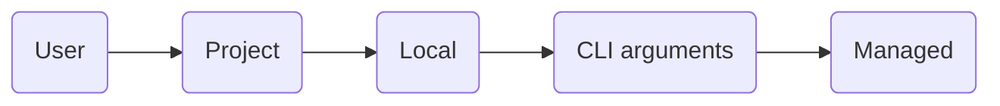

# Claude Code

[Agentic][ai agents] coding tool that reads and edits files, runs commands, and integrates with tools.<br/>
Works in a terminal, IDE, browser, and as a desktop app.

1. [TL;DR](#tldr)
1. [Grant access to tools](#grant-access-to-tools)
1. [Using skills](#using-skills)
1. [Limit tool execution](#limit-tool-execution)
1. [Memory](#memory)
1. [Using plugins](#using-plugins)
1. [Run on local models](#run-on-local-models)
1. [Further readings](#further-readings)
   1. [Sources](#sources)

## TL;DR

Claude can run in multiple shell sessions.<br/>
Prefer using git worktrees to isolate sessions in the same repository.

Fully multimodal.<br/>
Can access and understand images and other file types.<br/>
Can use tools, and do it in parallel.

_Normally_:

- Tied to Anthropic's Claude models (Sonnet and Opus).
- Requires a Claude API key or Anthropic plan.<br/>
  Usage is metered by the token.

> [!tip]
> One _can_ use [Claude Code router] or [Ollama] to run on a locally server or shared LLM instead.

Uses a **scope system** to determine where configurations apply and who they're shared with.

| Scope                   | Location                             | Area of effect                     | Shared                                    |
| ----------------------- | ------------------------------------ | ---------------------------------- | ----------------------------------------- |
| Managed (A.K.A. System) | System-level `managed-settings.json` | All users on the host              | Yes (usually deployed by IT)              |
| User                    | `$HOME/.claude/` directory           | Single user, across all projects   | No                                        |
| Project                 | `.claude/` directory in a repository | All collaborators, repository only | Yes (usually committed to the repository) |
| Local                   | `.claude/*.local.*` files            | Single user, repository only       | No (usually gitignored)                   |

The [settings' schema] is available on schemastore.org.<br/>
[Config file example].

When multiple scopes are active, settings are merged as follows:



Supports a plugin system for extending its capabilities.

Sends Statsig telemetry data by default. Includes operational metrics (latency, reliability, usage patterns).<br/>
Disable it by setting the `DISABLE_TELEMETRY` environment variable to `1`.

Gives better results when asked to make a plan before writing code, and when tries multiple times (iterates).<br/>
Common workflows:

- Explore, plan, ask for confirmation, write code, commit.

  <details style='padding: 0 0 1rem 1rem'>
    <summary>Example</summary>

  > Figure out the root cause for issue \#43, then propose possible fixes.<br/>
  > Let me choose an approach before you write code.<br/>
  > Ultrathink.

  </details>

- Write tests, commit, write code, iterate, commit, push, create a PR.

  <details style='padding: 0 0 1rem 1rem'>
    <summary>Example</summary>

  > Write tests for @utils/markdown.ts to make sure links render properly.<br/>
  > Note these tests will not pass yet since links are not yet implemented.<br/>
  > Commit.<br/>
  > Update the code to make the tests pass.<br/>
  > Commit. Push. PR.

  </details>

- Write code, screenshot the result, track progress, iterate.

  <details style='padding: 0 0 1rem 1rem'>
    <summary>Example</summary>

  > Implement \[mock.png], then screenshot it with Puppeteer and iterate until it looks like the mock.<br/>
  > Write down notes for yourself at every iteration. Think hard.

  </details>

Hit `esc` once to stop Claude.<br/>
This action is usually safe. Claude will then resume or make things differently, but will have a context.

Prefer using Sonnet for quicker, smaller tasks (e.g. as sub-agent, greenfield coding, app initialization).<br/>
Consider using Opus for broader, longer, higher-level tasks (e.g. planning, refactoring, orchestrating sub-agents).

Use memory and context files (`CLAUDE.md`) to instruct Claude Code on commands, style guidelines, and give it _key_
context. Try to keep them small.

Consider allowing specific tools to reduce interruption and avoid fatigue due to too many requests.<br/>
Prefer using CLI tools over MCP servers.

Make sure to use `/clear` or `/compact` regularly to allow Claude to maintain focus on the conversation.<br/>
Or make it create notes to self and restart it once the context goes above a threshold (usually best at 60%).

<details>
  <summary>Setup</summary>

```sh
brew install --cask 'claude-code'
```

</details>

<details>
  <summary>Usage</summary>

```sh
# Start in interactive mode.
claude

# Run a one-time task.
claude "fix the build error"

# Run a one-off task, then exit.
claude -p 'Hi! Are you there?'
claude -p "explain the function in @someFunction.ts"
claude -p 'What did I do this week?' --allowedTools 'Bash(git log:*)' --output-format 'json'
cat 'minutes.md' | claude -p "summarize this"

# Resume the most recent conversation that happened in the current directory
claude -c

# Resume a previous conversation
claude -r

# Add MCP servers.
# Defaults to the 'local' scope if not specified.
claude mcp add --transport 'http' 'GitLab' 'https://some.local.gitlab.com/api/v4/mcp'
claude mcp add --transport 'http' 'linear' 'https://mcp.linear.app/mcp' --scope 'user'

# List configured MCP servers.
claude mcp list

# Show MCP servers' details
claude mcp get 'github'

# Remove MCP servers.
claude mcp remove 'github'

# Load local plugins.
claude --plugin-dir './path/to/plugin'

# Install plugins.
# Marketplace defaults to 'claude-plugins-official`.
# Scope defaults to 'user'.
claude plugin install 'gitlab'
claude plugin i 'aws-cost-saver@aws-cost-saver-marketplace' --scope 'project'

# List installed plugins only.
claude plugin list

# List all plugins.
claude plugin list --available --json

# Enable plugins.
claude plugin enable 'gitlab@claude-plugins-official'

# Disable plugins.
claude plugin disable 'gitlab@claude-plugins-official'

# Update plugins.
claude plugin update 'gitlab@claude-plugins-official'
```

From within Claude Code:

```plaintext
/mcp  manage MCP servers
```

</details>

<details style='padding: 0 0 1rem 0'>
  <summary>Real world use cases</summary>

```sh
# Run Claude Code on a model served locally by Ollama.
ollama launch claude --model 'lfm2.5-thinking:1.2b'
ANTHROPIC_AUTH_TOKEN='ollama' ANTHROPIC_BASE_URL='http://localhost:11434' ANTHROPIC_API_KEY='' \
  claude --model 'lfm2.5-thinking:1.2b'
```

</details>

## Grant access to tools

Add MCP servers to give Claude Code access to tools, databases, and APIs in general.

> [!caution]
> MCPs are **not** verified, nor otherwise checked for security issues.<br/>
> Be especially careful when using MCP servers that cat fetch untrusted content, as they can fall victim of prompt
> injections.

Procedure:

1. Add the desired MCP server.

   <details style='padding: 0 0 1rem 1rem'>
     <summary>Examples</summary>

   ```sh
   # Defaults to the 'local' scope if not specified.
   claude mcp add --transport 'http' 'GitLab' 'https://some.local.gitlab.com/api/v4/mcp'
   claude mcp add --transport 'http' 'linear' 'https://mcp.linear.app/mcp' --scope 'user'
   ```

1. From within Claude Code, run the `/mcp` command to configure it.

<details>
  <summary>AWS API MCP server</summary>

Refer [AWS API MCP Server].

Enables AI assistants to interact with AWS services and resources through AWS CLI commands.

  <details style='padding: 0 0 1rem 1rem'>
    <summary>Run as Docker container</summary>

Manually add the MCP server definition to `$HOME/.claude.json`:

```json
{
  "mcpServers": {
    "aws-api": {
      "command": "docker",
      "args": [
        "run",
        "--rm",
        "--interactive",
        "--env",
        "AWS_REGION=eu-west-1",
        "--env",
        "AWS_API_MCP_TELEMETRY=false",
        "--env",
        "REQUIRE_MUTATION_CONSENT=true",
        "--env",
        "READ_OPERATIONS_ONLY=true",
        "--volume",
        "/Users/yourUserHere/.aws:/app/.aws",
        "public.ecr.aws/awslabs-mcp/awslabs/aws-api-mcp-server:latest"
      ]
    }
  }
}
```

  </details>

</details>

<details>
  <summary>AWS Cost Explorer MCP server</summary>

Refer [Cost Explorer MCP Server].

Enables AI assistants to analyze AWS costs and usage data through the AWS Cost Explorer API.

  <details style='padding: 0 0 1rem 1rem'>
    <summary>Run as Docker container</summary>

FIXME: many of those environment variable are probably **not** necessary here.

Manually add the MCP server definition to `$HOME/.claude.json`:

```json
{
  "mcpServers": {
    "aws-cost-explorer": {
      "command": "docker",
      "args": [
        "run",
        "--rm",
        "--interactive",
        "--env",
        "AWS_REGION=eu-west-1",
        "--env",
        "AWS_API_MCP_TELEMETRY=false",
        "--env",
        "REQUIRE_MUTATION_CONSENT=true",
        "--env",
        "READ_OPERATIONS_ONLY=true",
        "--volume",
        "/Users/yourUserHere/.aws:/app/.aws",
        "public.ecr.aws/awslabs-mcp/awslabs/cost-explorer-mcp-server:latest"
      ]
    }
  }
}
```

  </details>

</details>

## Using skills

Refer [Skills][documentation/skills].<br/>
See also:

- [Create custom skills].
- [Prat011/awesome-llm-skills].

Claude Skills follow and extend the [Agent Skills] standard format.

Skills superseded commands.<br/>
Existing `.claude/commands/` files will currently still work, but skills with the same name will take precedence.

Claude Code automatically discovers skills from:

- The user's `$HOME/.claude/skills/` directory, and sets them up as user-level skills.
- A project's `.claude/skills/` folder, and sets them up as project-level skills.
- A plugin's `<plugin>/skills/` folder, if such plugin is enabled.

Whatever the scope, skills must follow the `<scope-dir>/<skill-name>/SKILL.md` tree format, e.g.
`$HOME/.claude/skills/aws-action/SKILL.md` for a user-level skill.

User-level skills are available in all projects.<br/>
Project-level skills are limited to the current project.

Claude Code activates relevant skills automatically based on the request context.

When working with files in subdirectories, Claude Code automatically discovers skills from nested `.claude/skills/`
directories.

When skills share the same name across different scopes, the **more** specific scope wins (enterprise > personal >
project > subdirectory).<br/>
Plugin skills use a `plugin-name:skill-name` namespace, so they cannot conflict with other levels.<br/>
Files in `.claude/commands/` work the same way, but the skill will take precedence if a skill and a command share the
same name.

Each skill is a directory, with the `SKILL.md` file as the entrypoint:

```plaintext
some-skill/
├── SKILL.md           # Main instructions (required)
├── template.md        # Template for Claude to fill in
├── examples/
│   └── sample.md      # Example output, showing its expected format
└── scripts/           # Scripts that Claude can execute
    └── validate.sh
```

The `SKILL.md` files contains a description of the skill and the main, essentials instructions that teach Claude how to
use it.<br/>
This file is required. All other files are optional and are considered _supporting_ files.<br/>
Optional files allow to specify more details and materials, like Large reference docs, API specifications, or example
collections that do not need to be loaded into context every time the skill runs.<br/>
Reference optional files in `SKILL.md` to instruct Claude of what they contain and when to load them.

> [!tip]
> Prefer keeping `SKILL.md` under 500 lines. Move detailed reference material to supporting files.

## Limit tool execution

Leverage [Sandboxing][documentation/sandboxing] to provide filesystem and network isolation for tool execution.<br/>
The sandboxed bash tool uses OS-level primitives to enforce defined boundaries upfront, and controls network access
through a proxy server running outside the sandbox.<br/>
Attempts to access resources outside the sandbox trigger immediate notifications.

> [!warning]
> Effective sandboxing requires **both** filesystem and network isolation.<br/>
> Without network isolation, compromised agents could exfiltrate sensitive files like SSH keys.<br/>
> Without filesystem isolation, compromised agents could backdoor system resources to gain network access.<br/>
> When configuring sandboxing, it is important to ensure that configured settings do not bypass these systems.

The sandboxed tool:

- Grants _default_ read and write access to the current working directory and its subdirectories.
- Grants _default_ read access to the entire computer, except specific denied directories.
- Blocks modifying files outside the current working directory without **explicit** permission.
- Allows defining custom allowed and denied paths through settings.
- Allows accessing only approved domains.
- Prompts the user when tools request access to new domains.
- Allows implementing custom rules on **outgoing** traffic.
- Applies restrictions to all scripts, programs, and subprocesses spawned by commands.

On Mac OS X, Claude Code uses the built-in Seatbelt framework. On Linux and WSL2, it requires installing
[containers/bubblewrap] before activation.

Sandboxes _can_ be configured to execute commands within the sandbox **without** requiring approval.<br/>
Commands that cannot be sandboxed fall back to the regular permission flow.

Customize sandbox behavior through the `settings.json` file.

## Memory

Refer [Manage Claude's memory][documentation/manage claude's memory].

Claude Code can save learnings, patterns, and insights gained during active sessions, and load them in a later sessions.

One can write and maintain `CLAUDE.md` Markdown files with instructions, rules, and preferences themselves (or ask
Claude to do it on their behalf).<br/>
When _auto memory_ is enabled, Claude automatically updates `~/.claude/projects/<project>/memory/MEMORY.md` files. The
first 200 lines of those are loaded at the start of every session.

Auto memory is enabled by default.<br/>
It can be disabled via the `/memory` toggle, `settings.json`, or `CLAUDE_CODE_DISABLE_AUTO_MEMORY=1`.

Memory hierarchy (from broadest to most specific):

| Type              | Location                                                    |
| ----------------- | ----------------------------------------------------------- |
| Managed policy    | `/Library/Application Support/ClaudeCode/CLAUDE.md` (macOS) |
| Project memory    | `./CLAUDE.md` or `./.claude/CLAUDE.md`                      |
| Project rules     | `./.claude/rules/*.md`                                      |
| User memory       | `~/.claude/CLAUDE.md`                                       |
| Project overrides | `./CLAUDE.local.md`                                         |
| Auto memory       | `~/.claude/projects/<project>/memory/`                      |

Key commands:

| Command   | Summary                                              |
| --------- | ---------------------------------------------------- |
| `/memory` | View, edit, or toggle auto memory on/off             |
| `/init`   | Bootstrap a `CLAUDE.md` file for the current project |

## Using plugins

Reusable packages that bundle [Skills][using skills], agents, hooks, MCP servers, and LSP configurations.<br/>
They allow extending Claude Code's functionality, and sharing extensions across projects and teams.

Can be installed at all different scopes.

<details>
  <summary>Commands</summary>

```plaintext
# Browse, install, enable/disable, or manage plugins
/plugin
```

```sh
# Load local plugins.
claude --plugin-dir './path/to/plugin'

# Install plugin marketplaces.
claude plugin marketplace add 'owner/repo'      # github
claude plugin marketplace add 'path/to/plugin'  # local

# Install plugins.
# Marketplace defaults to 'claude-plugins-official`.
# Scope defaults to 'user'.
claude plugin install 'gitlab'
claude plugin i 'aws-cost-saver@aws-cost-saver-marketplace' --scope 'project'

# List installed plugins only.
claude plugin list

# List all plugins.
claude plugin list --available --json

# Enable plugins.
claude plugin enable 'gitlab@claude-plugins-official'

# Disable plugins.
claude plugin disable 'gitlab@claude-plugins-official'

# Update plugins.
claude plugin update 'gitlab@claude-plugins-official'

# Uninstall plugins.
claude plugin uninstall 'gitlab@claude-plugins-official'
```

</details>

## Run on local models

Claude _can_ use other models and engines by setting the `ANTHROPIC_AUTH_TOKEN`, `ANTHROPIC_BASE_URL` and
`ANTHROPIC_API_KEY` environment variables.

E.g.:

```sh
# Run Claude Code on a model served locally by Ollama.
ANTHROPIC_AUTH_TOKEN='ollama' ANTHROPIC_BASE_URL='http://localhost:11434' ANTHROPIC_API_KEY='' \
  claude --model 'lfm2.5-thinking:1.2b'
```

> [!warning]
> Performances do tend to drop substantially depending on the context size and the executing host.

<details style='padding: 0 0 1rem 1rem'>
  <summary>Examples</summary>

Prompt: `Hi! Are you there?`.<br/>
The model was run once right before the tests started to remove loading times.<br/>
Requests have been sent in headless mode (`claude -p 'prompt'`).

  <details style='padding: 0 0 0 1rem'>
    <summary><code>glm-4.7-flash:q4_K_M</code> on an M3 Pro MacBook Pro 36 GB</summary>

Model: `glm-4.7-flash:q4_K_M`.<br/>
Host: M3 Pro MacBook Pro 36 GB.<br/>
Claude Code version: `v2.1.41`.<br/>

| Engine             | Context | RAM usage | Used swap    | Average response time | System remained responsive |
| ------------------ | ------: | --------: | ------------ | --------------------: | -------------------------- |
| llama.cpp (ollama) |    4096 |     19 GB | No           |                   19s | No                         |
| llama.cpp (ollama) |    8192 |     19 GB | No           |                   48s | No                         |
| llama.cpp (ollama) |   16384 |     20 GB | No           |                2m 16s | No                         |
| llama.cpp (ollama) |   32768 |     22 GB | No           |                 7.12s | No                         |
| llama.cpp (ollama) |   65536 |     25 GB | No? (unsure) |                10.25s | Meh (minor stutters)       |
| llama.cpp (ollama) |  131072 |     33 GB | **Yes**      |                3m 42s | **No** (major stutters)    |

  </details>

</details>

## Further readings

- [Website]
- [Codebase]
- [Blog]
- [AI agents]
- Alternatives: [Gemini CLI], [OpenCode], [Pi]
- [Claude Code router]
- [Settings][documentation/settings]
- [Prat011/awesome-llm-skills]
- [Claude Skills vs. MCP: A Technical Comparison for AI Workflows]

### Sources

- [Documentation]
- [pffigueiredo/claude-code-sheet.md]
- [Mastering Claude Code in 30 minutes] by Boris Cherny, Anthropic

<!--
  Reference
  ═╬═Time══
  -->

<!-- In-article sections -->
[Using Skills]: #using-skills

<!-- Knowledge base -->
[AI agents]: ../agents.md
[Claude Code router]: claude%20code%20router.md
[Create custom skills]: create%20custom%20skills.md
[Gemini CLI]: ../gemini/cli.md
[Ollama]: ../ollama.md
[OpenCode]: ../opencode.md
[Pi]: ../pi.md

<!-- Files -->
[Config file example]: ../../../examples/claude/claude.json

<!-- Upstream -->
[Blog]: https://claude.com/blog
[Codebase]: https://github.com/anthropics/claude-code
[Documentation]: https://code.claude.com/docs/en/overview
[Documentation/Manage Claude's memory]: https://code.claude.com/docs/en/memory
[Documentation/Sandboxing]: https://code.claude.com/docs/en/sandboxing
[Documentation/Settings]: https://code.claude.com/docs/en/settings
[Documentation/Skills]: https://code.claude.com/docs/en/skills
[Website]: https://claude.com/product/overview
[Mastering Claude Code in 30 minutes]: https://www.youtube.com/watch?v=6eBSHbLKuN0

<!-- Others -->
[Agent Skills]: https://agentskills.io/
[AWS API MCP Server]: https://github.com/awslabs/mcp/tree/main/src/aws-api-mcp-server
[Claude Skills vs. MCP: A Technical Comparison for AI Workflows]: https://intuitionlabs.ai/articles/claude-skills-vs-mcp
[containers/bubblewrap]: https://github.com/containers/bubblewrap
[Cost Explorer MCP Server]: https://github.com/awslabs/mcp/tree/main/src/cost-explorer-mcp-server
[pffigueiredo/claude-code-sheet.md]: https://gist.github.com/pffigueiredo/252bac8c731f7e8a2fc268c8a965a963
[Prat011/awesome-llm-skills]: https://github.com/Prat011/awesome-llm-skills
[Settings' schema]: https://www.schemastore.org/claude-code-settings.json
