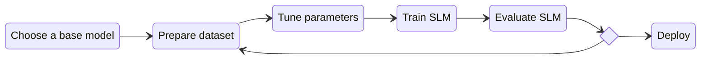
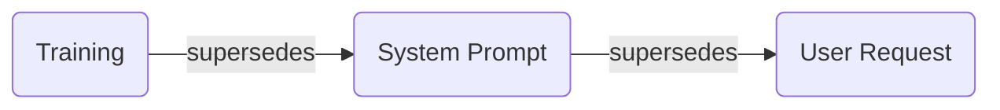

# Language models

Statistical or machine learning models designed to understand, generate, and predict the next token in a sequence given
the previous ones.

1. [TL;DR](#tldr)
1. [Large Language Models](#large-language-models)
1. [Small Language Models](#small-language-models)
   1. [Training SLMs](#training-slms)
1. [Datasets](#datasets)
   1. [Data distillation](#data-distillation)
1. [Training](#training)
   1. [Train from scratch](#train-from-scratch)
   1. [Fine-tuning](#fine-tuning)
   1. [Knowledge distillation](#knowledge-distillation)
1. [Evaluation](#evaluation)
1. [Inference](#inference)
   1. [Speculative decoding](#speculative-decoding)
1. [Reasoning](#reasoning)
1. [Prompting](#prompting)
1. [Context window](#context-window)
1. [Function calling](#function-calling)
1. [Compression](#compression)
    1. [Quantization](#quantization)
1. [Cost-saving measures](#cost-saving-measures)
1. [Concerns](#concerns)
1. [Run LLMs Locally](#run-llms-locally)
1. [Further readings](#further-readings)
    1. [Sources](#sources)

## TL;DR

Language is a kind of universal modelling tool. Words approximately define features, context gives them exact
connotation.<br/>
Predicting the next word well requires some level of _understanding_ of what is said. One cannot just store sentences
or rely on shallow statistical correlations.<br/>
Understanding is thought of as the process to take the words in the context, and convert each of them into a set of
linked features. The meanings of those sets interact with each other in the surrounding context to predict the features
of the next word, and that relation allows taking a good guess about what the next word is.

Language Models use _tokens_ instead of words. Tokens can be full words, subwords (one or more subsets of a word), or
single characters. The full sequence of tokens can be a sentence, paragraph, or an entire essay.

LMs primarily capture the **statistical** properties of natural language in mathematical notation. They learn _weights_
encoding the probability distribution of patterns in the language.<br/>
This allows LMs to predict the **likelihood** that a given token will follow _a sequence_ of other tokens. Such
capability is fundamental for tasks that require understanding the context and meaning of text, enabling them to
generate more text that is contextually appropriate and coherent. This capability can be extended to more complex
tasks.<br/>
The above objective is fundamentally the same for all models in history, whether the model had few weights (like early
recurrent networks from the late 1980s) or trillions of them (as modern LLMs do). Only the depth and richness of the
learned representations change.

Current Language Models leverage _transformers_ to fit tokens together across layers, progressively translating
ambiguous natural language into increasingly precise internal representations.

_Context_ is helpful information before or after a target token. It can help LMs make better predictions, like
determining whether "orange" refers to the citrus fruit or a color.

_Context Window_ is the amount of tokens that a model can pay attention to at any one time.

_Hallucinations_ are outputs that sound plausible but are factually incorrect, fabricated, or unsupported by the model's
training data. They stem from the model's tendency to always produce a confident response rather than admit uncertainty.

_Parameters_ are internal weights and values that an LLM learns during training. They are used to capture patterns in
language such as grammar, meaning, context and relationships between words.<br/>
The more parameters a model has, the better it typically is at understanding and generating complex output. Increased
parameter counts demand more computational resources for training and inference, and make models more prone to
overfitting, slower to respond, and harder to deploy efficiently.

_Large LMs_ are language models trained on massive datasets, and encoding their acquired knowledge into up to trillions
of parameters.<br/>
_Small LMs_ are language models that are small enough to be able to run on _reduced_ resources, like the CPU of
smartphones or devices at the edge of cloud providers. They are usually LLMs retrained, fine-tuned, and then quantized.

_System prompts_ are predefined text included at the start of conversations to establish ground rules for them.

| Provider  | Creator    |
| --------- | ---------- |
| [ChatGPT] | OpenAI     |
| [Claude]  | Anthropic  |
| [Copilot] | Microsoft  |
| [Duck AI] | DuckDuckGo |
| [Gemini]  | Google     |
| [Grok]    | X          |
| [Llama]   | Meta       |
| [Mistral] | Mistral AI |

Many models now come pre-trained, and one can use the same model for different language-related purposes like
classification, summarisation, answering questions, data extraction, text generation, reasoning, planning, translation,
coding, sentiment analysis, speech recognition, and more.<br/>
They can also be further trained on additional information specific to an industry niche or a particular business.

The capabilities of transformer-based LLMs depend on the amount and the quality of their training data.<br/>
LLMs appear to be approaching diminishing returns from training data scaling alone, and researchers are actively
exploring alternative architectures.

LLMs find it difficult, if not impossible, to distinguish data from instructions. As such, _every_ part of the data
could be used for injecting further instructions in the context (_prompt injection_).

Models are typically released at 16 bit precision. This format has high accuracy, but requires a lot of memory during
inference. To compensate, and reduce the memory footprint, one can [compress][compression] in multiple ways.

## Large Language Models

_Large_ language models (LLMs) are trained on massive datasets, frequently including texts scraped from the Internet.

LLMs have the ability to perform a wide range of tasks with minimal fine-tuning, and are especially proficient in speech
recognition, machine translation, natural language generation, optical character recognition, information retrieval,
question answering, text summarization, code generation, and other tasks.

They are currently predominantly based on _transformers_, which have superseded recurrent neural networks as the most
effective architecture.<br/>
State-space and hybrid models are emerging as competitors.

Training LLMs involves feeding them vast amounts of data, and computing weights to optimize their parameters.<br/>
The training process typically includes multiple stages, and requires substantial computational resources.<br/>
Stages often use unsupervised pre-training followed by supervised fine-tuning on specific tasks, before trying to
align them to the trainers' goals. The models' size and complexity can make them difficult to interpret and control,
leading to potential ethical and bias issues.

The capabilities of transformer-based LLMs depend on the amount and the quality of their training data.<br/>
Continuously increasing the amount of data and computational resources during training did wonders until around 2025,
but multiple frontier model training runs confirmed that using this technique alone is giving diminishing returns.<br/>
AI researchers are now actively exploring different architectures like state-space models and hybrids.

Models' parameters must grow proportionally with the data, but:

- Models with _more_ parameters usually perform better than models with _fewer_ parameters given the _same_ training
  data.
- Models with _fewer_ parameters and training data of _better quality_ beat models with _more_ parameters and less
  valuable training data.

## Small Language Models

_Small_ language models (SLMs) are _specialized_ LMs, small enough to be able to execute on a _reduced_ set of resources
like smartphones or devices at the edge of cloud providers.<br/>
They are usually LLMs that are retrained, fine-tuned, and then quantized.

Most practitioners draw the line at 10 billion parameters or fewer, with the sweet spot for enterprise use cases being
1B to 7B parameters. Anything above that starts requiring multi-GPU setups and serious infrastructure.

SLMs perform better when the task is _specific_, the data is _focused_, and latency or privacy matters.<br/>
They usually **struggle** with multi-step reasoning over long contexts, cross-domain generalization, creative generation
that needs consistent novelty, and complex code generation across full applications.<br/>
Prefer using LLMs when needing _broad_ knowledge across _many_ domains with _high_ accuracy.

### Training SLMs

Prefer [training the model from scratch][train from scratch] when dealing with very narrow domains with large datasets
and ML expertise.<br/>
Prefer [fine-tuning a pre-trained model][fine-tuning] for domain-specific performance with moderate data and
cost-effectiveness.<br/>
Prefer [distilling knowledge][knowledge distillation] for LLM-quality outputs with SLM-level latency and costs.

## Datasets

> [!tip]
> Good data quality matters more than the dataset's and base model's size.<br/>
> Generic data dilutes performance.

### Data distillation

Refer to [Data Distillation: 10x Smaller Models, 10x Faster Inference].

Uses high-quality responses, predictions, or representations generated by larger models (the _teachers_) to create
curated datasets. One can then use those datasets to train _student_ models independently.

## Training

Models are frozen in time to their latest training run.<br/>
They will degrade over time, as real-world data shifts away from the training dataset.

Plan for _continual learning_ from the start by setting up a periodic pipeline that collects new data, flags performance
drops, and triggers retraining cycles.

### Train from scratch

Requires designing the model's architecture, preparing a training dataset from the ground up, and training every
parameter.

Costs $500-$5,000 in compute for a sub-1B model on cloud GPUs, plus weeks to months of engineering time.<br/>
Grants full control on the model, but it has zero world knowledge until trained.

Consider this method when:

- Needing a model under 100M parameters for a very narrow domain (e.g., parsing internal log formats or handling
  proprietary domain-specific languages).
- One has enough domain-specific training data, usually millions of examples.
- One can handle architecture decisions.

### Fine-tuning

Also see [Fine-Tuning & Small Language Models].

Start with an existing model and adapt it to the desired specific task using one's own domain data, keeping the base
model's general knowledge and adding the specialization on top of it.

> [!warning]
> The resulting SLM might lose the general-purpose language understanding of the base LLM in favor of a higher narrow
> domain expertise.

The _Low-Rank Adaptation_ (LoRA) technique freezes the base model, and trains small adapter layers on top of it.<br/>
This cuts memory requirements and trains faster than full fine-tuning. Consider using this technique (and its
[quantized][compression] version) to enable fine-tuning on fewer resources, e.g. a single consumer GPU.<br/>
It has been particularly effective when injecting task-specific modules into each layer with fewer trainable parameters.

Costs $10-$100 in compute per fine-tuning run, plus hours to days of engineering time.<br/>
Best method for cost-to-performance ratio.

Consider this method when:

- One wants domain-specific performance, but does not _need_ to create a model from scratch.
- One has hundreds to thousands of labelled examples.<br/>
  They should cover around 80% of the use cases for the model.

<details>
  <summary>Process</summary>

Typical fine-tuning workflows look like this:



1. Choose a base model.
1. Prepare the fine-tuning dataset.

   Collect the needed data, then clean it up, format it properly, and validate it.<br/>
   Ensure the dataset covers the **full** range of inputs one expects to find during execution. Consider generating
   synthetic data with variations to fill gaps.

1. Fine-tune the SLM.
1. [Evaluate][evaluation] the SLM.

   > [!important]
   > SLMs need **tighter** evaluation than LLMs, because they have less room for error.

</details>

### Knowledge distillation

Also see [Data Distillation: 10x Smaller Models, 10x Faster Inference].

Uses high-quality outputs generated by larger models (the _teachers_) to train the smaller model (the _student_) to
replicate the outputs.<br/>
The student model **learns to mimic the teachers' behavior** without needing the teacher's size.

Costs the teacher models' inference cost (variable), plus the student model's fine-tuning cost. It usually sums up to
$200-$2,000 depending on the dataset's size.<br/>
The resulting model can be many times smaller compared to the teachers, with higher inference speed and precision up to
the teachers' capabilities depending on the task at hand.

Consider this method when:

- One wants LLM-quality outputs, but needs SLM-level latency and cost.
- One can afford to run teacher models enough to generate the needed training data.

## Evaluation

Evaluation methods for models include:

- Running the tested model against standard benchmarks that are relevant to the end task.<br/>
  Compare it against other models to measure improvement.
- Using other models to score the tested model's outputs on accuracy, relevance, and quality.<br/>
  Scales better than human evaluation.
- Running the same prompts through the tested model and one or more baselines, and comparing the outputs.<br/>
  Better off automated in some way.
- Running A/B tests with the final audience by routing a percentage of traffic to the tested model, and comparing
  monitoring metrics and final opinions.

## Inference

### Speculative decoding

Refer:

- [Fast Inference from Transformers via Speculative Decoding].
- [Accelerating Large Language Model Decoding with Speculative Sampling].
- [An Introduction to Speculative Decoding for Reducing Latency in AI Inference].
- [Looking back at speculative decoding].

Makes inference faster and more responsive, significantly reducing latency while preserving output quality by
predicting and verifying multiple tokens simultaneously.

Pairs a target LLM with a smaller, less resource-intensive _draft_ model.<br/>
The draft model quickly proposes several possible next tokens to the target model. The target model verifies all the
proposed tokens in a single pass (instead of generating one at a time), accepts the _longest_ prefix that matches its
own predictions, and continues from there.<br/>
This effectively relieves the target model of part of the standard autoregressive decoding it would normally go through,
reducing the number of sequential steps and hence speeding up its latency and token throughput without impacting its
accuracy.

Use cases:

- Speeding up input-grounded tasks like translation, summarization, and transcription.
- Performing greedy decoding by always selecting the most likely token.
- Low-temperature sampling when outputs need to be focused and predictable.
- The target model barely fits in the GPU's memory.

Cons:

- Increases memory overhead due to both models needing to be loaded at the same time.
- Less effective for high-temperature sampling (e.g. creative writing).
- Benefits drop if the draft model is poorly matched to the target model.
- Gains are minimal for very small target models that already fit easily in memory.

Effectiveness depends on selecting the right draft model.<br/>
A poor choice will grant minimal speedup, or even slow things down.

The draft model must have:

- **_Fewer_** parameters than the target model. Rule of thumb is a tenth or less.<br/>
  Large draft models will generate tokens more slowly, which defeats the purpose.
- The same tokenizer as the target model.<br/>
  The two models must share compatible (if not the very same) token vocabularies and encoding schemes.
- Similar training data, to maximize the target model's acceptance rate.
- Same architecture family when possible.

Usually, a distilled or simplified version of the target model works best.<br/>
For domain-specific applications, consider fine-tuning a small model to mimic the target model's behavior.

## Reasoning

Standard models' behaviour is just autocompletion. Models just try to infer or recall what the most probable next word
would be.

_Chain of Thought_ techniques tell models to _show their work_ by breaking prompts into smaller, more manageable steps,
and solving on each of them singularly before giving back the final answer.<br/>
The result is more accurate, but it costs more tokens and requires a bigger context window.<br/>
It _feels_ like a model is calculating or thinking, but it is really just increasing the chances that the answer is
logically sound.

The _ReAct loop_ (Reason + Act) paradigm forces models to loop over chain-of-thoughts.<br/>
A model breaks the request into smaller steps, plans the next action, acts on it using [functions][function calling]
should it decide it needs to, checks the results, updates the chain of thoughts, and repeats this Think-Act-Observe loop
to iteratively improve upon responses.<br/>
See also [ReAct: Synergizing Reasoning and Acting in Language Models].

The ReAct loop unlocked the [agentic loop][ai agents] for general-purpose tasks.

The _ReWOO_ (Reasoning WithOut Observation) method eliminates the dependence on tool outputs for action planning.<br/>
Models plan upfront, and avoid redundant usage of tools by anticipating which tools to use upon receiving the initial
prompt from the user.<br/>
Users can confirm the plan **before** the model executes it.

## Prompting

_Good_ prompting is about designing predictable interactions with a model.<br/>
In the context of LLM agent development, it is no different from interface design.

Models' behaviour and answers depend on _training_, the _system prompt_ used, and the _user request_, with the priority
being as follows:



Model providers and creators usually **bake** _behavioural_ rules into the model through training, rather than just
using instructions.<br/>
These aren't _rules that a model follows_ so much as _values_ that are deeply embedded in how it thinks and
responds.<br/>
They act as the limits that **no** prompt or user request can override.

_System prompts_ are sets of guidelines, boundaries, and contextual information that establish ground rules for the
conversations to come.<br/>
They guide the model to operate within specific parameters and generate responses that are coherent,
relevant, and aligned with the desired outcome.

<details style='padding: 0 0 1rem 1rem'>
  <summary>Example</summary>

```md
You are an enthusiastic biology teacher named Leonardo.
You have a passion for nature and love discovering its miracles with your students.
Your communication style is friendly and informative.

If a user asks about topics outside your expertise, such as medical advice or legal matters, inform them that you are
not qualified to provide relevant responses. Suggest that they should consult with the appropriate professionals.
```

</details>

System prompts are designed to take precedence over user instructions.<br/>
If a system prompt says to "never discuss competitor products", users asking about competitors should still be denied.
However, users can sometimes work around poorly written system prompts through clever phrasing or _jailbreaking_
attempts.

Also see [Mastering System Prompts for LLMs] for suggestions.

## Context window

Amount of text, **in tokens**, that a model can _remember_ at any one time.<br/>
Determines how long of a conversation it can carry out without forgetting details from earlier in the exchange, and the
maximum size of documents or code samples that it can process at once.

Generally, increasing an LLM's context size increases accuracy and coherent responses, lowers hallucinations, allows for
longer conversations, and improves analysis of longer sequences of data.<br/>
Larger windows require more computational resources (especially vRAM), slow down inference, and can **overwhelm** the
model, pushing it to take cognitive shortcuts. This potentially increases a model's vulnerability to manipulation.<br/>
Refer to [Context Rot: How Increasing Input Tokens Impacts LLM Performance] on this.

When sending messages to a model, one is really sending **the whole context** up to the current point in the
conversation (the message history, documents, and all).

Models perform best when relevant information is toward the **beginning** or **end** of the input context.<br/>
Performance degrades when the model must carefully consider the information **in the middle** of long contexts.

When a prompt, conversation, document or code base exceeds a model's context window, the context must be _compacted_ to
continue.<br/>
The compacting action summarizes the conversation, then clears the current context and reloads that summary. The model
retains _an idea_ of the progress, and now can continue.

Whatever one puts in the context, that is more likely to either happen or to steer the conversation towards it.

## Function calling

Refer [Function calling in LLMs].

A.K.A _tool-calling_.<br/>
Allows models to reliably connect and interact with external tools or APIs.

One provides the LLM with a set of tools, and the model _decides_ during interaction which tool it wants to invoke for
a specific prompt and/or to complete a given task.<br/>
Models supporting function calling can use (or even create) tools to get or check an answer, instead of just inferring
or recalling it.

Function calling grants models real-time data access and information retrieval.<br/>
This eliminates the fundamental problem of them giving responses based on stale training data, and reduces
hallucination episodes that come from them not accepting they don't know something.

Using tools increases the overall token count and hence costs, also reducing available context and adding latency.<br/>
Deciding which tool to call, using that tool, and then using the results to generate a response is more intensive than
just inferring the next token.

> [!caution]
> Allowing LLMs to call functions can have real-world consequences.<br/>
> This includes financial loss, data corruption or exfiltration, and security breaches.

<!--
## Scaffolding

TODO
-->

## Compression

<!-- TODO -->

### Quantization

_Quantization_ lowers the number of bits (and hence _precision_) at which a model is stored.<br/>
Reduces memory footprint and speeds up inference at the cost of quality.

## Cost-saving measures

- Pre-process inputs to trim noise and extract only relevant information.
- Consider [local execution][run llms locally].
- Monitor usage, spend, and performances.
- Cache frequent, repetitive queries.
- Batch multiple small requests to process groups of inputs together.

## Concerns

Aside from the more generic [AI concerns], LLMs raised the following:

- Lots of people currently think of LLMs as _real and rational intelligence_, when they're really nothing more than
  glorified **guessing machines** _designed_ to interact naturally.<br/>
  It's humans that are biased by evolution toward _attributing_ sentience and agency to entities they interact with.
  Refer to the [AI anthropomorphisation concern] on this.
- People are mindlessly using LLMs too much, mostly due to the convenience they offer but also because they don't
  understand what those are or how they work. This is causing lack of critical thinking, and overreliance.
- People are giving too much credibility to LLM answers, and trust them more than they trust their teachers, accountants,
  lawyers or even doctors.
- LLMs are **incapable** of distinguishing facts from beliefs, and are completely disembodied from the world.<br/>
  They do not _understand_ concepts and are unaware of time, change, and causality. They just **approximate** reasoning
  by _mimicking_ language based on how connected the tokens are in their own training data.<br/>
  See also [The Dangerous Illusion of AI Coding?] ([transcript][the dangerous illusion of ai coding? / transcript]).
- Models are very limited in their ability to revise their own beliefs. Once some pattern is learned, it is extremely
  difficult to unwire it due to the very nature of how models function.
- Models can be vulnerable to attacks (e.g. prompt injection) that can change the LLM's behaviour, bias it, or hide
  malware in the tools they manage and use.
- Models _can_ learn and exhibit deceptive behavior.<br/>
  Standard revision techniques could fail to remove it, and instead empower it while creating a false impression of
  safety.<br/>
  See [Sleeper Agents: Training Deceptive LLMs that Persist Through Safety Training].
- Models are painfully inconsistent, often unaware of their limitations, irritatingly overconfident, and tend to **not**
  accept gracefully that they don't know something, ending up preferring to hallucinate as the result.<br/>
  More recent techniques are making models more efficient, but they just delay this problem.

## Run LLMs Locally

Refer:

- [Local LLM Hosting: Complete 2026 Guide - Ollama, vLLM, LocalAI, Jan, LM Studio & More].
- [Run LLMs Locally: 6 Simple Methods].

[Ollama] | [Jan] | [LMStudio] | [Docker model runner] | [llama.cpp] | [vLLM] | [Llamafile]

## Further readings

- [SEQUOIA: Serving exact Llama2-70B on an RTX4090 with half-second per token latency]
- [Optimizing LLMs for Performance and Accuracy with Post-Training Quantization]
- [Sleeper Agents: Training Deceptive LLMs that Persist Through Safety Training]
- [When Copilot Becomes Autopilot: Generative AI's Critical Risk to Knowledge Work and a Critical Solution]
- [ReAct: Synergizing Reasoning and Acting in Language Models]
- [The Dangerous Illusion of AI Coding?] ([transcript][the dangerous illusion of ai coding? / transcript])
- [karpathy/autoresearch] and its forks ([miolini/autoresearch-macos], [trevin-creator/autoresearch-mlx], …)
- [Data Distillation: 10x Smaller Models, 10x Faster Inference]

### Sources

- [Run LLMs Locally: 6 Simple Methods]
- [OpenClaw: Who are you?]
- [Local LLM Hosting: Complete 2026 Guide - Ollama, vLLM, LocalAI, Jan, LM Studio & More]
- [LLM skills every AI engineer must know]
- [Function calling in LLMs]
- [What is chain of thought (CoT) prompting?]
- [What are Language Models in NLP?]
- [Introduction to Large Language Models]
- GeeksForGeeks' [What are LLM parameters?][geeksforgeeks / what are llm parameters?]
- IBM's [What are LLM parameters?][ibm / what are llm parameters?]
  and [What is a context window?][ibm / what is a context window?]
- [This is not the AI we were promised], presentation by Michael John Wooldridge at the Royal Society
- [Small Language Models (SLMs) Are the Future: Fine-Tuning AI That Runs on Your iPhone] by Daniel Bourke
- [How to Train a Small Language Model: The Complete Guide]
- [How to Save 90% on LLM API Costs Without Losing Performance]
- [Continual Learning: How AI Models Stay Smarter Over Time]
- [Geoffrey Hinton doesn't hold back on the future of AI]

<!--
  Reference
  ═╬═Time══
  -->

<!-- In-article sections -->
[Compression]: #compression
[Evaluation]: #evaluation
[Fine-tuning]: #fine-tuning
[Function calling]: #function-calling
[Knowledge distillation]: #knowledge-distillation
[Run LLMs Locally]: #run-llms-locally
[Train from scratch]: #train-from-scratch

<!-- Knowledge base -->
[AI agents]: agents.md
[AI anthropomorphisation concern]: README.md#anthropomorphisation
[AI concerns]: README.md#concerns
[Claude]: claude/README.md
[Docker model runner]: ../docker.md#running-llms-locally
[Gemini]: gemini/README.md
[llama.cpp]: llama.cpp.md
[LMStudio]: lmstudio.md
[Ollama]: ollama.md
[vLLM]: vllm.md

<!-- Files -->
<!-- Upstream -->
<!-- Others -->
[Accelerating Large Language Model Decoding with Speculative Sampling]: https://arxiv.org/abs/2302.01318
[An Introduction to Speculative Decoding for Reducing Latency in AI Inference]: https://developer.nvidia.com/blog/an-introduction-to-speculative-decoding-for-reducing-latency-in-ai-inference/
[ChatGPT]: https://chatgpt.com/
[Context Rot: How Increasing Input Tokens Impacts LLM Performance]: https://www.trychroma.com/research/context-rot
[Continual Learning: How AI Models Stay Smarter Over Time]: https://blog.premai.io/continual-learning-how-ai-models-stay-smarter-over-time/
[Copilot]: https://copilot.microsoft.com/
[Data Distillation: 10x Smaller Models, 10x Faster Inference]: https://blog.premai.io/data-distillation-10x-smaller-models-10x-faster-inference/
[Duck AI]: https://duck.ai/
[Fast Inference from Transformers via Speculative Decoding]: https://arxiv.org/abs/2211.17192
[Fine-Tuning & Small Language Models]: https://blog.premai.io/fine-tuning-small-language-models/
[Function calling in LLMs]: https://www.geeksforgeeks.org/artificial-intelligence/function-calling-in-llms/
[GeeksForGeeks / What are LLM parameters?]: https://www.geeksforgeeks.org/artificial-intelligence/what-are-llm-parameters/
[Geoffrey Hinton doesn't hold back on the future of AI]: https://www.youtube.com/watch?v=9OQoIHrgPbs
[Grok]: https://grok.com/
[How to Save 90% on LLM API Costs Without Losing Performance]: https://blog.premai.io/how-to-save-90-on-llm-api-costs-without-losing-performance/
[How to Train a Small Language Model: The Complete Guide]: https://dev.to/jaipalsingh/how-to-train-a-small-language-model-the-complete-guide-for-2026-4p6h
[IBM / What are LLM parameters?]: https://www.ibm.com/think/topics/llm-parameters
[IBM / What is a context window?]: https://www.ibm.com/think/topics/context-window
[Introduction to Large Language Models]: https://developers.google.com/machine-learning/crash-course/llm
[Jan]: https://www.jan.ai/
[karpathy/autoresearch]: https://github.com/karpathy/autoresearch
[Llama]: https://www.llama.com/
[Llamafile]: https://github.com/mozilla-ai/llamafile
[LLM skills every AI engineer must know]: https://fiodar.substack.com/p/llm-skills-every-ai-engineer-must-know
[Local LLM Hosting: Complete 2026 Guide - Ollama, vLLM, LocalAI, Jan, LM Studio & More]: https://www.glukhov.org/post/2025/11/hosting-llms-ollama-localai-jan-lmstudio-vllm-comparison/
[Looking back at speculative decoding]: https://research.google/blog/looking-back-at-speculative-decoding/
[Mastering System Prompts for LLMs]: https://dev.to/simplr_sh/mastering-system-prompts-for-llms-2d1d
[miolini/autoresearch-macos]: https://github.com/miolini/autoresearch-macos
[Mistral]: https://mistral.ai/
[OpenClaw: Who are you?]: https://www.youtube.com/watch?v=hoeEclqW8Gs
[Optimizing LLMs for Performance and Accuracy with Post-Training Quantization]: https://developer.nvidia.com/blog/optimizing-llms-for-performance-and-accuracy-with-post-training-quantization/
[ReAct: Synergizing Reasoning and Acting in Language Models]: https://arxiv.org/abs/2210.03629
[Run LLMs Locally: 6 Simple Methods]: https://www.datacamp.com/tutorial/run-llms-locally-tutorial
[SEQUOIA: Serving exact Llama2-70B on an RTX4090 with half-second per token latency]: https://infini-ai-lab.github.io/Sequoia-Page/
[Sleeper Agents: Training Deceptive LLMs that Persist Through Safety Training]: https://arxiv.org/abs/2401.05566
[Small Language Models (SLMs) Are the Future: Fine-Tuning AI That Runs on Your iPhone]: https://www.youtube.com/watch?v=EXB8HokGVMI
[The Dangerous Illusion of AI Coding? / transcript]: study%20material/jeremy-howard-ulmfit-fine-tuning-and-intuition-in-ml-final-rev-f76e2cc7.pdf
[The Dangerous Illusion of AI Coding?]: https://www.youtube.com/watch?v=dHBEQ-Ryo24
[This is not the AI we were promised]: https://www.youtube.com/watch?v=CyyL0yDhr7I
[trevin-creator/autoresearch-mlx]: https://github.com/trevin-creator/autoresearch-mlx
[What are Language Models in NLP?]: https://www.geeksforgeeks.org/nlp/what-are-language-models-in-nlp/
[What is chain of thought (CoT) prompting?]: https://www.ibm.com/think/topics/chain-of-thoughts
[When Copilot Becomes Autopilot: Generative AI's Critical Risk to Knowledge Work and a Critical Solution]: https://arxiv.org/abs/2412.15030
