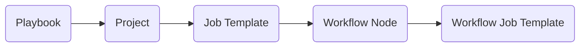

# Ansible AWX

1. [Gotchas](#gotchas)
1. [Instance setup](#instance-setup)
   1. [Deployment](#deployment)
   1. [Update](#update)
   1. [Removal](#removal)
   1. [Testing](#testing)
1. [Jobs execution](#jobs-execution)
1. [Workflow automation](#workflow-automation)
1. [API](#api)
1. [Further readings](#further-readings)
   1. [Sources](#sources)

## Gotchas

- When one does **not** define values in a resource, it will use the setting defined by the underlying dependency (if
  any).<br/>
  E.g.: not setting a schedule's `job_type` (or setting it to `null`) makes the job it starts use the job template's
  `job_type` setting.

- Consider using only AMD64 nodes to host the containers for AWX instances.

  As of 2024-04-11, AWX does **not** appear to provide ARM64 images for all its containers.<br/>
  One'll need to build their own missing ARM64 images and specify those during deployment. Good luck with that!

- K8S tolerations set in AWX custom resources only affect K8S-based AWX instances' deployments.<br/>
  They are **not** applied to other resources like automation Jobs.

  <details style='padding: 0 0 1rem 1rem'>

  Jobs' specific K8S settings need to be configured in the `pod_spec_override` attribute of Instance Groups of type
  _Container Group_:

  ```yaml
  ---
  # awx instance_groups get 'default' -f 'yaml'
  …
  pod_spec_override: |
    apiVersion: v1
    kind: Pod
    metadata:
      namespace: awx
      spec:
        …
        containers:
          - …
            image: 012345678901.dkr.ecr.eu-west-1.amazonaws.com/custom/awx-ee:latest
            resources:
              requests:
                cpu: 250m
                memory: 100Mi
              limits:
                cpu: 1930m
                memory: 3297Mi
        tolerations:
          - key: org.example.k8s/reservation/app
            operator: Equal
            value: awx
            effect: NoSchedule
          - key: org.example.k8s/awx/component
            operator: Equal
            value: job
            effect: NoSchedule
        affinity:
          nodeAffinity:
            requiredDuringSchedulingIgnoredDuringExecution:
              nodeSelectorTerms:
                - matchExpressions:
                  - key: org.example.k8s/reservation/app
                    operator: In
                    values:
                      - awx
            preferredDuringSchedulingIgnoredDuringExecution:
              - weight: 10
                preference:
                  matchExpressions:
                    - key: org.example.k8s/awx/component
                      operator: In
                      values:
                        - job
  ```

  </details>

## Instance setup

### Deployment

Starting from version 18.0, the [AWX Kubernetes Operator][operator's documentation] is the preferred way to deploy
AWX instances.<br/>
It is meant to provide a Kubernetes-native installation method for AWX via the `AWX` Custom Resource Definition (CRD).

Deploying AWS instances is just a matter of:

1. Installing the operator on the K8S cluster.<br/>
   Make sure to include Ansible's CRDs.
1. Create a resource of kind `AWX`.

Whenever a resource of the `AWX` kind is created, the [kubernetes operator] executes an Ansible role that creates all
the other resources an AWX instance requires to start in the cluster.<br/>
See [Iterating on the installer without deploying the operator].

The operator _can_ be configured to automatically deploy a default AWX instance once running, but its input options are
limited. This prevents changing specific settings for the AWX instance one might need to set.<br/>
Creating resources of the `AWX` kind, instead, allows to include their specific configuration, and hence for more of its
settings to be customized. It should™ also be less prone to deployment errors.

Requirements:

- An existing K8S cluster with AMD64 nodes (see [Gotchas]).
- A DB instance, either in the cluster or external to it.<br/>
  If internal, one shall be able to create PersistentVolumeClaims and PersistentVolumes in the cluster for it (unless
  data persistence is not a wanted feature).
- The ability for the cluster to create load balancers (if setting the service type to load balancer).

<details style='padding-top: 1em'>
<summary>Deploy the operator with <code>kustomize</code></summary>

```sh
$ mkdir -p '/tmp/awx'
$ cd '/tmp/awx'

# Specify the version tag to use
/tmp/awx$ cat <<EOF > 'kustomization.yaml'
---
apiVersion: kustomize.config.k8s.io/v1beta1
kind: Kustomization
namespace: awx
resources:
  - github.com/ansible/awx-operator/config/default?ref=2.14.0
    # https://github.com/ansible/awx-operator/releases
EOF

# Start the operator
/tmp/awx$ kubectl apply -k '.'
namespace/awx created
…
deployment.apps/awx-operator-controller-manager created
/tmp/awx$ kubectl -n 'awx' get pods
NAME                                              READY   STATUS    RESTARTS   AGE
awx-operator-controller-manager-8b7dfcb58-k7jt8   2/2     Running   0          10m
```

</details>

<details>
<summary>Deploy the operator with <code>helm</code></summary>

```sh
# Add the operator's repository.
$ helm repo add 'awx-operator' 'https://ansible.github.io/awx-operator/'
"awx-operator" has been added to your repositories
$ helm repo update 'awx-operator'
Hang tight while we grab the latest from your chart repositories...
...Successfully got an update from the "awx-operator" chart repository
Update Complete. ⎈Happy Helming!⎈

$ helm search repo 'awx-operator'
NAME                            CHART VERSION   APP VERSION     DESCRIPTION
awx-operator/awx-operator       2.14.0          2.14.0          A Helm chart for the AWX Operator

# Install the operator.
$ helm -n 'awx' upgrade -i --create-namespace 'my-awx-operator' 'awx-operator/awx-operator' --version '2.14.0'
Release "my-awx-operator" does not exist. Installing it now.
NAME: my-awx-operator
LAST DEPLOYED: Mon Apr  8 15:34:00 2024
NAMESPACE: awx
STATUS: deployed
REVISION: 1
TEST SUITE: None
NOTES:
AWX Operator installed with Helm Chart version 2.14.0
$ kubectl -n 'awx' get pods
NAME                                               READY   STATUS      RESTARTS   AGE
awx-operator-controller-manager-75b667b745-g9g9c   2/2     Running     0          17m
```

</details>

<details style='padding-bottom: 1rem'>
<summary>Deploy the operator with a kustomized Helm chart</summary>

```sh
$ mkdir -p '/tmp/awx'
$ cd '/tmp/awx'

/tmp/awx$ cat <<EOF > 'namespace.yaml'
---
apiVersion: v1
kind: Namespace
metadata:
  name: awx
EOF
/tmp/awx$ cat <<EOF > 'kustomization.yaml'
---
apiVersion: kustomize.config.k8s.io/v1beta1
kind: Kustomization
namespace: awx
helmCharts:
  - name: awx-operator
    repo: https://ansible.github.io/awx-operator/
    version: 2.19.0
    releaseName: awx-operator
    includeCRDs: true  # Important. Not namespaced. Watch out upon removal.
resources:
  - namespace.yaml
EOF

# Start the operator
/tmp/awx$ helm repo add 'awx-operator' 'https://ansible.github.io/awx-operator/'
/tmp/awx$ kubectl kustomize --enable-helm '.' | kubectl apply -f -
namespace/awx created
…
deployment.apps/awx-operator-controller-manager created
/tmp/awx$ kubectl -n 'awx' get pods
NAME                                              READY   STATUS    RESTARTS   AGE
awx-operator-controller-manager-8b7dfcb58-k7jt8   2/2     Running   0          10m
```

</details>

Once the operator is installed, AWX instances can be created by leveraging the `AWX` CRD.

<details style='padding-left: 1rem'>
<summary>Basic definition for a quick testing instance</summary>

```yaml
---
apiVersion: awx.ansible.com/v1beta1
kind: AWX
metadata:
  name: awx-demo
spec:
  no_log: false
  service_type: NodePort
  node_selector: |
    kubernetes.io/arch: amd64
```

</details>

<details style='padding: 0 0 1rem 1rem'>
<summary>Definition for an instance on AWS' EKS</summary>

```yaml
---
apiVersion: awx.ansible.com/v1beta1
kind: AWX
metadata:
  name: awx
spec:
  no_log: false
  admin_email: infra@example.org
  postgres_configuration_secret: awx-postgres-configuration
  node_selector: |
    kubernetes.io/arch: amd64
  service_type: LoadBalancer
  ingress_type: ingress
  ingress_annotations: |
    kubernetes.io/ingress.class: alb
```

</details>

Due to the operator being the one creating its resources, one's control is limited to what one can define in the AWX
resource's `spec` key.<br/>
See the [installer role's defaults] and any page under the _Advanced configuration_ section in the
[operator's documentation] for details.

Useful specs:

| Spec               | Description                                               | Reason                                                 |
| ------------------ | --------------------------------------------------------- | ------------------------------------------------------ |
| `no_log: false`    | See resource creation tasks' output in the operators'logs | Debug                                                  |
| `node_selector: …` | Select nodes to run on                                    | Use only specific nodes (see warning at the beginning) |

<details style="padding-top: 1em;">
<summary>Deploy AWX instances with <code>kubectl</code></summary>

```sh
$ cd '/tmp/awx'
/tmp/awx$ kubectl apply -f 'awx-demo.yaml'
```

</details>

<details>
  <summary>Deploy AWX instances with <code>kustomize</code></summary>

```sh
$ cd '/tmp/awx'

/tmp/awx$ yq -iy '.resources+=["awx-demo.yaml"]' 'kustomization.yaml'
/tmp/awx$ kubectl apply -k '.'
```

</details>

<details style='padding-bottom: 1rem'>
  <summary>Deploy AWX instances using the operator's helm chart's integrated definition</summary>

```sh
# Update the operator by telling it to also deploy the AWX instance.
$ helm -n 'awx' upgrade -i --create-namespace 'my-awx-operator' 'awx-operator/awx-operator' --version '2.14.0' \
  --set 'AWX.enabled=true' --set 'AWX.name=awx-demo'
Release "my-awx-operator" has been upgraded. Happy Helming!
NAME: my-awx-operator
LAST DEPLOYED: Mon Apr  8 15:37:47 2024
NAMESPACE: awx
STATUS: deployed
REVISION: 2
TEST SUITE: None
NOTES:
AWX Operator installed with Helm Chart version 2.14.0
$ kubectl -n 'awx' get pods
NAME                                               READY   STATUS      RESTARTS   AGE
awx-demo-migration-24.1.0-qhbq2                    0/1     Completed   0          12m
awx-demo-postgres-15-0                             1/1     Running     0          13m
awx-demo-task-87756dfbc-chx9t                      4/4     Running     0          12m
awx-demo-web-69d6d5d6c-wdxlv                       3/3     Running     0          12m
awx-operator-controller-manager-75b667b745-g9g9c   2/2     Running     0          17m
```

</details>

The default user is `admin`.<br/>
Get the password from the `{instance}-admin-password` secret:

```sh
$ kubectl -n 'awx' get secret 'awx-demo-admin-password' -o jsonpath="{.data.password}" | base64 --decode
L2ZUgNTwtswVW3gtficG1Hd443l3Kicq
```

Connect to the instance once it is up:

```sh
kubectl -n 'awx' port-forward 'service/awx-service' '8080:http'
open 'http://localhost:8080'
```

### Update

The documentation suggests to:

1. Temporarily set up the operator to automatically update any AWX instance it manages.
1. Delete the AWX instance resource.<br/>
   This will force the operator to pull fresh, updated images for the new deployment.
1. Restore the operator's settings to the previous version.

### Removal

Remove the `AWX` resource associated to the instance to delete it:

```sh
$ kubectl delete awx 'awx-demo'
awx.awx.ansible.com "awx-demo" deleted
```

Remove the operator if not needed anymore:

```sh
# Using `kustomize`
kubectl delete -k '/tmp/awx'

# Using `helm`
helm -n 'awx' uninstall 'my-awx-operator'

# Using the kustomized helm chart
kubectl kustomize --enable-helm '.' | kubectl delete -f -
```

Eventually, remove the namespace too to clean all things up:

```sh
kubectl delete ns 'awx'
```

### Testing

<details>
<summary>Run: follow the basic installation guide</summary>

[Guide][basic install]

  <details style="margin-left: 1em;">
  <summary>
    1. ARM, Mac OS X, <code>minikube</code>, <code>kustomize</code>: failed: ARM images for AWX not available
  </summary>

```sh
$ minikube start --cpus=4 --memory=6g --addons=ingress
…
🌟  Enabled addons: storage-provisioner, default-storageclass, ingress
🏄  Done! kubectl is now configured to use "minikube" cluster and "default" namespace by default

$ mkdir -p '/tmp/awx'
$ cd '/tmp/awx'

$ # There was no ARM version of the 'kube-rbac-proxy' image upstream, so it was impossible to just use the `make deploy`
$ # command as explained in the basic install.
$ # Defaulting to use 'quay.io' as repository as the ARM version of that image is available there.
$ cat <<EOF > 'kustomization.yaml'
---
apiVersion: kustomize.config.k8s.io/v1beta1
kind: Kustomization
namespace: awx
resources:
  - github.com/ansible/awx-operator/config/default?ref=2.14.0
    # https://github.com/ansible/awx-operator/releases
images:
  - name: quay.io/ansible/awx-operator
    newTag: 2.14.0   # same as awx-operator in resources
  - name: gcr.io/kubebuilder/kube-rbac-proxy
    # no ARM version upstream, defaulting to quay.io
    newName: quay.io/brancz/kube-rbac-proxy
    newTag: v0.16.0-arm64
EOF
$ kubectl apply -k '.'
namespace/awx created
…
deployment.apps/awx-operator-controller-manager created
$ kubectl -n 'awx' get pods
NAME                                              READY   STATUS    RESTARTS   AGE
awx-operator-controller-manager-8b7dfcb58-k7jt8   2/2     Running   0          3m42s

$ cat <<EOF > 'awx-demo.yaml'
---
apiVersion: awx.ansible.com/v1beta1
kind: AWX
metadata:
  name: awx-demo
spec:
  service_type: nodeport
EOF
$ yq -iy '.resources+=["awx-demo.yaml"]' 'kustomization.yaml'
$ kubectl apply -k '.'  # this failed because awx has no ARM images yet

$ # Fine. I'll do it myself.
$ git clone 'https://github.com/ansible/awx.git'
$ cd 'awx'
$ make awx-kube-build
…
ERROR: failed to solve: process "/bin/sh -c make sdist && /var/lib/awx/venv/awx/bin/pip install dist/awx.tar.gz" did not complete successfully: exit code: 2
make: *** [awx-kube-build] Error 1
$ # (ノಠ益ಠ)ノ彡┻━┻
```

  </details>
  <details style="margin-left: 1em;">
  <summary>2. AMD64, OpenSUSE Leap 15.5, <code>minikube</code>, <code>kustomize</code></summary>

```sh
$ minikube start --cpus=4 --memory=6g --addons=ingress
😄  minikube v1.29.0 on Opensuse-Leap 15.5
…
🌟  Enabled addons: storage-provisioner, default-storageclass, ingress
🏄  Done! kubectl is now configured to use "minikube" cluster and "default" namespace by default

$ mkdir -p '/tmp/awx'
$ cd '/tmp/awx'

$ # Simulating the need to use a custom repository for the sake of testing, so I cannot just use the `make deploy`
$ # command as explained in the basic install.
$ # In this case, the repository will be 'quay.io'.
$ cat <<EOF > 'kustomization.yaml'
---
apiVersion: kustomize.config.k8s.io/v1beta1
kind: Kustomization
namespace: awx
resources:
  - github.com/ansible/awx-operator/config/default?ref=2.14.0
    # https://github.com/ansible/awx-operator/releases
images:
  - name: quay.io/ansible/awx-operator
    newTag: 2.14.0   # same as awx-operator in resources
EOF
$ minikube kubectl -- apply -k '.'
namespace/awx created
…
deployment.apps/awx-operator-controller-manager created
$ minikube kubectl -- -n 'awx' get pods
NAME                                               READY   STATUS    RESTARTS   AGE
awx-operator-controller-manager-75b667b745-hjfc7   2/2     Running   0          3m43s

$ cat <<EOF > 'awx-demo.yaml'
---
apiVersion: awx.ansible.com/v1beta1
kind: AWX
metadata:
  name: awx-demo
spec:
  service_type: nodeport
EOF
$ yq -iy '.resources+=["awx-demo.yaml"]' 'kustomization.yaml'
$ minikube kubectl -- apply -k '.'
serviceaccount/awx-operator-controller-manager unchanged
…
deployment.apps/awx-operator-controller-manager unchanged
awx.awx.ansible.com/awx-demo created
$ minikube kubectl -- -n 'awx' get podsminikube kubectl -- -n 'awx' get pods
NAME                                               READY   STATUS      RESTARTS   AGE
awx-demo-migration-24.1.0-kqxcj                    0/1     Completed   0          9s
awx-demo-postgres-15-0                             1/1     Running     0          61s
awx-demo-task-7fcbb46c5d-ckf9d                     4/4     Running     0          48s
awx-demo-web-58668794c8-rfd7d                      3/3     Running     0          49s
awx-operator-controller-manager-75b667b745-hjfc7   2/2     Running     0          93s

$ # Default user is 'admin'.
$ minikube kubectl -- -n 'awx' get secret 'awx-demo-admin-password' -o jsonpath="{.data.password}" | base64 --decode
L2ZUgNTwtswVW3gtficG1Hd443l3Kicq
$ xdg-open $(minikube service -n 'awx' 'awx-demo-service' --url)

$ minikube kubectl -- delete -k '.'
```

  </details><br/>
</details>

<details>
<summary>Run: follow the helm installation guide</summary>

[Guide][helm install on existing cluster]

  <details style="margin-left: 1em;">
  <summary>1. AMD64, OpenSUSE Leap 15.5, <code>minikube</code>, <code>helm</code></summary>

```sh
$ minikube start --cpus=4 --memory=6g --addons=ingress
😄  minikube v1.29.0 on Opensuse-Leap 15.5
…
🌟  Enabled addons: storage-provisioner, default-storageclass, ingress
🏄  Done! kubectl is now configured to use "minikube" cluster and "default" namespace by default

$ helm repo add 'awx-operator' 'https://ansible.github.io/awx-operator/'
"awx-operator" has been added to your repositories
$ helm repo update 'awx-operator'
Hang tight while we grab the latest from your chart repositories...
...Successfully got an update from the "awx-operator" chart repository
Update Complete. ⎈Happy Helming!⎈

$ helm search repo 'awx-operator'
NAME                            CHART VERSION   APP VERSION     DESCRIPTION
awx-operator/awx-operator       2.14.0          2.14.0          A Helm chart for the AWX Operator

$ helm -n 'awx' upgrade -i --create-namespace 'my-awx-operator' 'awx-operator/awx-operator' --version '2.14.0'
Release "my-awx-operator" does not exist. Installing it now.
NAME: my-awx-operator
LAST DEPLOYED: Mon Apr  8 15:34:00 2024
NAMESPACE: awx
STATUS: deployed
REVISION: 1
TEST SUITE: None
NOTES:
AWX Operator installed with Helm Chart version 2.14.0
$ minikube kubectl -- -n 'awx' get pods
NAME                                              READY   STATUS    RESTARTS   AGE
awx-operator-controller-manager-8b7dfcb58-k7jt8   2/2     Running   0          3m

$ helm -n 'awx' upgrade -i --create-namespace 'my-awx-operator' 'awx-operator/awx-operator' --version '2.14.0' \
  --set 'AWX.enabled=true' --set 'AWX.name=awx-demo'
Release "my-awx-operator" has been upgraded. Happy Helming!
NAME: my-awx-operator
LAST DEPLOYED: Mon Apr  8 15:37:47 2024
NAMESPACE: awx
STATUS: deployed
REVISION: 2
TEST SUITE: None
NOTES:
AWX Operator installed with Helm Chart version 2.14.0
$ minikube kubectl -- -n 'awx' get pods
NAME                                              READY   STATUS      RESTARTS   AGE
awx-demo-migration-24.1.0-qhbq2                   0/1     Completed   0          12m
awx-demo-postgres-15-0                            1/1     Running     0          13m
awx-demo-task-87756dfbc-chx9t                     4/4     Running     0          12m
awx-demo-web-69d6d5d6c-wdxlv                      3/3     Running     0          12m
awx-operator-controller-manager-8b7dfcb58-k7jt8   2/2     Running     0          17m

$ # Default user is 'admin'.
$ minikube kubectl -- -n 'awx' get secret 'awx-demo-admin-password' -o jsonpath="{.data.password}" | base64 --decode
PoU9pFR2J5oFqymgX9I3I8swFgfZVkam
$ xdg-open $(minikube service -n 'awx' 'awx-demo-service' --url)

$ helm -n 'awx' uninstall 'my-awx-operator'
$ minikube kubectl -- delete ns 'awx'
```

  </details><br/>
</details>

<details>
<summary>Run: kustomized helm chart</summary>

> #### Warning
>
> Remember to include the CRDs from the helm chart.

  <details style="margin-left: 1em">
  <summary>1. AMD64, OpenSUSE Leap 15.5, <code>minikube</code></summary>

```sh
$ minikube start --cpus=4 --memory=6g --addons=ingress
😄  minikube v1.29.0 on Opensuse-Leap 15.5
…
🌟  Enabled addons: storage-provisioner, default-storageclass, ingress
🏄  Done! kubectl is now configured to use "minikube" cluster and "default" namespace by default

$ mkdir -p '/tmp/awx'
$ cd '/tmp/awx'

$ cat <<EOF > 'namespace.yaml'
---
apiVersion: v1
kind: Namespace
metadata:
  name: awx
EOF
$ cat <<EOF > 'kustomization.yaml'
---
apiVersion: kustomize.config.k8s.io/v1beta1
kind: Kustomization
namespace: awx
resources:
  - namespace.yaml
helmCharts:
  - name: awx-operator
    repo: https://ansible.github.io/awx-operator/
    version: 2.14.0
    releaseName: awx-operator
    includeCRDs: true
EOF
$ minikube kubectl -- apply -f <(minikube kubectl -- kustomize --enable-helm)
namespace/awx created
customresourcedefinition.apiextensions.k8s.io/awxbackups.awx.ansible.com created
…
deployment.apps/awx-operator-controller-manager created
$ minikube kubectl -- -n 'awx' get pods
NAME                                               READY   STATUS    RESTARTS   AGE
awx-operator-controller-manager-787d4945fb-fdffx   2/2     Running   0          3m36s

$ cat <<EOF > 'awx-demo.yaml'
---
apiVersion: awx.ansible.com/v1beta1
kind: AWX
metadata:
  name: awx-demo
spec:
  service_type: nodeport
EOF
$ yq -iy '.resources+=["awx-demo.yaml"]' 'kustomization.yaml'
$ minikube kubectl -- apply -f <(minikube kubectl -- kustomize --enable-helm)
namespace/awx unchanged
…
deployment.apps/awx-operator-controller-manager unchanged
awx.awx.ansible.com/awx-demo created
$ minikube kubectl -- -n 'awx' get pods
NAME                                               READY   STATUS      RESTARTS   AGE
awx-demo-migration-24.1.0-zwv8w                    0/1     Completed   0          115s
awx-demo-postgres-15-0                             1/1     Running     0          10m
awx-demo-task-9c4655cb9-cmz87                      4/4     Running     0          8m3s
awx-demo-web-77f65cc65f-qhqrm                      3/3     Running     0          8m4s
awx-operator-controller-manager-787d4945fb-fdffx   2/2     Running     0          14m

$ # Default user is 'admin'.
$ minikube kubectl -- -n 'awx' get secret 'awx-demo-admin-password' -o jsonpath="{.data.password}" | base64 --decode
DgHIaA9onZj106osEmvECigzsBqutHqI
$ xdg-open $(minikube service -n 'awx' 'awx-demo-service' --url)

$ minikube kubectl -- delete -f <(minikube kubectl -- kustomize --enable-helm)
```

  </details>

  <details style="margin-left: 1em">
  <summary>1. AMD64, Mac OS X, EKS</summary>

```sh
$ mkdir -p '/tmp/awx'
$ cd '/tmp/awx'

$ cat <<EOF > 'namespace.yaml'
---
apiVersion: v1
kind: Namespace
metadata:
  name: awx
EOF
$ cat <<EOF > 'kustomization.yaml'
---
apiVersion: kustomize.config.k8s.io/v1beta1
kind: Kustomization
namespace: awx
resources:
  - namespace.yaml
helmCharts:
  - name: awx-operator
    repo: https://ansible.github.io/awx-operator/
    version: 2.19.1
    releaseName: awx-operator
    includeCRDs: true
EOF
$ kubectl kustomize --enable-helm | kubectl apply -f -
namespace/awx created
…
deployment.apps/awx-operator-controller-manager created
$ kubectl get pods -n 'awx'
NAME                                               READY   STATUS    RESTARTS   AGE
awx-operator-controller-manager-3361cfab38-tdgt3   2/2     Running   0          13s

$ cat <<EOF > 'awx-demo.yaml'
---
apiVersion: awx.ansible.com/v1beta1
kind: AWX
metadata:
  name: awx-demo
spec:
  admin_email: me@example.org
  no_log: false
  node_selector: |
    kubernetes.io/arch: amd64
  service_type: LoadBalancer
  ingress_type: ingress
  ingress_annotations: |
    kubernetes.io/ingress.class: alb
EOF
$ yq -iy '.resources+=["awx-demo.yaml"]' 'kustomization.yaml'
$ kubectl kustomize --enable-helm | kubectl apply -f -
namespace/awx unchanged
…
deployment.apps/awx-operator-controller-manager unchanged
awx.awx.ansible.com/awx-demo created
$ kubectl -n 'awx' get pods
NAME                                               READY   STATUS      RESTARTS   AGE
awx-demo-migration-24.1.0-zwv8w                    0/1     Completed   0          115s
awx-demo-postgres-15-0                             1/1     Running     0          10m
awx-demo-task-8e34efc56-w5rc5                      4/4     Running     0          8m3s
awx-demo-web-545gbdgg7b-q2q4m                      3/3     Running     0          8m4s
awx-operator-controller-manager-3361cfab38-tdgt3   2/2     Running     0          14m

$ # Default user is 'admin'.
$ kubectl -n 'awx' get secret 'awx-demo-admin-password' -o jsonpath="{.data.password}" | base64 --decode
IDwYOgL9k2ckaXmqMm6PT4d6TXdJcocd
$ kubectl -n 'awx' get ingress 'awx-demo-ingress' -o jsonpath='{.status.loadBalancer.ingress[*].hostname}' \
  | xargs -I{} open http://{}

$ kubectl kustomize --enable-helm | kubectl delete -f -
namespace "awx" deleted
…
awx.awx.ansible.com "awx-demo" deleted
deployment.apps "awx-operator-controller-manager" deleted
```

  </details>
</details>

## Jobs execution

Unless explicitly defined in Job Templates or Schedules, Jobs using a containerized execution environment are executed
by the _default_ container group.

Normally, the _default_ container group does **not** limit where a Job's pod is executed, **nor** limits its assigned
resources.<br/>
By explicitly configuring this container group, one can change the settings for Jobs that do not ask for custom
executors.

E.g., one could set affinity and tolerations to assign Jobs to specific nodes by default, and set specific default
resource limits.

<details style='padding: 0 0 1rem 1rem'>

```yaml
# ansible playbook
- name: Configure instance group 'default'
  tags: configure_instance_group_default_spot
  awx.awx.instance_group:
    name: default
    is_container_group: true
    pod_spec_override: |-
      apiVersion: v1
      kind: Pod
      metadata:
        namespace: awx
      spec:
        serviceAccountName: default
        automountServiceAccountToken: false
        containers:
          - image: 012345678901.dkr.ecr.eu-west-1.amazonaws.com/infrastructure/awx-ee:latest
            name: worker
            args:
              - ansible-runner
              - worker
              - '--private-data-dir=/runner'
            resources:
              requests:
                cpu: 250m
                memory: 100Mi
              limits:
                cpu: 1930m
                memory: 3297Mi
                cpu: 1830m
                memory: 1425Mi
        tolerations:
          - key: example.org/reservation.app
            operator: Equal
            value: awx
            effect: NoSchedule
          - key: awx.example.org/reservation.component
            operator: Equal
            value: job
            effect: NoSchedule
        affinity:
          nodeAffinity:
            requiredDuringSchedulingIgnoredDuringExecution:
              nodeSelectorTerms:
                - matchExpressions:
                    - key: example.org/reservation.app
                      operator: In
                      values:
                        - awx
                    - key: awx.example.org/reservation.component
                      operator: In
                      values:
                        - job
            preferredDuringSchedulingIgnoredDuringExecution:
              - weight: 1
                preference:
                  matchExpressions:
                    - key: awx/component
                    - key: eks.amazonaws.com/capacityType
                      operator: In
                      values:
                        - SPOT
- name: Configure instance group 'ondemand'
  tags: configure instance_group_ondemand
  awx.awx.instance_group:
    name: ondemand
    is_container_group: true
    pod_spec_override: |-
      apiVersion: v1
      kind: Pod
      metadata:
        namespace: awx
      spec:
        serviceAccountName: default
        automountServiceAccountToken: false
        containers:
          - image: 012345678901.dkr.ecr.eu-west-1.amazonaws.com/infrastructure/awx-ee:latest
            name: worker
            args:
              - ansible-runner
              - worker
              - '--private-data-dir=/runner'
            resources:
              requests:
                cpu: 250m
                memory: 100Mi
              limits:
                cpu: 1830m
                memory: 1425Mi
        tolerations:
          - key: example.org/reservation.app
            operator: Equal
            value: awx
            effect: NoSchedule
          - key: awx.example.org/reservation.component
            operator: Equal
            value: job
            effect: NoSchedule
        affinity:
          nodeAffinity:
            requiredDuringSchedulingIgnoredDuringExecution:
              nodeSelectorTerms:
                - matchExpressions:
                    - key: example.org/reservation.app
                      operator: In
                      values:
                        - awx
                    - key: awx.example.org/reservation.component
                      operator: In
                      values:
                        - job
                    - key: eks.amazonaws.com/capacityType
                      operator: In
                      values:
                        - ON_DEMAND
```

</details>

## Workflow automation

Refer [How to use workflow job templates in Ansible], [Workflow job templates] and [Workflows].<br/>
Also see [Passing Ansible variables in Workflows using set_stats].

_Workflow Job Templates_ coordinate the linking and execution of multiple resources by:

- Synchronizing repositories with code for Projects.
- Synchronize Inventories.
- Having different Jobs run sequentially or in parallel.
- Running Jobs based on the success or failure of one or more previous Jobs.
- Requesting an admin's approval to proceed with one or more executions.

Each action is a _node_ on a Workflow Job Template.

<details>
<summary>Creation process</summary>



All the playbooks used in the workflow must be visible to AWX, meaning that one or more projects containing them must be
already configured in the instance.

Workflows need nodes to refer. Nodes reference a job template, which in turn refer a playbook to run.

The AWX UI does not allow creating nodes directly, but it can be done via the visualizer.

1. Open _Resources_ > _Templates_ in the sidebar.
1. Click on the _Add_ button and choose _Add job template_ to add every job template that is needed.<br/>
   Repeat as required.
1. Click on the _Add_ button and choose _Add workflow template_.
1. Fill in the form with the resources all nodes should share, and _save_.<br/>
   The visualizer will open.
1. In the visualizer, create the needed nodes.

</details>

## API

Refer [AWX API Reference] and [How to use AWX REST API to execute jobs].

AWX offers the `awx` client CLI tool:

```sh
# Install the 'awx' client
pipx install 'awxkit'
pip3 install --user 'awxkit'
```

> [!tip]
> Normally `awx` would require setting the configuration every command like so:
>
> ```sh
> awx --conf.host https://awx.example.org --conf.username 'admin' --conf.password 'password' config
> awx --conf.host https://awx.example.org --conf.username 'admin' --conf.password 'password' export --schedules
> ```
>
> Export settings to environment variables to avoid having to set them on the command line all the time:
>
> ```sh
> export TOWER_HOST='https://awx.example.org' TOWER_USERNAME='admin' TOWER_PASSWORD='password'
> ```

```sh
# Show the client's configuration
awx config

# List all available endpoints
curl -fs --user 'admin:password' 'https://awx.example.org/api/v2/' | jq '.' -

# List instance groups
awx instance_groups list

# Show instance groups
awx instance_groups get 'default'

# List jobs
awx jobs list
awx jobs list -f 'yaml'
awx jobs list -f 'human' --filter 'name,created,status'
awx jobs list -f 'jq' --filter '.results[] | .name + " is " + .status'

# Show job templates
awx job_templates list
curl -fs --user 'admin:password' 'https://awx.example.org/api/v2/job_templates/' | jq '.' -
awx job_templates get 'Some Job'

# Show notification templates
awx notification_templates list
curl -fs --user 'admin:password' 'https://awx.example.org/api/v2/notification_templates/' | jq '.' -

# Show schedules
awx schedules list
awx schedules --schedules 'schedule-1' 'schedule-n'
awx schedules get 'Some Schedule'
curl -fs --user 'admin:password' 'https://awx.example.org/api/v2/schedules/' | jq '.' -

# Export data
awx export
awx export --job_templates 'job-template-1' 'job-template-n' --schedules
curl -fs --user 'admin:password' 'https://awx.example.org/api/v2/export/' | jq '.' -
```

Refer [AWX Command Line Interface] for more information.

## Further readings

- [Website]
- [Kubernetes]
- [Minikube]
- [Kustomize]
- [Helm]
- [AWX Command Line Interface]

### Sources

- [AWX's documentation]
- [AWX's repository]
- The [Operator's documentation]
- The [Operator's repository]
- [Basic install]
- [arm64 image pulled shows amd64 as its arch]
- [Helm install on existing cluster]
- [Iterating on the installer without deploying the operator]
- [Installer role's defaults]
- [AWX API Reference]
- [How to use AWX REST API to execute jobs]
- [Automation Job isn't created with tolerations from AWX manifest]

<!--
  Reference
  ═╬═Time══
  -->

[gotchas]: #gotchas

<!-- Knowledge base -->
[helm]: kubernetes/helm.md
[kubernetes]: kubernetes/README.md
[kustomize]: kubernetes/kustomize.md
[minikube]: kubernetes/minikube.md

<!-- Upstream -->
[awx api reference]: https://ansible.readthedocs.io/projects/awx/en/latest/rest_api/
[awx command line interface]: https://docs.ansible.com/ansible-tower/latest/html/towercli/
[awx's documentation]: https://ansible.readthedocs.io/projects/awx/en/latest/
[awx's repository]: https://github.com/ansible/awx/
[basic install]: https://ansible.readthedocs.io/projects/awx-operator/en/latest/installation/basic-install.html
[helm install on existing cluster]: https://ansible.readthedocs.io/projects/awx-operator/en/latest/installation/helm-install-on-existing-cluster.html
[How to use workflow job templates in Ansible]: https://www.redhat.com/en/blog/ansible-workflow-job-templates
[installer role's defaults]: https://github.com/ansible/awx-operator/blob/devel/roles/installer/defaults/main.yml
[iterating on the installer without deploying the operator]: https://ansible.readthedocs.io/projects/awx-operator/en/latest/troubleshooting/debugging.html#iterating-on-the-installer-without-deploying-the-operator
[operator's documentation]: https://ansible.readthedocs.io/projects/awx-operator/en/latest/
[operator's repository]: https://github.com/ansible/awx-operator/
[website]: https://www.ansible.com/awx/
[Workflow job templates]: https://docs.redhat.com/en/documentation/red_hat_ansible_automation_platform/2.4/html/automation_controller_user_guide/controller-workflow-job-templates
[Workflows]: https://docs.ansible.com/automation-controller/4.4/html/userguide/workflows.html

<!-- Others -->
[arm64 image pulled shows amd64 as its arch]: https://github.com/brancz/kube-rbac-proxy/issues/79#issuecomment-826557647
[automation job isn't created with tolerations from awx manifest]: https://github.com/ansible/awx-operator/issues/1099#issuecomment-1298706083
[how to use awx rest api to execute jobs]: https://www.dbi-services.com/blog/how-to-use-awx-rest-api-to-execute-jobs/
[Kubernetes operator]: https://kubernetes.io/docs/concepts/extend-kubernetes/operator/
[Passing Ansible variables in Workflows using set_stats]: https://gregsowell.com/?p=7540
