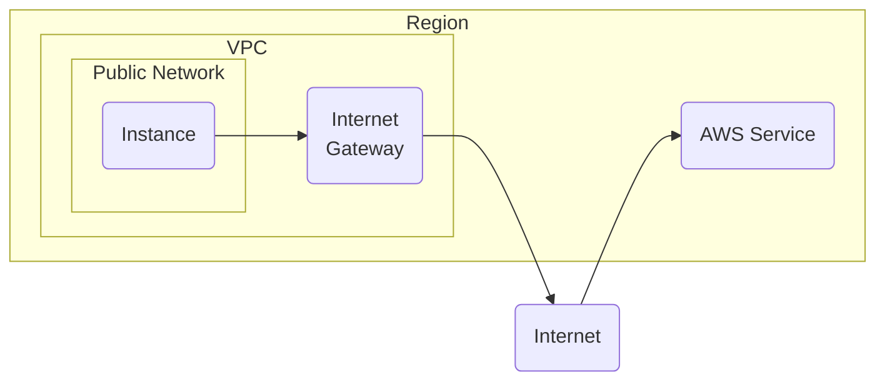
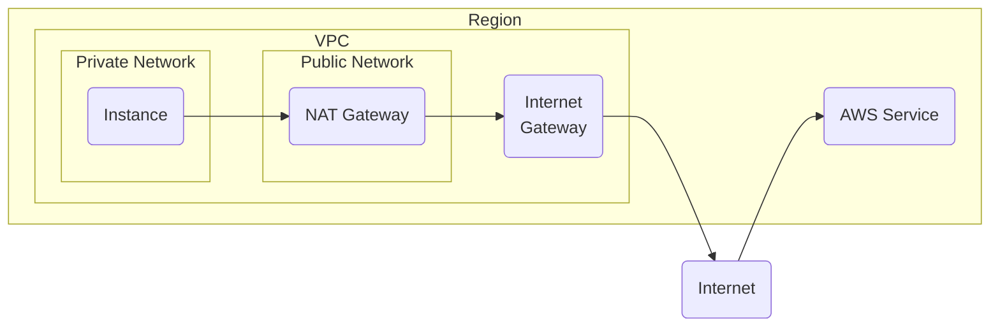
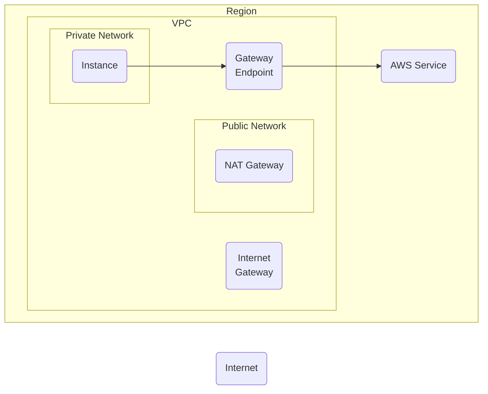
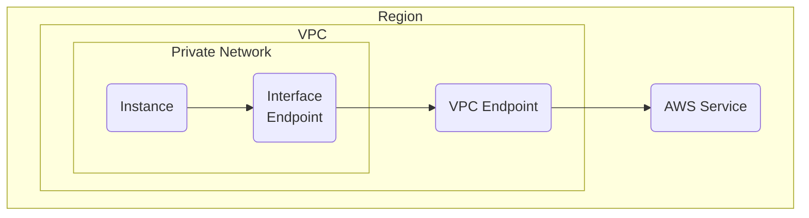

# Amazon Web Services

1. [TL;DR](#tldr)
1. [Networking](#networking)
   1. [Elastic IP addresses](#elastic-ip-addresses)
   1. [Proxying connections](#proxying-connections)
1. [Services](#services)
   1. [Billing and Cost Management](#billing-and-cost-management)
   1. [Config](#config)
   1. [Detective](#detective)
   1. [Direct Connect](#direct-connect)
   1. [Global Accelerator](#global-accelerator)
   1. [GuardDuty](#guardduty)
   1. [EventBridge](#eventbridge)
   1. [Inspector](#inspector)
   1. [Kinesis](#kinesis)
   1. [KMS](#kms)
   1. [PrivateLink](#privatelink)
   1. [Security Hub](#security-hub)
1. [Step Functions](#step-functions)
1. [Resource constraints](#resource-constraints)
1. [Access control](#access-control)
1. [Costs](#costs)
   1. [Free Tier](#free-tier)
   1. [Spot Instances](#spot-instances)
   1. [Savings plans](#savings-plans)
   1. [Reserved instances](#reserved-instances)
   1. [Tiered pricing](#tiered-pricing)
   1. [Enterprise discount program](#enterprise-discount-program)
   1. [Other tools](#other-tools)
1. [Resource tagging](#resource-tagging)
1. [API](#api)
   1. [Python](#python)
1. [Container images](#container-images)
    1. [Amazon Linux](#amazon-linux)
1. [Further readings](#further-readings)
    1. [Sources](#sources)

## TL;DR

_Regions_ are physical world locations where multiple Availability Zones exist.<br/>
They are physically isolated and independent from one another.<br/>
Regions come at **no** charge.

_Availability Zones_ are sets of one or more data centers, each with their own resources, housed in separate facilities.

Resources created in one Region do **not** exist in any other Region, unless explicitly using replication features
offered by AWS services.<br/>
Some services like IAM do **not** have Regional resources.

Recommended using regional STS endpoints instead of [the global one](https://sts.amazonaws.com) to reduce latency.<br/>
Session tokens from regional STS endpoints are valid in **all** AWS Regions. However, tokens from the global endpoint
are only valid in enabled Regions.

Session tokens valid in all Regions are larger. If storing session tokens, these might affect one's systems.

Regions introduced before 2019-03-20 are enabled by default. Newer regions are now disabled by default.<br/>
Regions enabled by default **cannot be enabled or disabled**.

Disabling Regions disables IAM access to resources in those Region. It will **not** delete resources in the disabled
region, and they **will** continue to be charged at the standard rate.

Disabling a Region can takes a few minutes to several hours to take effect. Services and Console will be visible until
the region is completely disabled.

Enabling Regions takes a few minutes to several hours. They **cannot** be used until the preparation process is
complete.

The API for _some_ AWS services (e.g. EC2) are **_eventually_ consistent**.<br/>
This means that the result of an API request that affects resources _might_ **not** be immediately visible to the
subsequent requests that API receives.

## Networking

VPCs define isolated virtual networking environments.<br/>
AWS accounts include one default VPC for each AWS Region.

Every VPC will have at least one CIDR block.<br/>
Every new AWS account will have one default VPC in every region, all with the `172.31.0.0/16` CIDR block assigned.

VPCs can be _peered_ to enable direct connectivity between them via private IP addresses.<br/>
The peer connection also requires exchanging route table entries between the VPCs.

Subnets are virtual networks, each of which carves out smaller range of IP addresses from their VPC's CIDR block.<br/>
Each subnet resides in a single Availability Zone.<br/>
_Public_ subnets have a direct route to an Internet gateway. Resources in public subnets **can** access the public
Internet.<br/>
_Private_ subnets do **not** have a direct route to an Internet gateway. Resources in private subnets **require** a NAT
device to access the public internet.

_Security groups_ control the traffic in and out of the resources associated with them, like firewalls would do.<br/>
_Security group rules_ are **stateful**, meaning that connections initiated from the security group will allow the
corresponding answers to come back in (but not new connections).<br/>
The default value for Egress traffic is to allow all connections.

_Network Access Control Lists_ also control the traffic in and out. However, they are associated with subnets, and
affect all resources within that subnet.<br/>
NACLs are **stateless**, meaning that both the Inbound and Outbound rules must match traffic patterns to allow
communications in **any** direction.<br/>
_NACL rules_ allow all traffic by default. They also have a priority.

Gateways connect VPCs to other networks.<br/>
[_Internet gateways_][connect to the internet using an internet gateway] connect VPCs to the Internet.<br/>
[_NAT gateways_][nat gateways] allow resources in private subnets to connect to the Internet, other VPCs, or on-premises
networks. They can communicate with services outside the VPC, but cannot receive unsolicited connection requests.<br/>
[_VPC endpoints_][access aws services through aws privatelink] connect VPCs to AWS services privately, without the need
of Internet gateways or NAT devices.

_Route tables_ control how traffic flows throughout, and in or out, a VPC.<br/>
They are associated with subnets, and affect all resources within those subnets.<br/>
By default, a VPC only comes with a single route table. It is referred to as the `Main` route table.

By default, connections to AWS services use the services' **public** endpoint.

Traffic from instances in **public** subnets is routed to the VPC's internet gateway, then forwarded to the requested
AWS service.

<details style="padding: 0 0 1rem 1rem">



</details>

Traffic from instances in **private** subnets is routed to a NAT gateway, which forwards it to the VPC's internet
gateway, which then forwards it to the requested AWS service.<br/>
This traffic does **not** leave the AWS network, even if it does traverse the internet gateway.

<details style="padding: 0 0 1rem 1rem">



</details>

[PrivateLink] leverages VPC endpoints to create a private and direct connection between a VPC and a service inside the
AWS backbone (usually, AWS-provided services).<br/>
[Gateway endpoints] do the same thing PrivateLink does, but in a more convenient way that does not require Elastic
Network Interfaces. These endpoints are only supported by specific AWS services ([S3] and DynamoDB at the time of
writing).

<details style="padding: 0 0 1rem 1rem">



</details>

[Direct Connect] creates a dedicated network connection between on-premises data centers or offices and AWS.

### Elastic IP addresses

Refer [Elastic IP addresses].

**Static**, **public** IPv4 addresses allocated to one's AWS account until one releases it.<br/>
One can can rapidly remapping addresses to other instances in one's account and use them as targets in DNS records.

### Proxying connections

AWS does not currently really offer a proxy-like service like HA Proxy or Squid would be.

Options:

1. Consider using [PrivateLink], if the destination service is **inside** the AWS network.
1. Consider routing traffic to the destination **directly** through a NAT Gateway, if one can set static CIDRs in the
   subnets' Route Tables.

   <details style='padding: 0 0 1rem 1rem'>

   This is the most basic way to accomplish the goal, while keeping maintenance efforts at a minimum.

   The idea is to:

   1. Create, or reuse, NAT Gateways as the points of exit.
   1. Create Route Tables accordingly.
   1. Configure the Route Table to route traffic to the wanted CIDRs to the NAT Gateway serving the AZ.

   Route Tables require defining sets of CIDRs.<br/>
   If the destination is inside a cloud provider and do not use static IPs, one might need to add **all** of the cloud
   provider's CIDRs for the Region, which change without notice and require updating.<br/>
   Even doing that, the sheer number of CIDRs might too high for a single Route Table to manage.

   </details>

1. Route all traffic through an AWS Network Firewall, then re-route traffic to the destination service through a NAT
   Gateway.

   <details style='padding: 0 0 1rem 1rem'>

   Network Firewalls can re-route traffic based on its URL instead of based on its CIRDs.<br/>
   This solves the issue requires Route Tables to use CIDRs, but requires all traffic in a Subnet to go through the
   Firewall's endpoint for its AZ.

   The idea is to:

   1. Create, or reuse, NAT Gateways as the points of exit.
   1. Create Network Firewall Endpoints accordingly.
   1. Configure the Network Firewalls to intercept all traffic from the subnets in the AZ each Endpoint covers, and
      re-route the packets for the destination to the NAT Gateway for the AZ.

   > [!warning]
   > Network Firewalls might be way too expensive to be used only for proxying purposes, with a baseline estimation just
   > shy of €900/month only for 3 Endpoints existing (for AZs A to C, for instance). Add to this the charges for data
   > processing for the entire traffic exiting or entering every Subnet served by a Network Firewall Endpoint.

   </details>

1. Route traffic to the destination service through a custom proxy instance.

   <details style='padding: 0 0 1rem 1rem'>

   This **will** require clients to configure their tools to use the proxy.<br/>
   This could be an EC2 instance, or some containerized solution.

   </details>

## Services

| Service                       | Summary                                       |
| ----------------------------- | --------------------------------------------- |
| [Billing and Cost Management] | Cost management                               |
| [CloudFront]                  | Content delivery                              |
| [CloudWatch]                  | Observability (logging, monitoring, alerting) |
| [Config]                      | Compliance                                    |
| [Detective]                   | Behaviour anomalies                           |
| [Direct Connect]              | Private on-premise to AWS connection          |
| [EC2]                         | Managed virtual machines                      |
| [ECR]                         | Container registry                            |
| [ECS]                         | Run containers as a service                   |
| [EFS]                         | Serverless file storage                       |
| [EKS]                         | Managed Kubernetes clusters                   |
| [EventBridge]                 | Stream real time data                         |
| [GuardDuty]                   | Threat detection                              |
| [IAM]                         | Access control                                |
| [Image Builder]               | Build custom AMIs                             |
| [Inspector]                   | Security vulnerability assessment             |
| [Kinesis]                     | Video or data streams                         |
| [KMS]                         | Key management                                |
| [OpenSearch]                  | ELK, logging                                  |
| [PrivateLink]                 | Private VPC to AWS service connection         |
| [RDS]                         | Databases                                     |
| [Route53]                     | DNS                                           |
| [S3]                          | Storage                                       |
| [Sagemaker]                   | Machine learning                              |
| [Secrets Manager]             | Secrets management                            |
| [Security Hub]                | Aggregator for security findings              |
| [SNS]                         | Pub/sub message delivery                      |
| [SQS]                         | Queues                                        |
| [Step Functions]              | Task orchestration                            |

[Service icons][aws icons] are publicly available for diagrams and such.
Public service IP address ranges are [available in JSON form][aws public ip address ranges now available in json form]
at <https://ip-ranges.amazonaws.com/ip-ranges.json>.

### Billing and Cost Management

Costs can be grouped by Tags applied on resources.<br/>
Tags to use for this kind of grouping need to be activated in the _Cost allocation tags_ section.<br/>
New tags might take 24 or 48 hours to appear there.

### Config

Compliance service for assessing and auditing AWS resources.

Provides an inventory of resources.<br/>
Records and monitors resource configurations and their changes.<br/>
Allows for automatic remediation for non-compliant resources by leveraging Systems Manager Automation documents.

The service's data is stored in an S3 bucket.<br/>
The bucket is named `config-bucket-{aws-account-number}` by default and created upon service's activation.

The changes logs can be streamed to 1! SNS topic for notification purposes.

Uses _rules_ to evaluate whether the resources configurations comply.<br/>
Rule evaluation is done either **once** every time a configuration changes, or **periodically**.<br/>
Resources are marked with the evaluation result (_compliant_, _non-compliant_).

Custom rules can be used to evaluate for uncommon requirements.<br/>
Custom rules leverage lambda functions.

_Conformance packs_ are set of rules bundled together as a deployable, single, immutable entity.<br/>
Defined as YAML templates.<br/>
Users cannot make changes without updating the **whole** rule package.<br/>
Sample templates for compliance standards and benchmarks are available.

### Detective

Uses ML and graphs to try and identify the root cause of security issues.<br/>
Creates visualizations with details and context by leveraging events from VPC Flow Logs, CloudTrail and GuardDuty.

### Direct Connect

Provides a dedicated, private network connection from on-premise to the AWS network.

One needs to establish a dedicated connection from a on-premise location to an AWS Direct Connect location.<br/>
This typically involves a **physical** connection between the on-premises network and the AWS infrastructure.

Once the connection is established, one can create one or more virtual interfaces to act as logical connections within
the physical Direct Connect connection.<br/>
Virtual interfaces can be configured with specific routing details, virtual private gateway associations, and bandwidth
settings.

Direct Connect uses link layer encryption over the connection to secure the traffic.

### Global Accelerator

Global service creating accelerators to improve the performance of applications.<br/>
Supports endpoints in multiple Regions.

**Standard** accelerators improve availability of Internet applications used by a global audience.<br/>
Global Accelerator directs traffic over AWS' global network to endpoints in the nearest Region to the client.<br/>
Endpoints for standard accelerators can be Network Load Balancers, Application Load Balancers, Amazon EC2 instances,
or Elastic IP addresses located in one or more Regions.

**Custom** routing accelerators map one or more users to a specific destination among many.

Global Accelerator provides 2 static IPv4 addresses and 2 static IPv6 addresses (for dual-stack VPCs) that are
associated with accelerators.<br/>
Those static IP addresses are anycast addresses from AWS' edge network and remain assigned to accelerators for as
long as they exist, **even** if disabled and no longer accepting or routeing traffic.<br/>
When deleting accelerators, the static IP addresses assigned to it are lost.

Global Accelerator also assigns each accelerator a default DNS name, similar to
`a1234567890abcdef.awsglobalaccelerator.com` for single-stack ones or similar to
`a1234567890abcdef.dualstack.awsglobalaccelerator.com` for dual-stack ones, that points to the static IP addresses
assigned to the same accelerator.

The static IP addresses provided by Global Accelerator serve as **single fixed entry points** for your clients.<br/>
They accept incoming traffic onto AWS' global network from the edge location that is closest to the users.<br/>
From there, traffic is routed based on the type of accelerator configured:

- Standard accelerators route traffic to the optimal endpoint based on several factors including the user's location,
  the health of the endpoint, and the endpoint weights one configures.
- Custom routing accelerators route each client to a specific EC2 instance and port in a subnet  based on the external
  static IP address and listener port that one provided.

Global Accelerator terminates TCP connections from clients at AWS' edge locations and establishes a new TCP connection
to one's endpoints.

Client IP addresses are preserved for endpoints on custom routing accelerators.<br/>
Standard accelerators have the option to preserve and access the client IP address for some endpoint types.

Global Accelerator continuously monitors the health of all standard accelerators' endpoints, and reroutes traffic for
all new connections automatically.<br/>
Health checks are **not** used with custom routing accelerators and there is no failover, because one specifies the
destination to route traffic to.

One can configure weights for one's endpoints in standard accelerators.<br/>
In addition, one can use the traffic dial in Global Accelerator to increase (dial up) or decrease (dial down) the
percentage of traffic to specific endpoint groups.

Global Accelerator sets an idle timeout to its connections.<br/>
If no data has been sent nor received by the time that the idle timeout period elapses, it closes the connection.

Idle timeout periods are **not** customizable.

To prevent connection timeout, one must send a packet with a minimum of one byte of data in either direction within the
TCP connection timeout window. One **cannot** use TCP keep-alive packets to maintain a connection open.

Idle timeouts are set to 340 seconds for TCP connections and 30 seconds for UDP connections.

Global Accelerator continues to direct traffic for established connections to endpoints until the idle timeout is met,
**even if the endpoint is marked as unhealthy or it is removed from the accelerator**.<br/>
It selects a new endpoint, if needed, only when a new connection starts or after an idle timeout.

Refer [How AWS Global Accelerator works] for more and updated details.<br/>
Also see [Using Amazon CloudWatch with AWS Global Accelerator].

### GuardDuty

Threat detection service.

It continuously monitors accounts and workloads for malicious activity and delivers security findings for visibility and
remediation.<br/>
Done by pulling streams of data from CloudTrail, VPC Flow Logs or EKS.

Member accounts can administer GuardDuty by delegation if given the permissions to do so.

_Findings_ are **potential** security issues for malicious events.<br/>
Those are also sent to EventBridge for notification (leveraging SNS).<br/>
Each is assigned a severity value (0.1 to 8+).

_Trusted IP List_ is a whitelist of **public IPs** that will be ignored by the rules.<br/>
_Threat IP List_ is a blacklist of **public IPs and CIDRs** that will be used by the rules.<br/>

### EventBridge

TODO

### Inspector

TODO

### Kinesis

TODO

### KMS

_Key material_ is the cryptographic secret of Keys that is used in encryption operations.

Enabling automatic key rotation for a KMS key makes the service generate new cryptographic material for the key every
year by default.<br/>
Specify a custom rotation period to customize that time frame.

Perform on-demand rotation should you need to immediately initiate key material rotation.<br/>
This works regardless of whether the automatic key rotation is enabled or not. On-demand rotations do **not** change
existing automatic rotation schedules.

KMS saves **all** previous versions of the cryptographic material in perpetuity to allow decryption of any data
encrypted with keys.<br/>
Rotated key material is **not** deleted until the key itself is deleted.

Track the rotation of key material [CloudWatch], CloudTrail, and the KMS console.<br/>
Alternatively, use the `GetKeyRotationStatus` operation to verify whether automatic rotation is enabled for a key and
identify any in progress on-demand rotations. Use the `ListKeyRotations` operation to view the details of completed
rotations.

When using a rotated KMS key to encrypt data, KMS uses the **current** key material.<br/>
When using the same rotated KMS key to decrypt ciphertext, KMS uses the version of the key material that was used for
encryption.<br/>
One **cannot** select a particular version of key materials for decrypt operations. This automation allows to safely use
rotated KMS keys in applications and AWS services without code changes.

Automatic key rotation has no effect on the data that KMS keys protect: it does **not** rotate the data generated by
rotated keys, re-encrypts any data protected by the keys, nor it will mitigate the effect of compromised data keys.

KMS supports automatic and on-demand key rotation only for symmetric encryption keys with key material that KMS itself
creates.<br/>
Automatic rotation is optional for customer managed KMS keys. KMS rotates the key material for AWS managed keys on an
yearly basis. Rotation of AWS owned KMS keys is managed by the AWS service that owns the key.

Key rotation only changes the key material, not the key's properties.<br/>
The key is considered the same logical resource, regardless of whether or how many times its key material changes.

Creating a new key and using it in place of the original one has the same effect as rotating the key material in an
existing key.<br/>
This is considered a _manual_ key rotation and is a good choice to rotate keys that are not eligible for automatic key
rotation.

AWS charges a monthly fee for the first and second rotation of key material maintained for each key.<br/>
This price increase is capped at the second rotation. Any subsequent rotations will **not** be billed.

Each key counts as one when calculating key resource quotas, regardless of the number of rotated key material versions.

### PrivateLink

See also [Access AWS services through AWS PrivateLink].

Allows private access to AWS services from within a VPC without the need of Internet Gateways.<br/>

It needs one to create:

- One _interface VPC endpoint_ for each desired AWS service.<br/>
  Each interface endpoint establishes a connection between the subnet they are in and their specific AWS service by
  means of Elastic Network Interfaces.
- A route in the subnet's route table for each interface endpoint.<br/>
  This will route all traffic destined to the AWS service referred by the interface endpoint to the endpoint.

The service's endpoint is resolved with the **private** IP addresses of the relative endpoint's network interface,
instead of the default public endpoint.<br/>
This allows traffic to be sent to the requested AWS service using the private connection between the VPC endpoint and
the AWS service.

<details style="padding: 0 0 1rem 1rem">



</details>

Services will **not** be able to initiate requests to resources through their VPC endpoint.

Bills per each VPC endpoint provisioned, per each Availability Zone, per hour, per GB of data processed.<br/>
Refer [AWS PrivateLink Pricing].

### Security Hub

Aggregator of findings for security auditing.

> Uses [Config] to check resources' configuration by leveraging compliancy rules.

Security standards are offered as ret of rules for [Config].

Data can be aggregated from different regions.<br/>
If the integration is enabled, findings from AWS services ([GuardDuty]) are used too within 5 minutes on average, while
ones from 3rd parties can take longer.

Data can be imported from or exported to 3rd parties if the integration is enabled.<br/>
Kinda acts as a middle layer for AWS accounts.

Findings are consumed in _AWS Security Finding Format_ (ASFF).<br/>
Those are automatically updated and deleted. Findings after 90 days are automatically deleted even if **not** resolved.

Can use custom insights.

Custom actions can be sent to EventBridge for automation.

Member accounts can administer Security Hub by delegation if given the permissions to do so.

## Step Functions

Refer [What is Step Functions?].

Workflows (A.K.A. _state machines_) for building applications, automating processes, orchestrating microservices, and
creating pipelines.<br/>
Can also be long-running and require human interaction.

Step Functions call AWS services or external workers to perform tasks.

In the context of Step Functions:

- State machines are called _workflows_.<br/>
  Workflows are a series of event-driven steps.
- Each step in a workflow is called _state_.
- _Task states_ represent units of work performed by **another AWS service**, like calling another service or API.<br/>
  Instances of running workflows performing tasks are called executions in Step Functions.
- _Activities_ represent units of work executed by workers that exist **outside** of Step Functions.

Workflows can be:

- _Standard_, if they run each step **exactly** once, for long time.<br/>
  They can run for up to 1y, are auditable, and show execution history and visual debugging.

  Step Functions counts a _state transition_ each time a step in a standard workflow is executed.<br/>
  It charges for the total number of state transitions across **all** one's state machines, **including** retries.<br/>
  4000 state transitions per month are free, then they are charged $0.025 per every 1000 transitions.<br/>
  Charges are metered daily and billed monthly.

- _Express_, if they run each step **at least once**, for up to 5 minutes.<br/>
  They are ideal for high-event-rate workloads like streaming data processing and IoT data ingestion.

  Pricing is based off of number of requests and duration.

  Step Functions counts a request each time it starts executing an express workflow.<br/>
  It charges for the total number of requests across **all** the workflows, **including** tests from the console.

  Duration is calculated:

  1. From the time a workflow begins executing until it completes or otherwise terminates.
  1. Rounded **up** to the nearest 100ms.

  The amount of memory used in the execution of a workflow is billed in 64MB chunks.<br/>
  Memory consumption is based on the size of a workflow definition, the use of map or parallel states, and the execution
  (payload) data size.

## Resource constraints

| Data type    | Component | Summary                                    | Description                                                                                                                                                                                                                                                | Type   | Length   | Pattern                           | Required |
| ------------ | --------- | ------------------------------------------ | ---------------------------------------------------------------------------------------------------------------------------------------------------------------------------------------------------------------------------------------------------------- | ------ | -------- | --------------------------------- | -------- |
| Statement ID | Value     | Optional identifier for a policy statement | The element supports only ASCII uppercase letters (A-Z), lowercase letters (a-z), and numbers (0-9).                                                                                                                                                       | String | FIXME    | `[A-Za-z0-9]`                     | No       |
| Tag          | Key       | Required name of the tag                   | The string value can be Unicode characters and cannot be prefixed with "aws:".<br/>The string can contain only the set of Unicode letters, digits, white-space, `_`,' `.`, `/`, `=`, `+`, `-`, `:`, `@` (Java regex: `^([\\p{L}\\p{Z}\\p{N}_.:/=+\\-]*)$`) | String | 1 to 128 | `^([\p{L}\p{Z}\p{N}_.:/=+\-@]*)$` | Yes      |
| Tag          | Value     | The optional value of the tag              | The string value can be Unicode characters. The string can contain only the set of Unicode letters, digits, white-space, `_`, `.`, `/`, `=`, `+`, `-`, `:`, `@` (Java regex: `^([\\p{L}\\p{Z}\\p{N}_.:/=+\\-]*)$"`, `[\p{L}\p{Z}\p{N}_.:\/=+\-@]*` on AWS) | String | 0 to 256 | `^([\p{L}\p{Z}\p{N}_.:/=+\-@]*)$` | Yes      |

## Access control

Refer [IAM].

## Costs

One pays for data transfer between instances and services in the **same region** but **different availability
zone**.<br/>
See [Understanding data transfer charges].

One pays for sending logs and metrics to [CloudWatch].

Available discount options:

| Discount type                 | Discount range      | Commitment length               | Flexibility                            | Applies to                          | Limitations                                                                       |
| ----------------------------- | ------------------- | ------------------------------- | -------------------------------------- | ----------------------------------- | --------------------------------------------------------------------------------- |
| [Free tier]                   | 100%                | 1 year                          | None                                   | Selected services (EC2, S3, Lambda) | Low usage limits<br/>Overuse is billed<br/>Only available to new accounts for 1y  |
| [Spot instances]              | Up to 90%           | None                            | High (for stateless/batch)             | EC2, EMR, ECS, EKS, Batch           | Can be terminated anytime<br/>Avoid for critical or long-running workloads        |
| [Savings plans]               | Up to 72%           | 1 or 3 years                    | Medium to high                         | EC2, Lambda, Fargate                | Must commit to a $/hour spend<br/>Not cancellable<br/>Unused commitment is wasted |
| [Reserved instances]          | Up to 75%           | 1 or 3 years                    | Low (standard) or Medium (convertible) | EC2, RDS, Redshift, ElastiCache     | Specific instance type/region<br/>Harder to manage<br/>Non-refundable             |
| [Tiered pricing]              | Various             | None                            | Automatic depending on usage           | S3, CloudFront, Lambda, DynamoDB    | Requires high volume<br/>Tiers and availability vary by service                   |
| [Enterprise discount program] | Custom (10 to >30%) | Custom (1 to 3 years typically) | High (custom contract)                 | All AWS                             | Requires large spend<br/>Enterprise-only<br/>Contract-based                       |

| Use case                                                     | Best discount options                           |
| ------------------------------------------------------------ | ----------------------------------------------- |
| Long-term predictable workloads                              | [Savings plans] or [Reserved instances]         |
| Short-term batch or flexible tasks                           | [Spot instances]                                |
| New to AWS / testing a service                               | [Free tier]                                     |
| High-volume services (e.g., S3 storage)                      | [Tiered pricing]                                |
| Large-scale enterprise planning to stay on AWS for some time | [Enterprise discount program] + [Savings plans] |

Order of application: reserved instances -> Savings plans (EC2 instances -> Compute)

### Free Tier

**New** AWS customers get **1 year** of free tier access to **selected** services only.

Only allows for **limited monthly usage** (E.G., up to 750 hours of t2.micro EC2, 5GB S3 per month).

Free tier is only available in specific regions.<br/>
Usage in multiple regions counts as a whole.  _FIXME: check_

Automatically charges standard rates when one exceeds one's account limits.

### Spot Instances

Lends **spare** EC2 instance capacity at up to 90% discount.<br/>
Prices vary based on regional supply and demand.

Instances can be interrupted by AWS with a 2-minute warning.<br/>
Not suitable for workloads needing guaranteed uptime or long-term execution.

Works great for **stateless**, **fault-tolerant**, or **batch** workloads.

### Savings plans

Refer [Savings Plans user guide].<br/>
See also [Understanding how Savings Plans apply to your usage].

Pricing models offering lower prices compared to On-Demand prices. They require specific usage commitments ($/hour) for
1-**year** or 3-**years** terms.

_Dedicated_ Instances, _Spot_ Instances and _Reserved_ Instances are **not** discounted by Savings Plans.

| Savings Plan     | Included resources                                                                                                                                                                                                                                                                     | Up to |
| ---------------- | -------------------------------------------------------------------------------------------------------------------------------------------------------------------------------------------------------------------------------------------------------------------------------------- | ----- |
| Compute          | EC2 instances regardless of family, size, AZ, region, OS or tenancy<br/>Lambda<br/>Fargate                                                                                                                                                                                             | 66%   |
| EC2 Instance     | **Individual** EC2 instance families in a specific region (e.g. M5 usage in N. Virginia) regardless of AZ, size, OS or tenancy                                                                                                                                                         | 72%   |
| Amazon SageMaker | **Eligible** SageMaker ML instances, including SageMaker Studio Notebook, SageMaker On-Demand Notebook, SageMaker Processing, SageMaker Data Wrangler, SageMaker Training, SageMaker Real-Time Inference, and SageMaker Batch Transform regardless of instance family, size, or region | 64%   |

Both Compute and EC2 Instance plan types apply to EC2 instances that are a part of Amazon EMR, Amazon EKS, and
Amazon ECS clusters. They do **not** apply to RDS instances.<br/>
Charges for the EKS service itself will not be covered by Savings Plans, but the underlying EC2 instances will be.

Savings Plans are available in the following payment options:

- _No Upfront_: no upfront payments, commitment charged purely on a monthly basis.
- _Partial Upfront_: lower prices, at least half of one's commitment upfront, remainder charged on a monthly basis.
- _All Upfront_: lowest prices, entire commitment charged in one payment at the start.

Savings Plans can be purchased in any account within an AWS Organization/Consolidated Billing family.<br/>
By default, the benefits of the Plans are applicable to usage across **all** accounts. One can **choose** to restrict
the benefit of the Plans to only the account that purchased them.

One account **can** have multiple Savings Plans active at the same time.

Plans **cannot** be cancelled during their term.<br/>
Plans **can** be _returned_ only if:

- They consist in an hourly commitment of $100 or less.
- They have been purchased in the past 7 days **and** in the same calendar month.

Once returned, one will receive a 100% refund for any upfront charges for the Savings Plan.<br/>
Refunds will be reflected in one's bill within 24 hours of return.

Any usage covered by the plan **will be charged at On-Demand rates**, or get covered by a different Savings Plans _if
applicable_.

Plans do **not** provide capacity reservations.<br/>
One **can** however reserve capacity with On Demand Capacity Reservations and pay lower prices on them with Savings
Plans.

Savings Plans are applied **after** Reserved Instances.<br/>
Furthermore, _EC2 Instance_ Savings Plans are applied **before** _Compute_ Savings Plans.

Savings Plans are applied to the highest savings percentage first. If there are multiple usages with equal savings
percentages, Savings Plans are applied to the first usage with the lowest Savings Plans rate.<br/>
Savings Plans continue to apply until there are no more remaining usages, or one's commitment is exhausted. Any
remaining usage is then charged at the On-Demand rates.

### Reserved instances

Gives discounts of up to 75% compared to On-Demand pricing for EC2, RDS, Redshift and ElastiCache instances in exchange
for an advance payment for either 1 or 3 years.

Available as follows:

- _Standard_: higher discounts, but very little flexibility.<br/>
  Limits to **specific** instance types, regions, OS, etc for the **whole** duration of the term.
- _Convertible_: lower discounts, but can switch instance families, OS, or tenancy during the term.

Reserved Instances are available in the following payment options:

- _No Upfront_: no upfront payments, commitment charged purely on a monthly basis.
- _Partial Upfront_: lower prices, at least half of one's commitment upfront, remainder charged on a monthly basis.
- _All Upfront_: lowest prices, entire commitment charged in one payment at the start.

Reserved instances plans are usually hard to manage at scale, and can lead to unused capacity if your usage changes.

### Tiered pricing

_Selected_ services like S3, Lambda, CloudFront, and DynamoDB offer automatic tiered pricing.<br/>
Tiered pricing lowers the per-unit cost of resources the more one uses them (E.G., S3 gets cheaper per GB as one stores
more and more data).

Tiered pricing requires large usage volumes to see meaningful savings.

### Enterprise discount program

Large customers, with high level of committed AWS spend (typically hundreds of thousands to millions per year), _can_
negotiate custom discounts and support terms.

These negotiations are only available to large enterprises, and **require** long-term contractual commitment.

### Other tools

AWS offers tools that can help optimize cost:

- Cost Explorer: analyzes past usage and helps forecast costs and savings.
- Trusted Advisor: provides recommendations for RIs, underutilized resources, etc.

## Resource tagging

Refer [What are tags?], [Tagging best practices and strategies], [Best Practices for Tagging AWS Resources] and
[Tag naming limits and requirements].

Tags are labels consisting of a key and an optional value.<br/>
One can apply them to resources in order to add metadata to them.

Most, but not all, AWS services and resource types currently support tags. See
[Services that support the Resource Groups Tagging API] for a list of which of them do.<br/>
Services other then the ones in the list may support tags via their own APIs.

> [!note]
> Tags are **not** encrypted.<br/>
> They should **not** be used to store sensitive data like personally identifiable information (PII).

Tags that users create are known as _user-defined_ tags.

Several AWS services automatically assign tags to those resources that they create and manage.<br/>
These keys are known as _AWS generated_, tags and are usually prefixed with `aws:`.<br/>
As such, the `aws:` prefix **cannot** be used in user-defined tag keys.

User-defined tags have usage requirements, and there are limits on the number that can be added to any AWS
resource.<br/>
AWS generated tags do **not** count against these limits.

AWS generated tags use a namespace format, e.g. `aws:cloudformation:some-stack`.<br/>
User-defined tags _can_ also use that format.

Using an organizational identifier as a prefix in tags is recommended to help identify where tags come from.

Suggested tags from AWS:

| Tag                                             | Value example                                                   | Notes                                           |
| ----------------------------------------------- | --------------------------------------------------------------- | ----------------------------------------------- |
| `Name`                                          | `GitlabRunner`, `Prometheus Server`                             | Shows as human-friendly name in the AWS console |
| `Owner`                                         | `SecurityLead`, `SecOps`, `Workload-1-Development-team`         |                                                 |
| `BusinessUnitId`                                | `Finance`, `Retail`, `API-1`, `DevOps`                          |                                                 |
| `Environment`, `example-org:devops:environment` | `Sandbox`, `Dev`, `PreProd`, `QA`, `Prod`, `Testing`            |                                                 |
| `CostCenter`, `company-b:CostCenter`            | `FIN123`, `Retail-123`, `Sales-248`, `HR-333`                   |                                                 |
| `FinancialOwner`                                | `HR`, `SecurityLead`, `DevOps-3`, `Workload-1-Development-team` |                                                 |
| `ComplianceRequirement`                         | `NIST`, `HIPAA`, `GDPR`                                         |                                                 |

[Create tag policies][creating organization policies with aws organizations] to enforce values, and to prevent the
creation of non-compliant resources.

> [!note]
> Once created, tags cannot be deleted.

If unused for some time, they will **not** show up in services like Cost Explorer.<br/>
Deletion aside, one can manage tags in the Tag Editor.

## API

Refer [Tools to Build on AWS].

### Python

Refer [Boto3 documentation].<br/>
Also see [Difference in Boto3 between resource, client, and session?].

_Clients_ and _Resources_ are different abstractions for service requests within the Boto3 SDK.<br/>
When making API calls to an AWS service with Boto3, one does so via a _Client_ or a _Resource_.

_Sessions_ are fundamental to both Clients and Resources and how both get access to AWS credentials.

<details style="padding: 0 0 0 1em;">
  <summary>Client</summary>

Provides low-level access to AWS services by exposing the `botocore` client to the developer.

Typically maps 1:1 with the related service's API and supports all operations for the called service.<br/>
Exposes Python-fashioned method names (e.g. ListBuckets API => list_buckets method).

Typically yields primitive, non-marshalled AWS data.<br/>
E.g. DynamoDB attributes are dictionaries representing primitive DynamoDB values.

Limited to listing at most 1000 objects, requiring the developer to deal with result pagination in code.<br/>
Use a [paginator][boto3 paginators] or implement one's own loop.

  <details style="padding: 0 0 1em 1em;">
    <summary>Example</summary>

```py
import boto3

client = boto3.client('s3')
response = client.list_objects_v2(Bucket='mybucket')
for content in response['Contents']:
    obj_dict = client.get_object(Bucket='mybucket', Key=content['Key'])
    print(content['Key'], obj_dict['LastModified'])
```

  </details>
</details>

<details style="padding: 0 0 0 1em;">
  <summary>Resource</summary>

Refer [Boto3 resources].

Provides high-level, object-oriented code.

Does **not** provide 100% API coverage of AWS services.

Uses identifiers and attributes, has actions (operations on resources), and exposes sub-resources and collections of
AWS resources.

Typically yields marshalled data, **not** primitive AWS data.<br/>
E.g. DynamoDB attributes are native Python values representing primitive DynamoDB values.

Takes care of result pagination.<br/>
The resulting collections of sub-resources are lazily-loaded.

Resources are **not** thread safe and should **not** be shared across threads or processes.<br/>
Create a new Resource for each thread or process instead.

Since January 2023 the AWS Python SDK team stopped adding new features to the resources interface in Boto3.<br/>
Newer service features can be accessed through the Client interface.<br/>
Refer [More info about resource deprecation?] for more information.

  <details style="padding: 0 0 1em 1em;">
    <summary>Example</summary>

```py
import boto3

s3 = boto3.resource('s3')
bucket = s3.Bucket('mybucket')
for obj in bucket.objects.all():
    print(obj.key, obj.last_modified)
```

  </details>
</details>

<details style="padding: 0 0 1em 1em;">
  <summary>Session</summary>

Refer [Boto3 sessions].

Stores configuration information (primarily credentials and selected AWS Region).<br/>
Initiates the connectivity to AWS services.

Leveraged by service Clients and Resources.<br/>
Boto3 creates a default session automatically when needed, using the default credential profile.<br/>
The default credentials profile uses the `~/.aws/credentials` file if found, or tries assuming the role of the executing
machine if not.

</details>

## Container images

### Amazon Linux

Refer [Pulling the Amazon Linux container image].

Amazon Linux container images are **infamous** for having issues when connecting to their package repositories from
**outside** of AWS' network.<br/>
While it can connect to them _sometimes™_ when running locally, one can get much easier and more consistent results by
just running it from **inside** AWS.

Disconnect from the VPN, start the container, and reconnect to the VPN before installing packages when running the
container locally.<br/>
If one can, prefer just build the image from an EC2 instance.

## Further readings

- [Learn AWS]
- [EC2]
- [Best Practices for Tagging AWS Resources]
- [Automating DNS-challenge based LetsEncrypt certificates with AWS Route 53]
- AWS' [CLI]
- [Tools to Build on AWS]
- [Boto3 documentation]
- [More info about resource deprecation?]
- [What Is OIDC and Why Do We Need It?]
- [AWS Fundamentals Blog]

### Sources

- [Constraints for tags][constraints  tag]
- [What is Amazon VPC?]
- [Subnets for your VPC]
- [What is AWS Config?]
- [AWS Config tutorial by Stephane Maarek]
- [Date & time policy conditions at AWS - 1-minute IAM lesson]
- [Elastic IP addresses]
- [Test Your Roles' Access Policies Using the AWS Identity and Access Management Policy Simulator]
- [Exporting DB snapshot data to Amazon S3]
- [I'm trying to export a snapshot from Amazon RDS MySQL to Amazon S3, but I'm receiving an error. Why is this happening?]
- [Rotating AWS KMS keys]
- [Using AWS KMS via the CLI with a Symmetric Key]
- [AWS Public IP Address Ranges Now Available in JSON Form]
- [Savings Plans user guide]
- [AWS Savings Plans Vs. Reserved Instances: When To Use Each]
- [How can I use AWS KMS asymmetric keys to encrypt a file using OpenSSL?]
- [A guide to tagging resources in AWS]
- [Guidance for Tagging on AWS]
- [Creating organization policies with AWS Organizations]
- [AWS re:Invent 2022 - Advanced VPC design and new Amazon VPC capabilities (NET302)]
- [Enable or disable AWS Regions in your account]
- [Difference in Boto3 between resource, client, and session?]
- [Boto3 resources]
- [Boto3 sessions]
- [Boto3 paginators]
- [What is AWS Global Accelerator?]
- [How AWS Global Accelerator works]
- [Using Amazon CloudWatch with AWS Global Accelerator]
- [Gateway Endpoints vs Internet Routing for S3]
- Introduction to the AWS Virtual Private Cloud (VPC) -
  [Part 1][Introduction to the AWS Virtual Private Cloud (VPC) - Part 1],
  [Part 2][Introduction to the AWS Virtual Private Cloud (VPC) - Part 2],
  [Part 3][Introduction to the AWS Virtual Private Cloud (VPC) - Part 3]
- [VPC Endpoints: Secure and Direct Access to AWS Services]

<!--
  Reference
  ═╬═Time══
  -->

<!-- In-article sections -->
[billing and cost management]: #billing-and-cost-management
[config]: #config
[detective]: #detective
[direct connect]: #direct-connect
[enterprise discount program]: #enterprise-discount-program
[eventbridge]: #eventbridge
[free tier]: #free-tier
[guardduty]: #guardduty
[inspector]: #inspector
[kinesis]: #kinesis
[kms]: #kms
[privatelink]: #privatelink
[reserved instances]: #reserved-instances
[savings plans]: #savings-plans
[security hub]: #security-hub
[Step Functions]: #step-functions
[spot instances]: #spot-instances
[tiered pricing]: #tiered-pricing

<!-- Knowledge base -->
[cli]: cli.md
[cloudfront]: cloudfront.md
[cloudwatch]: cloudwatch.md
[ec2]: ec2.md
[ecr]: ecr.md
[ecs]: ecs.md
[efs]: ecs.md
[eks]: eks.md
[iam]: iam.md
[image builder]: image%20builder.md
[opensearch]: opensearch.md
[rds]: rds.md
[route53]: route53.md
[s3]: s3.md
[sagemaker]: sagemaker.md
[secrets manager]: secrets%20manager.md
[sns]: sns.md
[sqs]: sqs.md

<!-- Upstream -->
[Access AWS services through AWS PrivateLink]: https://docs.aws.amazon.com/vpc/latest/privatelink/privatelink-access-aws-services.html
[aws icons]: https://aws-icons.com/
[AWS PrivateLink pricing]: https://aws.amazon.com/privatelink/pricing/
[aws public ip address ranges now available in json form]: https://aws.amazon.com/blogs/aws/aws-ip-ranges-json/
[aws re:invent 2022 - advanced vpc design and new amazon vpc capabilities (net302)]: https://www.youtube.com/watch?v=cbUNbK8ZdA0&pp=ygUWYW1hem9uIGludmVudCAyMDIyIHZwYw%3D%3D
[Best Practices for Tagging AWS Resources]: https://docs.aws.amazon.com/whitepapers/latest/tagging-best-practices/tagging-best-practices.html
[boto3 documentation]: https://boto3.amazonaws.com/v1/documentation/api/latest/index.html
[boto3 paginators]: https://boto3.amazonaws.com/v1/documentation/api/latest/guide/paginators.html
[boto3 resources]: https://boto3.amazonaws.com/v1/documentation/api/latest/guide/resources.html
[boto3 sessions]: https://boto3.amazonaws.com/v1/documentation/api/latest/guide/session.html
[connect to the internet using an internet gateway]: https://docs.aws.amazon.com/vpc/latest/userguide/VPC_Internet_Gateway.html
[constraints  tag]: https://docs.aws.amazon.com/directoryservice/latest/devguide/API_Tag.html
[creating organization policies with aws organizations]: https://docs.aws.amazon.com/organizations/latest/userguide/orgs_policies_create.html
[elastic ip addresses]: https://docs.aws.amazon.com/AWSEC2/latest/UserGuide/elastic-ip-addresses-eip.html
[enable or disable aws regions in your account]: https://docs.aws.amazon.com/accounts/latest/reference/manage-acct-regions.html
[exporting db snapshot data to amazon s3]: https://docs.aws.amazon.com/AmazonRDS/latest/UserGuide/USER_ExportSnapshot.html
[Gateway endpoints]: https://docs.aws.amazon.com/vpc/latest/privatelink/gateway-endpoints.html
[guidance for tagging on aws]: https://aws.amazon.com/solutions/guidance/tagging-on-aws/
[how aws global accelerator works]: https://docs.aws.amazon.com/global-accelerator/latest/dg/introduction-how-it-works.html
[how can i use aws kms asymmetric keys to encrypt a file using openssl?]: https://repost.aws/knowledge-center/kms-openssl-encrypt-key
[i'm trying to export a snapshot from amazon rds mysql to amazon s3, but i'm receiving an error. why is this happening?]: https://repost.aws/knowledge-center/rds-mysql-export-snapshot
[more info about resource deprecation?]: https://github.com/boto/boto3/discussions/3563
[nat gateways]: https://docs.aws.amazon.com/vpc/latest/userguide/vpc-nat-gateway.html
[Pulling the Amazon Linux container image]: https://docs.aws.amazon.com/AmazonECR/latest/userguide/amazon_linux_container_image.html
[rotating aws kms keys]: https://docs.aws.amazon.com/kms/latest/developerguide/rotate-keys.html
[savings plans user guide]: https://docs.aws.amazon.com/savingsplans/latest/userguide/
[Services that support the Resource Groups Tagging API]: https://docs.aws.amazon.com/resourcegroupstagging/latest/APIReference/supported-services.html
[subnets for your vpc]: https://docs.aws.amazon.com/vpc/latest/userguide/configure-subnets.html
[Tag naming limits and requirements]: https://docs.aws.amazon.com/tag-editor/latest/userguide/best-practices-and-strats.html#tag-conventions
[Tagging best practices and strategies]: https://docs.aws.amazon.com/tag-editor/latest/userguide/best-practices-and-strats.html
[test your roles' access policies using the aws identity and access management policy simulator]: https://aws.amazon.com/blogs/security/test-your-roles-access-policies-using-the-aws-identity-and-access-management-policy-simulator/
[tools to build on aws]: https://aws.amazon.com/developer/tools/
[understanding data transfer charges]: https://docs.aws.amazon.com/cur/latest/userguide/cur-data-transfers-charges.html
[Understanding how Savings Plans apply to your usage]: https://docs.aws.amazon.com/savingsplans/latest/userguide/sp-applying.html
[using amazon cloudwatch with aws global accelerator]: https://docs.aws.amazon.com/global-accelerator/latest/dg/cloudwatch-monitoring.html
[What are tags?]: https://docs.aws.amazon.com/whitepapers/latest/tagging-best-practices/what-are-tags.html
[what is amazon vpc?]: https://docs.aws.amazon.com/vpc/latest/userguide/what-is-amazon-vpc.html
[what is aws config?]: https://docs.aws.amazon.com/config/latest/developerguide/WhatIsConfig.html
[what is aws global accelerator?]: https://docs.aws.amazon.com/global-accelerator/latest/dg/what-is-global-accelerator.html
[What is Step Functions?]: https://docs.aws.amazon.com/step-functions/latest/dg/welcome.html

<!-- Others -->
[a guide to tagging resources in aws]: https://medium.com/@staxmarketing/a-guide-to-tagging-resources-in-aws-8f4311afeb46
[automating dns-challenge based letsencrypt certificates with aws route 53]: https://johnrix.medium.com/automating-dns-challenge-based-letsencrypt-certificates-with-aws-route-53-8ba799dd207b
[aws config tutorial by stephane maarek]: https://www.youtube.com/watch?v=qHdFoYSrUvk
[AWS Fundamentals Blog]: https://awsfundamentals.com/blog
[aws savings plans vs. reserved instances: when to use each]: https://www.cloudzero.com/blog/savings-plans-vs-reserved-instances/
[date & time policy conditions at aws - 1-minute iam lesson]: https://www.youtube.com/watch?v=4wpKP1HLEXg
[difference in boto3 between resource, client, and session?]: https://stackoverflow.com/questions/42809096/difference-in-boto3-between-resource-client-and-session
[Gateway Endpoints vs Internet Routing for S3]: https://awsfundamentals.com/blog/gateway-endpoints-vs-internet-routing-s3
[Introduction to the AWS Virtual Private Cloud (VPC) - Part 1]: https://awsfundamentals.com/blog/amazon-vpc-introduction-part-1
[Introduction to the AWS Virtual Private Cloud (VPC) - Part 2]: https://awsfundamentals.com/blog/introduction-to-the-aws-virtual-private-cloud-vpc-part-2
[Introduction to the AWS Virtual Private Cloud (VPC) - Part 3]: https://awsfundamentals.com/blog/amazon-vpc-introduction-part-3
[Learn AWS]: https://www.learnaws.org/
[using aws kms via the cli with a symmetric key]: https://nsmith.net/aws-kms-cli
[VPC Endpoints: Secure and Direct Access to AWS Services]: https://awsfundamentals.com/blog/vpc-endpoints
[What Is OIDC and Why Do We Need It?]: https://awsfundamentals.com/blog/oidc-introduction
