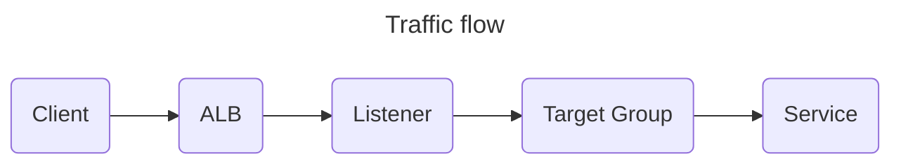

# Elastic Load Balancing

Distributes network traffic.

1. [TL;DR](#tldr)
1. [Target groups](#target-groups)
1. [Listeners](#listeners)
1. [Application Load Balancers](#application-load-balancers)
1. [Further readings](#further-readings)
   1. [Sources](#sources)

## TL;DR

_External_ load balancer should reside in **public** subnets and have **public** IP addresses.<br/>
_Internal_ load balancer should reside in **private** subnets and have **private** IP addresses.

<!-- Uncomment if used
<details>
  <summary>Setup</summary>

```sh
```

</details>
-->

<details>
  <summary>Usage</summary>

```sh
# Get load balancers' IDs.
aws elbv2 describe-load-balancers --names 'load-balancer-name' \
  --query 'LoadBalancers[].LoadBalancerArn' --output 'text' \
| grep -o '[^/]*$'

# Get load balancers' *private* IP addresses.
aws ec2 describe-network-interfaces --output 'text' \
  --filters Name=description,Values='ELB app/application-load-balancer-name/application-load-balancer-id' \
  --query 'NetworkInterfaces[*].PrivateIpAddresses[*].PrivateIpAddress'
aws ec2 describe-network-interfaces --output 'text' \
  --filters Name=description,Values='ELB net/network-load-balancer-name/network-load-balancer-id' \
  --query 'NetworkInterfaces[*].PrivateIpAddresses[*].PrivateIpAddress'
aws ec2 describe-network-interfaces --output 'text' \
  --filters Name=description,Values='ELB classic-load-balancer-name' \
  --query 'NetworkInterfaces[*].PrivateIpAddresses[*].PrivateIpAddress'

# Get load balancers' *public* IP addresses.
aws ec2 describe-network-interfaces --output 'text' \
  --filters Name=description,Values='ELB app/application-load-balancer-name/application-load-balancer-id' \
  --query 'NetworkInterfaces[*].Association.PublicIp'
aws ec2 describe-network-interfaces --output 'text' \
  --filters Name=description,Values='ELB net/network-load-balancer-name/network-load-balancer-id' \
  --query 'NetworkInterfaces[*].Association.PublicIp'
aws ec2 describe-network-interfaces --output 'text' \
  --filters Name=description,Values='ELB classic-load-balancer-name' \
  --query 'NetworkInterfaces[*].Association.PublicIp'

# Create listener rules.
# Conditions' 'host-header' values allow up to 90 chars total, not 128 as said in the docs.
# Priority 0 is the highest.
aws engineer elbv2 create-rule \
  --listener-arn 'arn:aws:elasticloadbalancing:eu-west-1:012345678901:listener/app/some-listener/0123456789abcedf/0123456789abcdef' \
  --conditions 'Field=host-header,Values=["some-host.dev.example.org"]' \
  --actions 'Type=forward,TargetGroupArn=arn:aws:elasticloadbalancing:eu-west-1:012345678901:targetgroup/0123456789abcdef0123456789abcdef/0123456789abcdef' \
  --priority '1000'
```

</details>

<!-- Uncomment if used
<details>
  <summary>Real world use cases</summary>

```sh
```

</details>
-->

## Target groups

A single target group **can** be shared across multiple load balancers.<br/>
A service exposed on both a public and an internal ALB only requires **one** target group and **one** listener per ALB.

## Listeners

When creating HTTPS listeners, one must specify **exactly one** certificate.<br/>
This is the _default_ certificate, and can be replaced after the listener's creation without needing to recreate the
listener.

One can also add more certificates to a listener's certificate list.
Should one do this, the LB will uses the default certificate **only** when:

- A client connects **without** using the Server Name Indication (SNI) protocol to specify a hostname.
- A request matches none of the additional certificates in the certificate list.

Secure multiple applications using a single load balancer by:

- Using a **wildcard** certificate.
- Using a certificate containing one Subject Alternative Name (SAN) for each additional domain.

Renewing or replacing a certificate does **not** affect in-flight requests that are received by the load balancer's node
and are pending routing to a healthy target.<br/>
After a certificate is renewed, new requests are presented the renewed certificate.<br/>
After a certificate is replaced, new requests are presented the new certificate.

## Application Load Balancers



ALBs require X.509 certificates (SSL/TLS server certificates).<br/>
ALBs integrate with [Certificate Manager]. They can just reference SSL certificates in ACM to use them to secure
connections.<br/>
When creating [listeners] that use HTTPS, one **must** deploy at least one certificate on the load balancer.<br/>
Refer to [SSL certificates for your Application Load Balancer].

If the hostname provided by a client matches only one certificate in the certificate list, the load balancer selects
this certificate. If the hostname matches multiple certificates in the list, the load balancer selects the _best_
certificate the client can support.<br/>
Certificate selection is based on the following criteria in the following order:

1. Public key algorithm (prefer ECDSA over RSA).
1. Expiration (prefer not expired).
1. Hashing algorithm (prefer SHA over MD5).<br/>
   If there are multiple SHA certificates, prefer the highest SHA number.
1. Key length (prefer the largest).
1. Validity period.

The load balancer's access logs record the hostname specified by each client and the certificate presented to it.

ALBs can use **rules** to forward traffic to different targets depending on the requests' data (e.g. its `path`).

The service charges per Load Balancer, per hour it exists. Every _partial_ hour is billed as a _full_ hour.<br/>
It also charges for the number of Load Balancer Capacity Units (LCU) used per minute. When using Load Balancer Capacity
Unit Reservation, any additional number of LCUs used per minute _beyond_ one's reserved LCUs per hour is added to the
bill.

> [!tip]
> To save money, prefer using **less** ALBs with **multiple** rules each.

Using rules in ALBs to redirect by path **keeps the path** in the forwarded request.<br/>
Applications that serve their files using _relative_ paths will not be able to find the resources, as the path will not
be available in the app's folder (and hence in the browser).

E.g.: given an ALB with a rule forwarding requests for paths matching `/some-app`, requests for
`https://example.com/some-app/static/js/index.js` will be forwarded _as-is_ and try fetching content from the
`/some-app` folder _in the application_.

> [!important]
> FIXME: verify.
>
> This does **not** seem to happen for targets that are tasks to ECS.<br/>
> Those seem to be treated differently by the ALB, where the requests' path seem to be stripped (replaced with `/`).

Solutions for this include:

- Rewriting the requests' path to `/` before forwarding them.
- Using an ECS-backed target.
- Using an ALB dedicated for the host (e.g. `some-app.example.com`) to forward requests **directly** using only the
  default rule (`path = /*`).

ALBs **can** rewrite requests' `host` header or path since 2025-10-15, if needed, by using
**[Transforms for listener rules]**.<br/>
See also the [news post][aws application load balancer launches url and host header rewrite] and the
[blog post][introducing url and host header rewrite with aws application load balancers].

The alternatives to this were to employ [CloudFront], [Lambda functions], reverse proxy layers/sidecars like NGINX and
Envoy **after** the ALB, or manage the request in-application.

Transforms change requests **before** the load balancer forwards them to the destination target group.

## Further readings

### Sources

<!--
  Reference
  ═╬═Time══
  -->

<!-- In-article sections -->
[Listeners]: #listeners

<!-- Knowledge base -->
[Certificate Manager]: README.md#certificate-manager
[CloudFront]: cloudfront.md
[Lambda functions]: README.md#lambda-functions

<!-- Files -->
<!-- Upstream -->
[AWS Application Load Balancer launches URL and Host Header Rewrite]: https://aws.amazon.com/about-aws/whats-new/2025/10/application-load-balancer-url-header-rewrite
[Introducing URL and host header rewrite with AWS Application Load Balancers]: https://aws.amazon.com/blogs/networking-and-content-delivery/introducing-url-and-host-header-rewrite-with-aws-application-load-balancers/
[SSL certificates for your Application Load Balancer]: https://docs.aws.amazon.com/elasticloadbalancing/latest/application/https-listener-certificates.html
[Transforms for listener rules]: https://docs.aws.amazon.com/elasticloadbalancing/latest/application/rule-transforms.html

<!-- Others -->
