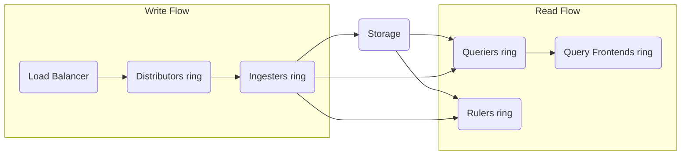
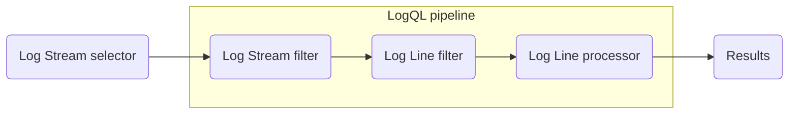

# Grafana Loki

Log aggregation system.

Inspired by Prometheus<br/>
Designed to be cost-effective and easy to operate.

1. [TL;DR](#tldr)
1. [Components](#components)
   1. [Distributor](#distributor)
   1. [Ingester](#ingester)
   1. [Query frontend](#query-frontend)
   1. [Query scheduler](#query-scheduler)
   1. [Querier](#querier)
   1. [Index gateway](#index-gateway)
   1. [Compactor](#compactor)
   1. [Ruler](#ruler)
1. [Logs ingestion](#logs-ingestion)
   1. [Logstash](#logstash)
   1. [OpenTelemetry](#opentelemetry)
1. [Labels](#labels)
   1. [Labelling best practices](#labelling-best-practices)
1. [Deployment](#deployment)
   1. [Monolithic mode](#monolithic-mode)
   1. [Simple scalable mode](#simple-scalable-mode)
   1. [Microservices mode](#microservices-mode)
1. [Object storage](#object-storage)
1. [Analytics](#analytics)
1. [Queries](#queries)
1. [Troubleshooting](#troubleshooting)
   1. [Too many storage configs provided in the common config](#too-many-storage-configs-provided-in-the-common-config)
1. [Further readings](#further-readings)
   1. [Sources](#sources)

## TL;DR

Loki does **not** require specific formats in input, but does require log entries to have at least one label.

Loki works differently from stores like ElasticSearch.<br/>
For one, Loki indexes log streams **by their labels**, and not by the logs' full contents. This allows for smaller
indexes and higher parallelization, but prevents full text searches.<br/>
It then compresses the entries' data, and stores it as _chunks_ on the local file system or in configured object storage
solutions.

Loki is built from a set of different components that work together as a set of microservices.<br/>
Those can be executed in one of 3 different modes:

- **Single Binary**.<br/>
  All components run simultaneously in and from a single process.<br/>
  Suggested for testing, and ingesting up to a few GB of logs daily.
- **Simple Scalable Deployment**.<br/>
  Multiple processes run components in groups, namely _read_, _write_, and _backend_ parts.<br/>
  Suggested when ingesting from a few GB up to a few TB of logs daily.
- **Microservices**.<br/>
  Multiple processes run each a single component.<br/>
  Designed to be executed in Kubernetes clusters.

Data is stored in 2 main file types: _index_es, or _chunk_s.<br/>
Indexes define where to find logs for specific sets of labels.<br/>
Chunks are containers for log entries that are assigned specific sets of labels.

Loki does **not** collect logs itself.<br/>
It needs _agents_, _collectors_, or other logs producers to push entries to it. They recommend using Grafana Alloy.

The _distributors_ receive and check the logs, then forward them to one or more _ingesters_ to ensure proper storage.

The _query frontend_, _query schedulers_, and _queriers_ organize and execute user queries against indexed data.<br/>
Loki uses LogQL for such user queries. One can also query logs from the CLI by using LogCLI.

All data, both in memory **and** in long-term storage, is partitioned by a tenant ID.<br/>
Loki runs in multi-tenant mode by default. It:

- Pulls the tenant ID from the `X-Scope-OrgID` header in HTTP requests when running in multi-tenant mode, or
- Ignores that header, and sets the tenant ID to `fake` when multi-tenant mode is disabled.
  This **will** appear in the index and in stored chunks.

Loki accepts out-of-order writes by default.

Retention in Loki is taken care of through the Compactor.<br/>
By default the `-compactor.retention-enabled` flag is **not** set, so logs sent to Loki live forever.

<details>
  <summary>Setup</summary>

```sh
# Install via package repository.
apt install 'loki'
dnf install 'loki'
zypper install 'loki'

# Run via Docker.
docker run --name loki -d \
  -p '3100:3100' -v "$(pwd)/config/loki.yml:/etc/loki/config.yml:ro" \
  'grafana/loki:3.3.2' -config.file='/etc/loki/config.yml'

# Run on Kubernetes in microservices mode.
helm --namespace 'loki' upgrade --create-namespace --install --cleanup-on-fail 'loki' \
  --repo 'https://grafana.github.io/helm-charts' 'loki-distributed'
```

On startup, unless explicitly configured otherwise, Loki tries to load a configuration file named `config.yaml` from the
current working directory, or from the `./config/` subdirectory if the first does not exist.<br/>
Should **none** of those files exist, it **will** give up and fail.

The default configuration file **for package-based installations** is located at `/etc/loki/config.yml` or
`/etc/loki/loki.yaml`.<br/>
The docker image tries using `/etc/loki/local-config.yml` by default (as per the image's `COMMAND` setting).

Some settings are currently **not** reachable via direct CLI flags (e.g. `schema_configs`, `storage_config.aws.*`), and
as such _require_ one to use a configuration file.

  <details style="padding: 0 0 1em 1em;">
    <summary>Disable reporting</summary>

  ```yaml
  analytics:
    reporting_enabled: false
  ```

  </details>

</details>

<details>
  <summary>Usage</summary>

```sh
# Get help.
loki -help
docker run --rm --name 'loki-help' 'grafana/loki:3.3.2' -help

# Verify configuration files.
loki -verify-config
loki -config.file='/etc/loki/local-config.yaml' -print-config-stderr -verify-config
docker run --rm 'grafana/loki' \
  -verify-config -config.file '/etc/loki/local-config.yaml'
docker run --rm -v "$PWD/custom-config.yaml:/etc/loki/local-config.yaml:ro" 'grafana/loki:3.3.2' \
  -verify-config -config.file '/etc/loki/local-config.yaml' -log-config-reverse-order

# List available component targets.
loki -list-targets
docker run --rm 'docker.io/grafana/loki' -config.file='/etc/loki/local-config.yaml' -list-targets

# Start server components.
loki
loki -target='all'
loki -config.file='/etc/loki/config.yaml' -target='read'

# Print the final configuration to the logs and continue.
loki -log-config-reverse-order …
loki -log.level='info' -log-config-reverse-order …

# Print the final configuration to stderr and continue.
loki -print-config-stderr …

# Check the server is working
curl 'http://loki.example.org:3100/ready'
curl 'http://loki.example.org:3100/metrics'
curl 'http://loki.example.org:3100/services'

# Check the hash rings' state
curl 'http://loki.example.org:3100/ring'
curl 'http://loki.example.org:3100/distributor/ring'

# Check components in Loki clusters are up and running.
# Such components must run by themselves for this.
# The 'read' component returns ready when browsing to <http://localhost:3101/ready>.
curl 'http://loki.example.org:3101/ready'
# The 'write' component returns ready when browsing to <http://localhost:3102/ready>.
curl 'http://loki.example.org:3102/ready'
```

```plaintext
GET /ready
GET /metrics
GET /services

GET /ring
GET /distributor/ring
```

</details>

<details>
  <summary>Real world use cases</summary>

```sh
# Check some values are applied to the final configuration.
docker run --rm --name 'validate-cli-config' 'grafana/loki:3.3.2' \
  -verify-config -config.file '/etc/loki/local-config.yaml' -print-config-stderr \
  -common.storage.ring.instance-addr='127.0.0.1' -server.path-prefix='/loki' \
  2>&1 \
| grep -E 'instance_addr' -E 'path_prefix'
docker run --rm --name 'validate-cli-config' 'grafana/loki:3.3.2' \
  -verify-config -config.file '/etc/loki/local-config.yaml' -print-config-stderr \
  -common.storage.ring.instance-addr='127.0.0.1' -server.path-prefix='/loki' \
  2> '/tmp/loki.config.yaml' \
&& sed '/msg="config is valid"/d' '/tmp/loki.config.yaml' \
|  yq -Sy '.common|.instance_addr,.path_prefix' - \
|| cat '/tmp/loki.config.yaml'
```

</details>

## Components



<details>
  <summary>Write flow (A.K.A. path)</summary>

1. The distributor receives an HTTP POST request with streams and log lines.
1. The distributor hashes each stream contained in the request.<br/>
   The hash determines the ingester instance to send the stream to, based on the information from the hash ring.
1. The distributor sends each stream to the appropriate ingester and its replicas, based on the configured replication
   factor.
1. The ingester receives the stream with log lines
1. The ingester creates a new chunk for the stream's data, or appends it to an existing chunk.<br/>
   Every chunk is unique per tenant and per label set.
1. The ingester acknowledges the write.
1. The distributor waits for a majority (quorum) of the ingesters to acknowledge their own writes.
1. The distributor responds with a success (2xx status code) when it received at least a quorum of acknowledged
   writes.<br/>
   Should it not receive a quorum of acknowledged writes, it responds with an error (4xx or 5xx status code).

```mermaid
```

</details>

<details>
  <summary>Read flow (A.K.A. path)</summary>

1. The query frontend receives an HTTP GET request with a LogQL query.
1. The query frontend splits the query into sub-queries and passes them to the query scheduler.
1. The querier pulls sub-queries from the query scheduler.
1. The querier passes the query to all ingesters for in-memory data.
1. The ingesters return in-memory data matching the query, if any.
1. The querier lazily loads data from the backing store.
1. The querier runs the query against the backing store if ingesters returned no or insufficient data.
1. The querier iterates over all received data and deduplicates it
1. The querier returns the result of the sub-query to the query frontend.
1. The query frontend waits for all sub-queries of a query to be finished and returned by the queriers.
1. The query frontend merges the individual results into a final result and return it to the client.

```mermaid
```

</details>

### Distributor

Handles incoming push requests from clients.

Once it receives a set of streams in an HTTP request, it validates each stream for correctness and to ensure the stream
is within the configured tenant (or global) limits.

Each **valid** stream is forwarded to `n` ingesters in parallel to ensure its data is recorded.<br/>
`n` is the replication factor for the data.<br/>
The distributor determines which ingesters to send a stream to by using consistent hashing.

When using multiple replicas of the distributor, a load balancer **must** sit in front of them to properly balance
incoming requests.<br/>
In Kubernetes, this is provided by the internal service load balancer.

The distributor is state**less** and can be _properly_ scaled.

### Ingester

On the _write_ path, persists data and ships it to long-term storage.<br/>
On the _read_ path, returns recently ingested, in-memory log data for queries.

Ingesters contain a lifecycle subcomponent managing their own lifecycle in the hash ring.<br/>
Each ingester has a state, which can be one of `PENDING`, `JOINING`, `ACTIVE`, `LEAVING`, or `UNHEALTHY`:

- `PENDING`: the ingester is waiting for a handoff from another ingester in the `LEAVING` state.<br/>
  This only applies for legacy deployment modes.
- `JOINING`: the ingester is currently inserting its tokens into the ring and initializing itself.<br/>
  It **may** receive write requests for tokens it owns.
- `ACTIVE`: the ingester is fully initialized.<br/>
  It may receive both write and read requests for tokens it owns.
- `LEAVING`: the ingester is shutting down.<br/>
  It may receive read requests for data it still has in memory.
- `UNHEALTHY`: the ingester has failed to heartbeat.<br/>
  Set by the distributor when periodically checking the ring.

Chunks are compressed and marked as read-only when:

- The current chunk has reached the configured capacity.
- Too much time has passed without the current chunk being updated.
- A flush occurs.

Whenever a chunk is compressed and marked as read-only, a writable chunk takes its place.

If an ingester crashes or exits abruptly, all the data that has not yet been flushed **will be lost**.<br/>
Replicas of each log mitigate this risk.

When flushes occur to a persistent storage provider, the chunk in question is hashed based on its tenant, labels, and
contents. Multiple ingesters with the same copy of the data will **not** write the same data to the backing store twice,
but if any write failed to one of the replicas, multiple differing chunk objects **will** be created in the backing
store.

### Query frontend

**Optional** service providing the querier's API endpoints.<br/>
Can be used to accelerate the _read_ path.

When in place, incoming query requests should be directed to the query frontend instead of the queriers.<br/>
The querier service will **still** be required within the cluster in order to actually execute the queries.

Performs some query adjustments, and holds queries in an internal queue.<br/>
Queriers will act as workers to pull jobs from the queue, execute them, and return them to the query frontend for
aggregation. They **will** need to be configured with the query frontend address to allow for connection.

Query frontends are stateless and can be properly scaled.

### Query scheduler

**Optional** service providing more advanced queuing functionality than the query frontend.<br/>
When active, the query frontend pushes split up queries to the query scheduler, which in turn enqueues them in an
internal in-memory queue.

Each tenant will get its own queue to guarantee fairness across all tenants.

Queriers connecting to the query scheduler will act as workers to pull jobs from the queue, execute them, and return
them to the query frontend for aggregation. They **will** need to be configured with the query scheduler address to
allow for connection.

Query schedulers are stateless and can be properly scaled.

### Querier

Executes Log Query Language (LogQL) queries.

Handles HTTP requests from the client directly, or pulls subqueries from the query frontend or query scheduler if
configured to do so.

Fetches log data from both the ingesters and from long-term storage.<br/>
They query **all** ingesters for in-memory data before falling back and run the same query against the backend store.

Because of the replication factor, it **is** possible for the querier to receive duplicate data.<br/>
To take care of this, it internally deduplicates data with the same nanosecond timestamp, label set, and log message.

### Index gateway

Used only by _shipper stores_.

Handles and serves metadata queries.<br/>
Those are queries that look up data from the index.

Query frontends will query the index gateway to know the log volume of queries, so to make a decision on how to shard
the queries.<br/>
The queriers will query the index gateway to know the chunk references for a given query, so to know which chunks to
fetch.

The index gateway can run in _simple_ or _ring_ mode:

- In _simple_ mode, each index gateway instance serves all indexes from all tenants.
- In _ring_ mode, index gateways use a consistent hash ring to distribute and shard the indexes per tenant amongst
  available instances.

### Compactor

Used by _shipper stores_ to compact multiple index files, produced by the ingesters and shipped to object storage, into
single index files per day and tenant.

It:

- Downloads files from object storage at regular intervals.
- Merges downloaded files into a single one.
- Uploads the newly created index.
- Cleans up the old files.

Also manages log retention and log deletion.

### Ruler

Manages and evaluates rules and alert expressions provided in rule configurations.<br/>

Rule configurations are stored in object storage or local file system.<br/>
They can be managed through the ruler's API, or directly by uploading them to object storage.

Rulers _can_ delegate rule evaluation to the query frontends to gain the advantages of query splitting, query sharding,
and caching offered by the query frontend.

Multiple rulers will use a consistent hash ring to distribute rule groups amongst available ruler instances.

## Logs ingestion

Refer [Send log data to Loki].

Logs are pushed to Loki via the `/api/v1/push` HTTP API endpoint as logproto or JSON payloads.<br/>
The distributors receive and validate the received requests, then forward the data to one or more ingesters.<br/>
Ingesters prepare and write the data into storage.

Loki stores logs as streams of log entries, all in the same format regardless of the format they were when ingested.

Indexes come in the form of labels, distinguishing log streams from one another.

### Logstash

Loki provides the `logstash-output-loki` Logstash output plugin to enable shipping logs to a Loki or Grafana Cloud
instance, though Grafana's folks suggest to **not** use it.<br/>
Refer [Logstash plugin].

```sh
logstash-plugin install 'logstash-output-loki'
```

```rb
output {
  loki {
    url => "http://loki.example.org:3100/loki/api/v1/push"
  }
}
```

Should one end up sending too many high cardinality labels to Loki, one can leverage the `include_fields` option to
limit the fields that would be mapped to labels and sent to the destination.<br/>
When this list is configured, **only** these fields will be sent and all the other fields will be ignored. Use the
`metadata_fields` option to map those to structured metadata and send them to Loki too.

<details style="padding: 0 0 1rem 1rem">

```rb
output {
  loki {
    url => "http://loki.example.org:3100/loki/api/v1/push"
    include_fields => [
      "agentId",
      "cancelledAt",
      "completedAt",
      "event",
      "statusCode",
      "subtaskId",
      "totalCount",
      "taskId",
      "uri"
    ]
    metadata_fields => [ "durationInMilliseconds" ]
  }
}
```

</details>

### OpenTelemetry

See also [OpenTelemetry / OTLP].

## Labels

Refer [Understand labels], [Cardinality] and [What is structured metadata].<br/>
See also [The concise guide to Grafana Loki: Everything you need to know about labels].

The content of _each_ log line is **not** indexed. Instead, log entries are grouped into _streams_.<br/>
The streams are then indexed using _labels_.

Labels are key-value pairs, e.g.:

```plaintext
deployment_environment = development
cloud_region = us-west-1
namespace = grafana-server
```

Sets of log messages that share **all** the labels above would be called a _log stream_.<br/>
Each log stream must have **at least one** label to be stored and queried in Loki.

Labels are intended to store **low-cardinality** values with the goal to describe the logs' source.<br/>
If frequently searching high-cardinality data in logs, one should use
[_structured metadata_][what is structured metadata] instead.

Loki has a default limit of 15 index labels.<br/>
I can't seem to find ways to set this value as of 2025-01-21.

When Loki performs searches, it:

1. Looks for **all** messages in the chosen stream.
1. Iterates through the logs in the stream to perform the query.

Labelling affects queries, which in turn affect dashboards.

Loki does **not** parse **nor** process log messages on ingestion.<br/>
However, some labels may automatically be applied to logs by the client that collected them.

Loki automatically tries to populate a default `service_name` label while ingesting logs.<br/>
This label is mainly used to find and explore logs in the `Explore Logs` feature of Grafana.

When receiving data from Grafana Alloy or the OpenTelemetry Collector as client, Loki automatically assigns some of the
OTel resource attributes as labels.<br/>
By default, some resource attributes will be stored as labels, with periods (`.`) replaced with underscores (`_`). The
remaining attributes are stored as structured metadata with each log entry.

[_Cardinality_][cardinality] is the combination of unique labels and values (how many values can each label have). It
impacts the number of log streams one creates and can lead to significant performance degradation.<br/>
Prefer fewer labels with bounded values.

Loki performs very poorly when labels have high cardinality, as it is forced to build a huge index and flush thousands
of tiny chunks to the object store.

Loki places the same restrictions on label naming as Prometheus:

- They _may_ contain ASCII letters and digits, as well as underscores and colons.<br/>
  It must match the `[a-zA-Z_:][a-zA-Z0-9_:]*` regex.
- Unsupported characters shall be converted to an underscore.<br/>
  E.g.: `app.kubernetes.io/name` shall be written as `app_kubernetes_io_name`.
- Do **not** begin **nor** end your label names with double underscores.<br/>
  This naming convention is used for internal labels, e.g. `_stream_shard_`.<br/>Internal labels are **hidden** by
  default in the label browser, query builder, and autocomplete to avoid creating confusion for users.

Prefer **not** adding labels based on the content of the log message.

Loki supports ingesting out-of-order log entries.<br/>
Out-of-order writes are enabled globally by default and can be disabled/enabled on a cluster or per-tenant basis.

Entries in a given log stream (identified by a given set of label names and values) **must be ingested in order**
within the default two hour time window.<br/>
When trying to send entries that are too old for a given log stream, Loki will respond with the `too far behind` error.

Use labels to separate streams so they can be ingested separately:

- When planning to ingest out-of-order log entries.
- For systems with different ingestion delays and shipping.

### Labelling best practices

- Use labels for things like regions, clusters, servers, applications, namespaces, and environments.

  <details style="padding: 0 0 1rem 1rem">

  They will be fixed for given systems/apps and have bounded values.<br/>
  Static labels like these make it easier to query logs in a logical sense.

  </details>

- Avoid adding labels for something until you know you need it.<br/>
  Prefer using filter expressions like `|= "text"` or `|~ "regex"` to brute force logs instead.
- Ensure labels have low cardinality. Ideally, limit it to tens of values.
- Prefer using labels with long-lived values.
- Consider extracting often parsed labels from log lines on the client side by attaching it as structured metadata.
- Be aware of dynamic labels applied by clients.

## Deployment

### Monolithic mode

Runs all of Loki's microservice components inside a single process as a single binary or Docker image.

Set the `-target` command line parameter to `all`.

Useful for experimentation, or for small read/write volumes of up to approximately 20GB per day.<br/>
Recommended to use the [Simple scalable mode] if in need to scale the deployment further.

<details>
  <summary>Horizontally scale this mode to more instances</summary>

- Use a shared object store.
- Configure the `ring` section of the configuration file to share state between all instances.

</details>

<details>
  <summary>Configure high availability</summary>

- Run multiple instances setting up the `memberlist_config` configuration.
- Configure a shared object store
- Configure the `replication_factor` to `3` or more.

This will route traffic to all the Loki instances in a round robin fashion.

</details>

Query parallelization is limited by the number of instances.<br/>
Configure the `max_query_parallelism` setting in the configuration file.

### Simple scalable mode

Default configuration installed by Loki's Helm Chart and the easiest way to deploy Loki at scale.

Requires a reverse proxy to be deployed in front of Loki to direct client's API requests to either the read or write
nodes. The Loki Helm chart deploys a default reverse proxy configuration using [Nginx].

This mode can scale up to a few TBs of logs per day.<br/>
If going over this, recommended to use the [Microservices mode].

Separates execution paths into `read`, `write`, and `backend` targets.<br/>
Targets can be scaled independently.

Execution paths are activated by defining the target on Loki's startup:

- `-target=write`: the `write` target is **stateful** and controlled by a Kubernetes StatefulSet.<br/>
  Contains the [distributor] and [ingester] components.
- `-target=read`: the `read` target is **stateless** and _can_ be run as a Kubernetes Deployment.<br/>
  In the official helm chart this is currently deployed as a StatefulSet.<br/>
  Contains the [query frontend] and [querier] components.
- `-target=backend`: the `backend` target is **stateful** and controlled by a Kubernetes StatefulSet.<br/>
  Contains the [compactor], [index gateway], [query scheduler] and [ruler] components.

### Microservices mode

Runs each Loki component as its own distinct processes.<br/>
Each process is invoked specifying its own target.

Designed for Kubernetes deployments and available as the [loki-distributed] community-supported Helm chart.

Only recommended for very large Loki clusters, or when needing more precise control over them.

## Object storage

Refer [Storage] and [Loki S3 Storage: A Guide for Efficient Log Management].

<details>
  <summary>AWS example</summary>

Refer also [AWS deployment (S3 Single Store)].

  <details style="padding-left: 1em;">
    <summary>Permissions</summary>

```json
{
  "Version": "2012-10-17",
  "Statement": [
    {
      "Effect": "Allow",
      "Action": [
        "s3:PutObject",
        "s3:GetObject",
        "s3:DeleteObject",
        "s3:ListBucket"
      ],
      "Resource": [
        "arn:aws:s3:::<chunks-bucket-name>",
        "arn:aws:s3:::<chunks-bucket-name>/*",
        "arn:aws:s3:::<ruler-bucket-name>",
        "arn:aws:s3:::<ruler-bucket-name>/*"
      ]
    }
  ]
}
```

  </details>
  <details style="padding-left: 1em;">
    <summary>Loki settings</summary>

```yaml
storage_config:
  aws:
    region: <aws-region>
    bucketnames:  # comma-separated list
      <chunks-bucket-name>
schema_config:
  configs:
    - store: tsdb
      object_store: aws
compactor:
  delete_request_store: aws
ruler:
  storage:
    type: s3
    s3:
      region: <aws-region>
      bucketnames:  # comma-separated list
        <ruler-bucket-name>
```

  </details>
</details>

## Analytics

By default, Loki will send anonymous but uniquely-identifiable usage and configuration analytics to Grafana Labs.<br/>
Explicitly disable reporting if wanted:

```yaml
analytics:
  reporting_enabled: false
```

## Queries

Loki uses LogQL for queries.

Refer [Querying Logs with LogQL].

LogQL expressions consist of two main parts:

- A log stream selector.<br/>
  This is in curly braces and defines which log streams to include or exclude.<br/>
  It **must** define at least one stream to try and match, even if it does not exist.
- An optional pipeline of one or more expressions.<br/>
  Those parse, filter, and format the log content from the stream.



<details>
  <summary>Examples</summary>

| Example                                        | Summary                                                                                        |
| ---------------------------------------------- | ---------------------------------------------------------------------------------------------- |
| `{level="INFO"}`                               | Select lines with label `level` being `INFO`                                                   |
| `{service_name="prometheus", level="WARN"}`    | Select lines with label `service_name` being `prometheus` **and** label `level` being `WARN`   |
| `{service_name=~"app1\|app2"} \|= "someValue"` | Select lines with label `service_name` being `app1` or `app2` that contain `someValue` in them |
| `{level="DEBUG"} \| logfmt`                    | Parse lines using the `logfmt` format                                                          |
| `{level="DEBUG"} \| json \| UserID="nick"`     | Filter on parsed fields                                                                        |
| `count_over_time({app="loki"}[5m])`            | Count lines over a window of 5m                                                                |
| `{job="mysql"} \|= "error" != "timeout"`       | Include lines containing `error` but exclude the ones containing `timeout`                     |

</details>

## Troubleshooting

### Too many storage configs provided in the common config

Error message example:

> failed parsing config: too many storage configs provided in the common config, please only define one storage backend

<details>
  <summary>Context</summary>

Loki is running locally from its Docker container image using the default configuration file and the following flags:

```yml
---
# docker-compose.yml
services:
  loki:
    image: grafana/loki:3.5.0
    command: >-
      -config.file=/etc/loki/local-config.yaml
      -target=all

      -reporting.enabled=false
      -auth.enabled=false

      -common.storage.ring.instance-addr=localhost
      -common.storage.ring.store=memberlist
      -memberlist.join=dns+localhost:7946

      -common.storage.s3.region=eu-west-1
      -common.storage.s3.buckets=loki-chunks
```

</details>

<details>
  <summary>Root cause</summary>

It seems the command flags for S3 storage are not working as expected.

</details>

<details>
  <summary>Solution</summary>

Configure those settings (or):

- In the configuration file:

  ```yml
  storage_config:
    aws:
      bucketnames: loki-chunks
      region: eu-west-1
  ```

- By removing the `common.storage` part in the command:

  ```yml
  command: >-
    …
    -s3.region=eu-west-1
    -s3.buckets=loki-chunks
  ```

The end result in `GET /config` is the same:

```yml
…
storage_config:
  alibabacloud: …
  aws:
    dynamodb: …
    s3: ""
    s3forcepathstyle: false
    bucketnames: loki-chunks
    endpoint: ""
    region: eu-west-1
    access_key_id: ""
    secret_access_key: ""
    …
  azure: …
```

</details>

## Further readings

- [Website]
- [Codebase]
- [Grafana]
- [Promtail]
- [Send log data to Loki]
- [Grafana Loki store log data on S3 bucket on AWS Fargate]
- [How to install Loki on (AWS) EKS using Terraform with S3]
- [Deploy the Loki Helm chart on AWS]
- [Loki S3 Storage: A Guide for Efficient Log Management]
- [Grafana Loki Configuration Nuances]
- [OpenTelemetry / OTLP]
- [Loki-Operator]
- [The Quest for HA and DR in Loki]
- [The concise guide to Loki: How to get the most out of your query performance]
- [Open source log monitoring: The concise guide to Grafana Loki]

### Sources

- [Documentation]
- [HTTP API reference]
- [How to Set Up Grafana, Loki, and Prometheus Locally with Docker Compose: Part 1 of 3]
- [Deploying Grafana, Loki, and Prometheus on AWS ECS with EFS and Cloud Formation (Part 3 of 3)]
- [AWS deployment (S3 Single Store)]
- [Zero to Hero: Loki] video playlist

<!--
  Reference
  ═╬═Time══
  -->

<!-- In-article sections -->
[compactor]: #compactor
[distributor]: #distributor
[index gateway]: #index-gateway
[ingester]: #ingester
[microservices mode]: #microservices-mode
[querier]: #querier
[query frontend]: #query-frontend
[query scheduler]: #query-scheduler
[ruler]: #ruler
[simple scalable mode]: #simple-scalable-mode

<!-- Knowledge base -->
[grafana]: grafana.md
[nginx]: nginx.md
[promtail]: promtail.md

<!-- Files -->
<!-- Upstream -->
[aws deployment (s3 single store)]: https://grafana.com/docs/loki/latest/configure/storage/#aws-deployment-s3-single-store
[Cardinality]: https://grafana.com/docs/loki/latest/get-started/labels/cardinality/
[codebase]: https://github.com/grafana/loki
[deploy the loki helm chart on aws]: https://grafana.com/docs/loki/latest/setup/install/helm/deployment-guides/aws/
[documentation]: https://grafana.com/docs/loki/latest/
[grafana loki store log data on s3 bucket on aws fargate]: https://community.grafana.com/t/grafana-loki-store-log-data-on-s3-bucket-on-aws-fargate/112861
[how to install loki on (aws) eks using terraform with s3]: https://community.grafana.com/t/how-to-install-loki-on-aws-eks-using-terraform-with-s3/136489
[http api reference]: https://grafana.com/docs/loki/latest/reference/loki-http-api/
[logstash plugin]: https://grafana.com/docs/loki/latest/send-data/logstash/
[loki-distributed]: https://github.com/grafana/helm-charts/tree/main/charts/loki-distributed
[Open source log monitoring: The concise guide to Grafana Loki]: https://grafana.com/blog/2023/12/11/open-source-log-monitoring-the-concise-guide-to-grafana-loki/?pg=blog&plcmt=body-txt
[send log data to loki]: https://grafana.com/docs/loki/latest/send-data/
[storage]: https://grafana.com/docs/loki/latest/configure/storage/
[The concise guide to Grafana Loki: Everything you need to know about labels]: https://grafana.com/blog/2023/12/20/the-concise-guide-to-grafana-loki-everything-you-need-to-know-about-labels/
[The concise guide to Loki: How to get the most out of your query performance]: https://grafana.com/blog/2023/12/28/the-concise-guide-to-loki-how-to-get-the-most-out-of-your-query-performance/
[Understand labels]: https://grafana.com/docs/loki/latest/get-started/labels/
[website]: https://grafana.com/oss/loki/
[What is structured metadata]: https://grafana.com/docs/loki/latest/get-started/labels/structured-metadata/
[Zero to Hero: Loki]: https://www.youtube.com/playlist?list=PLDGkOdUX1Ujr9QOsM--ogwJAYu6JD48W7

<!-- Others -->
[deploying grafana, loki, and prometheus on aws ecs with efs and cloud formation (part 3 of 3)]: https://medium.com/@ahmadbilalch891/deploying-grafana-loki-and-prometheus-on-aws-ecs-with-efs-and-cloud-formation-part-3-of-3-24140ea8ccfb
[grafana loki configuration nuances]: https://medium.com/lonto-digital-services-integrator/grafana-loki-configuration-nuances-2e9b94da4ac1
[how to set up grafana, loki, and prometheus locally with docker compose: part 1 of 3]: https://medium.com/@ahmadbilalch891/how-to-set-up-grafana-loki-and-prometheus-locally-with-docker-compose-part-1-of-3-62fb25e51d92
[loki s3 storage: a guide for efficient log management]: https://last9.io/blog/loki-s3-storage-guide/
[loki-operator]: https://loki-operator.dev/
[opentelemetry / otlp]: https://loki-operator.dev/docs/open-telemetry.md/
[Querying Logs with LogQL]: https://deepwiki.com/grafana/loki-k6-handson/4-querying-logs-with-logql
[the quest for ha and dr in loki]: https://www.infracloud.io/blogs/high-availability-disaster-recovery-in-loki/
