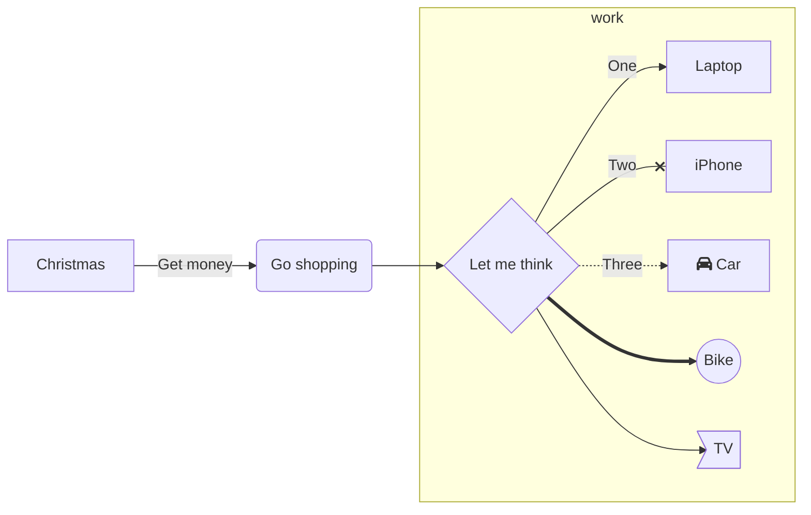
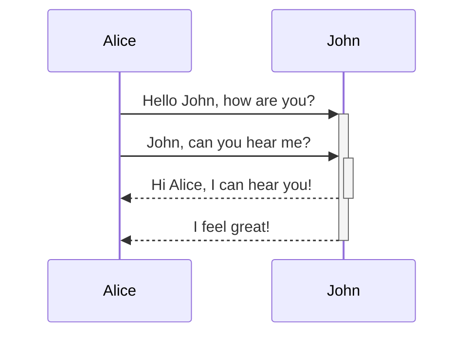
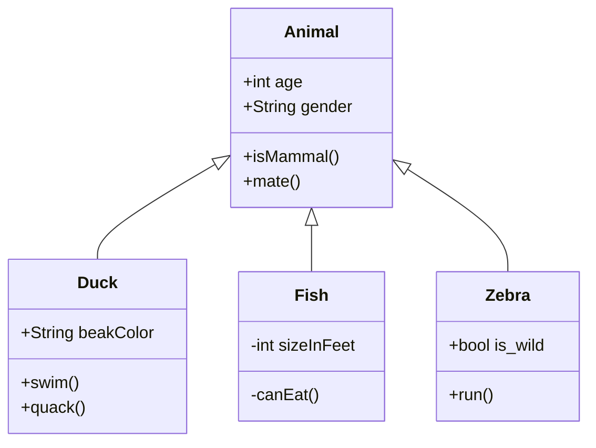
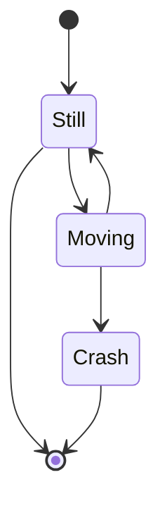
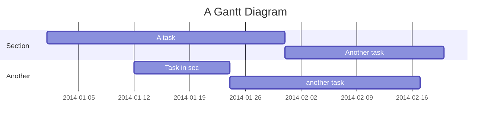
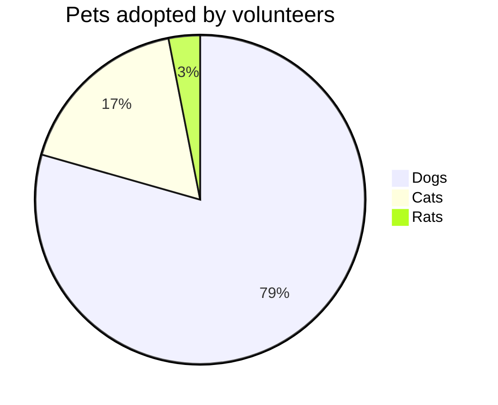

# Markdown

ReadMe's Markdown engine.

1. [Syntax highlighting](#syntax-highlighting)
1. [TODO lists](#todo-lists)
1. [Folded content](#folded-content)
1. [Images](#images)
1. [Diagrams](#diagrams)
   1. [Flow chart A.K.A. graph](#flow-chart-aka-graph)
   1. [Sequence diagram](#sequence-diagram)
   1. [Class diagram](#class-diagram)
   1. [State diagram](#state-diagram)
   1. [Gantt diagram](#gantt-diagram)
   1. [Pie chart](#pie-chart)
1. [Math](#math)
1. [Alerts](#alerts)
1. [Troubleshooting](#troubleshooting)
   1. [Escape the backtick character](#escape-the-backtick-character)
   1. [VS Code and mermaid graph in Markdown preview](#vs-code-and-mermaid-graph-in-markdown-preview)
1. [Further readings](#further-readings)
   1. [Sources](#sources)

## Syntax highlighting

Specify the language right after the code block's opening:

```ruby
def index
  puts "hello world"
end
```

```csharp
private void index(){
  MessageBox.Show("hello world");
}
```

## TODO lists

Use `[ ]` after the bullet point or numbered list character to switch them for an empty ballot box, and `[x]` for a checked one.

1. [ ] 1
1. [ ] 2
   - [x] a

- [x] Point 3

## Folded content

Use a `<details>` HTML tag:

```md
<details>
  <summary>Fold/Open</summary>
  Folded content
</details>
```

## Images

Add an image:

```md

![description][reference name]
```

Control width and height:

```md

```

Align in the center:

```md
<div align="center"></div>
```

## Diagrams

See [mermaid.js], [The magical Markdown I bet you don't know] and [slaise/High-level-Markdown].

Code blocks for diagrams can either:

- start with ` ```mermaid ` and finish with ` ``` `, or
- start with `:::mermaid` and finish with `:::`.

### Flow chart A.K.A. graph

```md
:::mermaid
graph LR
    A[Christmas] -->|Get money| B(Go shopping)
    B --> C{Let me think}
    subgraph work
    C -->|One| D[Laptop]
    C --x|Two| E[iPhone]
    C -.->|Three| F[fa:fa-car Car]
    C ==> G((Bike))
    C --> J>TV]
    end
:::
```



### Sequence diagram

```md
:::mermaid
sequenceDiagram
    Alice->>+John: Hello John, how are you?
    Alice->>+John: John, can you hear me?
    John-->>-Alice: Hi Alice, I can hear you!
    John-->>-Alice: I feel great!
:::
```



### Class diagram

```md
:::mermaid
classDiagram
    Animal <|-- Duck
    Animal <|-- Fish
    Animal <|-- Zebra
    Animal : +int age
    Animal : +String gender
    Animal: +isMammal()
    Animal: +mate()
    class Duck{
      +String beakColor
      +swim()
      +quack()
    }
    class Fish{
      -int sizeInFeet
      -canEat()
    }
    class Zebra{
      +bool is_wild
      +run()
    }
:::
```



### State diagram

```md
:::mermaid
stateDiagram-v2
    [*] --> Still
    Still --> [*]
    Still --> Moving
    Moving --> Still
    Moving --> Crash
    Crash --> [*]
:::
```



### Gantt diagram

```md
:::mermaid
gantt
    title A Gantt Diagram
    dateFormat  YYYY-MM-DD
    section Section
    A task           :a1, 2014-01-01, 30d
    Another task     :after a1  , 20d
    section Another
    Task in sec      :2014-01-12  , 12d
    another task      : 24d
:::
```



### Pie chart

```md
:::mermaid
pie title Pets adopted by volunteers
    "Dogs" : 386
    "Cats" : 85
    "Rats" : 15
:::
```



## Math

```md
$\sum_{n=1}^{10} n^2$
$$\sum_{n=1}^{10} n^2$$
```

$\sum_{n=1}^{10} n^2$
$$\sum_{n=1}^{10} n^2$$

## Alerts

Uses the Alert extension.

Refer [Github's alert formatting][github formatting  alerts].

```md
> [!NOTE]
> Useful information that users should know, even when skimming content.

> [!TIP]
> Helpful advice for doing things better or more easily.

> [!IMPORTANT]
> Key information users need to know to achieve their goal.

> [!WARNING]
> Urgent info that needs immediate user attention to avoid problems.

> [!CAUTION]
> Advises about risks or negative outcomes of certain actions.
```

---

> [!NOTE]
> Useful information that users should know, even when skimming content.

---

> [!TIP]
> Helpful advice for doing things better or more easily.

---

> [!IMPORTANT]
> Key information users need to know to achieve their goal.

---

> [!WARNING]
> Urgent info that needs immediate user attention to avoid problems.

---

> [!CAUTION]
> Advises about risks or negative outcomes of certain actions.

## Troubleshooting

### Escape the backtick character

Include a non-code formatted backtick by escaping it normally (with a `\`).

Render it in an inline code block using double backticks instead of single backticks.

Alternatively, use a code block. This will wrap everything in a `<pre>` HTML tag.<br/>
To do this, either indent 4 spaces to start a code block, or use fenced code blocks if supported.

### VS Code and mermaid graph in Markdown preview

Install and enable [`bierner.markdown-mermaid`][bierner.markdown-mermaid]'s extension.

## Further readings

- Official [documentation]
- [Extended syntax]
- [Linguist supported language syntax list]
- [Github's alert formatting][github formatting  alerts]

### Sources

- [Basic syntax]
- [Code blocks]
- [Escaping backticks]
- [Escaping backtick in Markdown]
- [The magical Markdown I bet you don't know]
- [slaise/High-level-Markdown]
- [Syntax highlighting in Markdown]

<!--
  Reference
  ═╬═Time══
  -->

<!-- Knowledge base -->
[mermaid.js]: mermaid.js.md

<!-- Upstream -->
[basic syntax]: https://www.markdownguide.org/basic-syntax
[code blocks]: https://docs.readme.com/rdmd/docs/code-blocks
[documentation]: https://docs.readme.com/rdmd/docs
[extended syntax]: https://www.markdownguide.org/extended-syntax/

<!-- Others -->
[bierner.markdown-mermaid]: https://marketplace.visualstudio.com/items?itemName=bierner.markdown-mermaid
[escaping backtick in markdown]: https://www.growingwiththeweb.com/2015/06/escaping-backtick-in-markdown.html
[escaping backticks]: https://www.markdownguide.org/basic-syntax/#escaping-backticks
[linguist supported language syntax list]: https://github.com/github/linguist/blob/master/lib/linguist/languages.yml
[slaise/high-level-markdown]: https://github.com/slaise/High-level-Markdown
[syntax highlighting in markdown]: https://support.codebasehq.com/articles/tips-tricks/syntax-highlighting-in-markdown
[the magical markdown i bet you don't know]: https://medium.com/codex/the-magical-markdown-i-bet-you-dont-know-b51f8c049773
[github formatting  alerts]: https://docs.github.com/en/get-started/writing-on-github/getting-started-with-writing-and-formatting-on-github/basic-writing-and-formatting-syntax#alerts
