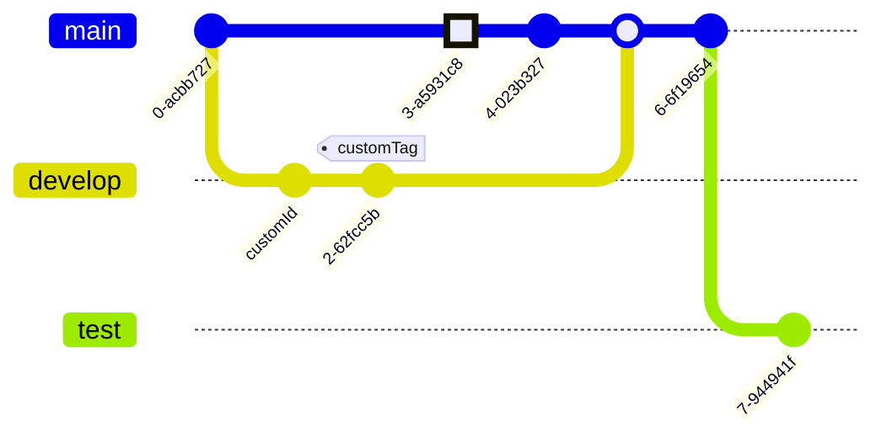

# mermaid.js

JavaScript based diagramming and charting tool.<br/>
Renders Markdown-inspired text definitions to create and modify diagrams dynamically.

1. [Live editor](#live-editor)
1. [Diagrams](#diagrams)
   1. [Flowchart (a.k.a. graph)](#flowchart-aka-graph)
   1. [Sequence diagram](#sequence-diagram)
   1. [Class diagram](#class-diagram)
   1. [State diagram](#state-diagram)
   1. [Gantt diagram](#gantt-diagram)
   1. [Pie chart](#pie-chart)
   1. [Git commit flow](#git-commit-flow)
1. [Further readings](#further-readings)

## Live editor

Mermaid.js offers a [live editor] and a [playground] to check and experiment on diagrams' code on the fly.

> [!tip]
> Prefer the playground to the live editor.<br/>
> It offers more features and a generally better experience.

## Diagrams

Code blocks for diagrams can either:

- start with ` ```mermaid ` and finish with ` ``` `, or
- start with `:::mermaid` and finish with `:::`

but are apparently only rendered in [Markdown] when using the ` ``` ` notation:

| Code delimiter | Gitea | Github | Gitlab |
| -------------- | ----- | ------ | ------ |
| ` ```mermaid ` | ✓     | ✓      | ✓      |
| `:::mermaid`   | ✗     | ✗      | ✗      |

### Flowchart (a.k.a. graph)

```md
:::mermaid
  flowchart TB

    sq[Square shape] --> ci((Circle shape))

    subgraph A
      od>Odd shape]-- Two line<br/>edge comment --> ro
      di{Diamond with <br/> line break} -.-> ro(Rounded<br>square<br>shape)
      di==>ro2(Rounded square shape)
    end

    %% Notice how text in shapes is appended further down
    e --> od3>Really long text with linebreak<br>in an Odd shape]

    %% Comments start with double percent signs
    e((Inner / circle<br>and some odd <br>special characters)) --> f(,.?!+-\*ز)

    cyr[Cyrillic]-->cyr2((Circle shape Начало));

    classDef green fill:#9f6,stroke:#333,stroke-width:2px;
    classDef orange fill:#f96,stroke:#333,stroke-width:4px;
    class sq,e green
    class di orange
:::
```


```md
:::mermaid
  graph LR
    A[Christmas] -->|Get money| B(Go shopping)
    B --> C{Let me think}
    subgraph work
      C -->|One| D[Laptop]
      C --x|Two| E[iPhone]
      C -.->|Three| F[fa:fa-car Car]
      C ==> G((Bike))
      C --> J>TV]
    end
:::
```


### Sequence diagram

```md
:::mermaid
  sequenceDiagram
    Alice->>+John: Hello John, how are you?
    Alice->>+John: John, can you hear me?
    John-->>-Alice: Hi Alice, I can hear you!
    John-->>-Alice: I feel great!
:::
```


### Class diagram

```md
:::mermaid
  classDiagram
    Animal <|-- Duck
    Animal <|-- Fish
    Animal <|-- Zebra
    Animal : +int age
    Animal : +String gender
    Animal: +isMammal()
    Animal: +mate()
    class Duck{
      +String beakColor
      +swim()
      +quack()
    }
    class Fish{
      -int sizeInFeet
      -canEat()
    }
    class Zebra{
      +bool is_wild
      +run()
    }
:::
```


### State diagram

Refer [State diagrams].

```md
:::mermaid
  stateDiagram-v2
    direction LR

    state "Still state with description" as Still
    Moving: Moving state with description

    [*] --> Still
    Still --> [*]
    Still --> Moving
    Moving --> Still
    Moving --> Crash
    Crash --> [*]
:::
```


### Gantt diagram

```md
:::mermaid
  gantt
    title A Gantt Diagram
    dateFormat YYYY-MM-DD
    section Section
    A task           :a1, 2014-01-01, 30d
    Another task     :after a1 , 20d
    section Another
    Task in sec      :2014-01-12 , 12d
    another task     :24d
:::
```


### Pie chart

```md
:::mermaid
  pie title Pets adopted by volunteers
    "Dogs" : 386
    "Cats" : 85
    "Rats" : 15
:::
```


### Git commit flow

```md
:::mermaid
  gitGraph:
    commit
    branch develop
    checkout develop
    commit id:"customId"
    commit tag:"customTag"
    checkout main
    commit type: HIGHLIGHT
    commit
    merge develop
    commit
    branch test
    commit
:::
```



## Further readings

- Official [documentation]
- [Markdown]
- [mermaid-cli]
- [Examples]

<!--
  Reference
  ═╬═Time══
  -->

<!-- Upstream -->
[documentation]: https://mermaid.js.org/intro/
[examples]: https://mermaid.js.org/syntax/examples.html
[live editor]: https://mermaid.live
[playground]: https://www.mermaidchart.com/play
[state diagrams]: https://mermaid.js.org/syntax/stateDiagram.html

<!-- Knowledge base -->
[markdown]: markdown.md
[mermaid-cli]: mermaid-cli.md
