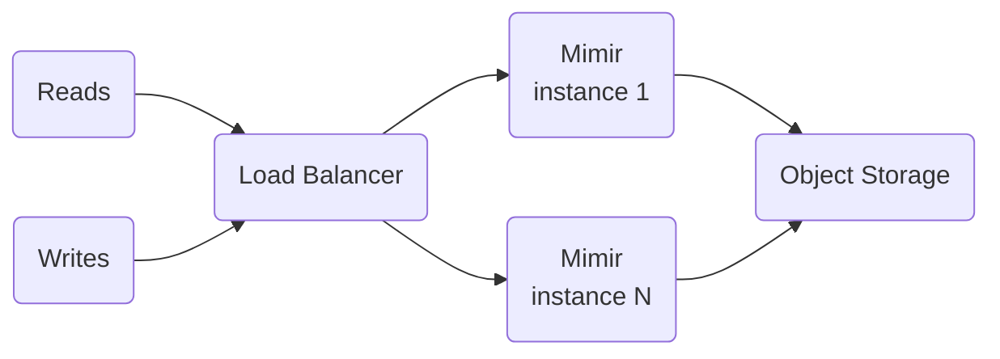
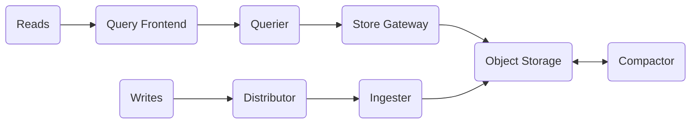

# Grafana's Mimir

Metrics aggregator.

Allows ingesting [Prometheus] or OpenTelemetry metrics, run queries, create new data through the use of recording rules,
and set up alerting rules across multiple tenants to leverage tenant federation.

<!-- Remove this line to uncomment if used
## Table of contents <!-- omit in toc -->

1. [TL;DR](#tldr)
1. [Setup](#setup)
   1. [Monolithic mode](#monolithic-mode)
   1. [Microservices mode](#microservices-mode)
1. [Storage](#storage)
   1. [Object storage](#object-storage)
1. [Authentication and authorization](#authentication-and-authorization)
1. [APIs](#apis)
1. [Deduplication of data from multiple Prometheus scrapers](#deduplication-of-data-from-multiple-prometheus-scrapers)
1. [Migrate to Mimir](#migrate-to-mimir)
1. [Troubleshooting](#troubleshooting)
   1. [HTTP status 401 Unauthorized: no org id](#http-status-401-unauthorized-no-org-id)
   1. [HTTP status 500 Internal Server Error: send data to ingesters: at least 2 live replicas required, could only find 1](#http-status-500-internal-server-error-send-data-to-ingesters-at-least-2-live-replicas-required-could-only-find-1)
1. [Further readings](#further-readings)
   1. [Sources](#sources)

## TL;DR

Scrapers (like Prometheus or Grafana's Alloy) need to send metrics data to Mimir.<br/>
Mimir will **not** scrape metrics itself.

Mimir listens by default on port `8080` for HTTP and on port `9095` for GRPC.<br/>
It also internally advertises data or actions to members in the cluster using the [gossip protocol]. This uses port
`7946` by default and **must** be reachable by all members in the cluster to work.

Mimir stores time series in TSDB blocks, that are uploaded to an object storage bucket.<br/>
Such blocks are the same that Prometheus and Thanos use, though each application stores blocks in different places and
uses slightly different metadata files for them.

Mimir supports multiple tenants, and stores blocks on a **per-tenant** level.<br/>
Multi-tenancy is enabled by default, and can be disabled using the `-auth.multitenancy-enabled=false` option.<br/>
If enabled, then multi-tenancy **will require every API request** to have the `X-Scope-OrgID` header with the value set
to the tenant ID one is authenticating for.<br/>
When multi-tenancy is **disabled**, it will only manage a single tenant going by the name `anonymous`.

Blocks can be uploaded using the `mimirtool` utility, so that Mimir can access them.<br/>
Mimir **will** perform some sanitization and validation of each block's metadata.

```sh
mimirtool backfill --address='http://mimir.example.org' --id='anonymous' 'block_1' … 'block_N'
```

As a result of validation, Mimir will probably reject Thanos' blocks due to unsupported labels.<br/>
As a workaround, upload Thanos' blocks directly to Mimir's blocks bucket, using the `<tenant>/<block ID>/` prefix.

<details>
  <summary>Setup</summary>

```sh
docker pull 'grafana/mimir'
helm repo add 'grafana' 'https://grafana.github.io/helm-charts' && helm repo update 'grafana'

# Does *not* look for default configuration files.
# When no configuration file is given, only default values are used. This is not something one might usually want.
mimir --config.file='./demo.yaml'
docker run --rm --name 'mimir' -p '8080:8080' -p '9095:9095' -v "$PWD/config.yaml:/etc/mimir/config.yaml" \
  'grafana/mimir' -- --config.file='/etc/mimir/config.yaml'
helm --namespace 'mimir-test' upgrade --install --create-namespace 'mimir' 'grafana/mimir-distributed'
```

</details>

<details>
  <summary>Usage</summary>

```sh
# Get help.
mimir -help
mimir -help-all

# Validate configuration files
mimir -modules -config.file 'path/to/config.yaml'

# See the current configuration of components
GET /config
GET /runtime_config

# See changes in the runtime configuration from the default one
GET /runtime_config?mode=diff

# Check the service is ready
# A.K.A. readiness probe
GET /ready

# Get metrics
GET /metrics
```

</details>

<!-- Uncomment if used
<details>
  <summary>Real world use cases</summary>

```sh
```

</details>
-->

## Setup

Mimir's configuration file is YAML-based.

There is **no** default configuration file, but one _can_ be specified on launch.<br/>
If no configuration file is given, **only** the default values will be used.

```sh
mimir --config.file='./demo.yaml'

docker run --rm --name 'mimir' --publish '8080:8080' --publish '9095:9095' \
  --volume "$PWD/config.yaml:/etc/mimir/config.yaml" \
  'grafana/mimir' --config.file='/etc/mimir/config.yaml'
```

Refer [Grafana Mimir configuration parameters] for the available parameters.

If enabled, environment variable references can be used in the configuration file to set values that need to be
configurable during deployment.<br/>
This feature is enabled on the command line via the `-config.expand-env=true` option.

Each variable reference is replaced at startup by the value of the environment variable.<br/>
The replacement is case-**sensitive**, and occurs **before** the YAML file is parsed.<br/>
References to undefined variables are replaced by empty strings unless a default value or custom error text is
specified.

Use the `${VAR}` placeholder, optionally specifying a default value with `${VAR:default_value}`, where `VAR` is the name
of the environment variable and `default_value` is the value to use if the environment variable is undefined.

Configuration files can be stored gz-compressed. In this case, add a `.gz` extension to those files that should be
decompressed before parsing.

Mimir loads a given configuration file at startup. This configuration **cannot** be modified at runtime.

Mimir supports _secondary_ configuration files that define the _runtime_'s configuration.<br/>
This configuration is reloaded **dynamically**. It allows to change the runtime configuration without having to restart
Mimir's components or instance.

Runtime configuration must be **explicitly** enabled, either on launch or in the configuration file under
`runtime_config`.<br/>
If multiple runtime configuration files are specified, they will be **merged** left to right.<br/>
Mimir reloads the contents of these files every 10 seconds.

```sh
mimir … -runtime-config.file='path/to/file/1,path/to/file/N'
```

It only encompasses a **subset** of the whole configuration that was set at startup, but its values take precedence over
command-line options.

Some settings are repeated for multiple components.<br/>
To avoid repetition in the configuration file, set them up in the `common` configuration file section or give them to
Mimir using the `-common.*` CLI options.<br/>
Common settings are applied to all components first, then the components' specific configurations override them.

Settings are applied as follows, with each one applied later overriding the previous ones:

1. YAML common values
1. YAML specific values
1. CLI common flags
1. CLI specific flags

Specific configuration for one component that is passed to other components is simply ignored by those.<br/>
This makes it safe to reuse files.

Mimir can be deployed in one of two modes:

- _Monolithic_, which runs all required components in a single process.
- _Microservices_, where components are run as distinct processes.

The deployment mode is determined by the `target` option given to Mimir's process.

<details style="padding: 0 0 1rem 1rem">

```sh
$ mimir -target='ruler'
$ mimir -target='all,alertmanager,overrides-exporter'

$ yq -y 'config.yml'
target: all,alertmanager,overrides-exporter
$ mimir -config.file='config.yml'
```

</details>

Whatever the Mimir's deployment mode, it will need to receive data from other applications.<br/>
It will **not** scrape metrics itself.

<details style="padding: 0 0 1rem 0">
<summary>Prometheus configuration</summary>

```yaml
remote_write:
  - url: http://mimir.example.org:8080/api/v1/push
    headers:
      X-Scope-OrgID:
        # required unless multi-tenancy is disabled
        # set it to the correct ones, this is the default
        anonymous
```

</details>

[Grafana] considers Mimir a data source of type _Prometheus_, and must be [provisioned](grafana.md#datasources)
accordingly.<br/>
From there, metrics can be queried in Grafana's _Explore_ tab, or can populate dashboards that use Mimir as their data
source.

### Monolithic mode

Runs **all** required components in a **single** process.

Can be horizontally scaled out by deploying multiple instances of Mimir's binary, all of them started with the
`-target=all` option.



By default Mimir expects 3 ingester replicas, and data ingestion will fail if there are less than 2 in the ingester
ring.<br/>
See
[HTTP status 500 Internal Server Error: send data to ingesters: at least 2 live replicas required, could only find 1].

### Microservices mode

Mimir's components are deployed as distinct processes.<br/>
Each process is invoked with its own `-target` option set to a specific component (i.e., `-target='ingester'` or
`-target='distributor'`).



**Every** required component **must** be deployed in order to have a working Mimir instance.

This mode is the preferred method for production deployments, but it is also the most complex.<br/>
Recommended using Kubernetes and the [`mimir-distributed` Helm chart][helm chart].

Each component scales up independently.<br/>
This allows for greater flexibility and more granular failure domains.

## Storage

Mimir supports the `s3`, `gcs`, `azure`, `swift`, and `filesystem` backends.<br/>
`filesystem` is the default one.

### Object storage

Refer [Configure Grafana Mimir object storage backend].

Blocks storage must be located under a **different** prefix or bucket than both the ruler's and AlertManager's stores.
Mimir **will** fail to start if that is the case.

To avoid that, it is suggested to override the `bucket_name` setting in the specific configurations.

<details style="padding: 0 0 0 1rem">
  <summary>Different buckets</summary>

```yaml
common:
  storage:
    backend: s3
    s3:
      endpoint: s3.us-east-2.amazonaws.com
      region: us-east-2

blocks_storage:
  s3:
    bucket_name: mimir-blocks

alertmanager_storage:
  s3:
    bucket_name: mimir-alertmanager

ruler_storage:
  s3:
    bucket_name: mimir-ruler
```

</details>

<details style="padding: 0 0 1rem 1rem">
  <summary>Same bucket, different prefixes</summary>

```yaml
common:
  storage:
    backend: s3
    s3:
      endpoint: s3.us-east-2.amazonaws.com
      region: us-east-2
      bucket_name: mimir

blocks_storage:
  storage_prefix: blocks

alertmanager_storage:
  storage_prefix: alertmanager

ruler_storage:
  storage_prefix: ruler
```

</details>

The WAL is **only** retained on local disk, **not** persisted to the object storage.

Metrics data is uploaded to the object storage every 2 hours, typically when a block is cut from the in-memory TSDB
head.<br/>
After the metrics data block is uploaded, its related WAL is truncated too.

## Authentication and authorization

Refer [Grafana Mimir authentication and authorization].

## APIs

Refer [Grafana Mimir HTTP API].

## Deduplication of data from multiple Prometheus scrapers

Refer [Configure Grafana Mimir high-availability deduplication].

## Migrate to Mimir

Refer [Configure TSDB block upload] and [Migrate from Thanos or Prometheus to Grafana Mimir].

## Troubleshooting

### HTTP status 401 Unauthorized: no org id

**Context**: Prometheus servers get this error when trying to push metrics.

**Root cause**: The push request is missing the `X-Scope-OrgID` header that would specify the tenancy for the data.

**Solution**:

Configure Prometheus to add the `X-Scope-OrgID` header to the data pushed.<br/>
Required even when multi-tenancy is disabled. In this case, use the default `anonymous` tenancy:

```yaml
remote_write:
  - url: http://mimir.example.org:8080/api/v1/push
    headers:
      X-Scope-OrgID:
        # required unless multi-tenancy is disabled
        # set it to the correct ones, this is the default
        anonymous
```

### HTTP status 500 Internal Server Error: send data to ingesters: at least 2 live replicas required, could only find 1

**Context**:

Mimir is running on [AWS ECS] in monolithic mode for evaluation.<br/>
It is loading the following configuration from a mounted [AWS EFS] volume:

```yml
multitenancy_enabled: false

common:
  storage:
    backend: s3
blocks_storage:
  s3:
    bucket_name: my-mimir-blocks
```

The service is backed by a load balancer.<br/>
The load balancer is allowing requests to reach the task serving Mimir correctly.

A Prometheus server is configured to send data to Mimir:

```yml
remote_write:
  - url: http://mimir.dev.somecompany.com:8080/api/v1/push
    headers:
      X-Scope-OrgID: anonymous
```

The push request passes Mimir's validation for the above header.

Both Mimir and Prometheus print this error when Prometheus tries to push metrics.

**Root cause**:

Writes to the Mimir cluster are successful **only** if the **majority** of the ingesters received the data.

The default value for the `ingester.ring.replication_factor` setting is `3`. As such, Mimir expects by default `3`
ingester in its ingester ring, with a minimum of `ceil(replication_factor/2)` that many ingesters (`2` by default) alive
at all times.<br/>
Data ingestion **will** fail with that error when less than the minimum alive replica are listed in the ingester ring.

This happens even when running in [monolithic mode].

**Solution**:

As a rule of thumb, make sure at least `ceil(replication_factor/2)` ingesters are available to Mimir.

When just testing the setup, configure the ingesters' `replication_factor` to `1`:

```yml
ingester:
  ring:
    replication_factor: 1
```

## Further readings

- [Website]
- [Codebase]
- [Prometheus]
- [Grafana]
- [Ceiling Function]

Alternatives:

- [Cortex]
- [Thanos]

### Sources

- [Documentation]
- [Migrate from Thanos or Prometheus to Grafana Mimir]
- [Configure Grafana Mimir object storage backend]
- [Grafana Mimir configuration parameters]
- [Grafana Mimir authentication and authorization]

<!--
  Reference
  ═╬═Time══
  -->

<!-- In-article sections -->
[HTTP status 500 Internal Server Error: send data to ingesters: at least 2 live replicas required, could only find 1]: #http-status-500-internal-server-error-send-data-to-ingesters-at-least-2-live-replicas-required-could-only-find-1
[Monolithic mode]: #monolithic-mode

<!-- Knowledge base -->
[aws ecs]: cloud%20computing/aws/ecs.md
[aws efs]: cloud%20computing/aws/efs.md
[cortex]: cortex.md
[grafana]: grafana.md
[prometheus]: prometheus/README.md
[thanos]: thanos.md

<!-- Files -->
<!-- Upstream -->
[codebase]: https://github.com/grafana/mimir
[configure grafana mimir high-availability deduplication]: https://grafana.com/docs/mimir/latest/configure/configure-high-availability-deduplication/
[configure grafana mimir object storage backend]: https://grafana.com/docs/mimir/latest/configure/configure-object-storage-backend/
[Configure TSDB block upload]: https://grafana.com/docs/mimir/latest/configure/configure-tsdb-block-upload/
[documentation]: https://grafana.com/docs/mimir/latest/
[Grafana Mimir authentication and authorization]: https://grafana.com/docs/mimir/next/manage/secure/authentication-and-authorization/
[grafana mimir configuration parameters]: https://grafana.com/docs/mimir/latest/configure/configuration-parameters/
[grafana mimir http api]: https://grafana.com/docs/mimir/latest/references/http-api/
[Grafana mimir-distributed Helm chart documentation]: https://grafana.com/docs/helm-charts/mimir-distributed/latest/
[helm chart]: https://github.com/grafana/mimir/tree/main/operations/helm/charts/mimir-distributed
[migrate from thanos or prometheus to grafana mimir]: https://grafana.com/docs/mimir/latest/set-up/migrate/migrate-from-thanos-or-prometheus/
[website]: https://grafana.com/oss/mimir/
[Grafana Mimir hash rings]: https://grafana.com/docs/mimir/next/references/architecture/hash-ring/

<!-- Others -->
[Gossip protocol]: https://en.wikipedia.org/wiki/Gossip_protocol
[Ceiling Function]: https://www.geeksforgeeks.org/ceiling-function/
