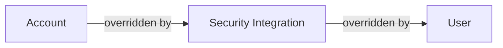

# Snowflake

Cloud-based [data warehousing][data warehouse] platform.

1. [TL;DR](#tldr)
1. [Roles](#roles)
1. [Users](#users)
   1. [Access with private keys](#access-with-private-keys)
   1. [Access with programmatic access tokens](#access-with-programmatic-access-tokens)
1. [Virtual warehouses](#virtual-warehouses)
1. [Policies](#policies)
   1. [Authentication policies](#authentication-policies)
   1. [Network policies](#network-policies)
1. [Snowflake CLI](#snowflake-cli)
1. [RoleOut](#roleout)
1. [Connecting privately](#connecting-privately)
   1. [From AWS accounts](#from-aws-accounts)
1. [Further readings](#further-readings)
   1. [Sources](#sources)

## TL;DR

Snowflake separates storage, compute and cloud services in different layers.

It:

- Runs completely on cloud infrastructure.
- Handles semi-structured data like JSON and Parquet.
- Stores persistent data in columnar format in cloud storage.<br/>
  Customers cannot see nor access the data objects directly; they can only access them through SQL query operations.
- Copies data as Copy-on-Write virtual clones.
- Stores tables in memory in small chunks to enhance parallelization.

Each virtual warehouse is a dedicated MPP compute clusters. Each member handles a different part of a query.<br/>
Snowflake offers Virtual warehouses in different sizes at different prices (XS, S, M, L, XL, …, 6XL).

Billing depends on how long a warehouse runs continuously.<br/>
The total cost is the aggregate of the cost of using data transfer, storage, and compute resources.

Snowflake's system analyzes queries and identifies patterns to optimize using historical data. The results of frequently
executed queries is cached.

Administrators use Role-Based Access Control (RBAC) to define and manage user roles and permissions.<br/>
Users should **not** have permissions on their own. Permissions should instead be given to roles, that should then be
granted to users.

Accounts can connect to Snowflake via:

- Web UI.
- Command line clients.
- ODBC and JDBC drivers.
- Native connectors (e.g., Python or Spark).
- Third-party connectors.

<!-- Uncomment if used
<details>
  <summary>Setup</summary>

```sh
```

</details>
-->

<details>
  <summary>Usage</summary>

```sql
-- List authentication policies
SHOW AUTHENTICATION POLICIES;

-- Create authentication policies
CREATE AUTHENTICATION POLICY allow_pats_policy AUTHENTICATION_METHODS = ('PROGRAMMATIC_ACCESS_TOKEN');

-- Delete authentication policies
DROP AUTHENTICATION POLICY allow_pats_policy;


-- List network policies
SHOW NETWORK RULES;
SHOW NETWORK RULES LIKE 'PYPI_RULE';

-- Get information about network rules
DESC NETWORK RULE 'PYPI_RULE';
DESCRIBE NETWORK RULE 'CLOUD_NETWORK';

-- Create network rules
CREATE NETWORK RULE cloud_network TYPE=IPV4 MODE=INGRESS VALUE_LIST=('47.88.25.32/27');

-- Delete network policies
DROP NETWORK RULE PYPI_RULE;
DROP NETWORK RULE IF EXISTS cloud_network;

-- List network policies
SHOW NETWORK POLICIES;

-- Create network policies
CREATE NETWORK POLICY allow_all_net_policy ALLOWED_IP_LIST = ('0.0.0.0/0');
CREATE NETWORK POLICY IF NOT EXISTS allow_aws_vpceid_block_public_policy
  ALLOWED_NETWORK_RULE_LIST = ('allow_aws_vpceid_access')
  BLOCKED_NETWORK_RULE_LIST = ('block_public_access_rule');

-- Set network policies at the account level
ALTER ACCOUNT SET NETWORK_POLICY = allow_aws_net_policy;

-- Delete network policies
DROP NETWORK POLICY allow_all_net_policy;


-- List warehouses
SHOW WAREHOUSES;

-- Show the warehouse in use
SELECT CURRENT_WAREHOUSE();

-- Start warehouses
USE WAREHOUSE dev_analytics_wh;

-- Show permissions objects have on warehouses
SHOW GRANTS ON WAREHOUSE dev_analytics_wh;

-- Delete warehouses
DROP WAREHOUSE IF EXISTS tuts_wh;


-- List databases
SHOW DATABASES;

-- Show the database in use
SELECT CURRENT_DATABASE();

-- Delete databases
DROP DATABASE IF EXISTS tuts_db;


-- Show current role
SELECT CURRENT_ROLE();

-- Show roles available to the user
SELECT CURRENT_AVAILABLE_ROLES();

-- List roles
SHOW ROLES;
SHOW ROLES LIKE 'REDASH_SERVICE_ROLE';
SHOW ROLES LIKE '%DATA%';

-- Get information about roles
DESC ROLE some_service_role;

-- Assume roles
-- the object assuming the role must have that role granted to it
USE ROLE USERADMIN;      -- create users and roles, manage the ones it owns
USE ROLE SYSADMIN;       -- create objects in an account
USE ROLE SECURITYADMIN;  -- manage objects' grants globally + create, monitor, and manage users and roles
USE ROLE ACCOUNTADMIN;   -- manage *all* resources in an account

-- Create roles
CREATE ROLE IF NOT EXISTS some_service_role;

-- Show permissions roles have
SHOW GRANTS TO ROLE SYSADMIN;
-- Show permissions the current role has on other objects
SHOW GRANTS ON ROLE SYSADMIN;

-- Grant permissions to roles
GRANT ROLE USERADMIN TO ROLE some_service_role;
GRANT USAGE ON WAREHOUSE COMPUTE_WH TO ROLE SYSADMIN;
GRANT USAGE ON DATABASE dev_dwh TO ROLE some_service_role;
GRANT USAGE ON SCHEMA dev_dwh.public TO ROLE some_service_role;
GRANT SELECT, INSERT ON ALL TABLES IN SCHEMA dev_dwh.public TO ROLE some_service_role;


-- Show current user
SELECT CURRENT_USER();

-- List users
SHOW USERS;
SHOW USERS LIKE 'BILLY';
SHOW USERS LIKE '%john%';
-- List service users
-- requires running in a warehouse
SELECT LOGIN_NAME FROM snowflake.account_usage.users WHERE TYPE='SERVICE';

-- Get information about users
DESC USER zoe;
DESCRIBE USER william;

-- Create users
CREATE USER alice;
CREATE USER IF NOT EXISTS bob;
CREATE OR REPLACE USER claude
  PASSWORD='somePassword' DISPLAY_NAME='Claude' EMAIL='claude@example.org'
  LOGIN_NAME='CLAUDE@EXAMPLE.ORG' MUST_CHANGE_PASSWORD=TRUE;
-- Create service users by specifying TYPE = SERVICE
-- Default resources do *not* need to exist beforehand, but *will* be used on login
CREATE USER IF NOT EXISTS data_service TYPE='SERVICE'
  DEFAULT_ROLE='data_service_role' DEFAULT_WAREHOUSE='dev_wh' DEFAULT_NAMESPACE='dev_db.dev_schema';

-- Change user attributes
ALTER USER bob SET DEFAULT_WAREHOUSE = NULL;
ALTER USER some_service_user SET TYPE = SERVICE;
ALTER USER some_service_user UNSET PASSWORD;

-- Show permissions users have
SHOW GRANTS TO USER CLAUDE;
-- Show permissions the current user has on other users
SHOW GRANTS ON USER CLAUDE;

-- Grant permissions to users
GRANT ROLE some_service_role TO USER some_service_user;
GRANT USAGE ON WAREHOUSE COMPUTE_WH TO USER mike;

-- Assign policies to users
ALTER USER some_service_user SET AUTHENTICATION POLICY allow_pats_policy;
ALTER USER some_service_user SET NETWORK_POLICY = allow_all_net_policy;

-- List PATs for users
SHOW USER PROGRAMMATIC ACCESS TOKENS FOR USER some_service_user;

-- Generate PATs for users
-- 'ROLE_RESTRICTION' required for SERVICE users. Sets the role for the token. Must be uppercase.
-- 'DAYS_TO_EXPIRY' must be between 1 and 365. Cannot be modified later.
-- 'MINS_TO_BYPASS_NETWORK_POLICY_REQUIREMENT' and 'COMMENT' are optional.
ALTER USER nora ADD PROGRAMMATIC ACCESS TOKEN act_as_nora DAYS_TO_EXPIRY=15;
ALTER USER some_service_user ADD PROGRAMMATIC ACCESS TOKEN some_service_pat
  ROLE_RESTRICTION='SOME_SERVICE_ROLE'
  DAYS_TO_EXPIRY=365
  MINS_TO_BYPASS_NETWORK_POLICY_REQUIREMENT=3
  COMMENT='Some optional comment';

-- Rotate PATs for users
ALTER USER some_service_user ROTATE PROGRAMMATIC ACCESS TOKEN some_service_pat;

-- Rename PATs for users
ALTER USER some_service_user MODIFY PROGRAMMATIC ACCESS TOKEN some_service_pat
  RENAME TO some_service_pat_new COMMENT = 'new name';

-- Disable PATs for users
ALTER USER some_service_user MODIFY PROGRAMMATIC ACCESS TOKEN some_service_pat SET DISABLED = TRUE;

-- Delete PATs for users
ALTER USER some_service_user REMOVE PROGRAMMATIC ACCESS TOKEN some_service_pat;

-- Reset passwords
ALTER USER IF EXISTS elijah RESET PASSWORD;

-- Disable MFA
ALTER USER fred SET DISABLE_MFA=TRUE;

-- Unlock users
ALTER USER greg SET MINS_TO_UNLOCK=0;

-- Disable users
ALTER USER heather SET DISABLED=TRUE;

-- Delete users
DROP USER snowman;

-- Ensure multi-factor authentication (MFA) is turned on for all human users with password-based authentication
CREATE AUTHENTICATION POLICY enforce_password_mfa
  MFA_AUTHENTICATION_METHODS = ('PASSWORD')  -- enforce MFA when logging in with username and password
  MFA_ENROLLMENT = REQUIRED;                 -- require MFA enrollment when logging in with username and password
ALTER ACCOUNT SET AUTHENTICATION POLICY enforce_password_mfa;


-- Show current IP address
SELECT CURRENT_IP_ADDRESS();

-- Get the IDs of the AWS Virtual Network hosting the current Snowflake account
SELECT SYSTEM$GET_SNOWFLAKE_PLATFORM_INFO();

-- Get hostnames and port numbers to open to access Snowflake from behind firewalls
-- The output of this function can then be passed to SnowCD
SELECT SYSTEM$ALLOWLIST();

-- Get the Snowflake account's information necessary to facilitate the self-service configuration of private
-- connectivity to the Snowflake service or Snowflake internal stages.
SELECT SYSTEM$GET_PRIVATELINK_CONFIG();


-- Kill queries
-- in order of roughness
ALTER USER … ABORT ALL QUERIES
ALTER WAREHOUSE … ABORT ALL QUERIES
SELECT SYSTEM$CANCEL_QUERY('query_id');
SELECT SYSTEM$CANCEL_ALL_QUERIES(123456789);  -- use session id
```

</details>

<details>
  <summary>Real world use cases</summary>

```sql
-- Show the warehouse, database, and schema in use
SELECT CURRENT_WAREHOUSE(), CURRENT_DATABASE(), CURRENT_SCHEMA();
```

</details>

## Roles

Entities to which privileges on securable objects can be granted and revoked.<br/>
They are assigned to [users] to allow them to perform actions required for business functions in their organization

Snowflake accounts come with a set of system-defined roles:

- `GLOBALORGADMIN`: the organization administrator.<br/>
  Manages the lifecycle of accounts and views organization-level usage information.<br/>
  This role exists only in the organization account. Replaces `ORGADMIN`.
- `ACCOUNTADMIN`: the account administrator.<br/>
  Encapsulates the `SYSADMIN` and `SECURITYADMIN` roles.<br/>
  Top-level role in the system with access to every component. It should be granted only to a limited and controlled
  number of users in the account.
- `SECURITYADMIN`: the security administrator.<br/>
  Manages any object grant globally. Creates, monitors, and manages users and roles.

  <details style='padding: 0 0 1rem 1rem'>

  This role is granted `MANAGE GRANTS` privilege to be able to modify any grant, including revoking it.<br/>
  It does **not**, though, give the `SECURITYADMIN` the ability to perform **other** actions like creating objects. To
  do so, the role must **also** be granted the privileges needed for those actions.

  It is also granted the `USERADMIN` role.

  </details>

- `USERADMIN`: the user and role administrator.<br/>
  Can create users and roles in the account. It also manages users and roles that it owns.

  <details style='padding: 0 0 1rem 1rem'>

  This role is granted the `CREATE USER` and `CREATE ROLE` privileges.

  Only roles with the `OWNERSHIP` privilege on an object (user or role in this case), or a higher role, can modify an
  object's properties.

  </details>

- `SYSADMIN`: the system Administrator.<br/>
  It has privileges to create warehouses, databases, and other objects in an account.
- `PUBLIC`: pseudo-role automatically granted by default to every user and every role in an account.<br/>
  Can own securable objects, but they are, by definition, available to every other user and role in the account.<br/>
  Typically used in cases where explicit access control is not needed.

```sql
-- List roles
SHOW ROLES;
SHOW ROLES LIKE '%DATA%';

-- Assume roles
USE ROLE SECURITYADMIN;

-- Grant permissions
GRANT ROLE FINANCIAL_CHIEF TO USER CLAUDE;
GRANT USAGE ON WAREHOUSE COMPUTE_WH TO ROLE SYSADMIN;

-- Show permissions users have
SHOW GRANTS TO USER CLAUDE;
-- Show permissions the current user has on other users
SHOW GRANTS ON USER CLAUDE;
```

## Users

Users can only be created by those with (or):

- The `USERADMIN` role or higher.
- Roles granting them the `CREATE USER` capability on the account.

Add users to the account executing a SQL Query by means of Snowflake's web UI found in the `Account` section.

Users have accepted attributes depending on their type. Incompatible properties will be stored, but kept disabled.<br/>
Changing the user type could reenable the now compatible, disabled, properties.

User accounts (_human users_ in Snowflake) are users with `TYPE` not set or set to `PERSON`.<br/>
Service accounts (_service users_ in Snowflake) are users with `TYPE` set to `SERVICE` and cannot use passwords for
logging in.<br/>
Legacy service accounts (_legacy service users_ in Snowflake) are users with `TYPE` set to `LEGACY_SERVICE` and use
passwords for logging in. Legacy service accounts are
[deprecated and will be removed][planning for the deprecation of single-factor password sign-ins].

Assess a user's type with the `DESCRIBE USER` command, or by querying the `snowflake.account_usage.users` table.

```sql
-- List users
SHOW USERS;
SHOW USERS LIKE 'BILLY';
SHOW USERS LIKE '%john%';
-- List service users
-- requires running in a warehouse
SELECT LOGIN_NAME FROM snowflake.account_usage.users WHERE TYPE = 'SERVICE';

-- Get information about users
DESC USER zoe;
DESCRIBE USER william;

-- Create users
CREATE USER alice;
CREATE USER IF NOT EXISTS bob;
CREATE OR REPLACE USER claude
  LOGIN_NAME='CLAUDE@EXAMPLE.ORG' DISPLAY_NAME='Claude' EMAIL='claude@example.org'
  PASSWORD='somePassword' MUST_CHANGE_PASSWORD=TRUE;
-- Create service users by specifying TYPE = SERVICE
-- Default resources do *not* need to exist beforehand, but *will* be used on login
CREATE USER IF NOT EXISTS some_service TYPE = SERVICE
  DEFAULT_ROLE = some_service_role DEFAULT_WAREHOUSE = dev_wh DEFAULT_NAMESPACE = dev_db.dev_schema;
```

Prefer setting a `DEFAULT_WAREHOUSE` and `DEFAULT_ROLE` for users, specially if they use non-Snowflake client tools.

Remember to `GRANT ROLE` after creating a user.<br/>
Snowflake does **not** offer access to a user's default role automatically. After a user is created, one **must**
provide that user access to its default role.<br/>
If a user can't access their default role, they won't be able to log in.

When using SSO:

- The users' LOGIN NAME must exactly match the email address used by one's Identity Provider.<br/>
  Mismatches or fresh email addresses will result in a failed SSO attempt.
- Optionally remove the ability for a user to log in with a password by not specifying one in the creation command.<br/>
  To give someone the ability to use a password later, simply modify that user's password and require them to change
  it.<br/>
  Setting up a password gives the user the option of selecting what method to use to login. This is required by tools
  that do not support logging in via SSO.

Change users to service users:

```sql
ALTER USER my_service_user SET TYPE = SERVICE;
ALTER USER my_service_user UNSET PASSWORD;
ALTER USER my_service_user UNSET FIRST_NAME;
ALTER USER my_service_user UNSET MIDDLE_NAME;
ALTER USER my_service_user UNSET LAST_NAME;
ALTER USER my_service_user SET DISABLE_MFA = TRUE;
```

### Access with private keys

Refer [Key-pair authentication and key-pair rotation] and [Snowflake terraform provider authentication].

> [!important]
> Snowflake only accepts keys in the Privacy Enhanced Mail (PEM) format.

Snowflake supports multiple active keys to allow for uninterrupted rotation.<br/>
Use the `RSA_PUBLIC_KEY` and `RSA_PUBLIC_KEY_2` parameters in `ALTER USER` to associate up to 2 public keys to one user.

> [!tip]
> Prefer using private keys in the PEM PKCS#8 format, as that is the one Snowflake accepts during authentication.<br/>
> Some tools (e.g., the [Snowflake CLI]) can use private keys in other formats.

Procedure:

1. Generate a keypair.

   ```sh
   openssl genrsa -out "$HOME/.ssh/snowflake.pem" '4096'
   openssl rsa -inform 'PEM' -in "$HOME/.ssh/snowflake.pem" -pubout -outform 'PEM' -out "$HOME/.ssh/snowflake.pub"
   ```

1. Make sure the private key uses the PKCS#8 format.

   ```sh
   # unencrypted
   openssl pkcs8 -inform 'PEM' -in "$HOME/.ssh/snowflake.pem" -outform 'PEM' -out "$HOME/.ssh/snowflake.p8" \
     -topk8 -nocrypt

   # encrypted (will require a password)
   openssl pkcs8 -inform 'PEM' -in "$HOME/.ssh/snowflake.pem" -outform 'PEM' -out "$HOME/.ssh/snowflake.p8" \
     -topk8 -v2 'aes-256-cbc'
   ```

1. Assign the key to one's Snowflake user.

   ```sql
   ALTER USER jsmith SET RSA_PUBLIC_KEY='MIIBIjANBgkqh...';
   ```

1. Configure tools to use the key.

   ```sh
   export SNOWFLAKE_PRIVATE_KEY="$(cat ~/.ssh/snowflake.p8)"
   export SNOWFLAKE_PRIVATE_KEY_PATH="$HOME/.ssh/snowflake.pem" SNOWFLAKE_PRIVATE_KEY_PASSPHRASE='somePassword'
   snow connection add -n 'jwt' --authenticator 'SNOWFLAKE_JWT' --private-key-file "$HOME/.ssh/snowflake.p8"
   snow connection test -x --account 'xy12345' --username 'MY_SERVICE_USER' \
     --authenticator 'SNOWFLAKE_JWT' --private-key-file "$HOME/.ssh/snowflake.p8"
   ```

### Access with programmatic access tokens

Refer [Using programmatic access tokens for authentication],
[Programmatically Accessing Snowflake Model Inference Endpoints] and [Programmatic Access Token (PAT) in Snowflake].

Programmatic access tokens (PATs) allow non-interactive access to Snowflake _without_ using username and password
credentials or key pairs.<br/>
PATs **bypass** MFA and username/password logins entirely. They are **not** usable in the Snowflake UI or web interface.

PATs are supported by the following Snowflake endpoints:

- Snowflake REST APIs.
- Snowflake SQL APIs.
- Snowflake Catalog SDK.
- Snowpark Container Services.

PATs are usable as replacement for passwords in the following:

- Snowflake drivers.
- Third-party applications that connect to Snowflake (e.g., Tableau, PowerBI).
- Snowflake APIs and libraries (e.g., Snowpark APIs, Snowflake Python APIs).
- Snowflake command-line clients (Snowflake CLI, SnowSQL).

One can generate programmatic access tokens for _human_ users (whose `TYPE` is `PERSON`) or _service_ users (which
`TYPE` is `SERVICE`).

PATs can be valid for up to 365 days. This is a security requirement on Snowflake's side.

Each token is restricted to a single role.<br/>
Users that can assume multiple roles need to have a token **per each role** they want to use that way.

Tokens are _immutable_.<br/>
Role restriction and expiry date **cannot** be changed later, requiring to rotate or recreate the PAT instead.

Newly generated tokens' secret is visible only **once** and during its creation.<br/>
They **cannot** be retrieved afterwards, and administrators can only view their metadata later.

Users can have up to 15 _**active**_ PATs.<br/>
_Expired_ tokens do **not** count, but _disabled_ tokens still do.

Rotating a PAT generates a new secret (and a new expiration) for it, and invalidates the old one.

Deletion is **permanent**, and allows for **no** recovery/restoration.

> [!important]
> One **cannot** modify, rename, rotate, or revoke programmatic access tokens in a session where one used a programmatic
> access token for authentication.

Requirements:

- Tokens must belong to Snowflake users with `TYPE=PERSON` or `TYPE=SERVICE`.
- Users using tokens must have assigned the following:
  - One or more [authentication policies] allowing PATs usage.
  - \[optionally] One or more [network policies][controlling network traffic with network policies] restricting the IP
    address for their requests' origin.

<details style='padding-bottom: 1rem'>
  <summary>Usage</summary>

```sql
-- List
SHOW USER PROGRAMMATIC ACCESS TOKENS FOR USER <username>;

-- Generate
ALTER USER <username> ADD PROGRAMMATIC ACCESS TOKEN <token_name>
  ROLE_RESTRICTION = '<role_name>'  -- Uppercase. Required for SERVICE users. Sets the role the token can operate under.
  DAYS_TO_EXPIRY = <integer>        -- 1 <= X <= 365. Cannot be modified later.
  MINS_TO_BYPASS_NETWORK_POLICY_REQUIREMENT = <integer>  -- Optional
  COMMENT = '<optional comment>';

-- Rotate
ALTER USER <username> ROTATE PROGRAMMATIC ACCESS TOKEN <token_name>;

-- Rename
ALTER USER <username> MODIFY PROGRAMMATIC ACCESS TOKEN <current_token_name>
  RENAME TO <new_token_name> COMMENT = '<new>';

-- Disable
ALTER USER <username> MODIFY PROGRAMMATIC ACCESS TOKEN <token_name> SET DISABLED = TRUE;

-- Delete
ALTER USER <username> REMOVE PROGRAMMATIC ACCESS TOKEN <token_name>;
```

Use the PAT:

- As one's password in Snowflake clients or APIs, or when prompted for a password in tools.<br/>
  The username and account parameters remain as usual.

  ```py
  conn = snowflake.connector.connect(
    user="PAT_USER",
    account="<account>",
    authenticator="snowflake",
    password="<PAT_token_string>",
    role="…",
    warehouse="…",
  )
  ```

- In the `Authorization: Bearer <token>` header when calling Snowflake's REST APIs.

</details>

Procedure:

1. \[if needed] Acquire enough privileges.

   <details style='padding: 0 0 1rem 1rem'>

   ```sql
   USE ROLE SECURITYADMIN;
   ```

   </details>

1. \[if needed] Create the user.

   <details style='padding: 0 0 1rem 1rem'>

   ```sql
   CREATE USER my_service_user TYPE=SERVICE DEFAULT_ROLE=my_service_role;
   ```

   </details>

1. \[if needed] Grant it the required roles and privileges.

   <details style='padding: 0 0 1rem 1rem'>

   ```sql
   CREATE ROLE my_service_role;

   GRANT USAGE ON DATABASE my_db TO ROLE my_service_role;
   GRANT USAGE ON SCHEMA my_db.my_schema TO ROLE my_service_role;
   GRANT SELECT ON ALL TABLES IN SCHEMA my_db.my_schema TO ROLE my_service_role;

   GRANT ROLE my_service_role TO USER my_service_user;
   ```

   </details>

1. \[semi-optional] Assign it an authentication policy that allows using PATs.

   > [!important]
   > If no other policy limits a user's authentication methods (e.g., the user has assigned **no** authentication
   > policy), that user can already use PATs.

   <details style='padding: 0 0 1rem 1rem'>

   ```sql
   CREATE AUTHENTICATION POLICY my_auth_policy_for_pats AUTHENTICATION_METHODS=('PROGRAMMATIC_ACCESS_TOKEN');
   ALTER USER my_service_user SET AUTHENTICATION POLICY my_auth_policy_for_pats;
   ```

   </details>

1. Assign it a network policy.

   > [!important]
   > **Required** by default for service accounts, _optional_ by default for users.

   <details style='padding: 0 0 1rem 1rem'>

   ```sql
   CREATE NETWORK POLICY IF NOT EXISTS my_net_policy ALLOWED_IP_LIST=('203.0.113.42', '198.51.100.0/24');
   ALTER USER my_service_user SET NETWORK_POLICY=my_net_policy;
   ```

   </details>

1. Create a PAT for it.

   <details style='padding: 0 0 1rem 1rem'>

   ```sql
   ALTER USER my_service_user ADD PROGRAMMATIC ACCESS TOKEN my_pat_token
     ROLE_RESTRICTION='MY_SERVICE_ROLE'  -- roles must be referred to in uppercase; required for service users
     DAYS_TO_EXPIRY=90
     COMMENT='My PAT for My Service User';
   ```

   </details>

   > [!important]
   > The PAT secret will only show now and **cannot** be retrieved ever again.<br/>
   > Note it down somewhere.

1. Use the PAT to authenticate.

   <details style='padding: 0 0 1rem 1rem'>

   ```sh
   snowsql -a 'xy12345' -u 'MY_SERVICE_USER' -r 'SVC_ETL_ROLE' -p '<PAT_token>'
   snow connection test --temporary-connection --account 'xy12345' --username 'MY_SERVICE_USER' --password '<PAT_token>'
   ```

   </details>

<details>
  <summary>Procedure example</summary>

Service: `data`, username: `data_service_user`, role: `data_service_role`, database: `data_db`, schema: `data_schema`.

```sql
USE ROLE ACCOUNTADMIN;

CREATE AUTHENTICATION POLICY allow_pats_auth_policy AUTHENTICATION_METHODS=('PROGRAMMATIC_ACCESS_TOKEN');
CREATE NETWORK POLICY IF NOT EXISTS allow_all_net_policy ALLOWED_IP_LIST=('0.0.0.0/0');

USE ROLE USERADMIN;

CREATE USER IF NOT EXISTS data_service_user TYPE=SERVICE DEFAULT_ROLE=data_service_role;

CREATE ROLE IF NOT EXISTS data_service_role;
GRANT USAGE ON DATABASE data_db TO ROLE data_service_role;
GRANT USAGE ON SCHEMA data_db.data_schema TO ROLE data_service_role;
GRANT SELECT ON ALL TABLES IN SCHEMA data_db.data_schema TO ROLE data_service_role;
GRANT ROLE data_service_role TO USER data_service_user;

ALTER USER data_service_user SET AUTHENTICATION POLICY allow_pats_auth_policy;
ALTER USER data_service_user SET NETWORK_POLICY=allow_all_net_policy;

ALTER USER data_service_user ADD PROGRAMMATIC ACCESS TOKEN data_service_pat
  ROLE_RESTRICTION='DATA_SERVICE_ROLE' DAYS_TO_EXPIRY=90;
```

```sh
$ snow connection test -x --account 'ABCDEFG-ZY01234' --username 'DATA_SERVICE_USER' --password 'REDACTED'
WARNING! Using --password via the CLI is insecure. Use environment variables instead.
+----------------------------------------------------------+
| key             | value                                  |
|-----------------+----------------------------------------|
| Connection name | None                                   |
| Status          | OK                                     |
| Host            | ABCDEFG-ZY01234.snowflakecomputing.com |
| Account         | ABCDEFG-ZY01234                        |
| User            | DATA_SERVICE_USER                      |
| Role            | DATA_SERVICE_ROLE                      |
| Database        | not set                                |
| Warehouse       | not set                                |
+----------------------------------------------------------+
```

</details>

## Virtual warehouses

Dedicated, independent clusters of compute resources in Snowflake.

They are required for queries and all DML operations, including loading data into tables.

Available in two types: _Standard_ or _Snowpark-optimized_.<br/>
Type aside, warehouses are defined by their size and those other properties that control and automate their activity.

Billing depends on how long the warehouse runs continuously.

Warehouses can be set to automatically resume or suspend, based on activity.<br/>
Auto-suspend and resume are both enabled by default.

## Policies

Refer [Authentication policies] and [Network policies].

Authentication policies control _**how**_ clients or users authenticate.<br/>
Network policies control _**from where**_ clients or users can authenticate.

### Authentication policies

Can be set on the whole account, or assigned to users in it.<br/>
When set on the whole account, policies apply to **all** users in that account.<br/>
When set on **both** the account and a user, the user-level policy overrides the account-level policy.

Having no active policy just allows everything.

Network policies take precedence over authentication policies.

### Network policies

By default, Snowflake allows users to connect from any computer or device.

Security administrators (or higher roles) can configure _network policies_ to allow or deny access to requests based on
their origin.<br/>
A policy's _allowed lists_ control which requests are allowed to access, the _blocked lists_ control which requests
should be explicitly blocked.

> [!tip]
> Network policies should prefer referencing _network rules_ **instead of** using CIDRs in their IP lists.

Network rules group related identifiers into logical units and define the traffic's direction, but do **not** specify
whether to allow or block them.<br/>
Adding rules to the allowed list and blocked list of network policies does that.

> [!tip]
> Avoid specifying both network rules and IP lists in the same network policy.

The general preferred workflow is as follows:

1. Create network rules based on their purpose and type of network identifier.
1. Create one or more network policies. Each of them should include all the network rules that contain the identifiers
   to be allowed or blocked.
1. Activate the policies for an account, user, or security integration.<br/>
   A network policy does **not** restrict network traffic until it is activated.

When adding network rules to the allowed list of a network policy, Snowflake grants access only to the specified
identifiers and blocks the rest.

If a policy has the same IP address values in both its `ALLOWED_IP_LIST` and `BLOCKED_IP_LIST` parameters, the values in
the `BLOCKED_IP_LIST` parameter applies first.<br/>
This behavior also applies to the `ALLOWED_NETWORK_RULE_LIST` and `BLOCKED_NETWORK_RULE_LIST` parameters.

Over private connections, if a policy has a network rule specifying VPCE IDs (AWS) or LinkIDs (Azure) in the
`ALLOWED_NETWORK_RULE_LIST` parameter, IP network rules in the `BLOCKED_NETWORK_RULE_LIST` are ignored, and the
specified VPCE IDs or LinkIDs take precedence.

Rules using private endpoint identifiers, such as Azure LinkIDs or AWS VPCE IDs, have **no** effect on requests coming
from the public network.<br/>
To restrict access based on private endpoint identifiers, and completely block requests from public IPv4 addresses, one
must create two separate network rules, one for the allowed list and another one for the blocked list.

Network policies can apply to an account, a security integration, or a user.<br/>
The most **specific** policy overrides more general ones.



Configure an user's `MINS_TO_BYPASS_NETWORK_POLICY` property to allow it to temporarily bypass a network policy for a
set number of minutes.

Network rules are **schema**-level objects.

## Snowflake CLI

CLI tool for Snowflake.<br/>
Meant to replace the SnowSQL tool.

See [Snowflake CLI].

## RoleOut

Project trying to accelerate the design and deployment of Snowflake environments through Infrastructure as Code.<br/>
Useful to view and configure the permissions matrix in a graphical way.

Refer [RoleOut].

## Connecting privately

### From AWS accounts

Refer [Why Snowflake doesn't share static IP address range with the customer - AWS].

Snowflake's platform is designed to take full advantage of the elasticity AWS offers.<br/>
Resources in the Snowflake account do **not** use any stable element, including IP addresses.

There are two ways to lock down communications with Snowflake:

1. Integrating with AWS PrivateLink.<br/>
   This allows using only local IPs from one's VPCs in AWS to connect to Snowflake.
1. Snowflake offers the `SYSTEM$ALLOWLIST` and its PrivateLink equivalent `SYSTEM$ALLOWLIST_PRIVATELINK` commands.<br/>
   They return a complete list of URLs that one can use to allow outbound communications from one's network to the
   Snowflake platform.<br/>
   These are guaranteed to be unique on an account-by-account basis, and stable for the lifetime of that account.

If configured to, Snowflake can reach out to one's S3 resources to load or unload data.<br/>
In this scenario, Snowflake supplies the VPC information for use in an S3 policy that would allow communications, IAM,
and other controls used to gate access when setting up the External Stage.

Should one required IP-address-only controls, the only current solution is to allow the whole AWS IP range from which
all Snowflake's dynamic IPs may originate. This amounts to the IP addresses for an entire AWS region.<br/>
AWS provides region-wide IP ranges as a JSON file. These are subject to change, and will need to be updated in
rules.<br/>
Snowflake recommends **avoiding** this approach.

## Further readings

- [Website]
- [Documentation]
- [Data warehouse]
- [Snowflake CLI]
- [Roleout]
- [Authentication policies]
- [Controlling network traffic with network policies]
- [Network rules]
- [Create a Snowflake data source with key pair authentication in IntelliJ IDEA]

### Sources

- [Snowflake CREATE USERS: Syntax, Usage & Practical Examples]
- [Overview of Access Control]
- [Programmatically Accessing Snowflake Model Inference Endpoints]
- [Programmatic Access Token (PAT) in Snowflake]
- [Unpacking Snowflake's New User Type Property]

<!--
  Reference
  ═╬═Time══
  -->

<!-- In-article sections -->
[users]: #users

<!-- Knowledge base -->
[Data warehouse]: ../data%20warehouse.md
[RoleOut]: roleout.md
[Snowflake CLI]: cli.md

<!-- Files -->
<!-- Upstream -->
[Authentication policies]: https://docs.snowflake.com/en/user-guide/authentication-policies
[Controlling network traffic with network policies]: https://docs.snowflake.com/en/user-guide/network-policies
[Documentation]: https://docs.snowflake.com/en/
[Key-pair authentication and key-pair rotation]: https://docs.snowflake.com/en/user-guide/key-pair-auth
[Network policies]: https://docs.snowflake.com/en/user-guide/network-policies
[Network rules]: https://docs.snowflake.com/en/user-guide/network-rules
[Overview of Access Control]: https://docs.snowflake.com/en/user-guide/security-access-control-overview
[Planning for the deprecation of single-factor password sign-ins]: https://docs.snowflake.com/en/user-guide/security-mfa-rollout
[Using programmatic access tokens for authentication]: https://docs.snowflake.com/en/user-guide/programmatic-access-tokens
[Website]: https://www.snowflake.com/en/
[Why Snowflake doesn't share static IP address range with the customer - AWS]: https://community.snowflake.com/s/article/Why-Snowflake-doesn-t-share-static-IP-address-with-customer

<!-- Others -->
[Create a Snowflake data source with key pair authentication in IntelliJ IDEA]: https://www.jetbrains.com/help/idea/create-snowflake-data-source-with-key-pair-authentication.html#create_a_data_source
[Programmatic Access Token (PAT) in Snowflake]: https://medium.com/%40mohitaverma0712/programmatic-access-token-pat-in-snowflake-how-to-use-754c28db8952
[Programmatically Accessing Snowflake Model Inference Endpoints]: https://medium.com/snowflake/programmatically-accessing-snowpark-model-inference-endpoints-9c11727076d1
[Snowflake CREATE USERS: Syntax, Usage & Practical Examples]: https://hevodata.com/learn/snowflake-create-users/
[Snowflake terraform provider authentication]: https://registry.terraform.io/providers/Snowflake-Labs/snowflake/latest/docs#authentication
[Unpacking Snowflake's New User Type Property]: https://select.dev/posts/snowflake-user-type
