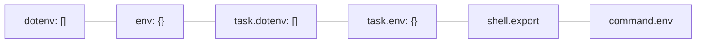
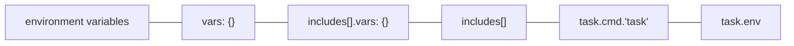

# Task

Task runner aiming to be simpler and easier to use than [GNU Make].

1. [TL;DR](#tldr)
1. [Usage](#usage)
1. [Variables](#variables)
1. [Call other tasks](#call-other-tasks)
   1. [Call root tasks from non-flattened included files](#call-root-tasks-from-non-flattened-included-files)
1. [Run tasks in a specific order](#run-tasks-in-a-specific-order)
1. [Run tasks concurrently](#run-tasks-concurrently)
1. [Troubleshooting](#troubleshooting)
   1. [Dry run does not print the commands that would be executed](#dry-run-does-not-print-the-commands-that-would-be-executed)
1. [Further readings](#further-readings)
   1. [Sources](#sources)

## TL;DR

Taskfiles are Task's Makefile counterpart.<br/>
Taskfiles are written in YAML.

_Tasks_ in Task are what _targets_ are for Make.

Task leverages `mvdan.cc/sh` to run commands, which is a native Go shell interpreter.<br/>
It allows to write `sh`/`bash` commands and have them work even where `sh` or `bash` are usually not available (e.g.:
Windows) as long as any called executable is available in `PATH`.

Pros:

- Taskfiles are more readable than Makefiles.
  Specifically:

  - There is no need to explicitly use tabs in tasks' definitions.
  - There is no need for special symbols, like `@`.
  - Environment variables management is easier.

Cons:

- Taskfiles are written in YAML. ≈(・ཀ・≈)<br/>
  That makes them very much similar to \[[Gitlab] and [Azure Devops]]'s pipelines, with all the pain that comes with it.

Uses Go's [text/template] and [slim-sprig] packages to interpolate values.

Environment variables (`env: {}, dotenv: []`) are available in the shell used by commands.<br/>
Variables (`vars: {}`) are **only** available to Task while executing templates, but **will default to environment
variables** with the same name.

<details>
  <summary>Setup</summary>

```sh
# Install the executable.
brew install 'go-task'
choco install 'go-task'
docker pull 'taskfile/task'
dnf install 'go-task'
go install 'github.com/go-task/task/v3/cmd/task@latest'
pip install --user 'go_task_bin'
snap install 'task' --classic
zypper install 'https://github.com/go-task/task/releases/download/v3.39.2/task_linux_amd64.rpm'

# Setup the shell's completion.
task --completion 'fish' > ~/'.config/fish/completions/task.fish'
task --completion 'zsh'  > '/usr/local/share/zsh/site-functions/_task'
task --completion 'bash' > '/etc/bash_completion.d/task'

# Create a new 'Taskfile.yml' file in the current folder.
task --init
```

</details>
<details>
  <summary>Usage</summary>

```sh
# Run tasks.
# No tasks given --> assumed one named 'default'
task
task 'assets'
task -v 'build:python' 'deploy:app'

# Simulate running tasks.
task -n 'bootstrap'
task --dry --verbose 'lint' 'validate:ansible'
```

</details>

## Usage

1. Create a file called `Taskfile.yml`, `taskfile.yml`, `Taskfile.yaml`, `taskfile.yaml`, `Taskfile.dist.yml`,
   `taskfile.dist.yml`, `Taskfile.dist.yaml`, or `taskfile.dist.yaml` (ordered by priority) in the root of one's
   project.

1. Run tasks by their name:

   ```sh
   task 'assets' 'build:python'
   task --dry 'bootstrap'
   ```

   If task names are omitted, Task will try and execute a task named `default`.

## Variables

Set **environment** variables at global or task level with `env: {}`.<br/>
They are made available in the shell used by commands.

<details style="padding: 0 0 1em 1em;">

```yml
env:
  SOME_VAR: some DEFAULT value
tasks:
  env_vars:test:
    env:
      SOME_VAR: some value
    cmds:
      - echo $SOME_VAR
```

</details>

**Exported** and **command-specific** shell variables **take precedence** over the ones defined in the Taskfile.

<details style="padding: 0 0 1em 1em;">

```sh
$ task env_vars:test
some value

$ set SOME_VAR 'some OTHER value'
$ task env_vars:test
some value

$ set -x SOME_VAR 'some OTHER value'
$ task env_vars:test
some OTHER value

$ SOME_VAR='some EPHEMERAL value' task env_vars:test
some EPHEMERAL value
```

</details>

Task accepts setting environment variables **inside** the command itself like `make` due to some shells not supporting
the usual syntax.

<details style="padding: 0 0 1em 1em;">

```sh
# These are equivalent
CONTENT='Hello, World!' FILE=file.txt MESSAGE="All done!" task write-file print
task write-file FILE=file.txt "CONTENT=Hello, World!" print "MESSAGE=All done!"
```

</details>

Include **environment** variables from `.env`-like files at global or task level with `dotenv: []`.<br/>
Non-existing files are **ignored** in a similar manner to `make`'s `-include` directive (with the prefixed dash).

<details style="padding: 0 0 1em 1em;">

```yml
dotenv:
  - .env
  - .env.local
tasks:
  env_vars:test:
    dotenv:
      - .env.task
      - .env.task.local
```

</details>

Environment variables set in `env: {}` **take precedence** over the ones loaded from `dotenv` **at the same level**.



<br/>

Variables (`vars: {}`) are **only** available to Task while executing templates, but **will default to environment
variables** with the same name.

Task execution looks for variables in the following order (first-come-first-served):

- Variables declared in the task's definition.
- Variables provided when calling a task from another.
- Variables defined in included Taskfiles.
- Variables provided when including Taskfiles.
- Global variables.
- Environment variables.



## Call other tasks

Use `task:` followed by the call**ed** task name as the command in the call**ing** task.

```yml
tasks:
  task:being:called: { … }
  task:calling:
    cmd: task: task:being:called
  another:task:calling:
    cmds:
      - task: task:being:called
        vars: { … }
```

### Call root tasks from non-flattened included files

Refer an empty namespace by prepending the name of the task with `:`.

```yml
# $ROOT/Taskfile.yml
includes:
  subproject:
    taskfile: subproject
    dir: subproject
tasks:
  task:of:interest: { … }
```

```yml
# $ROOT/subproject/Taskfile.yml
tasks:
  some:task:
    cmd:
      task: :task:of:interest
```

## Run tasks in a specific order

Specify them in order in the `cmds` key of another task:

```yml
tasks:
  default:
    desc: Run lint, build, and test in order
    cmds:
      - task: lint
      - task: build
      - task: test
```

Do **not** name them in the task's `deps`, as they will run concurrently and with no order.

## Run tasks concurrently

Execute `task` with the `--parallel` option and naming all the tasks that should run concurrently:

```sh
task --parallel 'task1' 'task2'
```

Tasks that run in parallel are **not** guaranteed to run in order.<br/>
Parallelization is meant for tasks that are independent from each other.

Tasks' dependencies run concurrently by default.<br/>
Naming other tasks in tasks' `deps` key ensures that all of them are executed **before** the one calling them starts,
but does **not** guarantee their order other than the dependencies they define themselves.

## Troubleshooting

### Dry run does not print the commands that would be executed

<details>
  <summary>Root cause</summary>

Command simulations do **not** print commands to output when setting `silent: true` at any level.

</details>

<details>
  <summary>Solution</summary>

Force the print using `-v, --verbose` when `silent` is set to `true`, or set it to `false` at task level.

</details>

## Further readings

- [Website]
- [Github]

### Sources

- [Usage]
- [Stop Using Makefile (Use Taskfile Instead)]
- [Demystification of taskfile variables]
- [KarChunT's notes]

<!--
  Reference
  ═╬═Time══
  -->

<!-- In-article sections -->
<!-- Knowledge base -->
[azure devops]: cloud%20computing/azure/devops.md
[gitlab]: gitlab/README.md
[gnu make]: gnu%20userland/make.md

<!-- Files -->
<!-- Upstream -->
[github]: https://github.com/go-task/task
[usage]: https://taskfile.dev/usage/
[website]: https://taskfile.dev/

<!-- Others -->
[demystification of taskfile variables]: https://medium.com/@TianchenW/demystification-of-taskfile-variables-29b751950393
[KarChunT's notes]: https://karchunt.com/docs/taskfile/
[slim-sprig]: https://github.com/go-task/slim-sprig
[stop using makefile (use taskfile instead)]: https://dev.to/calvinmclean/stop-using-makefile-use-taskfile-instead-4hm9
[text/template]: https://pkg.go.dev/text/template
